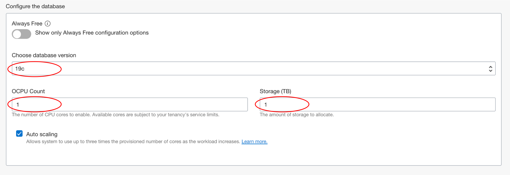
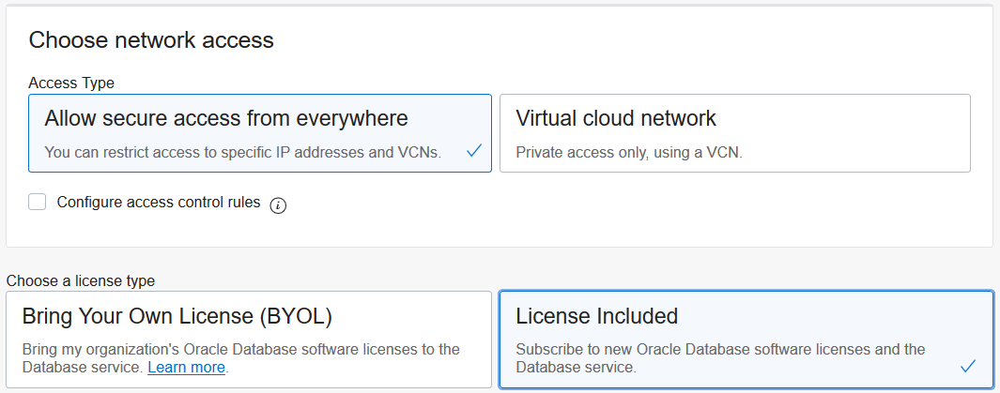
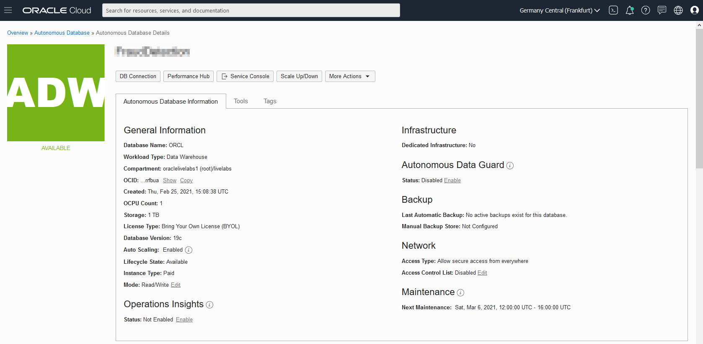
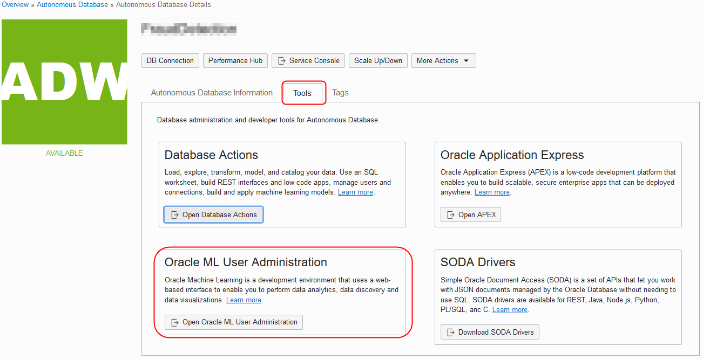
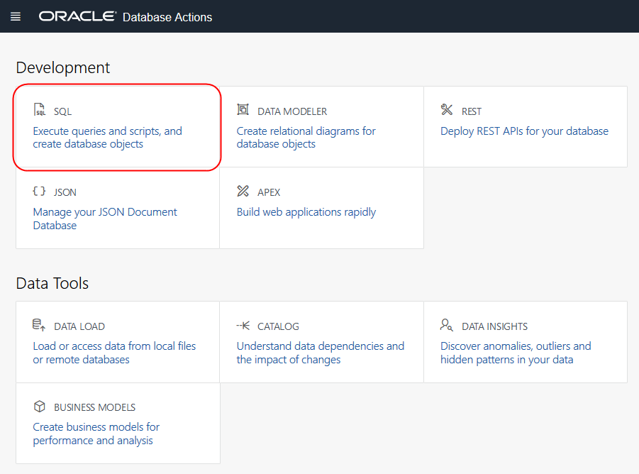
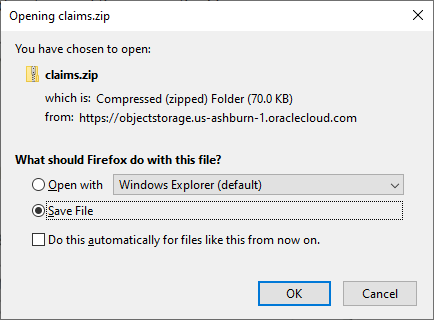
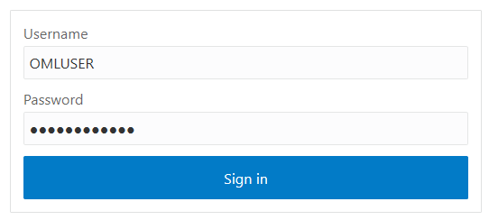
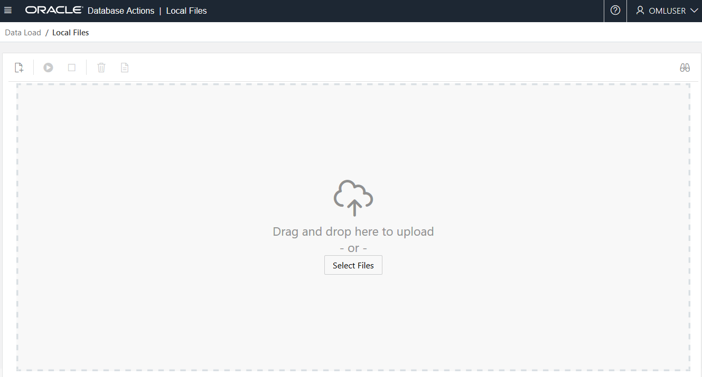

# Provision and Setup #

## Introduction ##

In this lab you will setup your environment. Here we will show you how to provision an autonomous database instances, create a user, load data into the database, and set up credentials and tools.

Estimated Time: 20 mins

### Objectives
-   Learn how to provision an ADW instance
-   Learn how to connect to ADW and use Database Actions

### Prerequisites

This lab assumes you have completed the following labs:
* Login to Oracle Cloud/Sign Up for Free Tier

*Note: You may see differences in account details (eg: Compartment Name is different in different places) as you work through the labs. This is because the workshop was developed using different accounts over time.*

In this section, you will provision an ADWC database, create an OML user account, and load the data required by the OML notebooks.

## **Step 1:** Create an ADW Instance

First, we are going to create an ADW Instance.

1.  Click the hamburger menu, search for **Autonomous Data Warehouse**, and click on it.

    

2.  Select **Create Autonomous Data Warehouse**.

    

3. Select **Compartment** by clicking on the drop-down list. (Note that yours will be different - do not select **ManagedCompartmentforPaaS**) and then enter **Display Name**, **Database Name**.

    

4.  Under **Choose a workload type** and **Choose a deployment type**, select **Data Warehouse**, and **Shared Infrastructure** respectively.

    

5.  Under **Configure the database**, leave **Choose database version** and **Storage (TB)** and **OCPU Count** as they are.

    

6.  Add a password. Note the password down in a notepad, you will need it later in Lab 2.

    

7.  Under **Choose a license type**, select **License Included**.

    

8.  Click **Create Autonomous Database**. Once it finishes provisioning, you can click on the instance name to see details of it.

    

## **Step 2:** Create an OML User

1. On your instance, click the **Tools** tab, and then click **Open Oracle ML User Administration**.

    

2. Sign in as admin with the password you used when you created your Autonomous instance.

    

3. Click on **Create**.

    

4. On the **Create User** form, enter the username **omluser**, an e-mail address (you can use admin@oracle.com), uncheck **Generate password**, and enter a password you will remember. You can use the same password you used for the ADMIN account. Then click **Create**.

    

## **Step 3:** Allow OMLUSER to access Database Actions

1. On the tab with your ADW instance, and click on **Open Database Actions**.

    

2. Login as ADMIN, using the same password you created for ADMIN when you created the ADW instance.

    

    

3. From the Database Action menu, select **SQL**.

    

4. Dismiss the Help by clicking on the **X** in the popup.

    

5. Copy and paste the SQL below into the SQL pane to allow OMLUSER to use the Database Actions.

    ```
      <copy>BEGIN
      ORDS_ADMIN.ENABLE_SCHEMA(
        p_enabled => TRUE,
        p_schema => 'OMLUSER',
        p_url_mapping_type => 'BASE_PATH',
        p_url_mapping_pattern => 'omluser',
        p_auto_rest_auth => TRUE
      );
      COMMIT;
    END;
    /</copy>
    ```

6. Click **Run Script** to execute the SQL.

    

    

## **Step 4:** Download Files to use in next lab

1.  Click the link below to download the install file.

    [claims.zip](https://objectstorage.us-ashburn-1.oraclecloud.com/p/yaGHxlS_7qmrSGfYH33N4VLt6e7K8BPm1iqdyDXy0z2Cr8v0jjDXzuQfL4c9BPrY/n/c4u03/b/data-management-library-files/o/claims.zip)

2.  Save `claims.zip` to a download directory and then unzip the file.

    

## **Step 5**: Upload the two data files to OMLUSER

1. On the tab with your ADW instance, and click on **Open Database Actions**.

    

2. This time sign in as **omluser**.

    

    

3. Select **Data Load** from Database Actions.

    

4. Leave the default selections (**Load data** and **Local File**) and click **Next**.

    

5. Drag the **CLAIMS.csv** and **CLAIMS0.csv** files from the directory where you downloaded and unzipped onto the Drag and Drop target.

    

6. When the upload is complete, click **Start** and click **Run** in the confirmation dialog.

    

    

7. When the job is completed, click on the hamburger menu to open the database tools menus and select **SQL**.

    

    

8. The SQL Web Developer shows the two tables have been successfully created (and associated with OMLUSER).

    


Please proceed to the next lab.

## Acknowledgements

- **Author** - Charlie Berger, Senior Director of Product Management, Machine Learning, Cognitive Analytics and AI
- **Last Updated By/Date** - Tom McGinn, Product Manager, Database Product Management, March 2021

## Need Help?
Please submit an e-mail to **livelabs-help-db_us@oracle.com**. Please include your workshop name and lab name.  You can also include screenshots and attach files.  Engage directly with the author of the workshop.

If you do not have an Oracle Account, click [here](https://profile.oracle.com/myprofile/account/create-account.jspx) to create one.
