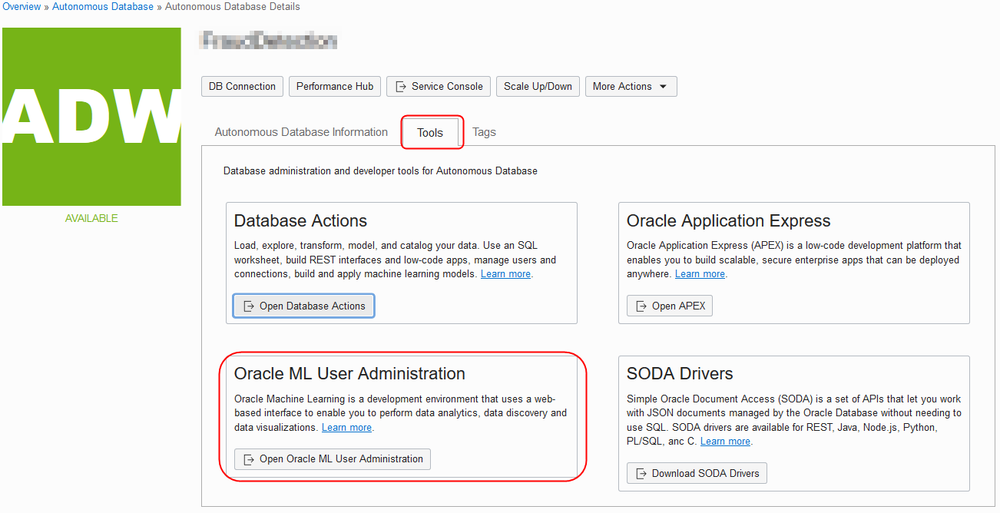
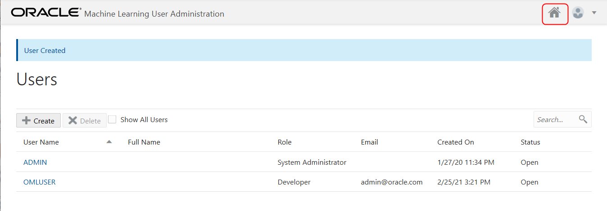
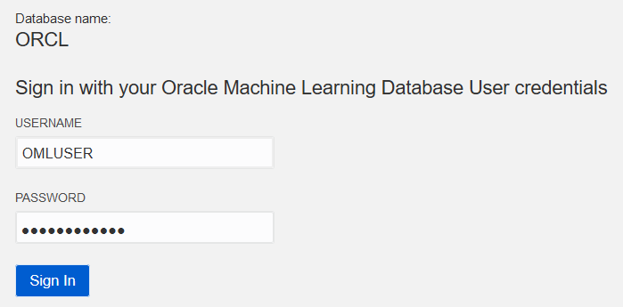
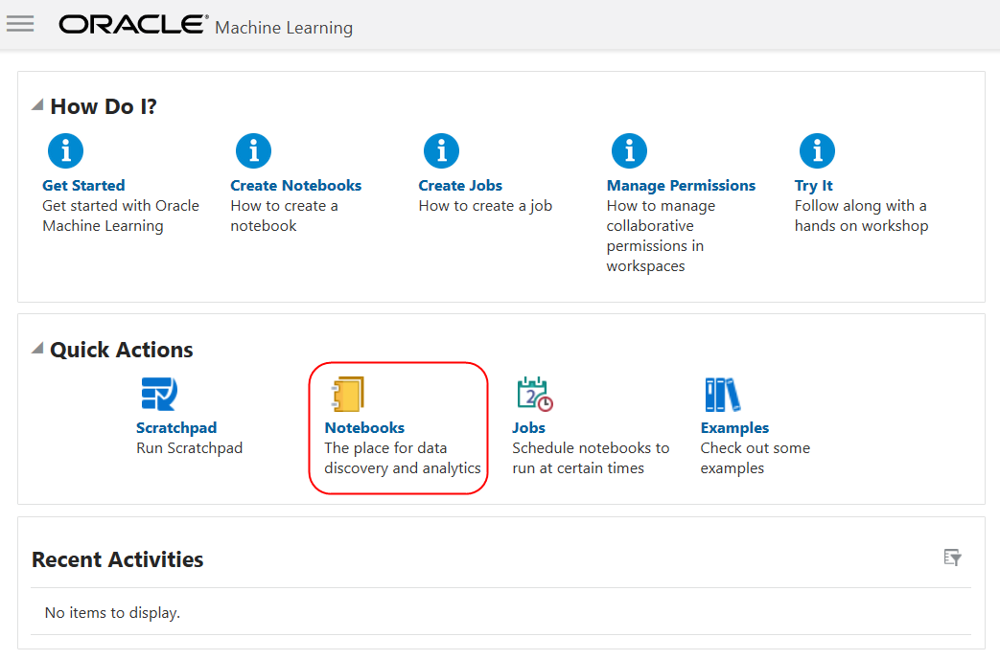
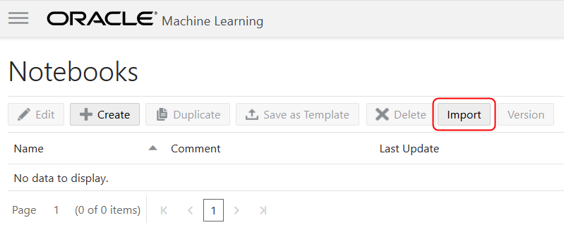
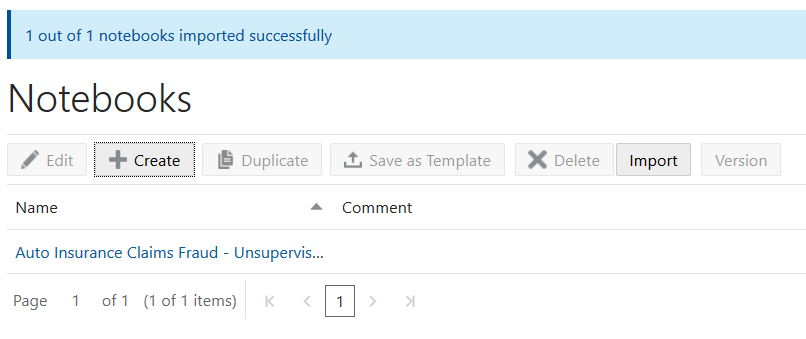
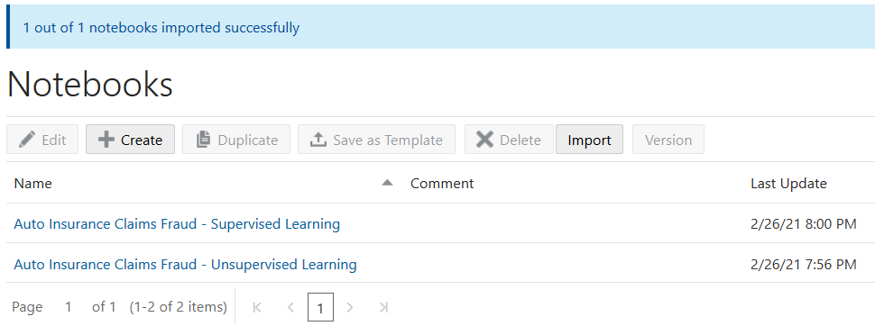
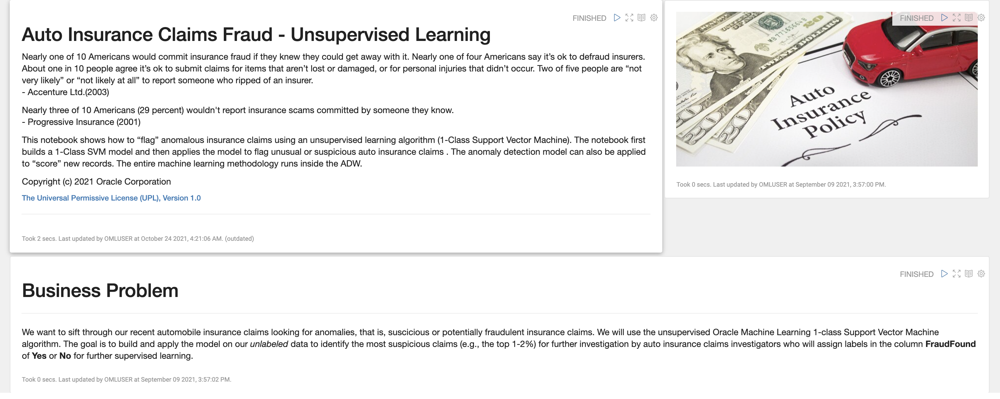
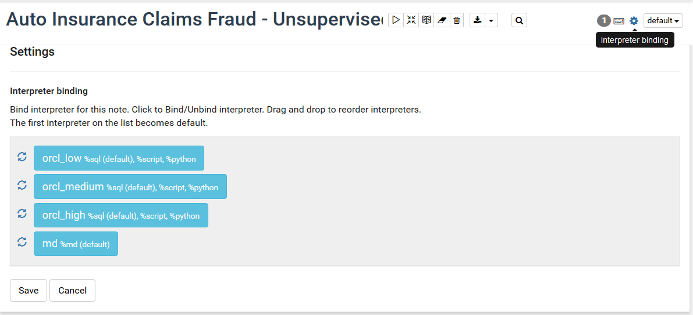
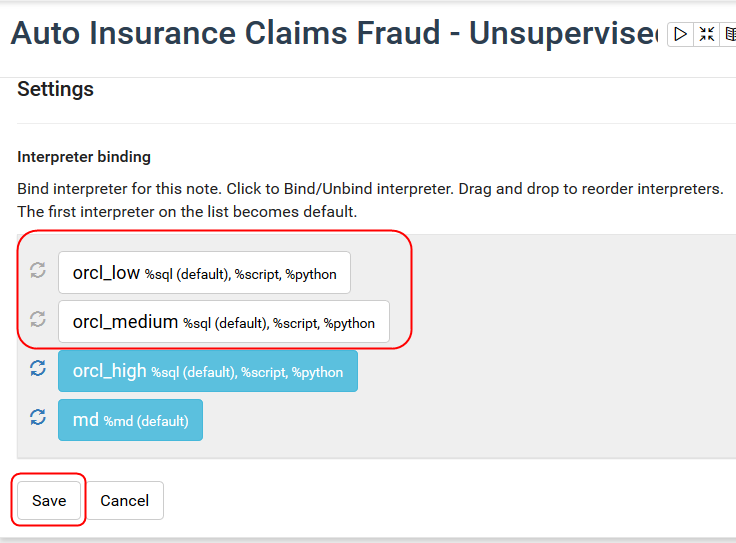

# Build a Machine Learning Model

## Introduction

This is the lab where you’re going to do the work of building and training a machine learning model that will help identify fraudulent auto claims.

### Before You Begin

Remember that we are trying to help predict when an auto claim is fraudulent. We use Oracle Machine Learning's 1-Class Support Vector Machine to train on "normal" records and apply the 1-Class SVM model to our insurance claims to flag those claims that are most dissimilar from the training population.

In this lab, you will use Apache Zeppelin notebooks to do this work.

Estimated time: 20 - 30 minutes

### Objectives

- Import an Apache Zeppelin notebook.
- Become familiar with Oracle Machine Learning Algorithms.
- Create a machine learning model to determine factors that predict fraud.

### Prerequisites

This lab assumes you have completed the following labs:
<if type="freetier">
- Sign Up for Free Tier Account/Login to Oracle Cloud
- Provision and Setup ADB
</if>
<if type="livelabs">
- Launch the workshop (in the Introduction)
</if>

## **Step 1:** Import ML Notebooks

We have built the steps that are normally followed when exploring data and building a machine learning model. This has been saved to the file you can download. We will import this notebook and review it. It is important to note that you *must execute all the steps in this notebook*. Executing the steps takes only a few minutes.

1. From the tab on your browser with your ADW instance, in the Tools tab, select **Open Oracle ML Administration** and (if required) login with the admin credentials. <if type="livelabs">Your admin password is the password you copied from the Launch page.</if>

    

    

2. Click the home button to login in with the OMLUSER.

    

3. Sign in with the omluser using the password <if type="freetier">you created</if><if type="livelabs">`AAbbcc123456`</if>.

    

4. Click on Notebooks from the Quick Actions menu.

    

5. Download the [Auto Insurance Claims Fraud - Unsupervised Learning.json](files/Auto-Insurance-Claims-Fraud-Unsupervised-Learning.json?download=1) file.

6. Download the [Auto Insurance Claims Fraud - Supervised Learning.json](files/Auto-Insurance-Claims-Fraud-Supervised-Learning.json?download=1) file.

7. Click on **Import**.

    

6. Go to the directory where you downloaded the files and import the **Auto-Insurance-Claims-Fraud-Unsupervised-Learning.json** notebook.

    

7. Repeat and import the **Auto-Insurance-Claims-Fraud-Unsupervised-Learning.json** notebook.

    

## **Step 2:** - Working Unsupervised Auto Claims

1.  Select the **Auto Insurance Claims Fraud - Unsupervised Learning** notebook to open it.

    

2.  Before you start working the **Auto Insurance Claims Fraud - Unsupervised Learning** you need to set the interpreter binging. Click on the gear icon.

    

3.  Click the low and medium bindings to disable them and click **Save**.

    

4.  Click on the **Run All Paragraphs** icon to run all paragraphs in the notebook, then click **OK**.

    

    

5.  Click on the **Show/Hide the Output** icon to show the output and ensure that all the paragraphs are in **Finished** state.

    

    Click the **Show/Hide the Output** icon again to return to the paragraphs.

## **Step 3:** About this Notebook

This step discusses the result of each portion of the notebook.

1. In the first table, the claims data illustrates the model input attributes.

    

2. The next section illustrates how we can graph our understanding of the data.

    

3. Next, we'll build the model to train on.

    

4. Using the model, we can display the most suspicious claims in descending order.

    

5. Then explore those suspicious claims.

    

6. Finally, build the table of suspicious claims.

    

Please proceed to the next lab.

## Acknowledgements

- **Author** - Charlie Berger, Senior Director of Product Management, Machine Learning, Cognitive Analytics and AI
- **Last Updated By/Date** - Tom McGinn, Product Manager, DB Product Management, March 2021

## Need Help?
Please submit an e-mail to **livelabs-help-db_us@oracle.com**. Please include your workshop name and lab name.  You can also include screenshots and attach files.  Engage directly with the author of the workshop.
