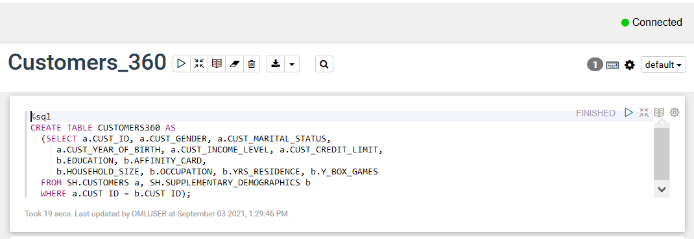
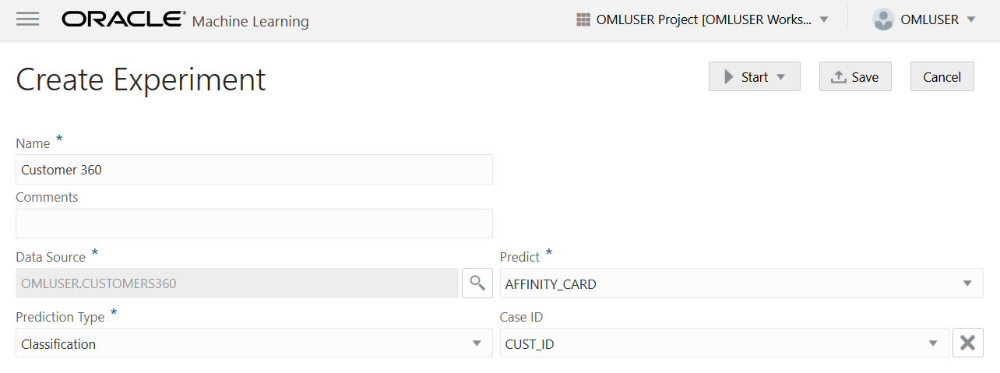

# Using Oracle Machine Learning AutoML UI

## Introduction

This lab walks you through the steps to create an AutoML experiment, edit and adjust experiment settings, view and deploy OML models.

Estimated Lab Time: 15 minutes

### About Oracle Machine Learning AutoML UI
Oracle Machine Learning AutoML UI (OML AutoML UI) is a no-code user interface supporting automated machine learning for both data scientist productivity and non-expert user access to powerful in-database algorithms. Like the OML4Py AutoML API, it accelerates machine learning projects by giving quick feedback on data set suitability for producing useful models – alleviating much of the drudgery of the machine learning process.
Oracle Machine Learning AutoML UI automates model building with minimal user input – you just have to specify the data and the target in what’s called an experiment and the tool does the rest. However, you can adjust some settings, such as the number of top models to select, the model selection metric, and even specific algorithms.
With a few clicks, you can generate editable _starter_ notebooks. These notebooks contain data selection, building the selected model – including the settings used to produce that model – and scoring and evaluation code – all in Python using OML4Py. You can build on this _generated notebook_ to apply your own domain expertise to augment the solution. Similarly, you can deploy models from OML AutoML UI as REST endpoints to OML Services in just a few clicks.

### Objectives


In this lab, you will:
* Access OML AutoML UI
* Create an experiment
* Edit and adjust experiment settings
* View the leaderboard and other settings
* Deploy models to OML Services
* View OML Models menu with deployed metadata and endpoint JSON
* Create a notebook for the top model
* View generated notebook and individual paragraphs


### Prerequisites (Optional)

This lab assumes you have:
* An Oracle account
* All previous labs successfully completed


*This is the "fold" - below items are collapsed by default*

## Task 1: Access OML AutoML UI

To access AutoML UI, you must sign into Oracle Machine Learning user interface, which also includes Oracle Machine Learning Notebooks, on Autonomous Database:
To sign into Oracle Machine Learning (OML) Notebooks from the Autonomous Database Service Console:

1. Select an Autonomous Database instance and on the Autonomous Database details page click **Service Console**.

	

2. Click **Development**.

  

4. On the Development page click **Oracle Machine Learning Notebooks**.  click **Navigation**.

5. Enter your username and password, and click **Sign in**. This opens the Oracle Machine Learning user interface homepage.

6. On your Oracle Machine Learning homepage, click **AutoML**.

	

   If you add another paragraph, add 3 spaces before the line.

## Task 2: Create the CUSTOMERS360 table

In this step, you will create a notebook and run a SQL query to create the table ``CUSTOMERS60``.

	>**Note:** You will be using this table in this lab in the next lab Oracle Machine Learning Services.

To create the table:

1. On the Oracle Machine Learning user interface home page, click **Notebooks**. The Notebooks page opens.

2. On the Notebooks page, click **Create**.

3. In the Create Notebook dialog, enter Customers_360 in the name field. and click **OK**.

4. Type ``%sql`` to connect to the SQL interpreter and press enter.

5. Enter the following script and click the run icon:

    ```
    <copy>
		CREATE TABLE CUSTOMERS360 AS
              (SELECT a.CUST_ID, a.CUST_GENDER, a.CUST_MARITAL_STATUS,
                 a.CUST_YEAR_OF_BIRTH, a.CUST_INCOME_LEVEL, a.CUST_CREDIT_LIMIT,
                 b.EDUCATION, b.AFFINITY_CARD,
                 b.HOUSEHOLD_SIZE, b.OCCUPATION, b.YRS_RESIDENCE, b.Y_BOX_GAMES
           FROM SH.CUSTOMERS a, SH.SUPPLEMENTARY_DEMOGRAPHICS b
           WHERE a.CUST_ID = b.CUST_ID);
		</copy>
    ```
		

6. In the next paragraph, run the following script to view the data:

	```
  <copy>
	select * from CUSTOMERS360
		where rownum < 10;
	 </copy>
  ```

	

## Task 3: Create an experiment
An Experiment can be described as a work unit that contains the definition of data source, prediction target, and prediction type along with optional settings. After an Experiment runs successfully, it presents you a list of machine learning models in the leader board. You can select any model for deployment, or use it to create a notebook based on the selected model.
When creating an Experiment, you must define the data source and the target of the experiment. To create an Experiment:

1. Click **AutoML** on your Oracle Machine Learning home page. The AutoML Experiments page opens.

2. Click **Create**. The Create Experiments page opens.

3. In the **Name** field, enter Customers 360.

	

4. In the **Comments** field, enter comments, if any.

5. In the **Data Source** field, define the data definition for your experiment. The data definition comprises a data source and a target. Click the search icon to open the Select Table dialog box. Select the table **CUSTOMERS360** and click **OK**.

6. In the Predict drop-down list, select the column **AFFINITY_CARD** from the CUSTOMERS360 table. This is the target for your prediction.

7. In the Prediction Type field, the prediction type is automatically selected based on your data definition. However, you can override the prediction type from the drop-down list, if data type permits. In this example, **Classification** is automatically chosen as the prediction type.
Supported Prediction Types are:

* Classification: For non-numeric data type, Classification is selected by default.
* Regression: For numeric data type, Regression is selected by default.

8. In the **Case ID** field, select **CUST_ID**. The Case ID helps in data sampling and dataset split to make the results reproducible between experiments. It also aids in reducing randomness in the results. This is an optional field.  


### Task 3.1: Adjust Additional Settings
To adjust additional settings of this experiment:

1. Expand the Additional Settings section on the Experiments page, and make the following changes:

2. 


### Task 3.2 View Leader Board with Additional Metrics


## Task 4: Deploy Top Model to OML Services


## Task 5: View OML Models with Deployed Metadata and JSON Endpoint


## Task 6: Create a Notebook for the Top Model


## Task 7: View Generated Notebook and Individual Paragraphs


## Learn More

*(optional - include links to docs, white papers, blogs, etc)*

* [URL text 1](http://docs.oracle.com)
* [URL text 2](http://docs.oracle.com)

## Acknowledgements
* **Author** - <Name, Title, Group>
* **Contributors** -  <Name, Group> -- optional
* **Last Updated By/Date** - <Name, Month Year>
