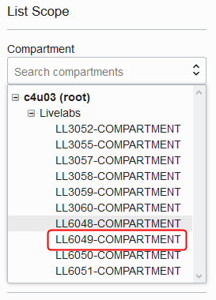
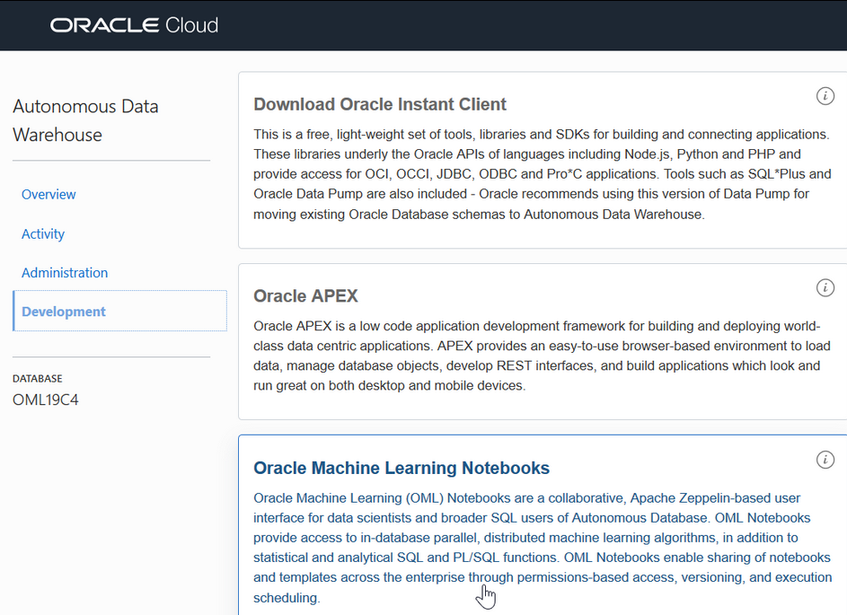
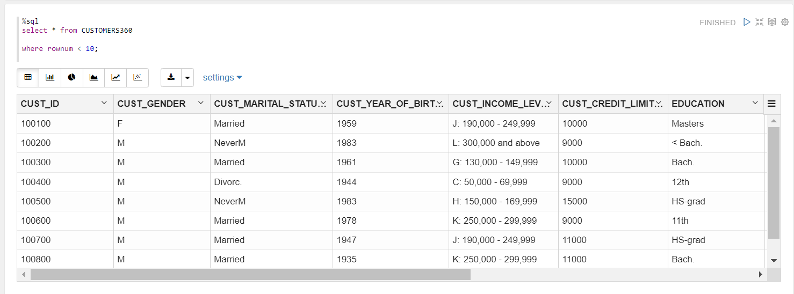

# Get started with Freetier Setup

## Introduction
This lab walks you through the steps to provision an Oracle Autonomous Database, and sign into Oracle Machine Learning user interface.

Estimated Lab Time: 15 minutes

### Objectives

In this lab, you will learn how to:

* Provision an Oracle Autonomous Database
* Sign into Oracle Machine Learning user interface
* Create the CUSTOMERS360 table. You will use in table in the lab on AutoML UI and OML Services.

### Prerequisites
* Sign up for a free tier Oracle Cloud account.

> **Note:** You may see differences in account details (eg: Compartment Name is different in different places) as you work through the labs. This is because the workshop was developed using different accounts over time.


## Task 1: Launch the Workshop

> Note: it takes approximately 20 minutes to create your workshop environment.*

1. Click the **Navigation Menu** in the upper left, navigate to **Oracle Database**, and select **Autonomous Data Warehouse**.

	

2. Select the compartment assigned to you from the **List Scope** menu and then click the Oracle Autonomous Data Warehouse instance.

    

    

## Task 2: Provision an Oracle Autonomous Database

To provision an Oracle Autonomous Database:

1. From the **Navigation Menu** in the upper left corner, select **Oracle Database**, and then select **Autonomous Data Warehouse**.

	

2. From the Oracle Cloud Infrastructure Console, on the Oracle Autonomous Database page choose your region and select a compartment.

3. Click **Create Autonomous Database**.

    

4. Provide basic information for the Oracle Autonomous Database.

    Enter a user-friendly display name for the ADB instance to easily identify the resource. The display name does not have to be unique.

    

5. For Workload Type, click **Data Warehouse**.

6. For Deployment, select **Shared Infrastructure**.

7. For Database configuration, select the following:

    - **Choose database version:** Select the database version. The available database version is **19c**.
    - **OCPU Count:** Enter ``1`` . This is number of CPU cores for your database.
    - **Storage (TB):** Specify the storage you wish to make available to your database, in terabytes. Click the arrow to select ``1``.
    - **Auto Scaling:** By default auto scaling is enabled to allow the system to automatically use up to three times more CPU and IO resources to meet workload demand.

    

8. For Administrator credentials, enter and re-confirm a password.

9. For network access, select **Allow secure access from everywhere.**

    

10. For License, select **License Included**.

    

11. Click **Create Autonomous Database**. The Oracle Autonomous Data Warehouse instance starts provisioning. Click **Autonomous Data Warehouse** again from the navigation to see a list of Oracle Autonomous Database instances in your console.

12. Click the Autonomous Data Warehouse instance you just created.

    


## Task 3: Sign into Oracle Machine Learning Notebooks

A notebook is a web-based interface for data analysis, data discovery, data visualization, and collaboration. You create and run notebooks in Oracle Machine Learning Notebooks. You can access Oracle Machine Learning Notebooks from Autonomous Database.

1. From the tab on your browser with your ADW instance, click **Service Console**, then select **Development** on the left.

	


2. Click **Oracle Machine Learning Notebooks.**

	  

3. Enter your user credentials and click **Sign in**.

	> **Note:** If you are using a LiveLabs tenancy, then the username is ``OMLUSER`` and the password is ``AAbbcc123456``.

	

4. Click **Notebooks** in the Quick Actions section.

	


## Task 4: Create the CUSTOMERS360 table

In this step, you will create a notebook and run a SQL query to create the table ``CUSTOMERS60``.

>**Note:** You will be using this table in this lab in the next lab Oracle Machine Learning Services.

To create the table:

1. On the Oracle Machine Learning user interface home page, click **Notebooks**. The Notebooks page opens.

2. On the Notebooks page, click **Create**.

3. In the Create Notebook dialog, enter Customers_360 in the name field. and click **OK**.

4. Type ``%sql`` to connect to the SQL interpreter and press enter.

5. Enter the following script and click the run icon:

    ```
    <copy>
		CREATE TABLE CUSTOMERS360 AS
              (SELECT a.CUST_ID, a.CUST_GENDER, a.CUST_MARITAL_STATUS,
                 a.CUST_YEAR_OF_BIRTH, a.CUST_INCOME_LEVEL, a.CUST_CREDIT_LIMIT,
                 b.EDUCATION, b.AFFINITY_CARD,
                 b.HOUSEHOLD_SIZE, b.OCCUPATION, b.YRS_RESIDENCE, b.Y_BOX_GAMES
           FROM SH.CUSTOMERS a, SH.SUPPLEMENTARY_DEMOGRAPHICS b
           WHERE a.CUST_ID = b.CUST_ID);
		</copy>
    ```

	

6. In the next paragraph, run the following script to view the data:

	```
		<copy>
		select * from CUSTOMERS360
			where rownum < 10;
		 </copy>
	 ```


	


## Learn More

* [Get Started with Oracle Machine Learning for Python](https://docs.oracle.com/en/database/oracle/machine-learning/oml4py/1/mlpug/get-started-with-oml4py.html#GUID-B45A76E6-CE48-4E49-B803-D25CA44B09ED)
* [Oracle Machine Learning Notebooks](https://docs.oracle.com/en/database/oracle/machine-learning/oml-notebooks/)

## Acknowledgements
* **Author** - Moitreyee Hazarika, Principal User Assistance Developer, Oracle Database
* **Contributors** -  Mark Hornick, Senior Director, Data Science and Machine Learning; Marcos Arancibia Coddou, Product Manager, Oracle Data Science; Sherry LaMonica, Principal Member of Tech Staff, Advanced Analytics, Machine Learning
* **Last Updated By/Date** - Moitreyee Hazarika, September 2021
