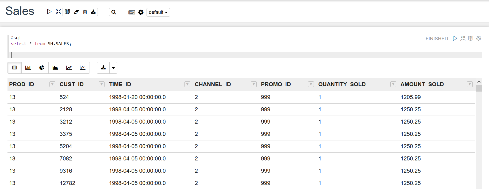

# Oracle® Cloud Creating and Running Notebooks in Oracle Machine Learning
## Before You Begin

This tutorial shows you how to create a notebook and run it in Oracle Machine Learning.

This tutorial takes approximately 10 minutes to complete.

### Background
An Oracle Machine Learning notebook is a web-based interface for data analysis, data discovery, and data visualization. Whenever a notebook is created, it must be defined with a specific Interpreter Settings specification. The notebook contains an internal list of bindings that determines the order of the interpreter bindings.

### What Do You Need?

* Access to your Oracle Machine Learning account
* A project created in your Oracle Machine Learning account, where the notebook will reside

## Create Your Notebook

To create a notebook:

1. Log in to your Oracle Machine Learning account and click **Notebooks** in the home page.

   

2. In the Notebooks page, click **Create**. The Create Notebook dialog box opens.

   

3. In the **Name** field, provide a name for the notebook.

4. In the **Comments**field, enter comments if any.

5. The **Connection** field specifies the Global connection group.

6. Click **OK**. This completes the task of creating a notebook. You must now open the in the Notebook editor to set the interpreter bindings.

7. Click **Back** to return to the Notebooks page, and to save the changes in the notebook.

## Run Your Notebook

You must fetch data in a notebook from the data source, and run the notebook for data analysis and data visualization.
The SQL statements and SQL scripts perform the operations related to data mining and data analysis in the database. The notebook offers the functionality to perform charting on the SQL
interpreter output that is returned to the notebook. The options in the chart settings to perform groupings, summation, and other operations are done in the notebook server, and not in the database server. For instance, if you want to run a **Group By** on all your data, then it is recommended to use SQL scripts to do the grouping in the database, and return the summary information for charting in the notebook. Grouping at the notebook level works well for small sets of data. If you pull a lot of data into the notebook, then there is a chance of the JVM
running out of memory. You can set the row limit for your notebook by using the option **Render Row Limit** in the Connection Group page.

To run a notebook:

1. Click the notebook that you want to run. The notebook opens in the Notebook editor.

2. Type the SQL statement to fetch data from an Oracle Database. For example, type `SELECT * from SH.SALES;` where `SH` is the schema name and `SALES` is the table name as shown in the screenshot.

   

   Click . Alternatively, you can press **Shift+Enter** keys to run the notebook.

3. After you run the notebook, it fetches the data in the notebook in the next paragraph, as shown in the screenshot. A paragraph is a notebook component where you can write SQL statements and run scripts. A paragraph has an input section and an output section. In the input section, you specify the interpreter to run along with the text. This information is sent to the interpreter to be executed. In the output section, the results of the interpreter are provided.

       

   The output section of the paragraph has a charting component that displays the results in graphical output. The chart interface allows you to interact with the output in the notebook paragraph. You have the option to run and edit single a paragraph or all paragraphs in a notebook. In this screenshot, you can see the data from the `SALES` table in a scatter plot.

       

   You can visualize the data by clicking the respective icons for each graphical representation, as shown here:

      * Click the histogram icon  to visualize your data in a histogram.
      * Click the pie chart icon  to visualize your data in a pie chart.
      * Click the cumulative gain chart icon  to visualize your data in a cumulative gain chart.
      * Click the line diagram icon  to visualize your data in a line diagram.
      * Click the scatter plot icon  to visualize your data in a scatter plot.

4. Click **Back** to return to the Notebooks page.

## Acknowledgements

* **Author** : Mark Hornick, Sr. Director, Data Science / Machine Learning PM, Moitreyee Hazarika, Principal User Assistance Developer, DB Development - Documentation

* **Last Updated By/Date**: Dimpi Sarmah, September 2020

See an issue?  Please open up a request [here](https://github.com/oracle/learning-library/issues).   Please include the workshop name and lab in your request.
