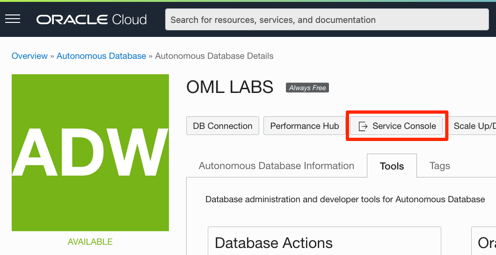
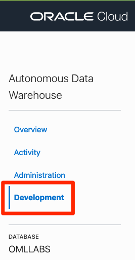
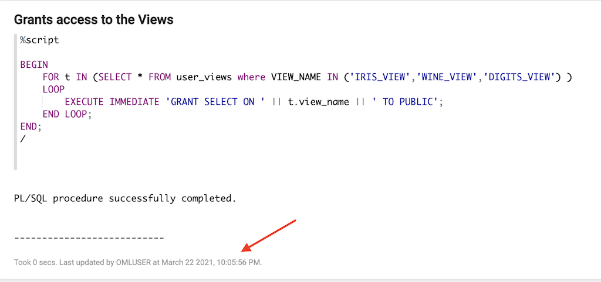

# Get Started with OML4Py on Oracle Autonomous Database

## Introduction
This lab walks you through the steps to create anOracle Machine Learning notebook and connect to the Python interpreter.

Estimated Lab Time: 15 minutes

### Objectives

In this lab, you will learn how to:
* Create an Oracle Machine Learning user
* Access Oracle Machine Learning Notebooks
* Create an Oracle Machine Learning Notebook
* Familiarize with the Oracle Machine Learning Notebook toolbar
* Familiarize with the Oracle Machine Learning Notebook interpreter bindings
* Familiarize with the Oracle Machine Learning Notebook interpreters
* Connect to the Python Interpreter
* Verify Connection to the Oracle Autonomous Database
* View help files

## **Step 1**: Create an Oracle Machine Learning User

An administrator creates a new user account and user credentials for Oracle Machine Learning in the User Management interface.
> **Note:** You must have the administrator role to access the Oracle Machine Learning User Management interface. To create a user account:

1. On the Autonomous Database Details page, click **Service Console.**

    

2. On the Service Console click **Administration.**
    

3. Click **Manage Oracle ML Users** to open the Oracle Machine Learning User Administration page.
    
4. Click **Create** on the Oracle Machine Learning User Administration page.
    <if type="freetier"></if>
    <if type="livelabs"></if>

5. In the Create User page, enter the following details to create the user:
    
    <if type="freetier">
    - **Username:** Enter `omluser` for username. Using this username, the user will log in to an Oracle Machine Learning instance.
    - **First Name:** Enter the first name of the user.
    - **Last Name:**  Enter the first name of the user.
    - **Email Address:** Enter the email ID of the user.
    - Select the option **Generate password and email account details to user. User will be required to reset the password on first sign in.** to auto generate a temporary password and send an email with the account credentials to the user.
    If you select this option, you need not enter values in the **Password** and **Confirm Password** fields; the fields are grayed out.
    - **Password:** Enter a password for the user, if you choose to create a password for the user.
    This option is disabled if you select the Generate password... option to auto generate a temporary password for the user.
    - **Confirm Password:** Enter a password to confirm the value that you entered in the Password field.
    By doing so, you create the password for the user. The user can change the password when first logging in.
    </if>
    <if type="livelabs">
    - **Username:** Enter `omluser2` for username. You use this user later in the workshop to learn how to grant datastore access to a user.
    - **Email Address:** Enter an email ID for the user.
    - Untick the **Generate password and email account details to user. User will be required to reset the password on first sign in.** option.
    You do not select this option, because you want to specify your own password. If you select this option, you need not enter values in the **Password** and **Confirm Password** fields; the fields are grayed out.
    - **Password:** Enter `AAbbcc123456` for password.
    - **Confirm Password:** Enter the same password again.
    </if>

6. Click **Create.**

<if type="livelabs">
    
</if>

<if type="freetier">
7. Repeat step 5 and 6 to create `omluser2` user. You use this user later in the workshop to learn how to grant datastore access to a user.

    
</if>


## **Step 2:** Access Oracle Machine Learning Notebooks

You create notebooks in Oracle Machine Learning Notebooks. You can access Oracle Machine Learning Notebooks from Autonomous Database.

1. From the tab on your browser with your ADW instance, click **Service Console**, then select **Development** from the left.

    

    

2. Click **Oracle Machine Learning Notebooks**.

    

3. <if type="livelabs">Sign in with the **omluser** using the password `AAbbcc123456`.</if><if type="freetier">Enter your `omluser` credentials and click **Sign in.**</if>

    

4. Click **Notebooks** on the Quick Actions menu.

    

<if type="freetier">## **Step 3:** Create Tables and Views, and Grant Access

This workshop uses tables and views which need to be created before proceeding with the workshop. To create these tables and views:

1. Download the [Run Me First notebook](./../notebooks/lab0_run_me_first.json?download=1). This notebook contains the scripts for creating tables and views, and granting required access.

2. In the Notebooks page click **Import** and select the `lab0_run_me_first.json` notebook file.

3. Click on the notebook to open it after it is successfully imported.

    

4. Click the **Run all paragraphs**  icon, and then click **OK** to confirm.

5. Wait until all the paragraphs have finished running and you see your current time in the last paragraph.

    

The prerequisite scripts have run successfully.

</if>

## **Step <if type="freetier">4</if><if type="livelabs">3</if>:** (Optional) Download and View the Notebook File

To download the notebook version of this lab (without screenshots), click <if type="freetier">[here](./../notebooks/lab1_get_started_freetier.json?download=1)</if><if type="livelabs">[here](./../notebooks/lab1_get_started_livelabs.json?download=1)</if>.

[](include:import)

<if type="livelabs">## **Step 4:** Create an Oracle Machine Learning Notebook</if>
<if type="freetier">## **Step 5:** Create an Oracle Machine Learning Notebook</if>

A notebook is a web-based interface for data analysis, data discovery, data visualization and collaboration. To create a notebook:
1. <if type="freetier">Click the hamburger menu, search for Notebooks, and click on it. </if>In the Notebooks page, click **Create.** The Create Notebook window appears.

    

2. In the **Name** field, provide a name for the notebook.
3. In the **Comments** field, enter comments, if any.
4. In the **Connections** field, select a connection in the drop-down list. By default, the `Global` connection group is assigned.
5. Click **OK.** The notebook is created and it opens in the notebook editor.

    

> **Note:** For Oracle Autonomous Database, a connection is automatically established provided you have the appropriate interpreter binding specified and import the oml package.    

### About Oracle Machine Learning Notebooks

The Oracle Machine Learning notebooks toolbar contains buttons to run code in paragraphs, for configuration settings, and display options.

For example, it displays the current status and the number of users connected to the notebook. It also contains a menu item for keyboard shortcuts and options to show or hide the markdown editor and paragraph output. Additional settings are shown in the illustration here.
    

Oracle Machine Learning notebooks contain an internal list of bindings to fetch data from the database or another data source, such as Oracle Cloud Object Storage. For this lab, we set the interpreter binding to connect to the ADW database and run queries.

Click the interpreter bindings icon in the upper right-corner of the Notebook to view the list of available interpreter bindings.
  

The default service is low. Click to bind or unbind an interpreter. Drag-and-drop individual interpreter binding settings up or down to order which binding will be used by default. The first interpreter on the list becomes the default. Those highlighted in blue are active.

An interpreter is a plug-in that allows you to use a specific data processing language in your Oracle Machine Learning notebook. You can add multiple paragraphs, and each paragraph can be connected to different interpreters such as SQL or Python.

You create different paragraphs with different interpreters based on the code you want to run in the paragraphs. The interpreter is set at the top of the paragraph.
The available interpreters are:

  - `%sql`&mdash;To call the SQL interpreter and run SQL statements
  - `%script`&mdash;To call and run PL/SQL scripts
  - `%md`&mdash;To call the Markdown interpreter and generate static html from Markdown plain text
  - `%python`&mdash;To call the Python interpreter and run Python scripts

<if type="livelabs">## **Step 5:** Connect to the Python Interpreter</if>
<if type="freetier">## **Step 6:** Connect to the Python Interpreter</if>

To run Python commands in a notebook, you must first connect to the Python interpreter. This occurs as a result of running your first `%python` paragraph. To use OML4Py, you must import the `oml` module, which automatically establishes a connection to your database.
In an Oracle Machine Learning notebook, you can add multiple paragraphs, and each paragraph can be connected to different interpreters such as SQL or Python. This example shows you how to:

* Connect to a Python interpreter to run Python commands in a notebook
* Import the Python modules - oml, pandas, numpy, and matplotlib
* Check if the `oml` module is connected to the database

**Note:** `z` is a reserved keyword and must not be used as a variable in `%python` paragraphs in Oracle Machine Learning Notebooks. You will see `z.show()` used in the examples to display Python object and proxy object content.

1. Open the notebook and click the interpreter bindings icon. View the available interpreter bindings.  The "low" priority binding runs operations serially (no parallelism). You can drag-and-drop individual interpreter binding settings up or down to order which binding will be used by default. Those highlighted in blue are active. Click to toggle to inactive.

    

    The available interpreter bindings are:
    - `%sql`&mdash;To call the SQL interpreter and run SQL statements
    - `%script`&mdash;To call and run PL/SQL scripts
    - `%md`&mdash;To call the Markdown interpreter and generate static html from Markdown plain text
    - `%python`&mdash;To call the Python interpreter and run Python scripts

2. To connect to the Python interpreter, type `%python` at the top of a new paragraph in your notebook.
   You are now ready to run Python scripts in your notebook.

3. To use OML4Py module, you must import the oml module. Type the following Python command to import the `oml` module, and click the run icon. Alternatively, you can press Shift+Enter keys to run the notebook.   

    ```
    %python
    <copy>import oml</copy>
    ```

    

<if type="livelabs">## **Step 6:** Verify Connection to the Oracle Autonomous Database</if>
<if type="freetier">## **Step 7:** Verify Connection to the Oracle Autonomous Database</if>

Using the default interpreter bindings, OML Notebooks automatically establishes a database connection for the notebook.  

1. To verify the Python interpreter has established a database connection through the `oml` module, run the command:

    ```
    %python
    <copy>oml.isconnected()</copy>
    ```
    

    Once your notebook is connected, the command returns `True`.         


<if type="livelabs">## **Step 7:** View Help Files</if>
<if type="freetier">## **Step 8:** View Help Files</if>


The Python help function is used to display the documentation of packages, modules, functions, classes, and keywords. The help function has the following syntax:
    ```
    help([object])
    ```

For example,
  - To view the help files for the `oml.create` function, type:
    ```
    %python
    <copy>
    help(oml.create)</copy>
    ```

  - To view the help files for `oml` package, type:

    ```
    %python
    <copy>
    help(oml)</copy>
    ```  

## Learn More

* [Get Started with Oracle Machine Learning for Python](https://docs.oracle.com/en/database/oracle/machine-learning/oml4py/1/mlpug/get-started-with-oml4py.html#GUID-B45A76E6-CE48-4E49-B803-D25CA44B09ED)
* [Oracle Machine Learning Notebooks](https://docs.oracle.com/en/database/oracle/machine-learning/oml-notebooks/)

## Acknowledgements
* **Author** - Moitreyee Hazarika, Principal User Assistance Developer
* **Contributors** -  Mark Hornick, Senior Director, Data Science and Machine Learning; Marcos Arancibia Coddou, Product Manager, Oracle Data Science; Sherry LaMonica, Principal Member of Tech Staff, Advanced Analytics, Machine Learning
* **Last Updated By/Date** - Moitreyee Hazarika, June 2021
