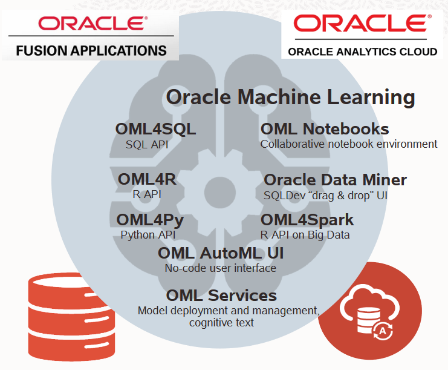

# Introduction

## About this Workshop

In this workshop, you will explore how to pick a good wine for under $30 using Oracle Autonomous Database, Oracle Machine Learning and the Oracle Analytics Cloud with a simple use case.

Estimated Lab Time: 90 minutes

Preview this video about picking a good inexpensive wine using Oracle Machine Learning.

### About Product/Technology

**Oracle Machine Learning** extends Oracle Database(s) and enables users to build “AI” applications and analytical dashboards. OML delivers powerful in-database machine learning algorithms, automated ML functionality via SQL APIs and integration with open source Python* and R.

To select a good inexpensive wine, you will:
- Use the Oracle Machine Learning Notebook to:
    - Understand the Business Problem
    - Explore data
    - Identify key attributes
    - Build predictive ML models 
    - Apply ML models for predictions
- Further investigate insights and predictions using Oracle Analytics Cloud, Interactive analytics, charts and more.

### Workshop Scenario

Let's take a scenario where we are invited to a party and want to bring something to contribute. A bottle of wine is always a good option. But which one? There are so many! And we don't want to break the bank for our party gift. Let's try to use the Autonomous Database, Oracle Machine Learning and Oracle Analytics Cloud to find a likely tasty and likely to be rated greater than 90 Points (GT\_90\_Points) adult beverage that is also affordable (Under $30).

Note:  Data comes from Kaggle WineReviews130K data = 130k wine reviews with variety, location, winery, price, etc. Points was binned to GT\_90\_Points and LT\_90_Points  [https://www.kaggle.com/zynicide/wine-reviews](https://www.kaggle.com/zynicide/wine-reviews)

Using Wine Reviews data from Kaggle, we build, evaluate and apply Oracle Machine Learning models using random forests and support vector machine classification techniques that identify likely good (greater than 90 points) bottles of wine. This demo highlights OML's text mining capabilities and its tight integration with Oracle Analytics Cloud for interactively explore OML's insights and predictions.

### Objectives

In this lab, you will:
* Provision an Oracle Autonomous Database instance
* Setup
* Data Load
* Query
* Analyze
* Visualize

### Prerequisites

* An Oracle Free Tier, Always Free, Paid or LiveLabs Cloud Account

You may now [proceed to the next lab](#next).

## Learn More

* [Picking a Good Inexpensive Wine <$30 using Oracle Machine Learning](https://blogs.oracle.com/machinelearning/picking-a-good-inexpensive-wine-%3c30-using-oracle-machine-learning)

## Acknowledgements

* **Author** - Charlie Berger, Senior Director of Product Management, Data Mining and Advanced Analytics
* **Contributors** -  Anoosha Pilli, Database Product Management
* **Last Updated By/Date** - Didi Han, Database Product Management,  March 2021
* **Workshop Expiry Date** - March 2022