# Provision and Load Data into Autonomous Database Instance[Workshop Under Construction]

## Introduction

In this lab, you will provision the Oracle Autonomous Database, upload data file into Oracle Cloud Infrastructure(OCI) object storage, set up credentials, create table, load data into tables from files from OCI object storage files.

*Note: While this lab uses ADW, the steps are identical for creating and connecting to an ATP database.*

Estimated Lab Time: 5 minutes

### Objectives

In this lab, you will:
- Provision an Autonomous Database instance
- Upload files to the OCI Object Storage
- Define object store credentials for your Autonomous Database instance
- Setup SQL Developer Web to load data into an Autonomous Database table
- Create tables in your database
- Load data from the Object Store

### Prerequisites

- This lab requires an [Oracle Cloud account](https://www.oracle.com/cloud/free/). You may use your own cloud account, a cloud account that you obtained through a trial, a Free Tier account, or a LiveLabs account.

### Video Preview

Watch a video demonstration on getting started with Oracle Machine Learning and Oracle Autonomous Database.

[](youtube:UDwlTpbhPX0)

## **STEP 1**: Provision an ADW instance

1. Login to the Oracle Cloud, as shown in the previous lab.

2. If you are using a Free Trial or Always Free account, and you want to use Always Free Resources, you need to be in a region where Always Free Resources are available. You can see your current default **Region** in the top, right hand corner of the page.

    

3. Once you are logged in, you can view the cloud services dashboard where all the services available to you. Click on hamburger menu, search for Autonomous Data Warehouse and select it.

    **Note:** You can also directly access your Autonomous Data Warehouse or Autonomous Transaction Processing service in the **Quick Actions** section of the dashboard.

    

4. From the compartment drop-down menu select the **Compartment** where you want to create your ADB instance. This console shows that no databases yet exist. If there were a long list of databases, you could filter the list by the **State** of the databases (Available, Stopped, Terminated, and so on). You can also sort by **Workload Type**. Here, the **Data Warehouse** workload type is selected.

    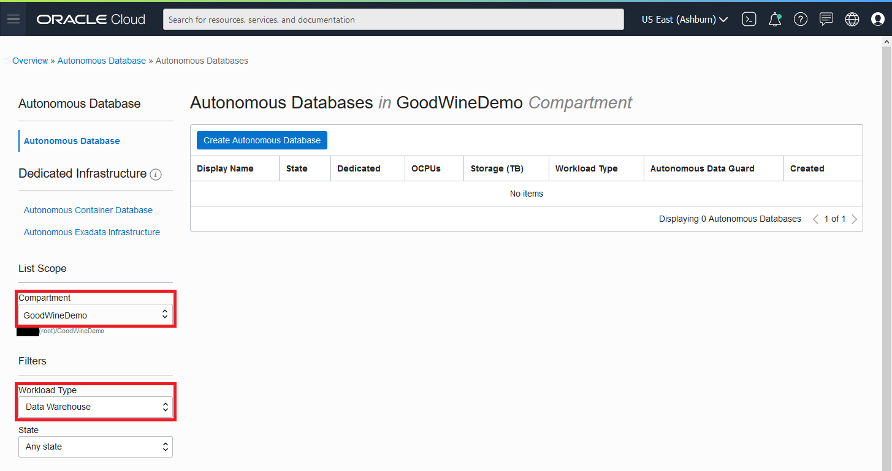

5. Click **Create Autonomous Database** to start the instance creation process.

    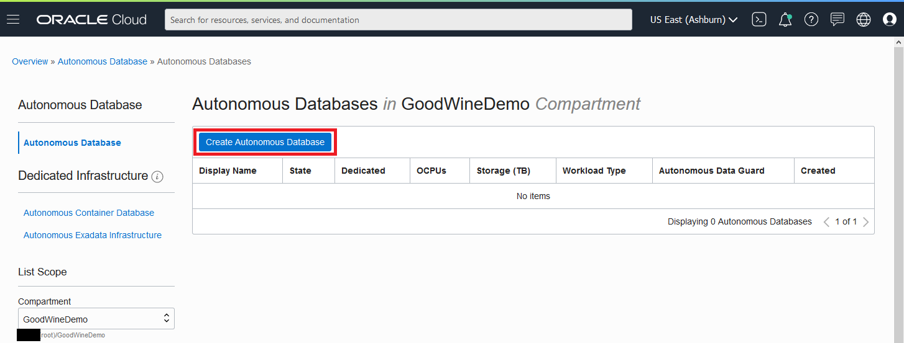

6.  This brings up the **Create Autonomous Database** screen, specify the configuration of the instance:
    - **Compartment** - Select a compartment for the database from the drop-down list.
    - **Display Name** - Enter a memorable name for the database for display purposes. This lab uses **ADW Good Wine** as the ADB display name.
    - **Database Name** - Use letters and numbers only, starting with a letter. Maximum length is 14 characters. (Underscores not initially supported.) This lab uses **ADWWINE** as database name.

    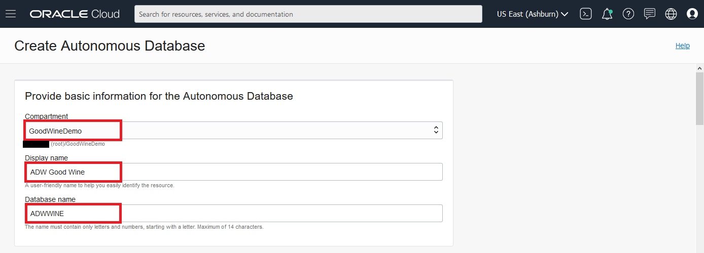

7. Choose a workload type, deployment type and configure the database:
    - **Choose a workload type** - For this lab, choose __Data Warehouse__ as the workload type.
    - **Choose a deployment type** - For this lab, choose **Shared Infrastructure** as the deployment type.
    - **Always Free** - If your Cloud Account is an Always Free account, you can select this option to create an always free autonomous database. An always free database comes with 1 CPU and 20 GB of storage. For this lab, we recommend you leave Always Free unchecked.
    - **Choose database version** - Select a database version from the available versions.
    - **OCPU count** - Number of CPUs for your service. Leave as it is, or if you choose an Always Free database, it comes with 1 CPU.
    - **Storage (TB)** - Select your storage capacity in terabytes. Leave as it is or, if you choose an Always Free database, it comes with 20 GB of storage.
    - **Auto Scaling** - For this lab, keep auto scaling enabled.

    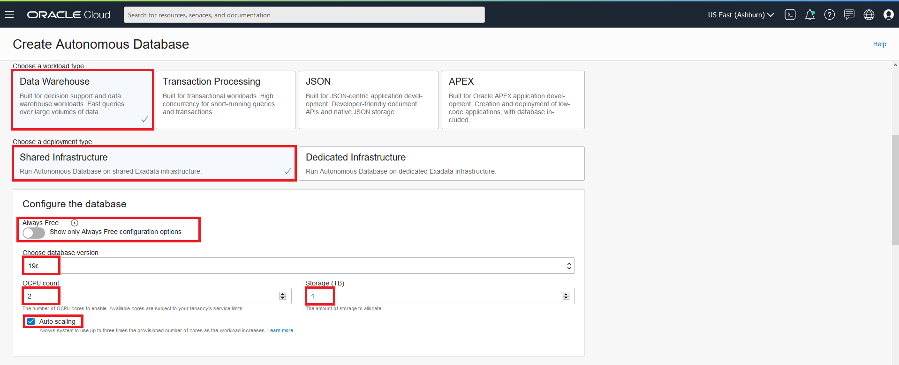

8. Create administrator credentials, choose network access and license type and click **Create Autonomous Database**.

    - **Password** - Specify the password for **ADMIN** user of the service instance.
    - **Confirm Password** - Re-enter the password to confirm it. Make a note of this password.
    - **Choose network access** - For this lab, accept the default, "Allow secure access from everywhere".
    - **Choose a license type** - For this lab, choose **License Included**.

    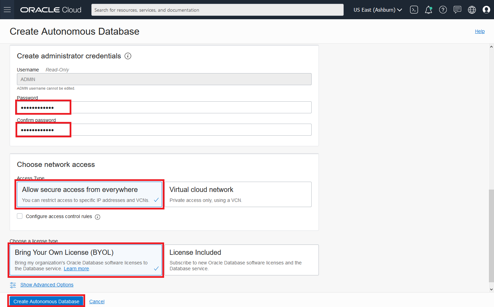

9.  Your instance will begin provisioning. In a few minutes, the state will turn from Provisioning to Available. At this point, your Autonomous Data Warehouse database is ready to use! Have a look at your instance's details here including its name, database version, OCPU count, and storage size.

    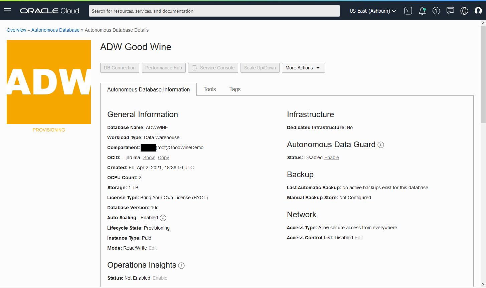

    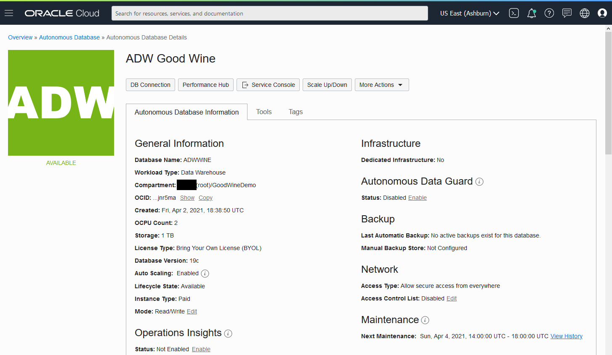

## **STEP 2:** Create ML User in ADW

1.  From the hamburger menu, select **Autonomous Data Warehouse** and navigate to your ADW instance.

    

    

2.  Select **Tools** on the Autonomous Database Details page.

    

3.  Select **Open Oracle ML User Administration** under the tools.

    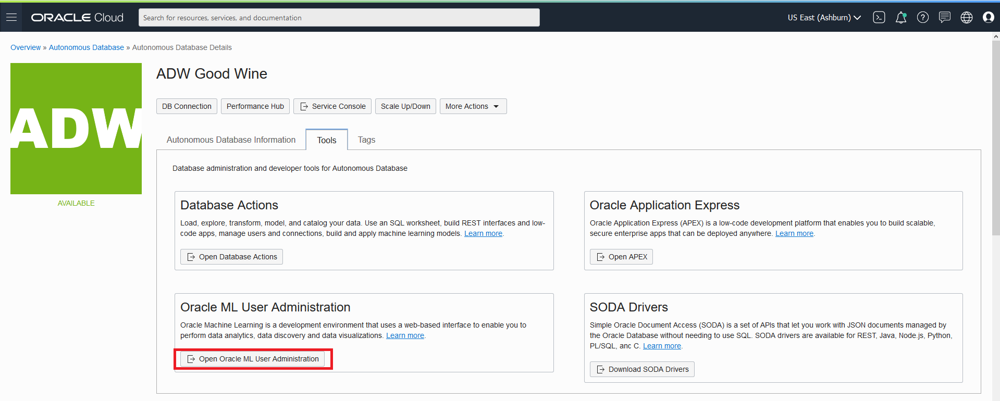

4. Sign in as **Username - ADMIN** and with the password you used when you created your Autonomous instance.

    

5.  Click **Create** to create a new ML user.

    

6. On the Create User form, enter **Username - OMLUSER**, an e-mail address (you can use admin@oracle.com), un-check **Generate password**, and enter a password you will remember. You can use the same password you used for the ADMIN account. Then click **Create**.

    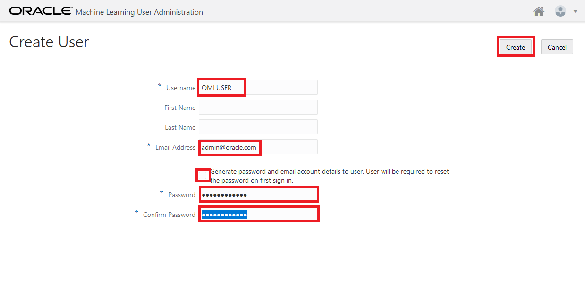

7. Notice that the **OMLUSER** is created.

    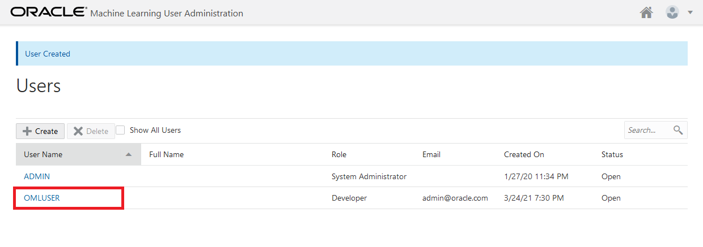

## **STEP 3**: Grant Privileges to OMLUSER to Access Database Actions

1.  From the hamburger menu, select **Autonomous Data Warehouse** and navigate to your ADW instance.

    

    

2.  Select **Tools** on the Autonomous Database Details page.

    

3. Select **Open Database Actions** under the tools.

    

4. On the Database Actions login page, log in with your ADW credentials, provide the **Username - ADMIN** and click **Next**. Then provide the <if type="freetier">**Password** you created for the Autonomous instance.</if><if type="livelabs">password **WELcome__1234**</if> and click **Sign in**.

    

    

5. From the Database Action menu, select **SQL**.

    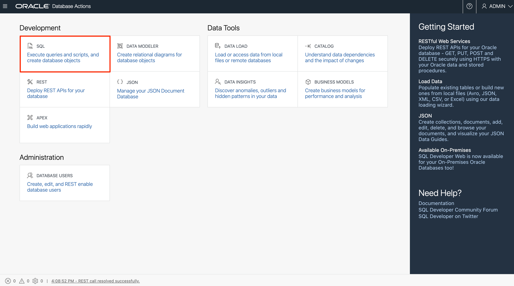

6. Dismiss the Help by clicking on the **X** in the popup.

    

7.  By default, only the ADMIN user can use the SQL Developer Web. To enable OMLUSER to use it, you need to enter the following and execute the procedure to grant SQL developer web access to OMLUSER.

    ````
    <copy>
    BEGIN
      ORDS_ADMIN.ENABLE_SCHEMA(
        p_enabled => TRUE,
        p_schema => 'OMLUSER',
        p_url_mapping_type => 'BASE_PATH',
        p_url_mapping_pattern => 'OMLUSER',
        p_auto_rest_auth => TRUE
      );
      COMMIT;
    END;
    /
    </copy>
    ````
    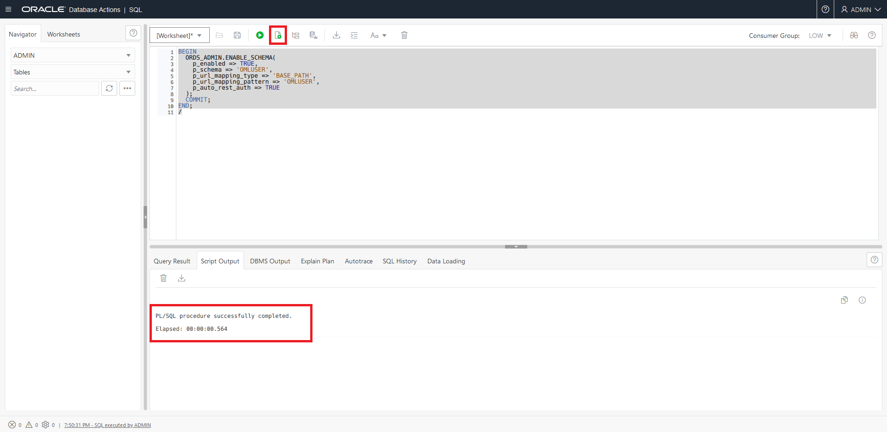

8.  Grant storage privileges to OMLUSER.

    ````
    <copy>
    alter user OMLUSER quota 500m on data;
    </copy>
    ````

    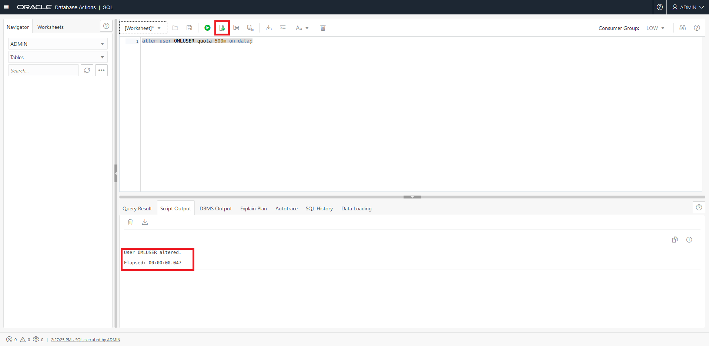

## **STEP 4**: Download the Necessary Files

1.  Click the link below to download the Wine Reviews CSV file.

    [WINEREVIEWS130KTEXT.csv](https://objectstorage.us-ashburn-1.oraclecloud.com/p/0dPIVvUpDxQWiDolBn8uJnTKkeoMg-ZNx5DQCXKAI06Vgxm00F5BKuN18iQum9tN/n/c4u03/b/data-management-library-files/o/WINEREVIEWS130KTEXT.csv)

2.  Save the WINEREVIEWS130KTEXT.csv to a location and note the path for later.

    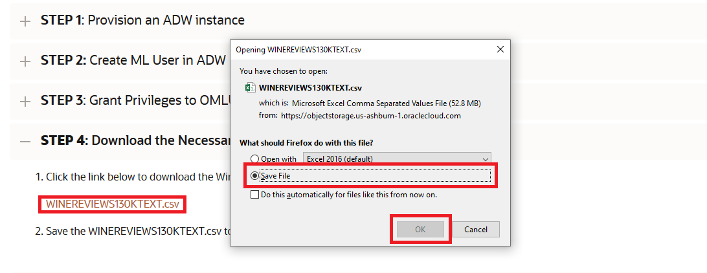

## **STEP 5**: Upload the Data Files to OMLUSER

1. On the tab with your ADW instance, click on **Open Database Actions** under Tools.

    


2. Sign in as **ADMIN**. Provide the **Username - ADMIN** and click **Next**. Then provide the password for your ADMIN and click **Sign in**.

    
    
    

3. In the webpage's URL, find the section that says **ADMIN** and change it to **OMLUSER**, then press enter.

    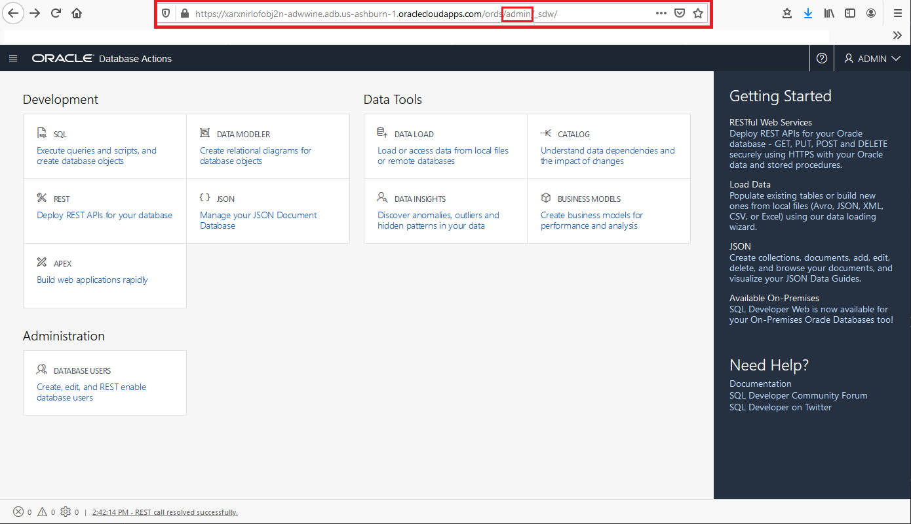

    

4. This time sign in as **OMLUSER**. Provide the **Username - OMLUSER** and the password for your OMLUSER and click **Sign in**.

    

5. Select **Data Load** from Database Actions menu.

    

6. Leave the default selections - **Load data** and **Local File** and click **Next**.

    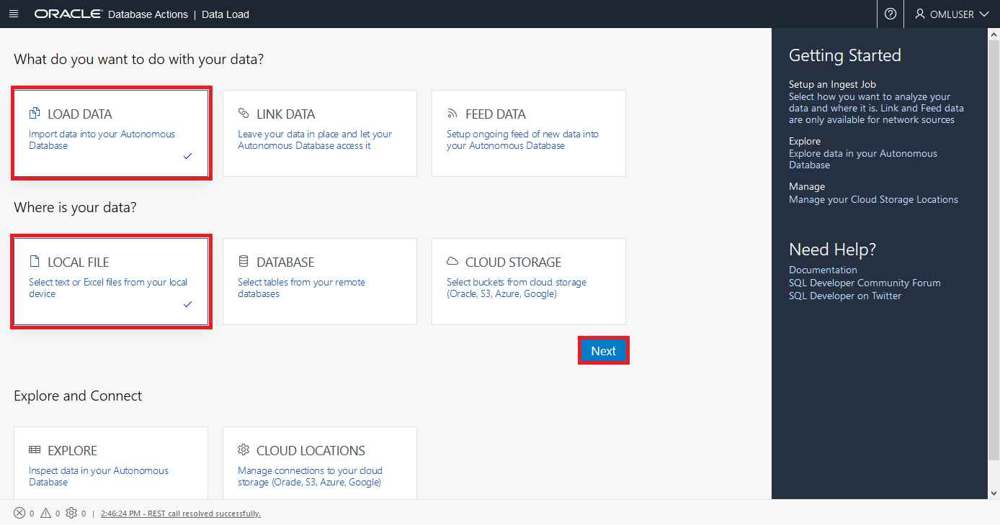

7. Drag and drop the **WINEREVIEWS130KTEXT.csv** from the location where you downloaded it onto the Drag and Drop target or click on **Select files** to browse the WINEREVIEWS130KTEXT.csv file and upload it.

    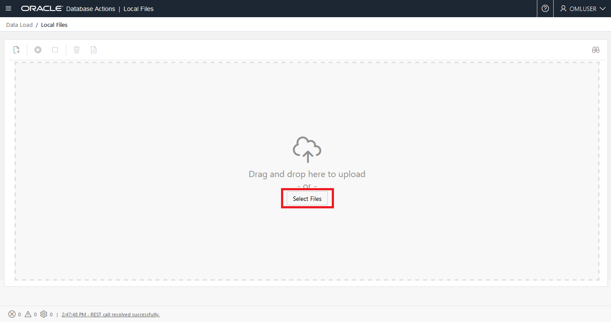

8. When the upload is complete, click **Start** and click **Run** in the Run Data Load Job confirmation dialog box.

    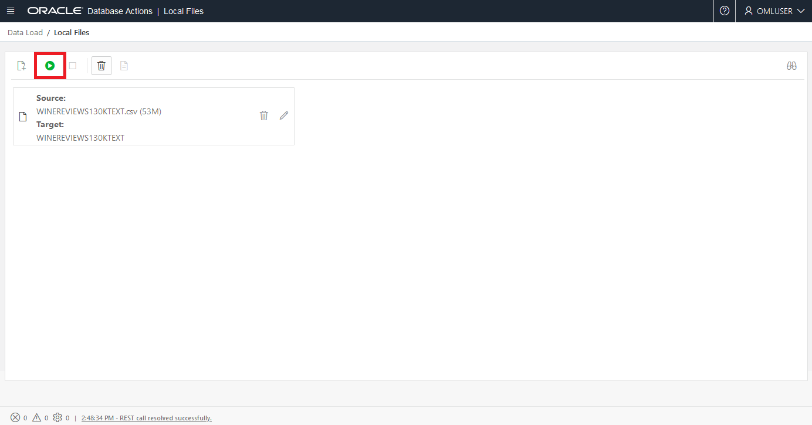

    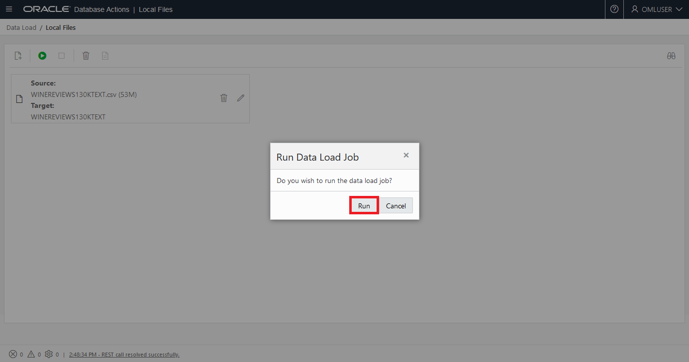

9. Notice the *Status: Running(1/1)* while loading the data. The status will be updated to *Status: Completed(1/1)* once the data loading job is completed.

    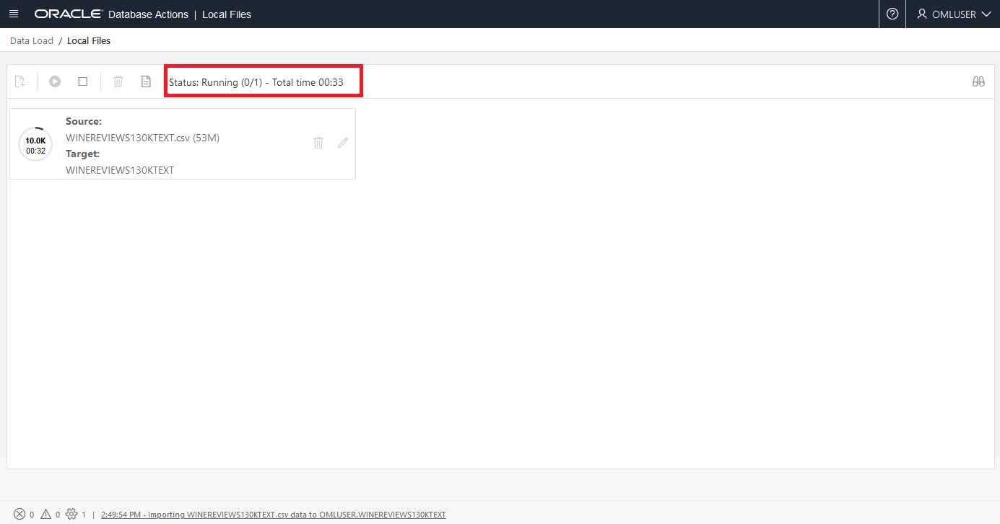

    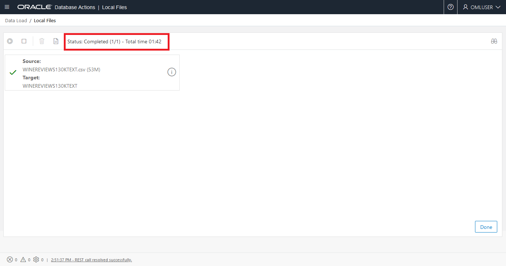

10. Click on the hamburger menu and click on **Development**. From the database actions development menu, select **SQL**.

    

11. Click on the **X** in the popup to dismiss the Help.

    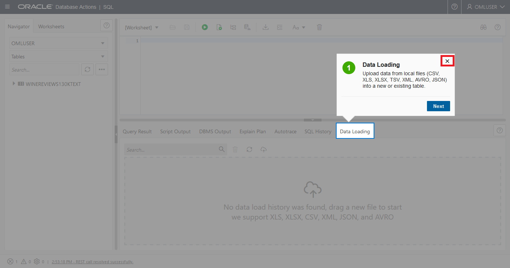

12. The SQL Web Developer shows the table has been successfully created (and associated with OMLUSER).

    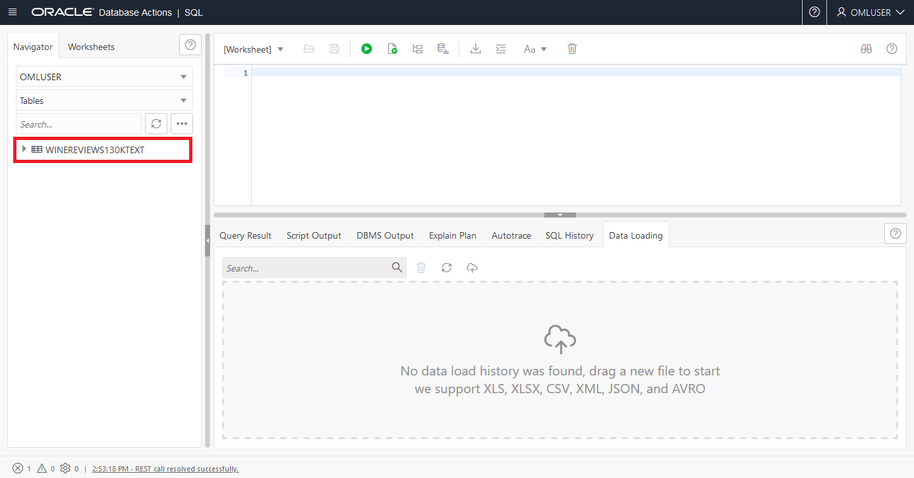

[Please proceed to the next lab](#next).

## Acknowledgements

* **Contributors** -  Anoosha Pilli & Didi Han, Database Product Management
* **Last Updated By/Date** - Didi Han, March 2021
* **Lab Expiry Date** - March 2022