# Prepare the Report and test the Pseudo Code

## Introduction
In this lab, you will prepare the report page removing the project column and adding a Select List for all the projects. The Select List will be used to filter the report. Next you will add a button to extend the end date for all the tasks of the selected project by one day and create a pseudo code in **SQL Workshop** to achieve that.
While extending the end date you need to avoid extending tasks that have '**Closed**' status.


Estimated Time: 15 minutes

## **STEP 1**: Using SQL Workshop to write Pseudo Code
Reviewing the above requirement, we can test the In-Database JavaScript code using **SQL Commands** under **SQL Workshop**. We will write a pseudo code to extend the **Email Integration** project's tasks.

1. Click on the **SQL Workshop** arrow icon and then click on **SQL Commands** menu Item.
  
    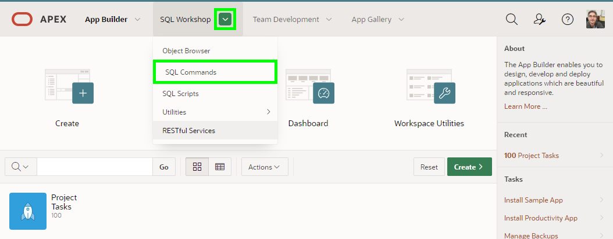

2. Copy the following SQL code.
   
    ```
    <copy>
    select * from project_tasks where project = 'Email Integration' and status != 'Closed'
    </copy>
    ```
3. Paste the code in the **SQL Commands** window. 
   
   Set the **Language** attribute to either **SQL** or **PL/SQL**.
   
   Click the **Run** button and observe the end dates for the tasks.
   
   The query will show only a couple of tasks where their status is not Closed.

    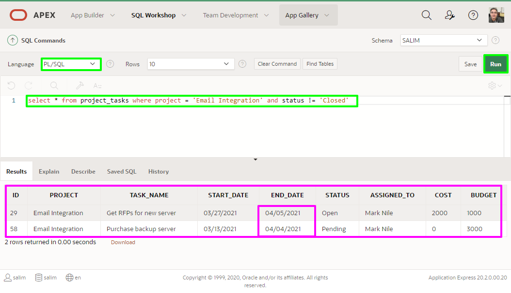

4. Examine the following code. The code is utilizing the DBMS_MLE package in Oracle Database 21c. The package will allow developers to switch the context from PL/SQL to JavaScript.
   
   It will allow them as well to evaluate and run In-Database JavaScript code.
   Copy the code.

    ```
    <copy>
    DECLARE
    ctx DBMS_MLE.context_handle_t;
    user_code clob := q'~
        const oracledb = require("mle-js-oracledb");      
        function extendProjectTasks( status ) {
            if (status !== "Closed") {
                return true;
            }
            else {
                return false;
            }
        }      
        const conn = oracledb.defaultConnection();
        for (var row of conn.execute("select id, status from project_tasks where project = 'Email Integration'").rows) {              
        if ( extendProjectTasks( row[1] )) {
            oracledb.defaultConnection().execute( "update project_tasks set end_date = end_date + 1 where id = :id", { id: row[0] } );
            console.log("The task with the ID: " + row[0] + " and the status " + row[1] + " has been extended successfully!")
            }      
        }; 
    ~';
    BEGIN
        ctx := DBMS_MLE.create_context();
        DBMS_MLE.eval(ctx, 'JAVASCRIPT', user_code);
        DBMS_MLE.drop_context(ctx);
    END;
    </copy>
    ```
5. Paste the PL/SQL in the **SQL Commands**.
   
   et the **Language** attribute to **PL/SQL**.
   
   Click the **Run** button and note the IDs for the extended tasks.

    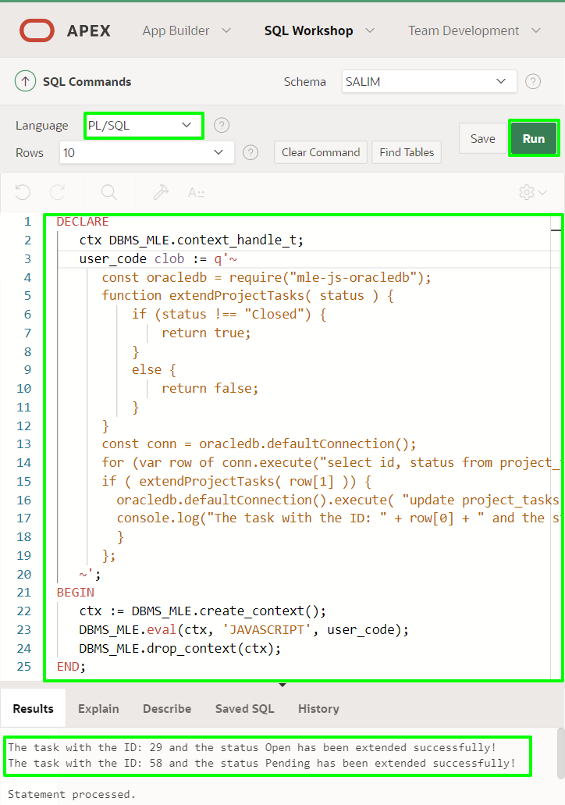

6. Copy and run the following query again.
   
    ```
    <copy>
    select * from project_tasks where project = 'Email Integration' and status != 'Closed'
    </copy>
    ```
    Observe the end dates column values. The dates have been extended by one day.
    
    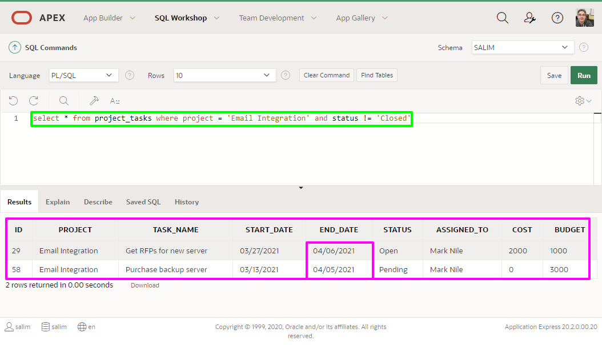

7. Although the code looks neat. Oracle APEX team made it even simpler to work with JavaScript Server-Side code. Let's examine the following code:

    ```
    <copy>
    function extendProjectTasks( status ) {
        if (status !== "Closed") {
            return true;
        }
        else {
            return false;
        }
    }

    for ( var row of apex.conn.execute( "select id, status from project_tasks where project = :project", { project: "Email Integration" } ).rows ) {
        if ( extendProjectTasks( row.STATUS )) {
            apex.conn.execute( "update project_tasks set end_date = end_date + 1 where id = :id", { id: row.ID } );
            console.log("The task with the ID: " + row.ID + " and the status " + row.STATUS + " has been extended successfully!")
        }
    }
    </copy>
    ```

    Copy the above code.

8. Paste the code in **SQL Commands**.
   
   Set the **Language** attribute to **JavaScript (MLE)**.
   
   Click the **Run** button and note the IDs for the extended tasks.
   
   This time the code is written in JavaScript natively.

    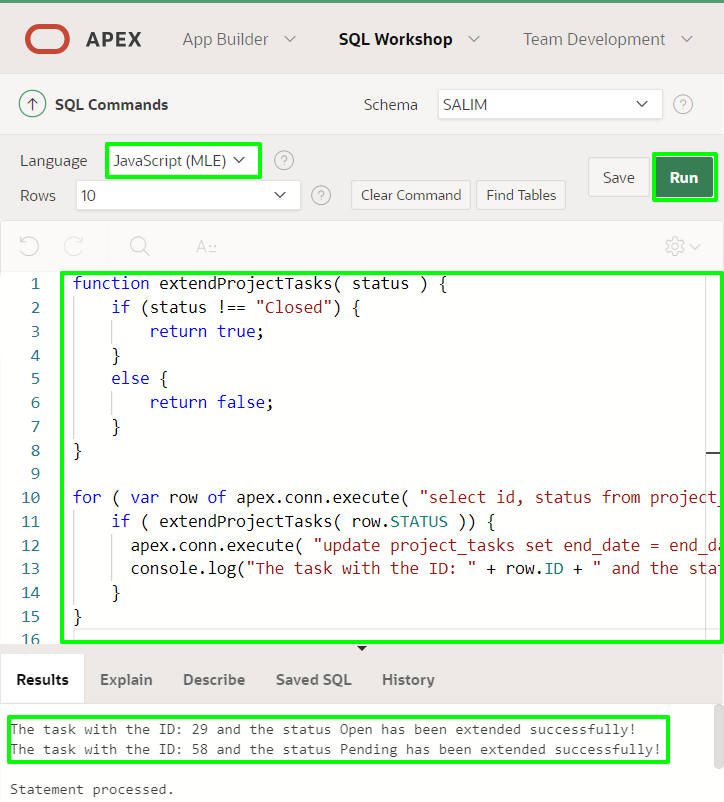

9. Let's run copy and run the following query again.
    
    Set the **Language** attribute to **PL/SQL**.
   
    ```
    <copy>
    select * from project_tasks where project = 'Email Integration' and status != 'Closed'
    </copy>
    ```
    
    Observe the end dates column values. The dates have been extended by one day. The same effect with less and more organized JavaScript code.

    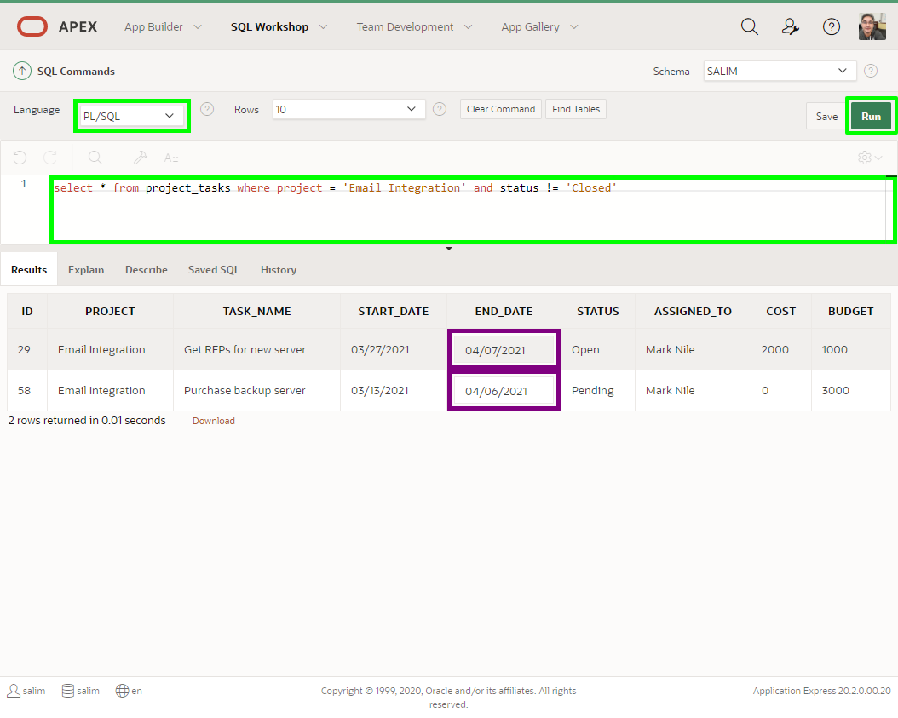


## **STEP 2**: Prepare Report
Now that we have completed testing the pseudo code. Let's navigate to **Project Tasks Report** page and then click on **Edit Page 4** on the developer tool bar.

1. Click **Actions** => **Columns**.
   
   Select **Project** column from the right side and click on the **Left** arrow button to remove it from the display columns.

    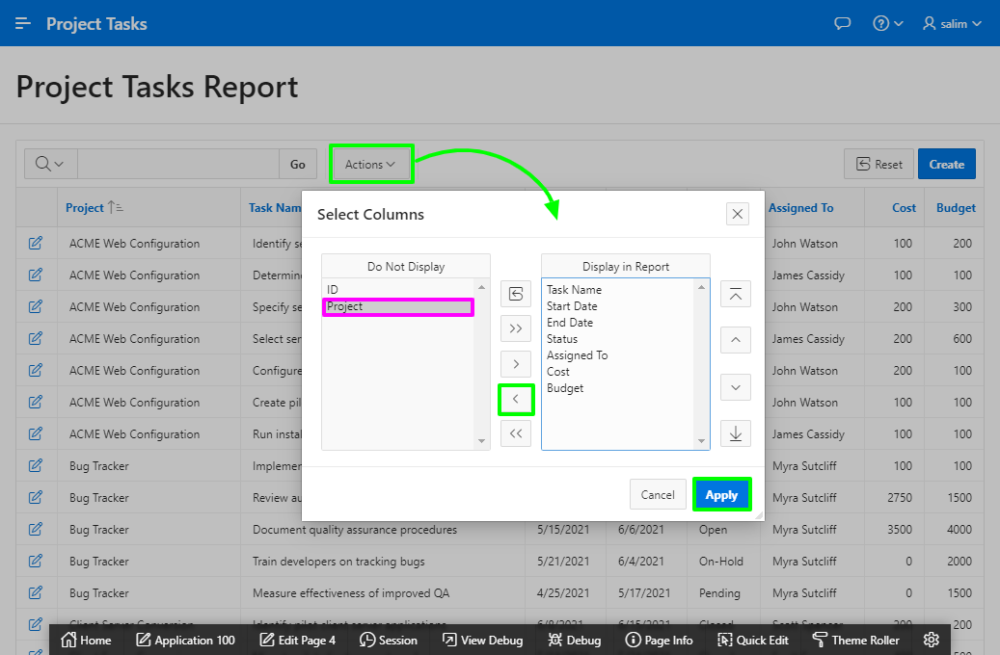

2. Click on **Actions** => **Report** => **Save Report**.
       
    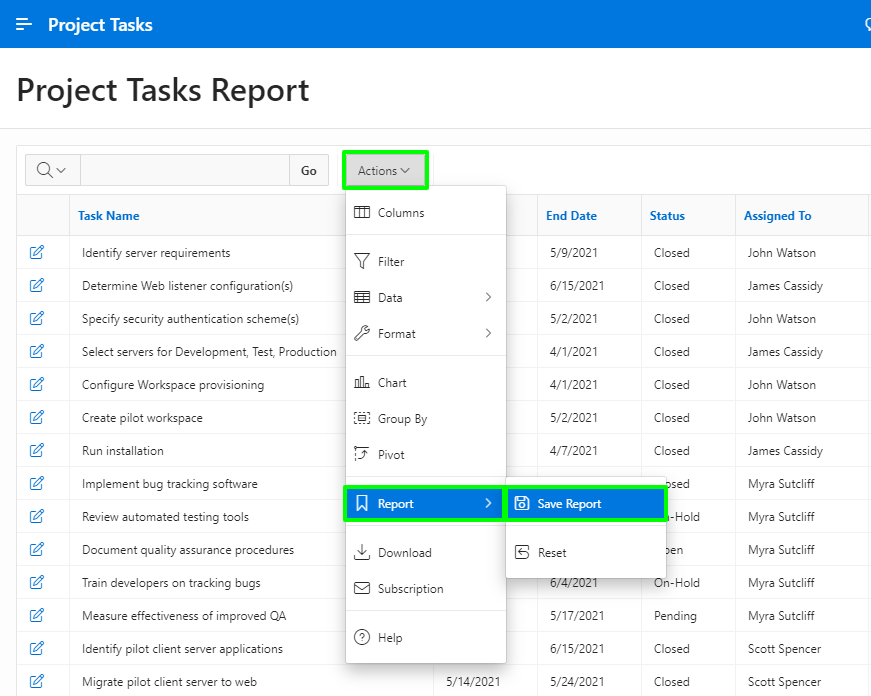

3. Set **Default Report Type** to **Primary** and click **Apply** button.

    

4. While in Page 4 click on **Edit Page 4** in the developer toolbar.
   
    

5. Right click on the **Content Body** and then click on the **Create Region** menu item.
   
   The region will hold the newly to be created Project's select list.

    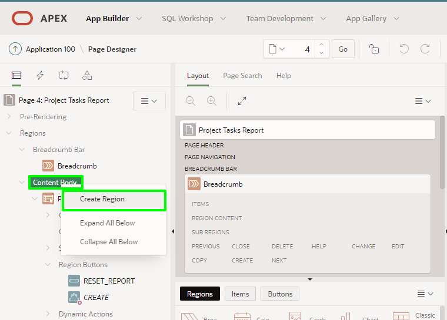

6. Set the following property values for the new region:
   
   **Title** => **Project**
   
   **Sequence** => **5**

    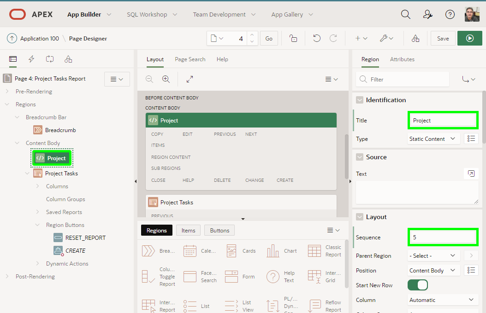

7. Right click on the **Project** region and click **Create Page Item**.

    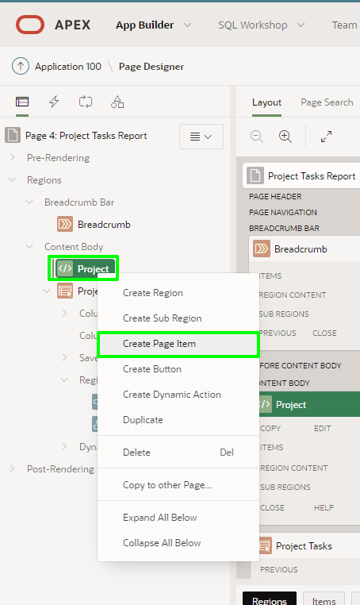

8. Set the following property values for the new page item under **Identification** section:
   
   **Name** => **P4_PROJECT**
   
   **Type** => **Select List**

    Set the following property values under **List of Values** section:

    **Type** => **SQL Query**

    Copy the following code and paste in **SQL Query** property

    ```
    <copy>
    select distinct project d, project r from project_tasks
    </copy>
    ```

    **Display Extra Valus** => **Disabled**

    **Display Null Value** => **Enabled**

    **Null Display Value** => **- Select Project -**

    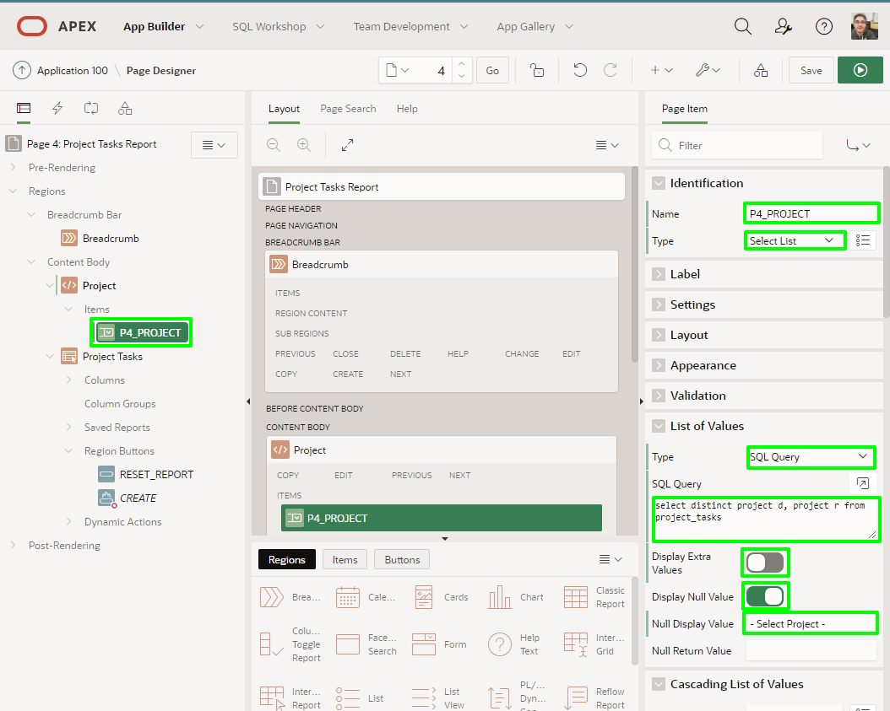

9. Next we will create a button. The button will be used in the next lab to initiate the Extend Project Tasks process.

    Right click on the **Region Buttons** and click **Create Button** menu item.

    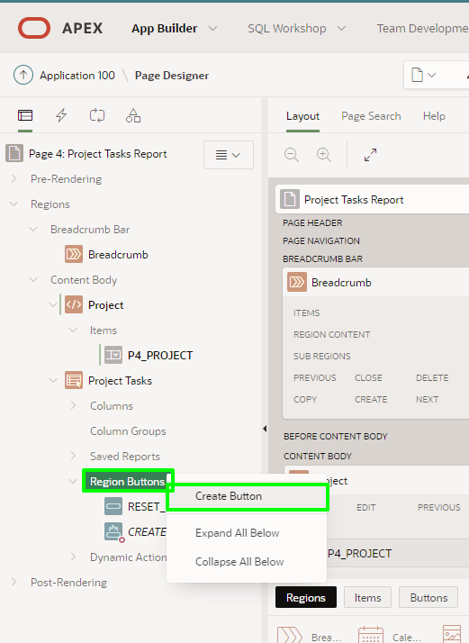

10. Set the following property values for the new button:
    
    **Name** => **Extend\_Project\_Tasks**
    
    **Label** => **Extend Project Tasks**
    
    **Sequence** => **20**

    **Button Position** => **Right Interactive Report Search**

    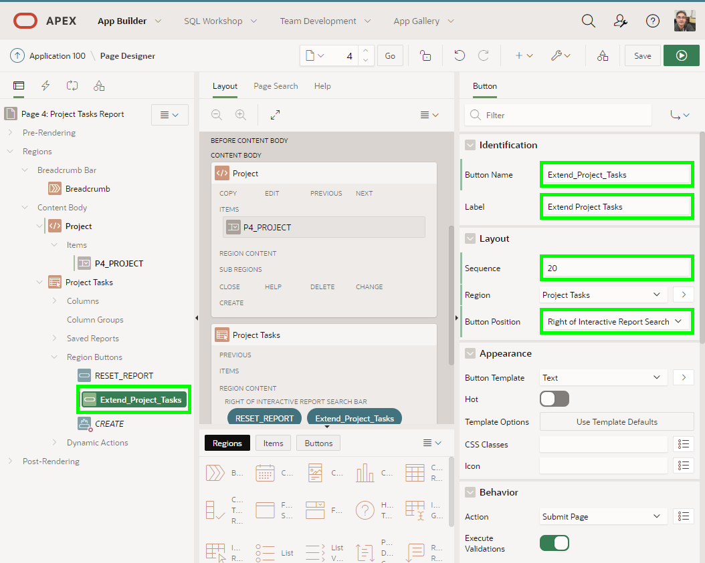

    Click on **Template Options** button

    Update **Type** => **Warning** and then click **OK** button

    Finally, click **Save and Run Page** button.

    

    Your project tasks report page looks like this now.

    

11. Navigate back to **Page Designer** for **Page 4** and select the **Project Task** report.

    Update the following property values:

    **Where Clause** => **project = :P4_PROJECT**

    **Page Items to Submit** => **P4_PROJECT**

    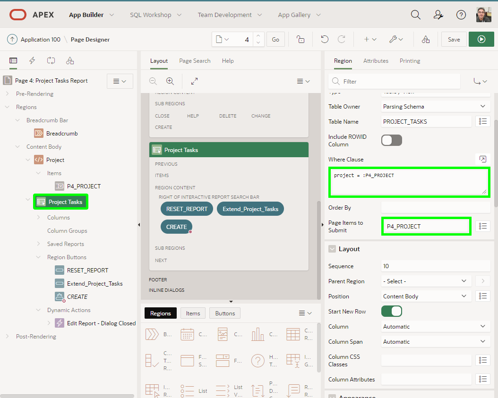

12. Right click on **P4_PROJECT** page item and click on **Create Dynamic Action**

    

13. Change the **Name** for the Dynamic Action to **onChange** and update the Action under the True actions list as the followings:

    **Action** => **Refresh**
    
    **Selection Type** => **Region**

    **Region** => **Project Tasks**

    Finally, click **Save and Run Page** button.

    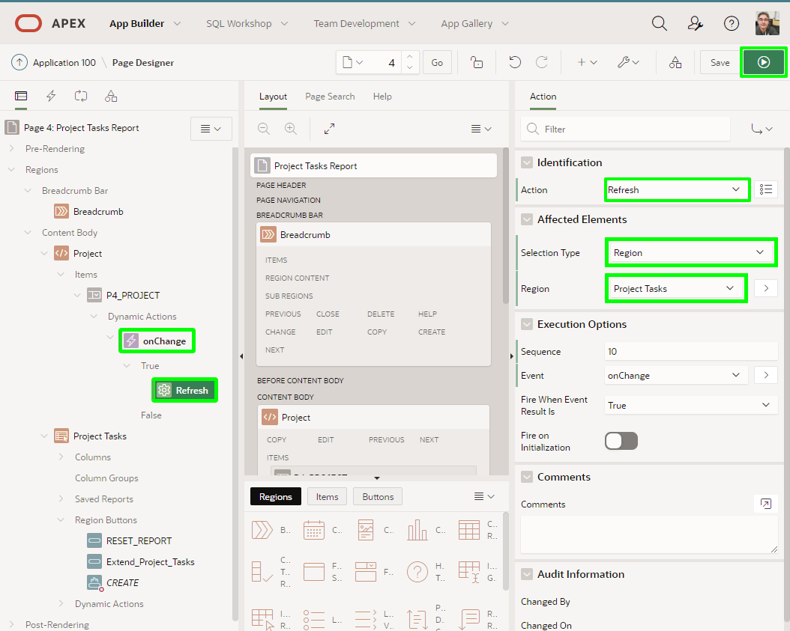

14. Try selecting a project from the project's select list.
    
    Now the report will refresh based on the selected project.

    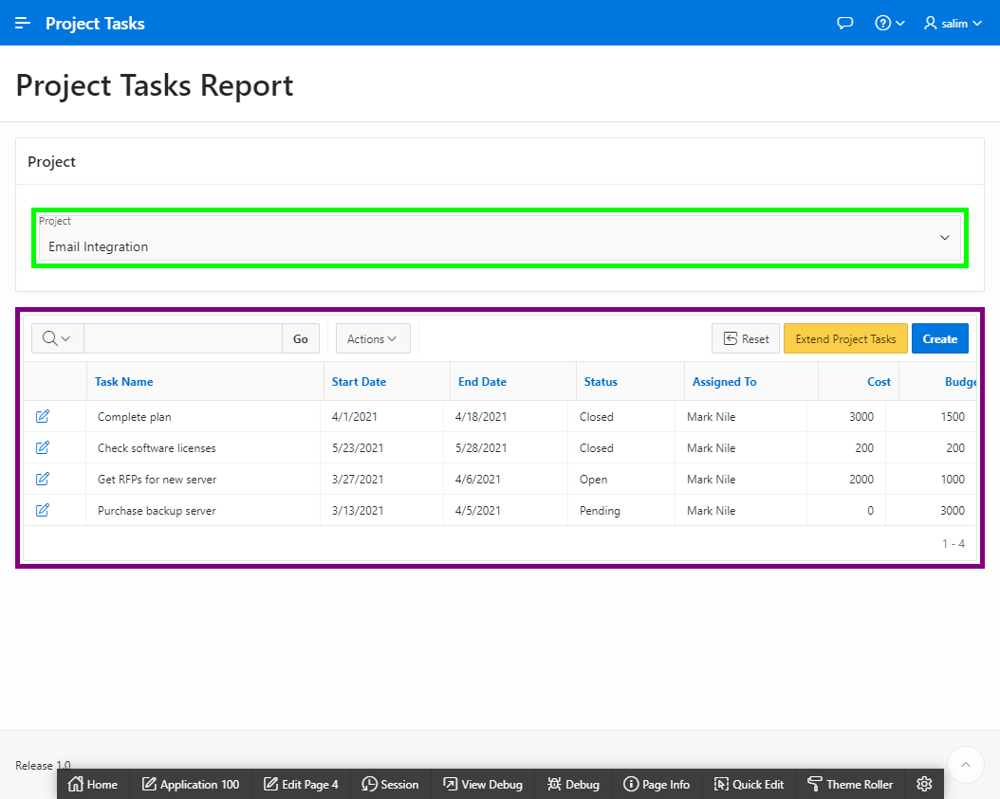

## **Summary**

You have examined how to write JavaScript code in SQL Workshop and the project report page has been prepared for the next lab.

## **Acknowledgements**

 - **Author/Contributors** -  Salim Hlayel, Principal Product Manager
 - **Last Updated By/Date** - Tom McGinn, Database Innovations Architect, Product Management, July 2020

