# Evaluate Routing Behaviors

## Introduction

Before putting the digital assistant into production, let’s use the tester to evaluate various aspects of its routing behavior.

Estimated Lab Time: 25 minutes

### Objectives

In this lab, you will:
* Evaluate routing behaviors

## Task 1: No Match

1. Open the tester by clicking the tester icon. 
2. In the tester's **Message** field, type *I want a burger* and press Enter.
  Since no match is found in the DA and skill, it generates the DA-level help card:
  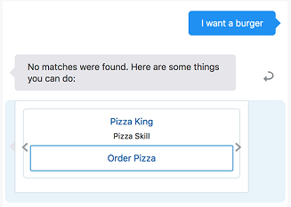
  **Note**: Only the Pizza King shows in the screenshot, but you can use the horizontal scroll arrows to see the cards for the other skills.

3. Click **Reset**.

## Task 2: Implicit Invocation

1. In the tester's **Message** field, type *Send money* and press Enter.
  Notice that the routing resolves to the Digital Bank candidate skill and its **Send Money** intent:
  
  **Note**: "Digital Bank" is the invocation name of FinancialBot.

2. Click the **Routing** tab and scroll down.
  Notice the intent evaluation that leads to this response:
  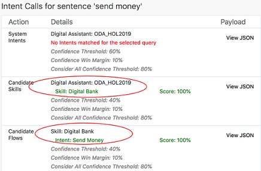

3. Click **Reset**.

**Note**: In these examples, you might get slightly different results than what are shown here, especially in the confidences scores (given in percentages) when resolving intents. And in some cases, the resolved intents could vary, should the differing confidence scores push those intents above or below the given confidence thresholds. The cause of this variance is the non-deterministic nature of the AI behind the natural language processing and the fact that these bots have a limited number of training utterances (in order to make the lab simpler).

## Task 3: Explicit Invocation

1. In the tester's **Message** field, type *I want to send money from Digital Bank* and press Enter.
  Here’s the user’s input and the digital assistant’s initial response:
  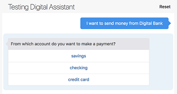

2. Click the **Routing** tab and scroll down to the Rules section and notice the rule that is displayed.
  

  In the Intent Calls section, you can see that the Digital Bank skill gets a much higher confidence score than the other skills.
  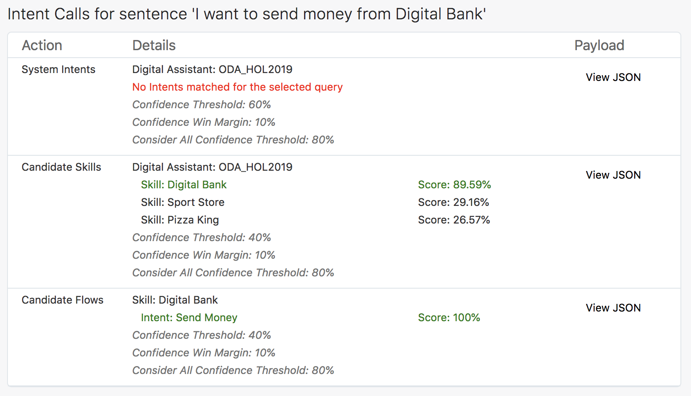

3. Click **Reset**.

## Task 4: Ambiguous Utterance
1. In the tester's **Message** field, type *What is my balance?* and press Enter.
  Here’s the conversation:
  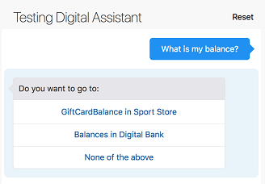

  As you can see, the digital assistant is unsure of what the user wants to do, so it provides a prompt asking the user to choose among the Sport Store (which is the invocation name for the RetailBot skill) and Digital Bank skill intents.

2. Click the **Routing** tab and scroll down.
  Notice the evaluation in the Intent Calls section that leads to this response:
    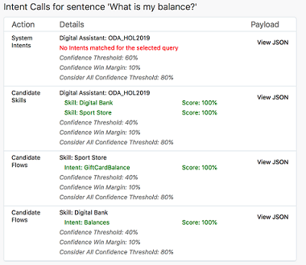  

  Both the candidate skills got high scores (100%). And then for each of those skills, the router identified a candidate flow that also scored highly (also 100%).

  Since the GiftCardBalance and Balances candidate flows exceed the confidence threshold, and since difference between their scores is less than the Confidence Win Margin value (10%), the digital assistant asks the user to choose between those intents.

3. Click **Reset**.

## Task 5: Context Awareness
1. In the tester, type *What is my balance?* and press Enter.
  Here’s the conversation:
  

2. Select **Balances in Digital Bank**.
  

3. Select **checking**.
  

4. Again, type *How much do I have in my savings?*
  Here is the response:
  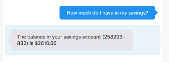

5. Click **Reset**.

### Notes on What We Just Did
As you can see, the user starts with the question "What is my balance?", goes through a prompt to disambiguate between the Digital Bank skill and the Sport Store skill, and eventually gets her checking account balance. Then the user enters "What is my balance?" again, but this time doesn't have to navigate through any disambiguation prompts. The info in the Routing tab helps to explain why.

Also note that in the Rules section of the Routing tab, you see the following:

So, even though there are matching intents from the Sport Store skill, they are ignored. The Intent Calls section shows all of the matching intents, but the entry for “Current Context”, which contains only the Digital Bank skill’s Balances intent, is decisive.
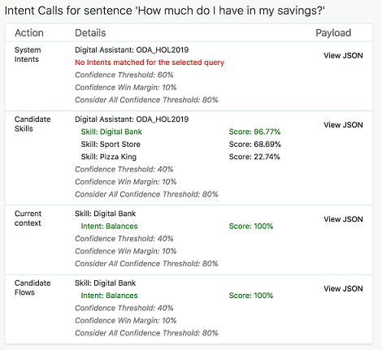

## Task 6: Non sequitur
Non sequitur refers to interrupting a conversation flow by changing the subject. Here's an example where such interruptions occur because the user needs info from one skill to complete the flow in another skill.

1. In the tester, type *I want to order a small meaty pizza* and press Enter.
  Pizza Skill is invoked and here is the response:
  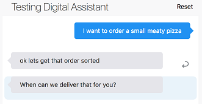

2. To simulate the user suddenly being unsure if he has enough money, type the following: *oh, do I have enough money on my credit card?*
  At this point the DA detects that the intent corresponds to the Digital Bank skill and asks if user wants to switch to Balances in Digital Bank:
  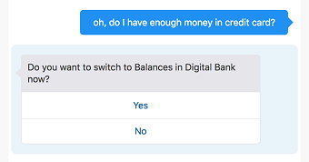

3. Select **Yes**.
  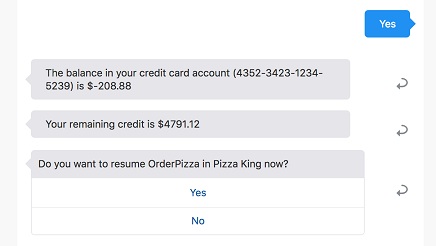

  The user is presented with his financial details, thus completing that flow. At that point, the DA asks if it can return back to PizzaSkill.

4. Again, select **Yes**.
  

  The DA returns to PizzaSkill and resumes the conversation where you left it:

5. Type *9:00 PM* and press Enter.
  

  In this sequence, you started ordering a pizza, confirmed you had enough money in your account, and finished ordering the pizza.

## Task 7: Non sequitur – Complex Conversation
Let’s try a more complex conversation:

1. In the tester, type *I want to order a large pizza at 9:00 PM today* and press Enter.
2. Instead of selecting the kind of pizza, type *oh, do I have enough money?*
  At this point, the DA will ask you to switch to **Balance in Digital Bank**.

3. Select **Yes**.
4. Now, instead of selecting the account type, type *how about my gift card balance?*
  The DA asks if you want to switch to **GiftCardBalance in Sport Store**.

5. Select **Yes**.

6. Type *GC100* as the gift card number and press Enter.
  The DA informs you of your gift card balance.

  Then the DA asks if you want to return to **Balance in Digital Bank**.

7. Select **Yes**.
8. Select **savings** as your account type.
  The DA fetches the savings account details for you and asks if you want to return to **OrderPizza in Pizza King**.

9. Select **Yes**.
10. Select any of the options for the kind of pizza you want to order.
11. Observe the states flow in the **Conversation** tab.
  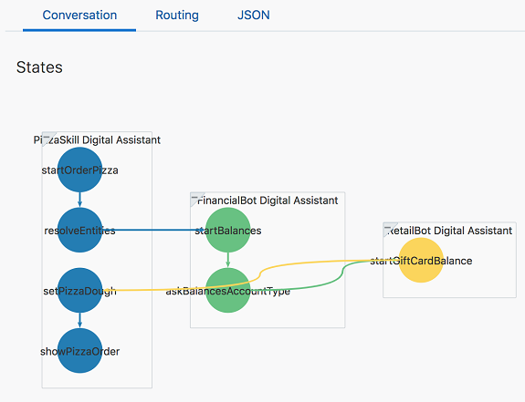

  You are now done with creating, personalizing, and evaluating the routing behavior of your digital assistant! In the next section, we'll add it to a web channel through which users can access it.

You may proceed to the next lab.

## Acknowledgements
* **Author** - Marcie Samuelsen
* **Contributors** -  Kamryn Vinson
* **Last Updated By/Date** - Kamryn Vinson, October 2020
