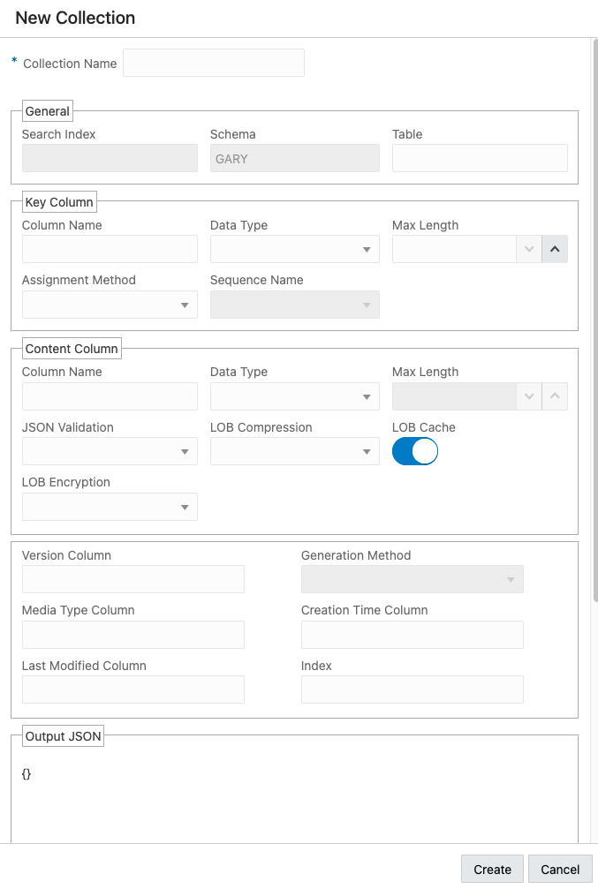
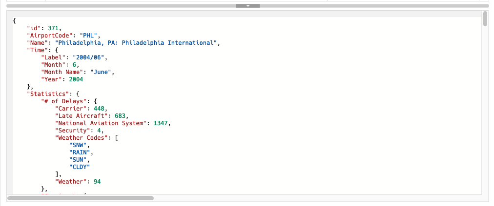
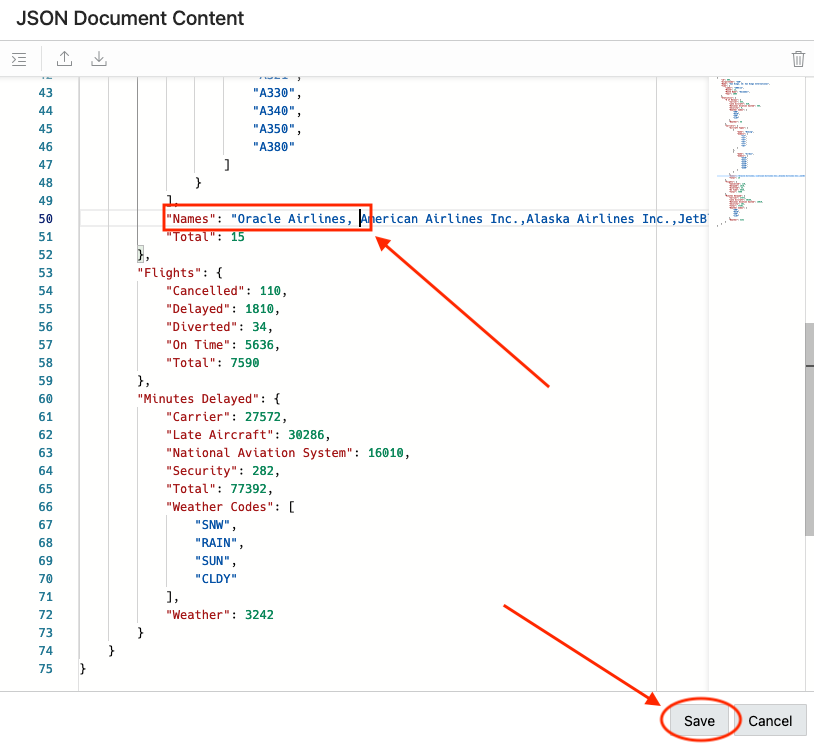
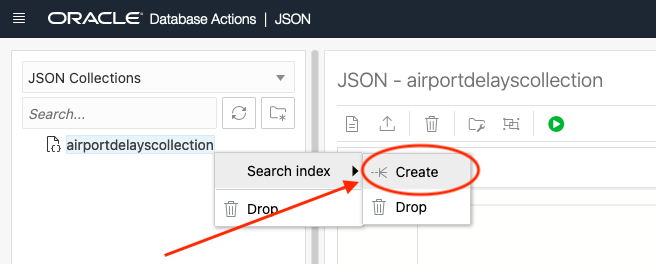
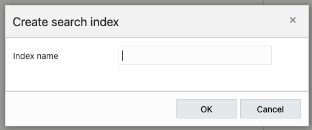
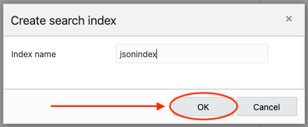
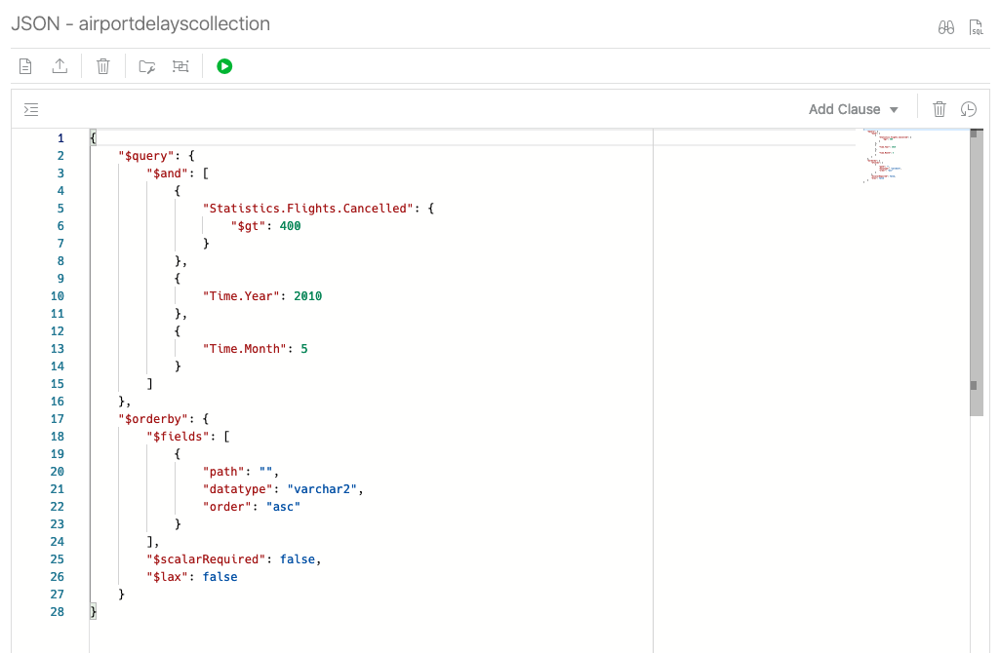

# Choose your Own JSON Adventure: Relational or Document Store: JSON Documents and SODA

## Overview of SODA

Simple Oracle Document Access (SODA) is a set of NoSQL-style APIs that let you create and store collections of documents (in particular JSON) in Oracle Database, retrieve them, and query them, without needing to know Structured Query Language (SQL) or how the documents are stored in the database. 

## Introduction

In this lab you will use the SQL Developer Web browser-based tool, connect to your Database and load JSON data into a collection. You will then work with this data to understand how it is accessed and stored.

Estimated Lab Time: 30-45 minutes

### Objectives

- Load JSON data into relational tables
- Understand how Oracle stores JSON data in relations tables
- Work with the JSON data with SQL

### Prerequisites

- The following lab requires an <a href="https://www.oracle.com/cloud/free/" target="\_blank">Oracle Cloud account</a>. You may use your own cloud account, a cloud account that you obtained through a trial, or a training account whose details were given to you by an Oracle instructor.
- This lab assumes you have successfully provisioned Oracle Autonomous database an connected to ADB with SQL Developer web.
- You have completed the user setups steps.

### **STEP 1: Creating a Collection**

**If this is your first time accessing the JSON Worksheet, you will be presented with a guided tour. Complete the tour or click the X in any tour popup window to quit the tour.**

### **Create a Collection using the Database Actions UI**

1. The first step here is to create a **collection** for our JSON Documents. We can do this two ways. The first method is to use the UI in Database Actions. We can start by selecting **JSON** in the **Database Actions Menu**.

    

2. On the JSON worksheet, left click the **Create Collection** button in the middle of the page.

    

3. Using the **New Collection** slider

    

    enter **airportdelayscollection** in the **Collection Name** field

    

4. When your **New Collection** slider looks like the below image, left click the **Create** button.

    

#### **Create a Collection using the SODA for REST APIs**

1. We can create a collection with the **SODA for REST APIs** as well. To do this, open an **OCI Cloud Shell**. We can do this by clicking the Cloud Shell icon in the upper right of the OCI web console.

    

2. We can now use the **OCI Cloud Shell** that appears on the bottom of the OCI Web Console Page.

    

3. To use the SODA for REST APIs, we need to construct the URL. To start, we use cURL and pass in the username/password combination. Be sure to use the password that you set for our user back in the User Setups lab.

    ```
    curl -u "gary:PASSWORD"
    ```

    Also, we can add the -i which tells the cURL command to include the HTTP response headers in the output. This is helpful with debugging

    ```
    curl -u "gary:PASSWORD" -i
    ```

    next, this is going to create a collection, so we will use the **PUT HTTP method**. 

    ```
    curl -u "gary:PASSWORD" -i -X PUT
    ```

    Lastly, we will add the URL. The URL is built up with the hostname followed by ords, followed by our schema name gary

    ```
    https://coolrestlab-adb21.adb.eu-frankfurt-1.oraclecloudapps.com/ords/gary/
    ```

    then, add soda to indicate we want to use the SODA APIs followed by latest and the name of the collection airportdelayscollection. Your URL should look similar to the below one. (Your hostname will be different then this sample)

    ```
    https://coolrestlab-adb21.adb.eu-frankfurt-1.oraclecloudapps.com/ords/gary/soda/latest/airportdelayscollection
    ```

    And when we put it all together, we get the following:

    ```
    curl -u "gary:PASSWORD" -i -X PUT https://coolrestlab-adb21.adb.eu-frankfurt-1.oraclecloudapps.com/ords/gary/soda/latest/airportdelayscollection
    ```

4. We now can take this cURL command and run it in the OCI Cloud Shell. **REMEMBER to use your password in place of PASSWORD**

    

    ```
    curl -u "gary:PASSWORD" -i -X PUT https://coolrestlab-adb21.adb.eu-frankfurt-1.oraclecloudapps.com/ords/gary/soda/latest/airportdelayscollection
    HTTP/1.1 201 Created
    Date: Mon, 26 Apr 2021 15:53:46 GMT
    Content-Length: 0
    Connection: keep-alive
    X-Frame-Options: SAMEORIGIN
    Cache-Control: private,must-revalidate,max-age=0
    Location: https://coolrestlab-adb21.adb.eu-frankfurt-1.oraclecloudapps.com/ords/gary/soda/latest/airportdelayscollection/
    ```
    If the collection already exists, you will get a message similar to the following:

    ```
    HTTP/1.1 200 OK
    Date: Mon, 26 Apr 2021 16:07:38 GMT
    Content-Length: 0
    Connection: keep-alive
    X-Frame-Options: SAMEORIGIN
    Cache-Control: private,must-revalidate,max-age=0
    ```

### **STEP 2: Loading JSON Data into a Collection**

1. The SODA APIs will be used to load the records into the collection. We will build the cURL command up similar as we did in the previous step. We start with again the user/password combination. **REMEMBER to use your password in place of PASSWORD**

    ```
    curl -u "gary:PASSWORD"
    ```

    And as with before, we need to add the -i for the header return information

    ```
    curl -u "gary:PASSWORD" -i
    ```

    now the HTTP method. For the loading of data, we will use a **POST**

    ```
    curl -u "gary:PASSWORD" -i -X POST
    ```
    
    next, we need to indicate the file we want to load. Use **-d** then **@airportDelays.json**

    ```
    curl -u "gary:PASSWORD" -i -X POST -d @airportDelays.json
    ```

    the content type headers need to be set to indicate we are passing over JSON

    ```
    curl -u "gary:PASSWORD" -i -X POST -d @airportDelays.json -H "Content-Type: application/json"
    ```

    Lastly we add the URL but append an insert action on the end with **?action=insert**. So we take the URL we constructed previously and append the action.

    ```
    https://coolrestlab-adb21.adb.eu-frankfurt-1.oraclecloudapps.com/ords/gary/soda/latest/airportdelayscollection
    ```

    the full cURL command will be similar to the following. **REMEMBER to use your password in place of PASSWORD**

    ```
    curl -u "gary:PASSWORD" -i -X POST -d @airportDelays.json -H "Content-Type: application/json" "https://coolrestlab-adb21.adb.eu-frankfurt-1.oraclecloudapps.com/ords/gary/soda/latest/airportdelayscollection?action=insert"
    ```

    and we can run this in the OCI cloud shell. 
    
    
2. We first need to stage the airportDelays.json file. Issue the following command in the OCI Cloud Shell:

    ```
    curl -o airportDelays.json https://objectstorage.us-ashburn-1.oraclecloud.com/p/rQEg_sXqFmCO8Swe5vVesi3-hmiCfLsY0Yc8mr_k0zdX2NWhhm34zrwhs0uvg8K-/n/c4u03/b/developer-library/o/airportDelays.json
    ```

3. Now that we have the file staged, we can run the full cURL command to load the JSON into our collection. Use the OCI Cloud Shell to do this:

    ```
    curl -u "gary:PASSWORD" -i -X POST -d @airportDelays.json -H "Content-Type: application/json" "https://coolrestlab-adb21.adb.eu-frankfurt-1.oraclecloudapps.com/ords/gary/soda/latest/airportdelayscollection?action=insert"
    ```

    and you will see it start loading

    ```
    HTTP/1.1 100 Continue

    HTTP/1.1 200 OK
    Date: Mon, 26 Apr 2021 16:46:50 GMT
    Content-Type: application/json
    Content-Length: 736197
    Connection: keep-alive
    X-Frame-Options: SAMEORIGIN
    Cache-Control: private,must-revalidate,max-age=0

    {"items":[{"id":"6E7AD2EE1E6B452D954AB4F87C1B1953","etag":"3C144144B1374205A6635923E92E2546","lastModified":"2021-04-26T16:46:30.428087","created":"2021-04-26T16:46:30.428087"},{"id":"5C8FD6CE99774C6D940B82F94D960E11","etag":"53C68394591B49E88A21D64BDE5D102F","lastModified":"2021-04-26T16:46:30.428087","created":"2021-04-26T16:46:30.428087"}........
    ```
    many records loaded......
    ```
    ......{"id":"D8883CB8103645C2AE7A462A7CCF6EC7","etag":"3E32619CBDBB45B09466A727FA79F5B8","lastModified":"2021-04-26T16:46:30.428087","created":"2021-04-26T16:46:30.428087"},{"id":"79FDFCC218F84B2BA60FC17440CAD50B","etag":"EE635498227B46478A0C32AC2F979A95","lastModified":"2021-04-26T16:46:30.428087","created":"2021-04-26T16:46:30.428087"},{"id":"D5210F98995A4677906715C9EB41FE17","etag":"729F41684B444883A7835ABE17B3AFC1","lastModified":"2021-04-26T16:46:30.428087","created":"2021-04-26T16:46:30.428087"}],"hasMore":false,"count":4408,"itemsInserted":4408}%
    ```

    and once completed, you should see a message like the following at the end of the load:

    ```
    "hasMore":false,"count":4408,"itemsInserted":4408}%  
    ```

    indicating that all 4408 JSON documents have been loaded.

### **STEP 3**: Working with JSON Data in a Document Store: QBEs

A filter specification is a pattern expressed in JSON. You use it to select, from a collection, the JSON documents whose content matches it, meaning that the condition expressed by the pattern evaluates to true for the content of (only) those documents.

A filter specification is also called a query-by-example (QBE), or simply a filter.

#### **Simple Filtering**

1. Let's start working with our documents in the airportdelayscollection collection. We will be using the **JSON worksheet** in Database Actions. In the worksheet, we have the main canvas area; similar to what we would see with the SQL Worksheet or SQL Developer.

    

    Once you find the main canvas, click the **Run Query** button on the toolbar.

    

    This returns all the documents in our collection on the bottom section of the page because we issued an empty QBE indicated by **{}**. This is where we will see the results of the follwing QBE's we will be executing.

    

2. To start, we can make a similar query as we did when we were working with relational data. If you remember, the first SQL statement retrieved records where airportcode = 'SFO'. We can issue a QBE that does the exact same search. Copy and paste the below code into the JSON worksheet and run the query.

    ````
    <copy>
    {
        "AirportCode": "SFO"
    }
    </copy>
    ````

    You can see that all the results on the bottom on the page have the Airport Code of SFO. At any point, you can double click a result on the bottom of the page to bring up the **JSON Document Content** slider. Here you can see the full JSON document.

   

3. We can add to the QBE like we did with the SQL and further filter the results down to all documents who also have the month name of June and the Year of 2010. Copy and paste this QBE into the worksheet and run the query

    ````
    <copy>
    {
        "AirportCode": "SFO",
        "Time": {
            "Month Name": "June",
            "Year": 2010
        }
    }
    </copy>
    ````

    again, we see the results on the bottom of the page. And as we did with SQL, we can just use the Label to find the exact same set of results

    ````
    <copy>
    {
        "AirportCode": "SFO",
        "Time": {
            "Label": "2010/06"
        }
    }
    </copy>
    ````
 

#### **QBE Comparison Operators**

A query-by-example (QBE) comparison operator tests whether a given JSON object field satisfies some conditions.

The comparison operators are the following:

```
$all — whether an array field value contains all of a set of values

$between — whether a field value is between two string or number values (inclusive)

$eq — whether a field value is equal to a given scalar

$exists — whether a given field exists

$gt — whether a field value is greater than a given scalar value

$gte — whether a field value is greater than or equal to a given scalar

$hasSubstring — whether a string field value has a given substring (same as $instr)

$in — whether a field value is a member of a given set of scalar values

$instr — whether a string field value has a given substring (same as $hasSubstring)

$like — whether a field value matches a given SQL LIKE pattern

$lt — whether a field value is less than a given scalar value

$lte — whether a field value is less than or equal to a given scalar value

$ne — whether a field valueis different from a given scalar value

$nin — whether a field value is not a member of a given set of scalar values

$regex — whether a string field value matches a given regular expression

$startsWith — whether a string field value starts with a given substring
```

1. Let's try a **comparison operator** on our documents. Here, again similar to what we did with SQL, we want to see all the records with DCA as the airport code that have more than 400 canceled flights. The QBE would be as follows using the greater than operator **$gt**:

    ````
    <copy>
    {"AirportCode": "DCA",
    "Statistics.Flights.Cancelled": {"$gt": 400}
    }
    </copy>
    ````

2. Again, using additional filters, we can combine multiple search attributes. Here we add the Year being 2010.

    ````
    <copy>
    {"AirportCode": "DCA",
    "Statistics.Flights.Cancelled": {"$gt": 400},
    "Time.Year": 2011
    }
    </copy>
    ````

3. Its important to note that any QBE we create and run here can be used via the SODA for REST APIs. So taking the cURL examples for loading and creating collections, we can create a similar one but pass the **action** of **query** instead of insert as we previously did. Use the OCI Cloud Shell for running this cURL command.

    We start with a POST and the user/password combination
    
    ```
    curl -X POST -u "gary:PASSWORD"
    ```

    then we add the URL...note we add **action=query** at the end of the URL

    ```
    curl -X POST -u "gary:PASSWORD" "https://coolrestlab-adb21.adb.eu-frankfurt-1.oraclecloudapps.com/ords/gary/soda/latest/airportdelayscollection?action=query"
    ```
    
    Now, we add the content type headers
    
    ```
    curl -X POST -u "gary:PASSWORD" "https://coolrestlab-adb21.adb.eu-frankfurt-1.oraclecloudapps.com/ords/gary/soda/latest/airportdelayscollection?action=query" -H "Content-Type: application/json" 
    ```

    Lastly, we are going to pass in the QBE we wrote on the JSON worksheet as **--data-binary**
 
    ```
    curl -X POST -u "gary:PASSWORD" "https://coolrestlab-adb21.adb.eu-frankfurt-1.oraclecloudapps.com/ords/gary/soda/latest/airportdelayscollection?action=query" -H "Content-Type: application/json" --data-binary \
    '{"AirportCode": "DCA","Statistics.Flights.Cancelled": {"$gt": 400},"Time.Year": 2011}'
    ```
    with the results being the same as in the JSON worksheet

    ```
    {"items":[{"id":"6C5C28DB03FF4C838DD0E8379B5F42D9","etag":"1F5AC6CAB64740F9A79912D65514BBE0","lastModified":"2021-04-25T23:40:51.197350000Z",
    "created":"2021-04-25T23:40:51.197350000Z","links":[{"rel":"self","href":"https://bqj5jpf7pvxppq5-adb21.adb.eu-frankfurt-1.oraclecloudapps.com:443/
    ords/gary/soda/latest/airportdelayscollection/6C5C28DB03FF4C838DD0E8379B5F42D9"}],"value":{"id":2644,"AirportCode":"DCA","Name":"Washington, DC:
    Ronald Reagan Washington National","Time":{"Label":"2011/01","Month":1,"Month Name":"January","Year":2011},"Statistics":{"# of Delays":{"Carrier":331,
    "Late Aircraft":314,"National Aviation System":348,"Security":4,"Weather Codes":["SNW","RAIN","SUN","CLDY"],"Weather":38},"Carriers":{"Aircraft Types":
    [{"make":"Boeing","models":["717","737","757","767","777","787"]},{"make":"Airbus","models":["A320","A321","A330","A340","A350","A380"]}],
    "Names":"American Airlines Inc.,Alaska Airlines Inc.,JetBlue Airways,Continental Air Lines Inc.,Delta Air Lines Inc.,Atlantic Southeast Airlines,
    Frontier Airlines Inc.,AirTran Airways Corporation,American Eagle Airlines Inc.,United Air Lines Inc.,US Airways Inc.,ExpressJet Airlines Inc.",
    "Total":12},"Flights":{"Cancelled":550,"Delayed":1038,"Diverted":22,"On Time":5173,"Total":6783},"Minutes Delayed":{"Carrier":16829,"Late 
    Aircraft":18648,"National Aviation System":12615,"Security":165,"Total":50961,"Weather Codes":["SNW","RAIN","SUN","CLDY"],"Weather":2704}}}}],
    "hasMore":false,"count":1}%    
    ```
4. We can also use cURL to get a single record. Just place the system created id at the end if the SODA for REST URL. Looking at the above return JSON, the id is in the first line (**"id":"6C5C28DB03FF4C838DD0E8379B5F42D9"**):

    ```
    {"items":[{"id":"6C5C28DB03FF4C838DD0E8379B5F42D9","etag":"1F5AC6CAB64740F9A79912D65514BBE0","lastModified":"2021-04-25T23:40:51.197350000Z",
    ```

    Take that id (**"id":"6C5C28DB03FF4C838DD0E8379B5F42D9"**) and append it to the SODA URL as follows:

    ```
    curl -X GET -u "gary:PASSWORD" "https://coolrestlab-adb21.adb.eu-frankfurt-1.oraclecloudapps.com/ords/gary/soda/latest/airportdelayscollection/6C5C28DB03FF4C838DD0E8379B5F42D9"
    ```
    
    Running that cURL command in the OCI Cloud Shell will return that single record just as above.


#### **QBE Operator $not**

1. The QBE Operator $not allows even greater functionality when writing QBEs. It lets us evaluate an attribute and exclude results which contain that contain that value. For example, lets take our QBE where we used the greater than operator (**$gt**) and instead of only bringing back records where the Airport Code was DCA, lets use the **$not** operator and bring back all the records where the Airport Code is **not** DCA. 

    The statement
    ```
    AirportCode":{"$not" : {"$eq" : "DCA"}}
    ```
    is saying Airportcode is not equal (**$eq**) to DCA.

    Copy and paste this into the JSON worksheet to try it out.

    ````
    </copy>
    {"Statistics.Flights.Cancelled": {"$gt": 400},
    "AirportCode":{"$not" : {"$eq" : "DCA"}}
    }
    </copy>
    ````

#### **QBE Logical Combining Operators: $and, $or, and $nor**

1. We can structure our QBEs similar to how we structure where clauses in SQL with the **$and** and **$or** clauses. QBEs also give us the ability to use **$nor**.

    We can start with **$and**. This is actually used implicitly and we have been using it for multple QBEs already. Just look back in this lab and we can see the implicit use of $and in many QBEs. For example, here

    ```
    {"AirportCode": "DCA",
    "Statistics.Flights.Cancelled": {"$gt": 400},
    "Time.Year": 2011
    }
    ```

    $and is implicitly used where the commas are. We are saying get back documents where Airport Code is DCA **$and** Flights Cancled are greater than 400 **$and** the Year is 2011. We can explicity use it as we see in the following. Copy and paste it into your JSON worksheet and run the QBE.

    ````
    </copy>
    { "$and" : [
        {"Statistics.Flights.Cancelled": {"$gt": 400}},
        {"Time.Year": 2010 },
        {"AirportCode": "ORD"}
    ]}
    </copy>
    ````

2. Next up is **$or**. Just as it does with SQL or most any programming language, it matches results where one or the other values in the or condition exists. In this example, we are looking for documents where the Airport Code is DCA, implicitly using and for the Year being 2012 and using the **$or** for being in month 6 (June) or month 7 (July). Copy and paste it into your JSON worksheet and run the QBE.

    ````
    </copy>
    {"AirportCode": "DCA",
    "Time.Year": 2012,
    "$or" : [{"Time.Month": {"$eq": 6}}, {"Time.Month": {"$eq": 7}}]
    }
    </copy>
    ````


{"Statistics.Flights.Cancelled": {"$gt": 400},
"Time.Year": 2010,
"AirportCode":{"$not" : {"$eq" : "DCA"}},
"$or" : [{"Time.Month": {"$eq": 6}}, {"Time.Month": {"$eq": 7}}]
}

3. Lastly, we can take a look at **$nor**. Acting like an opposite of **$or**, using it will exclude records that match the condition. We can use the example we used for **$or** but change it to **$nor**. Now, instead of returning 2 records, it will return 10 and exclude month 6 (June) or month 7 (July). Copy and paste it into your JSON worksheet and run the QBE.

    ````
    </copy>
    {"AirportCode": "DCA",
    "Time.Year": 2012,
    "$nor" : [{"Time.Month": {"$eq": 6}}, {"Time.Month": {"$eq": 7}}]
    }
    </copy>
    ````

#### **Updating a Document Using the UI and SODA for REST**

1. To update a JSON document using the UI, you can just double click on the record and bring out the **JSON Document Content** slider. Select any JSON document to bring out the slider.

   

2. Updating this JSON is as easy as clicking into this slider and changing a value. Find the **Names** node under **Statistics** then **Carriers**. Just left click the beginning of the value and add **Oracle Airlines,** (remember the comma). When done, click the **save** button on the bottom of the slider. Thats it, the JSON document has been updated.

   

3. We can also update one or multiple documents via the SODA for REST APIs. For this, we use the **$patch** operator when writing the JSON to update the document. For this example, we will be using a method that could update one or multiple documents; its dependent on the query we include. The JSON we will use is as follows:

    ```
    '{
        "$query": {"id": 1},
        "$patch": [
            {
                "op": "test",
                "path": "/Statistics/# of Delays/Carrier",
                "value": 1009
            },
            {
                "op": "replace",
                "path": "/Statistics/# of Delays/Carrier",
                "value": 1019
            }
        ]
    }'
    ```

    Whis the above is saying is 
        1) Find me all the JSON documents who's id is 1. 
        2) In the Operation (op) test, see if we have a value of 1009 using the path "/Statistics/# of Delays/Carrier" and the document is id 1.
        3) If we pass the test operation, replace the value with 1019.

4. To make this change, we use cURL with the **action** being **update** with the format **action=update** in the URL. The cURL command is very similar to the previous commands with it being:

    ```
    curl -X POST -u "gary:PASSWORD" "https://coolrestlab-adb21.adb.eu-frankfurt-1.oraclecloudapps.com/ords/gary/soda/latest/airportdelayscollection?action=update" -H "Content-Type: application/json" --data-binary '{
        "$query": {"id": 1},
        "$patch": [
            {
                "op": "test",
                "path": "/Statistics/# of Delays/Carrier",
                "value": 1009
            },
            {
                "op": "replace",
                "path": "/Statistics/# of Delays/Carrier",
                "value": 1019
            }
        ]
    }'
    ```

    and running this command will result in the following:

    ```
    {"count":1,"itemsUpdated":1}%    
    ```

    So one document matched and one was updated.

5. Using the JSON worksheet, we can query for this document and see the change right away. Copy and paste it into your JSON worksheet and run the QBE.

    ````
    </copy>
    {"id": 1}
    </copy>
    ````

    You can see the updated value in the document results on the bottom of the page with **Carrier** now being 1019.

    ```
{
        "id": 1,
        "AirportCode": "ATL",
        "Name": "Atlanta, GA: Hartsfield-Jackson Atlanta International",
        "Time": {
            "Label": "2003/06",
            "Month": 6,
            "Month Name": "June",
            "Year": 2003
        },
        "Statistics": {
            "# of Delays": {
                "Late Aircraft": 1275,
                "National Aviation System": 3217,
                "Security": 17,
                "Weather Codes": [
                    "SNW",
                    "RAIN",
                    "SUN",
                    "CLDY"
                ],
                "Weather": 328,
                "Carrier": 1019
    ```

#### **Creating a Search Index and the $contains Operator**

1. We can index all the text in our JSON collection/documents by adding an index. Add this index is as simple as a single click of the mouse. To start, in the JSON worksheet, on the left of the page is the **Collection Navigator**.

   

2. Find the airportdelayscollection collection and right click on it. This will bring up a menu where we can select **Search Index** and then left click **Create**.

   

    This will bring up the **Create Search Index** modal.

   

3. Using the **Create Search Index** find the **Index Name** field. Enter **jsonindex** into this field.

   

4. Once your **Create Search Index** looks like the below image, left click the **OK** button.

   

5. We can now use the **$contains** operator in our QBEs. Lets try the following. In the updating section of this lab, we added Oracle Airlines to a document. We can now directly find this record by just using the contains operator on the Statistics.Carriers.Names node. Copy and paste it into your JSON worksheet and run the QBE.

    ````
    </copy>
    {"Statistics.Carriers.Names": {"$contains": "Oracle"}}
    </copy>
    ````

#### **Using an $orderby Clause**

1. The JSON worksheet has some built-in functions we can use with one being the **$orderby** clause. This clause sorts our results based on a path we provide the QBE. Lets start with a QBE we used previously. Copy and paste it into your JSON worksheet and run the QBE.

    ````
    </copy>
    {"$and" : [{"Statistics.Flights.Cancelled": {"$gt": 400}}, {"Time.Year": 2010 }, {"Time.Month": 5}]}
    </copy>
    ````

2. Use the **Add Clause** dropdown and select **$orderby**

   

3. Our QBE is reformatted and the **$orderby** clause is added

   

4. In the **$orderby** JSON

    ```
    "$orderby": {
            "$fields": [
                {
                    "path": "",
                    "datatype": "varchar2",
                    "order": "asc"
                }
            ],
            "$scalarRequired": false,
            "$lax": false
        }
    ```
    Find the path node and replace "" with "AirportCode"

    ```
    "$orderby": {
            "$fields": [
                {
                    "path": "AirportCode",
                    "datatype": "varchar2",
                    "order": "asc"
                }
            ],
            "$scalarRequired": false,
            "$lax": false
        }
    ```

   

5. Run the QBE and you will see the results have been ordered by Airport Code.

## Conclusion

In this lab, you loaded JSON into a collection and worked with that collection using SODA for REST APIs as well as the Database Actions JSON worksheet.

## Acknowledgements

- **Authors** - Jeff Smith, Beda Hammerschmidt and Brian Spendolini
- **Last Updated By/Date** - April 2021
- **Workshop Expiry Date** - April 2022