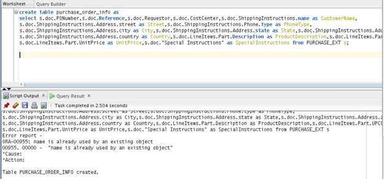
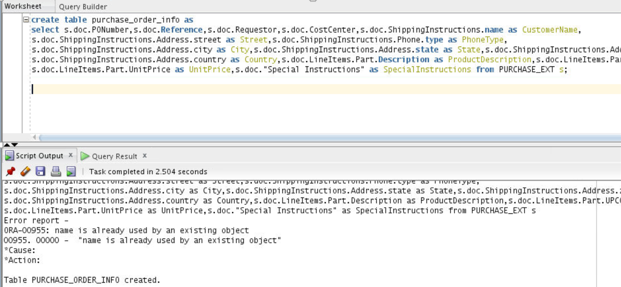
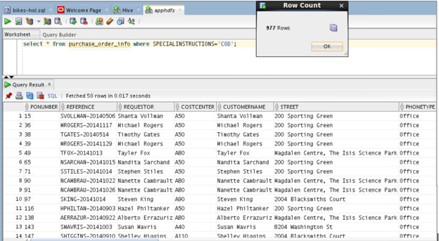
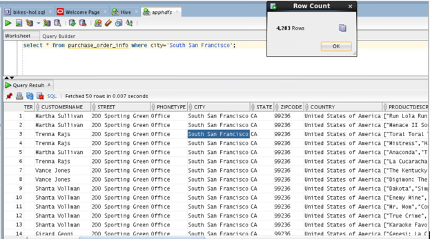
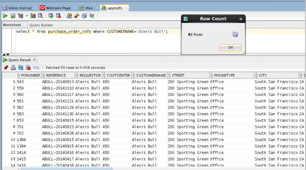

# Oracle BigDataSQL-HDFS

## Introdution 
Want to load the data into Oracle?  Perform some simple ETL  (Kay - need to add some more detail here)


## **Step 1:**  Create Purchase Order Table
1. Connect to **database**
    ````
    <copy>
    sqlplus apphdfs/apphdfs@orclpdb
    </copy>
    ````

2. Create **Table**
    ````
      <copy>
    create table purchase_order_info as
    select s.doc.PONumber,
    s.doc.Reference,
    s.doc.Requestor,
    s.doc.CostCenter,
    s.doc.ShippingInstructions.name as CustomerName,
    s.doc.ShippingInstructions.Address.street as Street,
    s.doc.ShippingInstructions.Phone.type as PhoneType,
    s.doc.ShippingInstructions.Address.city as City,
    s.doc.ShippingInstructions.Address.state as State,
    s.doc.ShippingInstructions.Address.zipCode as Zipcode,
    s.doc.ShippingInstructions.Address.country as Country,
    s.doc.LineItems.Part.Description as ProductDescription,
    s.doc.LineItems.Part.UPCCode as UPCCode,
    s.doc.LineItems.Part.UnitPrice as UnitPrice,
    s.doc."Special Instructions" as SpecialInstructions 
    from PURCHASE_EXT s;
      </copy>
    ````

    

3. Query the count of all rows in **purchase order info** table
   
    ````
        <copy>
        sqlplus apphdfs/apphdfs@orclpdb
        </copy>
    ````
    ````
        <copy>
        Select count(*) from purchase_order_info;
        </copy>
    ````
        


## **Step 2:**  Products with mode of purchase is COD

1. Connect to **Database**
    ````
    <copy>
    sqlplus apphdfs/apphdfs@orclpdb
    </copy>
    ````
2. List purchase information of orders where mode of payments is **COD**
    ````
    <copy>
    Select * from purchase_order_info where SPECIALINSTRUCTIONS=’COD’;
    </copy>
    ````
    


## **Step 3:**  Products ordered from a specific GEO location


1. Connect to **Database**

    ````
    <copy>
    sqlplus apphdfs/apphdfs@orclpdb
    </copy>
    ````

2. Query to get product infomation from specific **GEO location** 
    ````
    <copy>
    Select * from purchase_order_info where city=’South San Francisco’;
    </copy>
    ````




## **Step 4:**  Customer purchase history details

1. Connect to **Database**
  ````
  <copy>
  sqlplus apphdfs/apphdfs@orclpdb
  </copy>
  ````

2. Query to get customer's **purchase history**
  ````
  <copy>
  Select * from purchase_order_info where CUSTOMERNAME=’Alexis Bull’;
  </copy>
  ````

  

This lab is now complete.

## Acknowledgements

- **Authors/Contributors** - Brian Hengen, Balasubramanian Ramamoorthy, Arvind Bhope
- **Last Updated By/Date** - Kay Malcolm, Database Product Management, May 2020

## Need Help?
Please submit feedback or ask for help using our [LiveLabs Support Forum](https://community.oracle.com/tech/developers/categories/livelabsdiscussions). Please click the **Log In** button and login using your Oracle Account. Click the **Ask A Question** button to the left to start a *New Discussion* or *Ask a Question*.  Please include your workshop name and lab name.  You can also include screenshots and attach files.  Engage directly with the author of the workshop.

If you do not have an Oracle Account, click [here](https://profile.oracle.com/myprofile/account/create-account.jspx) to create one.


