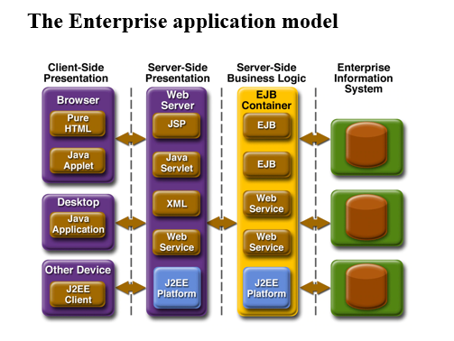

# Introduction to Java EE Development using JDeveloper & WebLogic

 
Java Platform, Enterprise Edition (Java EE) is the standard in community-driven enterprise software. Java EE is developed using the Java Community Process, with contributions from industry experts, commercial and open source organizations, Java User Groups, and countless individuals. Each release integrates new features that align with industry needs, improves application portability, and increases developer productivity.

The Java EE platform is designed to help developers create large-scale, multitiered, scalable, reliable, and secure network applications. A shorthand name for such applications is enterprise applications, so called because these applications are designed to solve the problems encountered by large enterprises.

The benefits of an enterprise application are helpful, even essential, for individual developers and small organizations in an increasingly networked world.
The features that make enterprise applications powerful, like security and reliability, often make these applications complex. The Java EE platform reduces the complexity of enterprise application development by providing a development model, API, and runtime environment that allow developers to concentrate on functionality.

## The Enterprise application model

 

The advantage of the J2EE platform is that the application model encapsulates the layers of functionality in specific types of components. Business logic is encapsulated in Enterprise JavaBeans (EJB) components. Client interaction can be presented through plain HTML web pages, through web pages powered by applets, Java Servlets, or JavaServer Pages technology, or through stand-alone Java applications. Components communicate transparently using various standards: HTML, XML, HTTP, SSL, RMI, IIOP, and others.

## Java EE Servers and Containers

A Java EE server is a server application that implements the Java EE platform APIs and provides standard Java EE services. Java EE servers are sometimes called application servers, because they allow you to serve application data to clients, much as web servers serve web pages to web browsers.
Java EE servers host several application component types that correspond to the tiers in a multitiered application. The Java EE server provides services to these components in the form of a container.
Java EE containers are the interface between the component and the lower-level functionality provided by the platform to support that component. The functionality of the container is defined by the platform and is different for each component type. Nonetheless, the server allows the different component types to work together to provide functionality in an enterprise application.

## The Web Container

The web container is the interface between web components and the web server. A web component can be a servlet or a JavaServer Faces Facelets page. The container manages the component’s life cycle, dispatches requests to application components, and provides interfaces to context data, such as information about the current request.

## The EJB Container

The EJB container is the interface between enterprise beans, which provide the business logic in a Java EE application, and the Java EE server. The EJB container runs on the Java EE server and manages the execution of an application’s enterprise beans.

## The Application Client Container

The application client container is the interface between Java EE application clients (special Java SE applications that use Java EE server components) and the Java EE server. The application client container runs on the client machine and is the gateway between the client application and the Java EE server components that the client uses.

Know More:[ Oracle J2EE (JEE)](https://www.oracle.com/in/java/technologies/java-ee-glance.html)

## Acknowledgements

- **Authors** - Balasubramanian Ramamoorthy, Dhananjay Kumar, Pradeep Chandramouli
- **Contributors** - Nishanth Kaushik,Kanika Sharma,Srinivas Pothukuchi,Arvind Bhope
- **Team** - North America AppDev Specialists
- **Last Updated By** - Kay Malcolm, Senior Director, Database Product Management, June 2021
- **Expiration Date** - June 2021

## Issues?
Please submit an issue on our [issues](https://github.com/oracle/learning-library/issues) page. We review it regularly.

