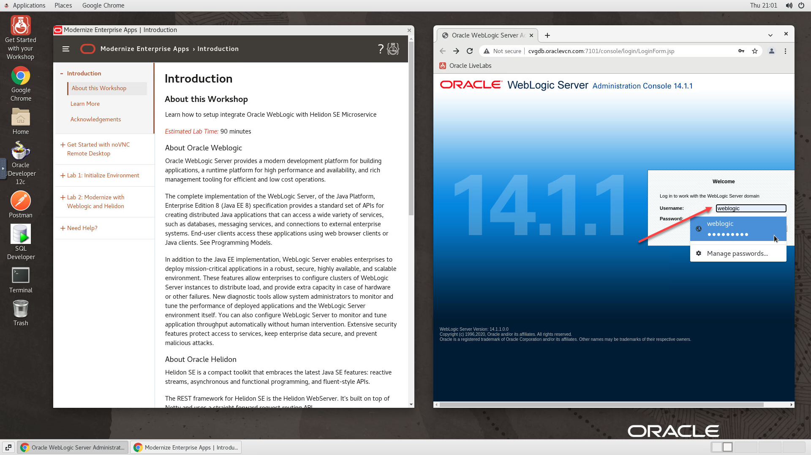
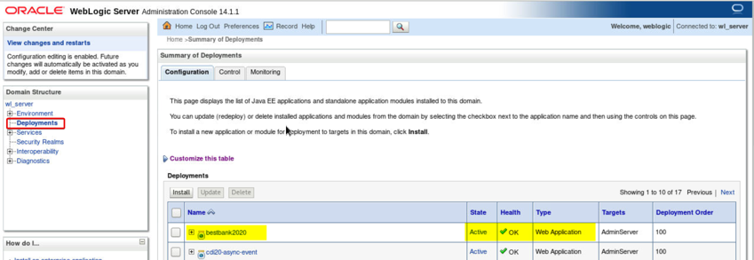

# Initialize Environment

## Introduction

In this lab we will review and startup all components required to successfully run this workshop.

*Estimated Lab Time:* 10 Minutes.

### Objectives
- Initialize the workshop environment.

### Prerequisites
This lab assumes you have:
- A Free Tier, Paid or LiveLabs Oracle Cloud account
- SSH Private Key to access the host via SSH
- You have completed:
    - Lab: Generate SSH Keys
    - Lab: Prepare Setup (Free Tier and Paid Tenants Only)
    - Lab: Environment Setup

## **STEP 1**: Running your Lab
### Access the graphical desktop
For ease of execution of this workshop, your instance has been pre-configured for remote graphical desktop accessible using any modern browser on your laptop or workstation. Proceed as detailed below to login.

1. Launch your browser to the following URL

    ```
    URL: <copy>http://[your instance public-ip address]:8080/guacamole</copy>
    ```

2. Provide login credentials

    ```
    Username: <copy>oracle</copy>
    ```
    ```
    Password: <copy>Guac.LiveLabs_</copy>
    ```

    

    *Note*: There is an underscore `_` character at the end of the password.

3. Click on *Terminal* icon on the desktop to start a terminal

    

### Login to Host using SSH Key based authentication
While all command line tasks included in this workshop can be performed from a terminal session from the remote desktop session as shown above, you can optionally use your preferred SSH client. Refer to *Lab Environment Setup* for detailed instructions relevant to your SSH client type (e.g. Putty on Windows or Native such as terminal on Mac OS):
  - Authentication OS User - “*opc*”
  - Authentication method - *SSH RSA Key*
  - OS User – “*oracle*”.

1. First login as “*opc*” using your SSH Private Key

2. Then sudo to “*oracle*”. E.g.

    ```
    <copy>sudo su - oracle</copy>
    ```

## **STEP 2**: Setup and Initialize Environment
1.	From any of the terminal session, proceed as shown below as user “*oracle*”
2.	Source the setWLS14Profile.sh and setBankAppEnv.sh to set the environment variables required to start the weblogic 14c Admin server and run commands to build Helidon and Bank applications:

  	```
  	<copy>  cd /u01/middleware_demo/scripts/
  	. ./setWLS14Profile.sh
  	. ./setBankAppEnv.sh
    </copy>
  	```

3.	Change the working directory to WebLogic 14c domain bin and start AdminServer in the wl_server domain:

    ```
    <copy>
    cd $DOMAIN_HOME/bin
    nohup sh startWeblogic.sh &
    tail -f nohup.out
    </copy>
  	```

Press `CTRL + C` to end the tail command

4.	The terminal shows stdout logs for starting the AdminServer.
3.	Open the Weblogic Admin Console and login with credentials provided below:

      

    ```
    Console URL: <copy>http://<Your instance public IP address>:7101/console</copy>
    ```
    ```
    username: <copy>weblogic</copy>
    ```
    ```
    password: <copy>Oracle123!</copy>
    ```

4.	On the left hand side Menu under “Domain Structure” click on “Deployments”. Observe that the bestbank2020 application has been already deployed and available to access.

	  

5.	Open a new browser tab or session and access the bank application UI with URL `http://<Your instance public IP address>:7101/bestbank2020`
6.	The existence of base version of the sample bestbank application is confirmed.
7.	Change directory to `/u01/middleware_demo/wls-helidon`

  	```
  	<copy>cd /u01/middleware_demo/wls-helidon/</copy>
  	```

8.	Verify if pom.xml and `src/` folder is available under `/u01/middleware_demo/wls-helidon`

  	```
  	<copy>ls -alrt</copy>
  	```

You may now *proceed to the next lab*.

## Acknowledgements

- **Authors** - Balasubramanian Ramamoorthy, Sudip Bandyopadhyay, Vishwanath Venkatachalaiah
- **Contributors** - Jyotsana Rawat, Satya Pranavi Manthena, Kowshik Nittala, Rene Fontcha
* **Last Updated By/Date** - Rene Fontcha, LiveLabs Platform Lead, NA Technology, December 2020

## Need Help?
Please submit feedback or ask for help using our [LiveLabs Support Forum](https://community.oracle.com/tech/developers/categories/converged-database). Please click the **Log In** button and login using your Oracle Account. Click the **Ask A Question** button to the left to start a *New Discussion* or *Ask a Question*.  Please include your workshop name and lab name.  You can also include screenshots and attach files.  Engage directly with the author of the workshop.

If you do not have an Oracle Account, click [here](https://profile.oracle.com/myprofile/account/create-account.jspx) to create one.
