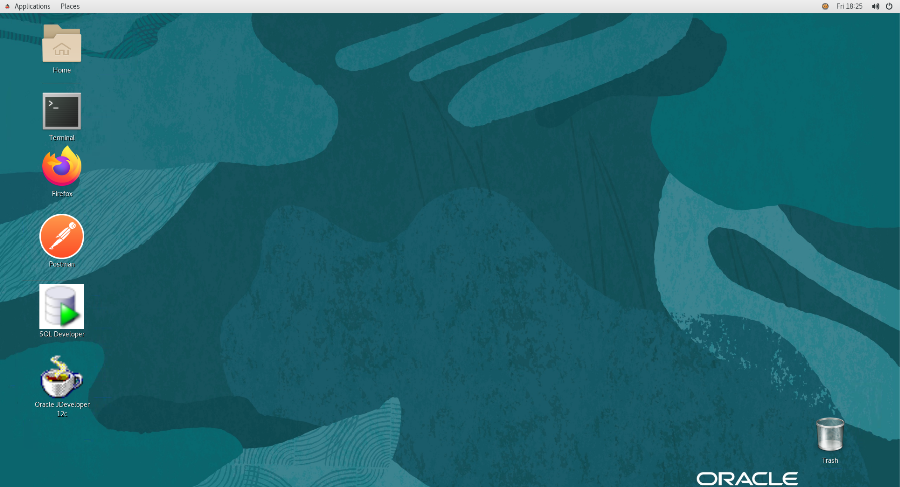

# Initialize Environment

## Introduction

In this lab we will review and startup all components required to successfully run this workshop.

*Estimated Lab Time:* 10 Minutes.

### Objectives
- Initialize the workshop environment.

### Prerequisites
This lab assumes you have:
- A Free Tier, Paid or LiveLabs Oracle Cloud account
- SSH Private Key to access the host via SSH
- You have completed:
    - Lab: Generate SSH Keys (*Free-tier* and *Paid Tenants* only)
    - Lab: Prepare Setup (*Free-tier* and *Paid Tenants* only)
    - Lab: Environment Setup

## **Step 0**: Running your Lab
### Access the graphical desktop
For ease of execution of this workshop, your instance has been pre-configured for remote graphical desktop accessible using any modern browser on your laptop or workstation. Proceed as detailed below to login.

1. Launch your browser to the following URL

    ```
    URL: <copy>http://[your instance public-ip address]:8080/guacamole</copy>
    ```

2. Provide login credentials

    ```
    Username: <copy>oracle</copy>
    ```
    ```
    Password: <copy>Guac.LiveLabs_</copy>
    ```

    

    *Note*: There is an underscore `_` character at the end of the password.

3. Click on *Terminal* icon on the desktop to start a terminal

    

### Login to Host using SSH Key based authentication
While all command line tasks included in this workshop can be performed from a terminal session from the remote desktop session as shown above, you can optionally use your preferred SSH client.

Refer to *Lab Environment Setup* for detailed instructions relevant to your SSH client type (e.g. Putty on Windows or Native such as terminal on Mac OS):
  - Authentication OS User - “*opc*”
  - Authentication method - *SSH RSA Key*
  - OS User – “*oracle*”.

1. First login as “*opc*” using your SSH Private Key

2. Then sudo to “*oracle*”. E.g.

    ```
    <copy>sudo su - oracle</copy>
    ```

## **Step 1**: Check Application accessibility
1. Access the application using the URL  (**`http://<Public IP>:3000/`**), the application's home page opens.


You may now [proceed to the next lab](#next).

## Acknowledgements

- **Authors** - Balasubramanian Ramamoorthy, Sudip Bandyopadhyay, Vishwanath Venkatachalaiah
- **Contributors** - Jyotsana Rawat, Satya Pranavi Manthena, Kowshik Nittala, Rene Fontcha
- **Last Updated By/Date** - Rene Fontcha, LiveLabs Platform Lead, NA Technology, January 2021
