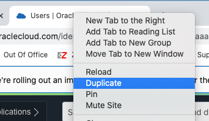
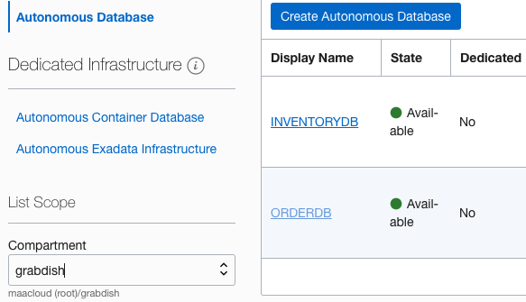

# Setup
## Introduction

In this 20-minute lab we will provision and setup the resources in your tenancy to install and execute microservices.  

### Objectives

* Clone the microservices code
* Execute setup

### What Do You Need?

* An Oracle Cloud paid account or free trial with credits. To sign up for a trial account with $300 in credits for 30 days, click [here](http://oracle.com/cloud/free).

You will not be able to complete this workshop with the 'Always Free' account. Make sure that you select the free trial account with credits.

## **STEP 1**: Login to the OCI Console

Logon to the OCI console for your tenancy.  Be sure to select the **home region** in your tenancy.  This workshop setup will only work in the home region.

  
  
## **STEP 2**: Launch the Cloud Shell

Cloud Shell is a small virtual machine running a Bash shell which you access through the OCI Console. Cloud Shell comes with a pre-authenticated CLI which is set to the OCI Console tenancy region. It also provides up-to-date tools and utilities.

Click the Cloud Shell icon in the top-right corner of the Console.

  

## **STEP 3**: Create a Folder to Contain the Workshop Code

Create a directory to contain the workshop code and change directory to that directory.  The directory name will also be used to create a compartment of the same name in your tenancy.  Make sure that a compartment of the same name does not already exist or the setup will fail.  All the resources that are created by the setup will be created in this compartment.  This will allow you to quickly delete and cleanup afterwards.  Here is an example:

<copy>mkdir grabdish; cd grabdish</copy>

Note, you must change directory to the directory that you have created or the setup will fail.

## **STEP 4**: Make a clone of the workshop source code

To work with application code, you need to make a clone from the GitHub repository using the following command. 

```bash
<copy>git clone -b terraform-etc --single-branch https://github.com/oracle/microservices-datadriven.git
</copy>
```

You should now see `microservices-datadriven` in your folder

TODO: When we publish this will change to clone from the main branch.

## **STEP 5**: Running the Setup Script

1. Execute the following sequence of commands to start the setup.  Note, the commands will also change your .bashrc file so that you will always return to the right place when you connect:

    ```
    <copy>
    sed -i.bak '/grabdish/d' ~/.bashrc
    echo "source $PWD/microservices-datadriven/grabdish/env.sh" >>~/.bashrc
    source microservices-datadriven/grabdish/env.sh
    source setup.sh

    </copy>
    ```
   
   NOTE: THE CLOUD SHELL WILL DISCONNECT AFTER A CERTAIN PERIOD OF INACTIVITY. If that happens, you can reconnect and run this command to resume the setup:

    ```
    <copy>
    source setup.sh
    </copy>
    ```

   The setup process will typically take around 20 minutes to complete.  

2. The setup will ask for you to enter your User OCID.  This can be found in the OCI console.


  

  

3. The setup will automatically configure key based access to the OCI command line interface.  To do this it may need to generate and upload a new API Key to your tenancy.  

   To generate a key the setup will ask you to enter a passphrase.  If that happens then hit return (empty passphrase).  Do not enter a passphrase or setup will fail.
   
   If there is no space for a new key in OCI, the setup will ask you to remove an existing key to make room.  This can be done through the OCI console.

  

  

4. The setup will automatically upload an Auth Token to your tenancy so that docker can login to the OCI Registry.  If there is no space for a new Auth Token, the setup will ask you to remove an existing token to make room.  This can be done through the OCI console.

  

  

5. The setup will provision two databases (for orders and inventory), an Oracle Kubernetes Engine (OKE) cluster, OCI Registry Repositories and an OCI Object Storage wallet.  You can monitor it's progress by duplicting the current browser window.  It is best not to use the original browser tab as this may interupt the setup.

  

   In the new tab, select the resources you are interested in and select your new compartment.  Here we show the database resources that have been created.

  

6. Once the database is created, the setup will ask you to enter an admin password for the databases.  For simplicity, the same password will be used for the order and inventory databases.  Database passwords must be 12 to 30 characters and contain at least one uppercase letter, one lowercase letter, and one number. The password cannot contain the double quote (") character or the word "admin".

7. The setup will also ask you to enter a UI password that will be used to enter the microservice frontend user interface.  Make a note of the password as you enter it as you will need it later.  The UI password must be 8 to 30 characters

8. When the setup.sh script completes it will provide a summary of the setup status.  If everything has completed you will see the following status.

  

   If any of the setup jobs are still running you can monitor their progress with 

     ```
     <copy>
     ps -ef | grep "$GRABDISH_HOME/utils" | grep -v grep
     </copy>
     ```

   Their log files are located in the $GRABDISH_LOG directory.

    ```
    <copy>
    ls -al $GRABDISH_LOG
    </copy>
    ```

   Once the setup has completed you are ready to move on to Lab 2

## Acknowledgements

* **Authors** - Paul Parkinson, Dev Lead for Data and Transaction Processing, Oracle Microservices Platform, Helidon, 
  Richard Exley, Consulting Member of Technical Staff, Oracle MAA and Exadata
* **Adapted for Cloud by** - Nenad Jovicic, Enterprise Strategist, North America Technology Enterprise Architect Solution Engineering Team
* **Documentation** - Lisa Jamen, User Assistance Developer - Helidon
* **Contributors** - Jaden McElvey, Technical Lead - Oracle LiveLabs Intern
* **Last Updated By/Date** - Tom McGinn, June 2020


