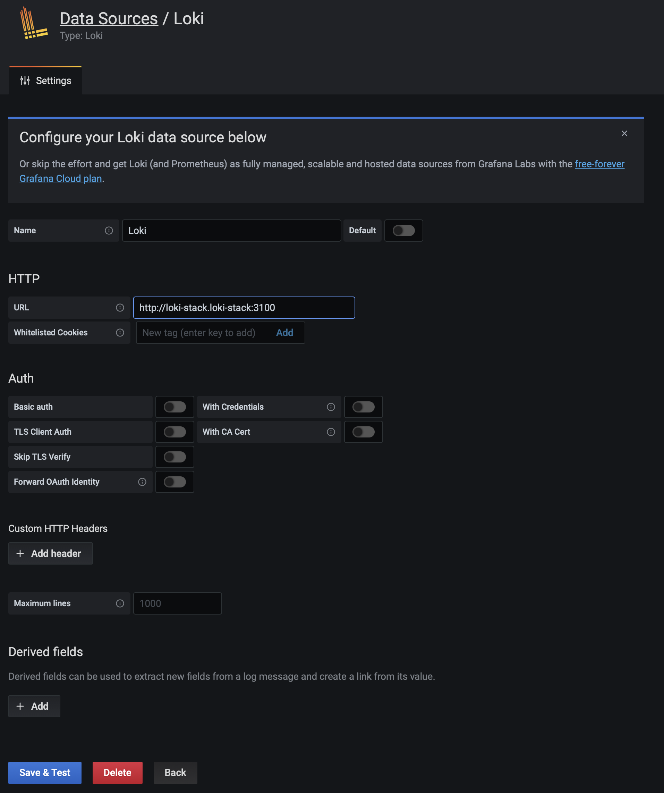
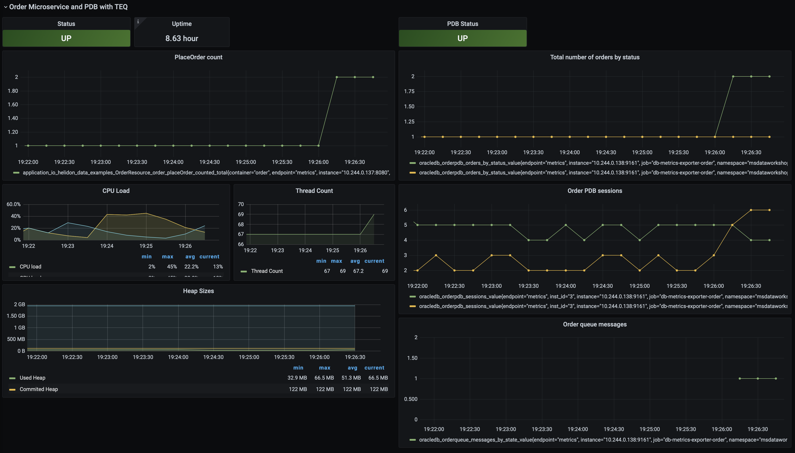
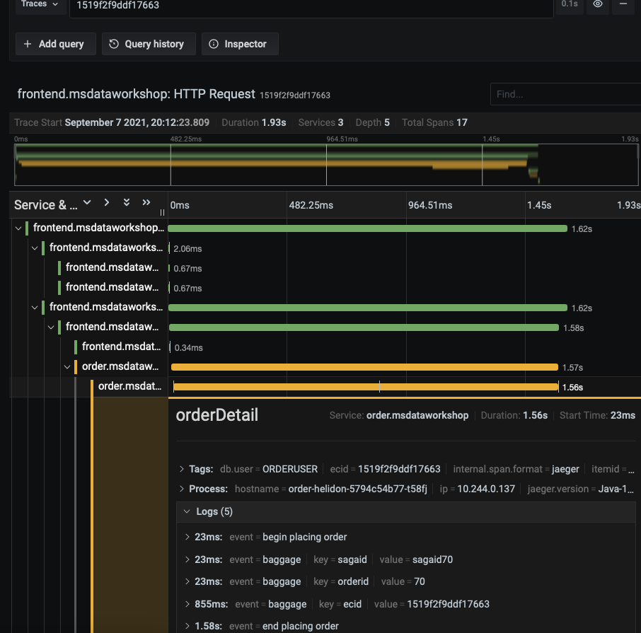

# Observability (Metrics, Tracing, and Logs)

## Introduction

This lab will show you can trace microservice activity using Jaeger.

Estimated lab Time - 25 minutes

  -   Install and configure Grafana, Prometheus, Loki, Promtail, and Jaeger
  -   Understand single-pane-of glass unified observability using Grafana to analyze metrics, logs, and tracing of the microservices architecture across the applicaiotn and Oracle database tier.

## Task 1: Install and configure observability software as well as metrics and log exporters

1. Run the install script to install Jaeger, Prometheus, Loki, Promtail, Grafana and an SSL secured LoadBalancer for Grafana
   
    ```
    <copy>cd $GRABDISH_HOME/observability;./install.sh</copy>
    ```

2. Run the `/applyMonitorsAndExporter.sh` script. This will do the following...
   - Create Prometheus ServiceMonitors to scrape the Frontend, Order, and Inventory microservices.
   - Create Prometheus ServiceMonitors to scrape the Order PDB, and Inventory PDB metric exporter services.
   - Create configmpas, deployments, and services for PDB metrics exporters.
   - Create configmaps, deployments, and services for PDB log exporters.
   
    ```
    <copy>cd $GRABDISH_HOME/observability;./applyMonitorsAndExporter.sh</copy>
    ```

## Task 2: Configure Grafana

1. Identify the IP address of the Grafana LoadBalancer by executing the following command:
   
       ```
       <copy>services</copy>
       ```
   
     
     
     Note that it will generally take a few minutes for the LoadBalancer to provision during which time it will be in a `pending state`

2. Open a new browser tab and enter the external IP URL :
   
     `https://<EXTERNAL-IP>`
   
      Note that for convenience a self-signed certificate is used to secure this https address and so it is likely you will be prompted by the browser to allow access.

3. Login using the default username `admin` and password `prom-operator` 

      
    
4. View pre-configured Prometheus data source...
    
    Select the `Configuration` gear icon on the left-hand side and select `Data Sources`.

      
      
    Click `select` button of Prometheus option.
      
      
      
    The URL for Prometheus should be pre-populated
     
      
    
    Click `Test` button and verify success.
    
      
        
    Click the `Back` button.
    
5. Select the `Data sources` tab and select `Jaeger` 
      
    Click `Add data source`.
    
      
      
    Click `select` button of Jaeger option.
      
      
    
    Enter `http://jaeger-query.msdataworkshop:80` in the URL field.
    
      
        
    Click the `Save and test` button and verify successful connection message.
      
        
    Click the `Back` button.
    
6. Add and configure Loki data source...
    
    Click `Add data source`.
    
      
      
    Click `select` button of Loki option.
      
      
    
    Enter `http://loki-stack.loki-stack:3100` in the URL field 
    
      
       
    Create the two Derived Fields shown in the picture below.
    The values are as follows: 
    
        Name: traceIDFromSpanReported
        Regex: Span reported: (\w+)
        Query: ${__value.raw}
        Internal link enabled and `Jaeger` selected from the drop-down list.
        (Optional) Debug log message: Span reported: dfeda5242866aceb:b5de9f0883e2910e:ac6a4b699921e090:1
    
        Name: traceIDFromECID
        Regex: ECID=(\w+)
        Query: ${__value.raw}
        Internal link enabled and `Jaeger` selected from the drop-down list
        (Optional) Debug log message: ECID=dfeda5242866aceb

      
      
      

    Click the `Save & Test` button and verify successful connection message.
    
      
        
    Click the `Back` button.
    
7. Install the GrabDish Dashboard

    Select the `+` icon on the left-hand side and select `Import`
      
      
    
    Copy the contents of the GrabDish Dashboard JSON found here: https://raw.githubusercontent.com/oracle/microservices-datadriven/main/grabdish/observability/dashboards/grabdish-dashboard.json
    
    Paste the contents in the `Import via panel json` text field and click the `Load` button
      
    
    Confirm upload and click `Import` button.
      
    

## Task 3: Open and study the main GrabDish Grafana Dashboard screen and metrics

1. Select the four squares icon on the left-hand side and select 'Dashboards'
      

2. In the `Dashboards` panel select `GrabDish Dashboard`

      

3. Notice the collapsible panels for each microservices and their content which includes
    - Metrics about the kubernetes microservice runtime (CPU load, etc.)
    - Metrics about the kubernetes microservice specific to that microservice (`PlaceOrder Count`, etc.)
    - Metrics about the PDB used by the microservice (open sessions, etc.)
    - Metrics about the PDB specific to that microservice (inventory count)
 
      
      
      

4. By default the status will show a value of `1` for `UP` status. 

   This can be corrected by selecting the `Edit` item in the/a `Status` panel dropdown
      
   
   Add a value mapping where `value` of `1` results in `text` of `UP`) under the `Field` tab as shown here:
      
      
   Click the `Apply` button in the upper right to apply changes.
   
5. If not already done, place an order using the application or run the scaling test in previous labs in order to see the metric activity in the dashboard.

6. Select the 'Explore' option from the drop-down menu of any panel to show that metric and time-span on the Explore screen

      
      
## Task 4: Use Grafana to drill down on metrics, tracing, and logs correlation and logs to trace feature

1. Click the `Split` button on the Explore screen.
      

2. Click the `Loki` option from the drop-down list on the right-hand panel.
      

3. Click the chain icon on either panel. This will result in the Prometheus metrics on the left and Loki logs on the right are of the same time-span.
      

4. Click the `Log browser` drop-down list on the right-hand panel and select the `app` label under "1. Select labels to search in"
      

5. Select the `order` (microservice) and `db-log-exporter-orderpdb` values under "2. Find values for selected label"
      
      
      
6. Select one of the green info log entries to expand it. Notice the `Jaeger` button next to the trace id.
      
      
7. Click the `Jaeger` to view the corresponding trace information and drill down into detail.
      


## Acknowledgements
* **Author** - Paul Parkinson, Developer Evangelist
* **Last Updated By/Date** - Paul Parkinson, August 2021