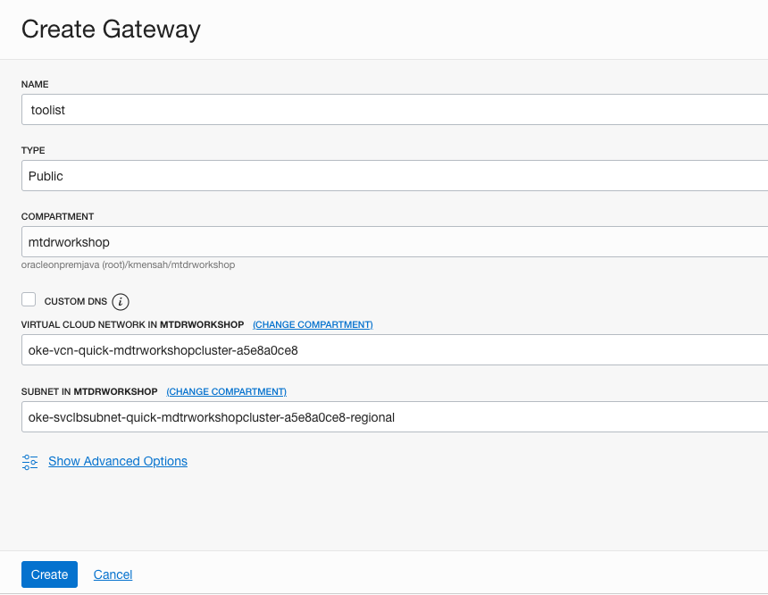
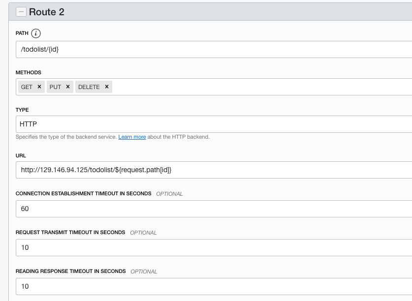

## MyToDoReact version 1.0.
Copyright (c) 2021 Oracle, Inc.

Licensed under the Universal Permissive License v 1.0 as shown at https://oss.oracle.com/licenses/upl/

# Lab 3 -- Backend (Java/Helidon)

## **Summary**

In this Part, you will build and deploy the Helidon Java backend Docker image to OKE, then configure the API Gateway

As with most React applications (https://reactjs.org/), this application uses remote APIs to handle data persistence. The backend implements 5 REST APIs including:
- 1) retrieving the current list of todo items
- 2) Adding a new todo item
- 3) finding a todo item by its id
- 4) updating an existing todo item
- 5) deleting a todo item.

The APIs are documented using Swagger @ http://130.61.67.158:8780/swagger-ui/#/

The backend is implemented using the following Java classes (under ./backend/src/...):   
- Main.java: starts and configure the main entry points.
- ToDoItem.java: maps a Todo Item instance to/from JSON  document
- ToDoItemStorage.java: stores the Todo item in a persistent store i.e., the Oracle Autonomous database
- ToDoListAppService.java: implements the Helidon service and exposes the REST APIs


## **Objectives**

* Set values for environment variables
* Build and deploy the Docker image of the application
* Deploy the image on the Oracle Kubernetes Engine (OKE)
* Describe the steps for Undeploying
* Configure the API Gateway
* Test the backend application


## **STEP 1**: Set values for workshop environment variables

1. Set the root directory of the workshop
```
<copy>export MTDRWORKSHOP_LOCATION=~/mtdrworkshop<copy>
```
2. Run source addAndSourcePropertiesInBashrc.sh

The following command will set the values of environment variables in mtdrworkshop.properties and source ~/.bashrc
```
<copy>cd $MTDRWORKSHOP_LOCATION; source addAndSourcePropertiesInBashrc.sh</copy>
```

## **STEP 2**: Build and push the Docker images

1. Set the environment variable "DOCKER_REGISTRY" to push the docker image to the OCI image registry.
 Example: <region-key>.ocir.io/<object-storage-namespace>/<firstname.lastname>/<repo-name>"
 If the variable is not set or set to an empty string the push will fail (but the docker image will be built).

2. Make sure to be in backend/target/classes/wallet directory then execute
   ```
   <copy>Unzip ~/mtdrworkshop/setup-dev-environment/wallet.zip</copy>
   ```

3. Pick mtdrb_tp service alias (see the list of aliases in
   ./backend/target/classes/wallet/tnsnames.ora)


4. Edit ./backend/target/classes/application.yaml to set the database service and user password


5. Copy the edited ./backend/target/classes/application.yaml to backend./src/main/resources/application.yaml

6. Run the `build.sh` script to build and push the
    microservices images into the repository

    ```
    <copy>cd $MTDRWORKSHOP_LOCATION/backend; ./build.sh</copy>
    ```
  In a couple of minutes, you should have successfully built and pushed the images into the OCIR repository.

7.  Check your container registry in the root compartment
    - Go to the Console, click the hamburger menu in the top-left corner and open
    **Developer Services > Container Registry**.

   

8. Mark Access as Public  (if Private)  (**Actions** > **Change to Public**):

   

## **STEP 3**: Deploy on Kubernetes and Check the Status

1. Run the `deploy.sh` script

```
  <copy>cd $MTDRWORKSHOP_LOCATION/backend; ./deploy.sh</copy>
```

2. kubectl create -f app.yaml
```
  <copy>kubectl create -f app.yaml</copy>
```

--> service/todolistapp-helidon-se-service created
--> deployment.apps/todolistapp-helidon-se-deployment created

3. Check the status using the following commands
$ kubectl get services

The following command returns the Kubernetes service of MyToDo application with a load balancer exposed through an external API
```
  <copy>kubectl get services</copy>
```


4. $ kubectl get pods
```
  <copy>kubectl get pods</copy>
```


5. Continuously tailing the log of one of the pods

$ kubectl logs -f <pod name>
  Examaple kubectl lgs -f todolistapp-helidon-se-deployment-7fd6dcb778-c9dbv

  Returns:
  http://130.61.66.27/todolist

## **STEP 4**: UnDeploy

  If you make changes to the image, you need to delete the service and the pods by running undeploy.sh then redo Steps 2 & 3.

  1. Run the `undeploy.sh` script
  ```
    <copy>cd $MTDRWORKSHOP_LOCATION/backend; ./undeploy.sh</copy>
  ```
  2. Rebuild the image + Deploy + (Re)Configure the API Gateway


## **STEP 5**: Configure the API Gateway

The API Gateway protects any RESTful service running on Container Engine for Kubernetes, Compute, or other endpoints through policy enforcement, metrics and logging.
Rather than exposing the Helidon service directly, we will use the API Gateway to define cross-origin resource sharing (CORS).

1. From the hamburger  menu navigate **Developer Services** > **API Management**
   

2. Configure the basic info: name, compartment, VCN and Subnet
    - VCN: pick on of the vitual circuit network
    - Subnet pick the public subnet   
    The click "Create"
  

3. Click on Deployments
   

4. Create a todolist deployment
   

5. Click on Todolist gateway
     

6. Configure Cross-origin resource sharing (CORS) policies
  CORS is a security mechanism that will prevent  running application loaded from origin A  from using resources from another origin B.
  Allowed Origins: is the list of all the servers from which the react application will be loaded.
  Allowed methods: GET, PUT, DELETE, POST, OPTIONS are all needed.
  

 7. Configure the Headers
    

 8. Configure the routes: we will define two routes:
    - /todolist for the first two APIs: GET, POST and OPTIONS
    

    - /todolist/{id} for the remaining three APIs: (GET, PUT and DELETE)
    


## **STEP 6**: Testing the backend application through the API Gateway

1. Navigate to the newly create Gateway Deployment Detail an copy the endpoint
   

2. Testing through the API Gateway endpoint
  postfix the gateway endpoint with "/todolist" as shown in the image below
   

  It should display the Todo Item(s) in the TodoItem table. At least the row you have created in Part I.

Congratulations, you have completed Part II; you may now proceed to the final part (i.e., Part III).

## Acknowledgements
* **Workshop by** - Kuassi Mensah, Dir. Product Management, Java Database Access
* **Application by** - Jean de Lavarene, Sr. Director of Development, JDBC/UCP
* **Original scripts by** - Paul Parkinson, Developer Evangelist, Microservices

## Need Help?
Please submit feedback or ask for help using this [LiveLabs Support Forum](https://community.oracle.com/tech/developers/categories/building-microservices-with-oracle-converged-database). Please login using your Oracle Sign On and click the **Ask A Question** button to the left.  You can include screenshots and attach files.  Communicate directly with the authors and support contacts.  Include the *lab* and *step* in your request.
