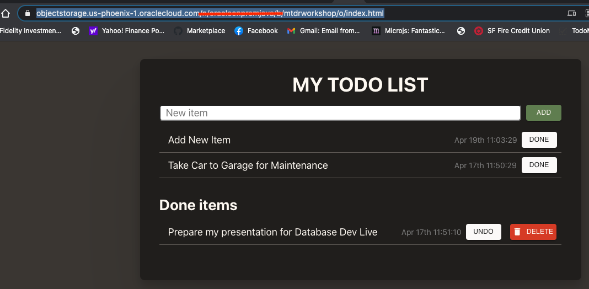

# Deploy the Application Frontend (React JS)

## Introduction

In this tutorial you will deploy a pre-built ReactJS application locally then build it for production and host it on the Oracle Cloud Infrastucture (OCI).

Estimated Time: 15 minutes

### Understand the ReactJS Application

The application is simple; it uses "functional components" with "state hooks" for managing states. There is a main component called "App", which renders another component called "NewItem" and two tables of todo items: the active ones and the completed ones. The "NewItem" component displays the text field for adding a new item.

The App component includes the items state ([]) which contains the list of todo items. When setItems is called with a new array of items, the component will re-render.

The App component also maintains the following states:

- "isLoading" is true when waiting for the backend to return the list of items. We use this state to display a spinning wheel while loading.

- "isInserting" is true when waiting for the backend to process a newly inserted item. The **Ad** button will display a spinning wheel during this time.

- "error" stores the error messages received during the API calls.

The index.css file contains all the styles for the application.

### Objectives

In this tutorial, you will:
- Clone the workshop git repository on your laptop
- Set the API Gateway endpoint
- Run the ReactJS frontend code in development mode and build for production
- Host the production build on the OCI Object Storage

### Prerequisites

1. This tutorial requires the completion of **Setup Development Environment** and **Deploy the Backend   Docker Image to Kubernetes**

2. Make sure the `npm` command is installed.

    ```
    <copy>npm --version</copy>
    ```
3. if `npm` is not inalladed, install `Node` for your laptop, using `https://bit.ly/3evGlEo`.

4. Make sure `Go lang` is installed.

    `go version` -> `go version go1.15.2 darwin/amd64`

    ```
    <copy>go version</copy>
    ```
5. If `Go lang` is not installed, see https://golang.org/doc/

## **STEP 1**: Configure API.js

This project was bootstrapped with [Create React App](https://github.com/facebook/create-react-app).

1. Clone the git repository to a directory on your laptop; we only need the front end in this tutorial:

	```bash
	<copy>git clone https://github.com/oracle/oci-react-samples.git</copy>
	```

2. Navigate to the `frontend` directory
     ```bash
     <copy>cd frontend</copy>
    ```
3. Run the following `npm` commands to install the required packages:

	```bash
	<copy>npm install --save typescript</copy>
	```
	
	```bash
	<copy>npm install</copy>
	```
	
4. In case of errors, try the following command:
	
		```
		<copy>npm audit fix --force</copy>
		```
	
	>**Note**: ideally, the `npm -version` should be higher than  `6.14.x`  and `node version` higher than 14.16.x 
	
5. If `npm` version is inferior to 6.14.x then install the latest `node` using
		https://bit.ly/3evGlEo

6. Update API_LIST in API.js:
6.1. Navigate to thnw `frontend/src` directory
		```bash
		<copy>cd frontend/src</copy>
		```
6.2. In the Oracle Cloud Console, navigate to **Developer Services** and select **API Management**
	- Click your gateway and go to **Deployment**.
	- Copy the endpoint.
	- Paste the endpoint as the value of API_LIST and append **/todolist**.

		For example, const API_LIST = 'https://xxxxxxxxxx.apigateway.eu-frankfurt-1.oci.customer-oci.com/todolist';

  	- Save the modified API.js file.

## **STEP 2**: Run in Dev Mode then Build for Production

1. In the project directory, run the app in the development mode <br />:

	```bash
	<copy>npm start</copy>
	```

2. Open [http://localhost:3000](http://localhost:3000) to view it in the browser.

> **Note**
    - The page will reload if you make edits.<br />
    - You will also see any lint errors in the console.

4. Cancel the developer mode execution and build the app for production into the `build` folder.<br />

	4.1. Press **Ctrl-c** to cancel the developer mode executions.

	4.2. Execute `npm run build`.

		```bash
		<copy>npm run build</copy>
		```
	 `npm` correctly bundles React in production mode (in the build folder) and optimizes the build for best performance.

    

	The build is minified and the file name include the hashes.<br />
	Your app is ready to be deployed!

	See the section about [deployment](https://facebook.github.io/create-react-app/docs/deployment) for more information.

## **STEP 3**: Host on the Oracle Cloud Infrastructure Object Storage

1. Open up the navigation menu in the top-left corner of the Oracle Cloud Console and select
**Object Storage** and then select **Object Storage**.

2. Create the **mtdrworkshop** bucket.

3. Install the Staci utility for copying directories to the Oracle Cloud Infrastructure (OCI) object storage
   bucket with folder hierarchies.

	3.1. Execute `git clone https://github.com/maxjahn/staci.git`.

		```bash
		<copy>git clone https://github.com/maxjahn/staci.git</copy>
		```

	3.2. Navigate to the **staci** directory

		```bash
		<copy>cd staci</copy>
		```

	3.3. Execute `go get -d`.

		```bash
		<copy>go get -d</copy>
		```

	3.4. Execute `go build`.

		```bash
		<copy>go build</copy>
		```

4. Upload a static build into the bucket, using the staci binary.

	```bash
	<copy>./staci/staci -source build -target mtdrworkshop</copy>
	```

	- The application is visible in the 'mtdrworkshop' bucket of your tenancy.

5. Click the index.html object and copy its URL.

    

You may now run the application from OCI Object Store, using the URL of the index that you've copied above.

    


## Acknowledgements

* **Author** -  Kuassi Mensah, Dir. Product Management, Java Database Access
* **Contributors** - Jean de Lavarene, Sr. Director of Development, JDBC/UCP
* **Last Updated By/Date** - Anoosha Pilli, Database Product Management,  April 2021
