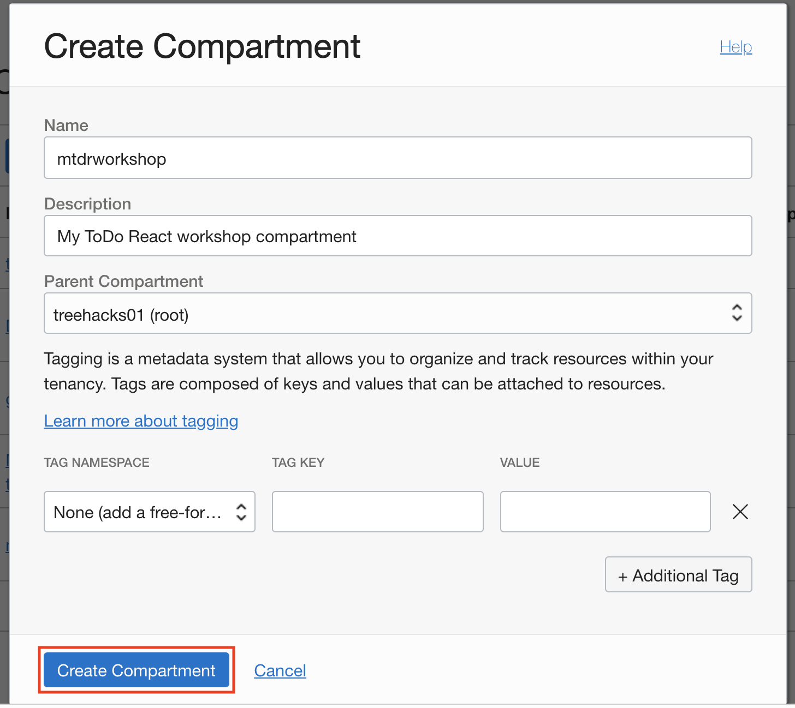
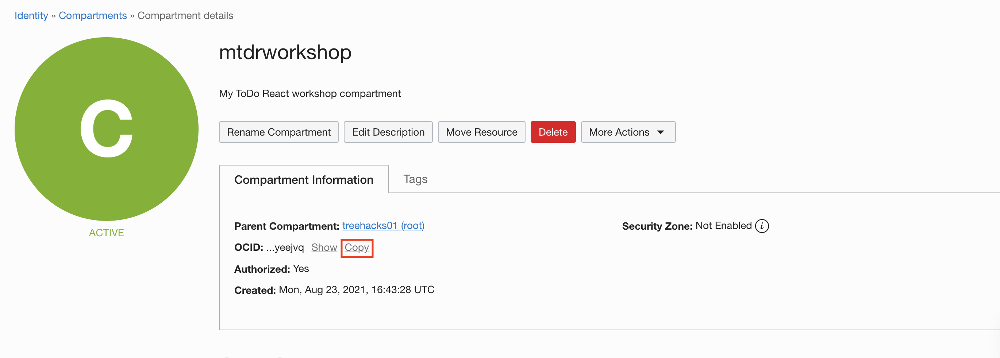
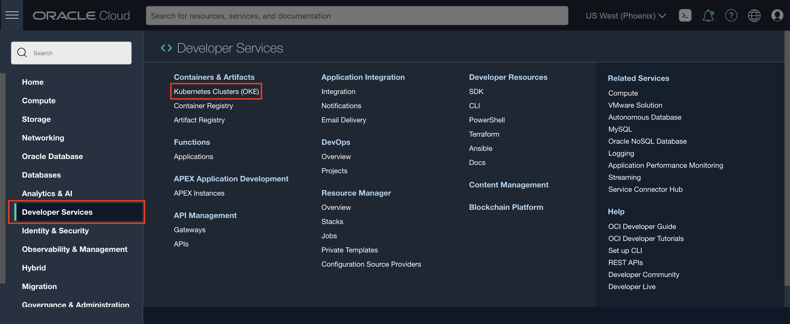
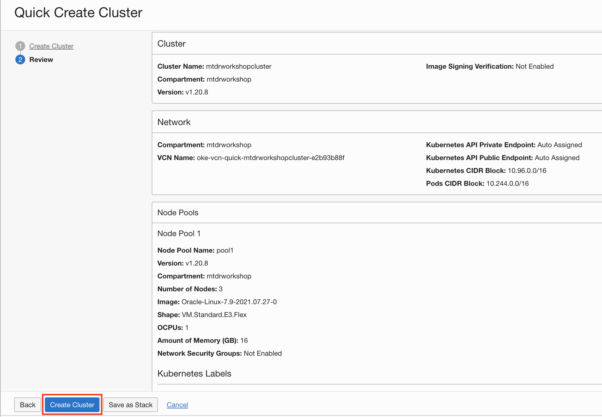
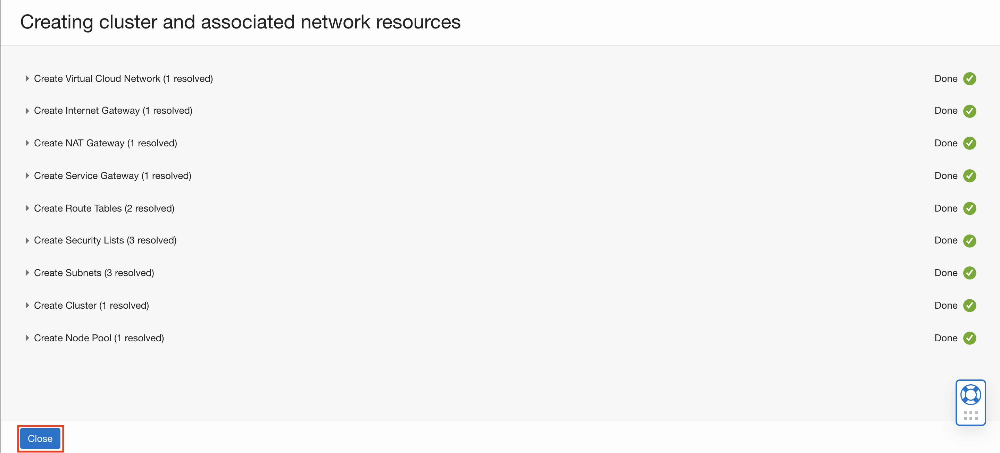
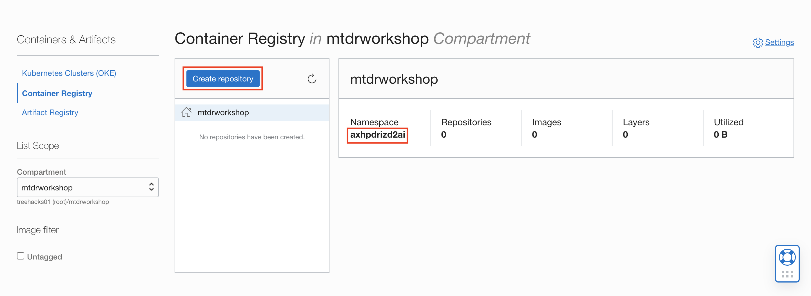
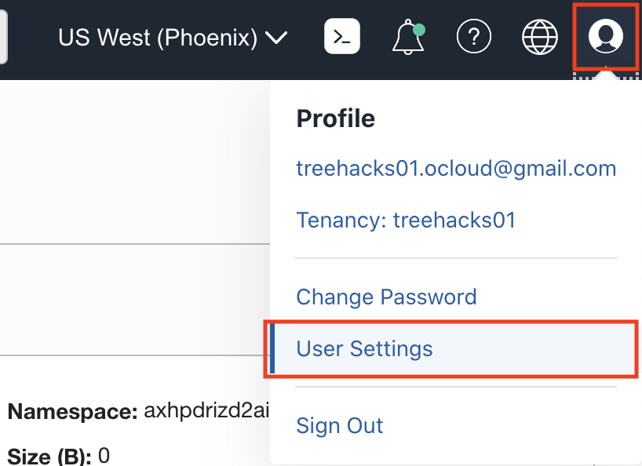

## MyToDoReact version 1.0.
##
## Copyright (c) 2021 Oracle, Inc.
## Licensed under the Universal Permissive License v 1.0 as shown at https://oss.oracle.com/licenses/upl/

# Lab 1 --  MyToDoReact Setup OCI, OKE, ATP and Cloud shell

## Introduction

Welcome to the MyToDo React workshop. In this lab you will be able to: (1) register and get a Free Tier Cloud instance in Oracle Cloud Infrastructure (OCI; (2) create an OCI compartment; (3) create a Kubernetes cluster in the Oracle Kubernetes Engine (OKE)

### Objectives

* Register to an OCI Free Tier instance
* Download the workshop code and scripts
* Collect information that will be used later throughout this workshop
* Set up a two nodes OKE cluster: mtdrworkshopcluster
* Create the mdtrdb ATP database
* Create an OCI Registry and Auth key

### What Do You Need?

* An Oracle Cloud paid account or free trial with credits. To sign up for a trial account with $300 in credits for 30 days, click [here](http://oracle.com/cloud/free).

 You will not be able to complete this workshop with the 'Always Free' account. Make sure that you select the free trial account with credits.

## **STEP 1**: Launch the Cloud Shell

Cloud Shell is a small virtual machine running a Bash shell which you access through the OCI Console. Cloud Shell comes with a pre-authenticated CLI which is set to the OCI Console tenancy home page region. It also provides up-to-date tools and utilities.

Click the Cloud Shell icon in the top-right corner of the Console.

  


## **STEP 2**: Clone mtdrworkshop GitHup repository

1. Open up Cloud Shell and clone the github repo.

    ````shell
    <copy>
    git clone https://github.com/oracle/MyToDoReact.git
    </copy>
    ````

  You should now see `mtdrworkshop` in your root directory

2. Change to the mtdrworkshop directory:

    ```
    <copy>cd mtdrworkshop</copy>

    ```
## **STEP 3**: Create an OCI compartment and an OKE cluster in that compartment

 1. Open up the hamburger menu in the top-left corner of the Console and select **Identity > Compartments**.

       

 2. Click **Create Compartment** with the following parameters then click **Create Compartment**:
        - Compartment name: `mtdrworkshop`
        - Description: `My ToDo React workshop compartment`

        

        

  3. Once the compartment is created, click the name of the compartment and then click **Copy** to copy the OCID.

        

        

  4. Go back into your cloud shell and verify you are in the `~/mtdrworkshop` directory.

  5. Run `./setCompartmentId.sh <COMPARTMENT_OCID> <REGION_ID>` where your `<COMPARTMENT_OCID>` and `<REGION_ID>` values are set as arguments.

      For example:

       `./setCompartmentId.sh ocid1.compartment.oc1..aaaaaaaaxbvaatfz6yourcomparmentidhere5dnzgcbivfwvsho77myfnqq us-ashburn-1`

  6.  To create an OKE cluster, return to the OCI console and open up the hamburger button in the top-left
            corner of the Console and go to **Developer Services > Kubernetes Clusters**.

          

  7. Make sure you are in the newly created compartment and click **Create Cluster**.
     (Please use the default schema in the unlikely situation that the newly created compartment is not quickly visible on the left pickler)

          

  8. Choose **Quick Create** as it will create the new cluster along with the new network
        resources such as Virtual Cloud Network (VCN), Internet Gateway (IG), NAT
        Gateway (NAT), Regional Subnet for worker nodes, and a Regional Subnet for load
        balancers. Click **Launch Workflow**.

          


  9. Change the name of the cluster to `mtdrworkshopcluster`, accept all the other defaults, and click **Next** to review the cluster settings.


  10. Once reviewed click **Create Cluster**, and you will see the resource creation progress.

          

  11. Close the creation window once you can.

          

  12. Once launched it should usually take around 5-10 minutes for the cluster to be
        fully provisioned and the Cluster Status should show Active.

          

          

        _There is no need to wait for the cluster to be fully provisioned at this point as we will verify cluster creation and create a kube config in order to access it in a later step._


## **STEP 4**: Create the ATP database

1. Set some values for some environment variables
```
<copy>export WORKINGDIR=workingdir; export MTDRWORKSHOP_COMPARTMENT_ID=$(cat $WORKINGDIR/mtdrworkshopcompartmentid.txt);echo console created MTDRWORKSHOP_COMPARTMENT_ID... $MTDRWORKSHOP_COMPARTMENT_ID</copy>

```

2. Create the MTDRDB database by copying and replacing <MTDRDB ADMIN PASSWORD> with the actual password in the following command.

```
<copy>oci db autonomous-database create --admin-password <MTRDB ADMIN PASSWORD> --compartment-id $MTDRWORKSHOP_COMPARTMENT_ID --cpu-core-count 1 --data-storage-size-in-tbs 1 --db-name MTDRDB --display-name MTDRDB| jq --raw-output '.data | .["id"] ' > $WORKINGDIR/mtdrworkshopdbid.txt</copy>
```
Please note the ADMIN password for configuring the backend, later.

3. Export the following environment variable and notice the creation of the MTDRDB.
```
<copy>export MTDRWORKSHOP_MTDRDBDB_ID=$(cat $WORKINGDIR/mtdrworkshopdbid.txt);
echo MTDRWORKSHOP_MTDRDB_ID... $MTDRWORKSHOP_MTDRDBDB_ID
</copy>
```

   

   _the OCID for the PDB is stored and will be used later to create kubernetes secret that the microservice will use to access it._


## **STEP 5**: Create an OCI Registry and Auth key and login to it from Cloud Shell
You are now going to create an Oracle Cloud Infrastructure Registry and an Auth key. Oracle Cloud Infrastructure Registry is an Oracle-managed registry that enables you to simplify your development-to-production workflow by storing, sharing, and managing development artifacts such as Docker images.

1. Open up the hamburger menu in the top-left corner of the console and go to **Developer Services > Container Registry**.

  


2. Take note of the namespace (for example, `axkcsk2aiatb` shown in the image below).



 Click **Create Repository** , specify the following details for your new repository, and click **Create Repository**.
    - Repository Name: `<tenancy name>/mtdrworkshop`
	- Access: `Public`

  Make sure that access is marked as `Public`.  


  

  Go to Cloud Shell and run `./addOCIRInfo.sh` with the namespace and repository name as arguments

  ```
  <copy>./addOCIRInfo.sh <namespace> <repository_name></copy>
  ```

  For example `./addOCIRInfo.sh axkcsk2aiatb mtdrworkshop.user1/mtdrworkshop`

3. You will now create the Auth token by going back to the User Settings page. Click the Profile icon in the top-right corner of the Console and select **User Settings**.

  

4. Click on **Auth Tokens** and select **Generate Token**.

  

5. In the description type `mtdrworkshoptoken` and click **Generate Token**.

  

6. Copy the token value.

  

7. Go to Cloud Shell and run docker login ...
 `docker login  <USERNAME> "<AUTH_TOKEN>"` where

  * `<USERNAME>` - is the username used to log in (typically your email address). If your username is federated from Oracle Identity Cloud Service, you need to add the `oracleidentitycloudservice/` prefix to your username, for example `oracleidentitycloudservice/firstname.lastname@something.com`

  * `"<AUTH_TOKEN>"` - paste the generated token value and enclose the value in quotes. For example `docker loging oracleidentitycloudservice/user.foo@bar.com "8nO[BKNU5iwasdf2xeefU;yl"`

  ```
  <copy>docker login $MTDRWORKSHOP_REGION.ocir.io -u $MTDRWORKSHOP_OCIR_NAMESPACE/$MTDRWORKSHOP_OCIR_USER -p <AUTH_TOKEN</copy>
  ```

8. Once successfully logged into Container Registry, we can list the existing docker images. Since this is the first time logging into Registry, no images will be shown.

    ```
    <copy>docker images </copy>
    ```


## **STEP 6**: Access OKE from the Cloud Shell

1. Run `./verifyOKEAndCreateKubeConfig.sh`

 ```
 <copy>./verifyOKEAndCreateKubeConfig.sh</copy>
 ```

2. Notice `/.kube/config` is created for the cluster and the `mtdrworkshop` namespace is also created.

  


You may now proceed to the next lab.

## Acknowledgements
* **Application by** - Jean de Lavarene, Sr Director of Development, JDBC/UCP
* **Workshop by** - Kuassi Mensah, Dr Product Management, JDBC/UCP, OJVM
* **Original scripts by** - Paul Parkinson, Dev Lead for Data and Transaction Processing, Oracle Microservices Platform, Helidon

## Need Help?
Please submit feedback or ask for help using this [LiveLabs Support Forum](https://community.oracle.com/tech/developers/categories/building-microservices-with-oracle-converged-database). Please login using your Oracle Sign On and click the **Ask A Question** button to the left.  You can include screenshots and attach files.  Communicate directly with the authors and support contacts.  Include the *lab* and *step* in your request.
