# OKE Apps and OCI Logging Service

## Introduction

Logs contain critical event, state and diagnostic information for your  containerized and serverless applications. Traditionally, it has been challenging to collect and centrally manage application pod log data from a busy Kubernetes cluster. Early strategies focused on custom sidecar containers exporting log data directly to user-managed storage locations for consumption by legacy search tools.  Considerable dev work and administrative overhead!  Vendors have proposed proprietary agent-based solutions that may streamline the work but may not be transparent to your applications (and cause vendor lock-in). 

It is important align with the long term vision of the Kubernetes Foundation's recommended strategy for log management on the worker nodes. Kubernetes recommends you containers export log messages via native stdout/stderr buffers.  This data is already collected and managed by the worker nodes.  OKE cluster nodes automatically deploy with a lightweight agent for collecting metrics and log information from host processes.  Additionally, this agent can be easily configured to collect custom application log data as shown in the following diagram.  


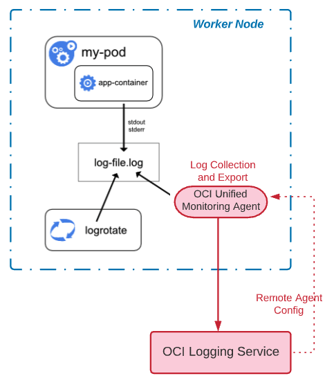


In this lab you will deploy a sample Python webservice application with OCI Logging enabled. 

Estimated Lab Time: 15 minutes

### Objectives

In this lab, you will:
* Create an OCI Log Group and Agent Configuration 
* Review code options to enable app logging and deploy a Python web service to OKE
* Examine application log data ingested into the OCI Logging Service

### Prerequisites

* An Oracle Free Tier, Always Free, Paid or LiveLabs Cloud Account
* Access to the cloud environment and resources configured in Lab 1 


## **STEP 1**: Create Log Group

Log groups are logical containers for organizing and managing logs. Logs must always be inside  a log group. You must first create a log group to enable or create logs.  Fortunately, this is a fast and easy activity.

1. In the OCI Management Console, ensure you have selected the same Region as Lab 1.  Navigate to **Observability and Management** --> **Logging** --> **Log Groups**

      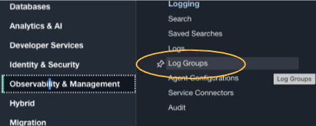

2. Ensure **Compartment** devlivedemo is selected in the left column.

    
   
3. Click the **Create Log Group** button.

    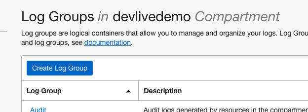

4. On the **Create Log Group** dialog page ensure **Compartment** devlivedemo is specified.  **NAME** your Log Group devlivelg, provide a brief **DESCRIPTION**, and then click the **Create** button.

    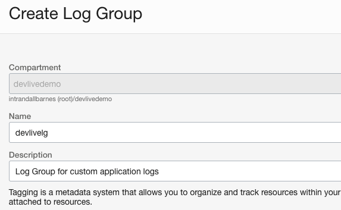

   
   You are now ready to move on to the next step.

## **STEP 2:** Create Custom Log and Agent Config

An agent configuration provides instructions for both the Logging Service and a specific group of deployed agents to work together.  It is required for custom logs.  Follow these steps to create an agent configuration that will include importing app container log messages from the OKE cluster created in Lab 1.

1. Navigate to **Observability and Management** --> **Logging** --> **Logs**.  Under List Scope, Compartment, choose devlivedemo.  Then select **Create Custom Log** to open the Create panel.

    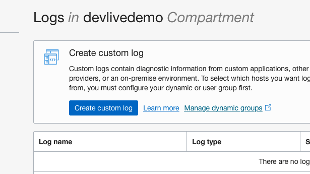


2.  In **CUSTOM LOG NAME** enter *customlog01*, for **COMPARTMENT** ensure *devlivedemo* is listed, and in **LOG GROUP** select *devlivelg*.  Then click the **Create Custom Log** button.

    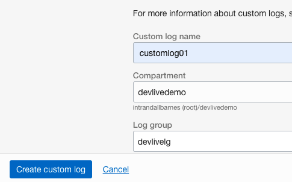

   The **Create Agent Configuration** panel is displayed, where you can create a new configuration. 

    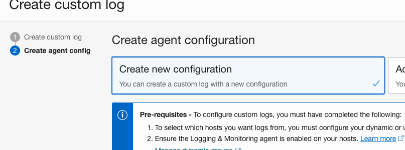
  

3.  In **CONFIGURATION NAME** enter oke-app-cfg01.  Ensure **COMPARTMENT** specifies devlivedemo.  

    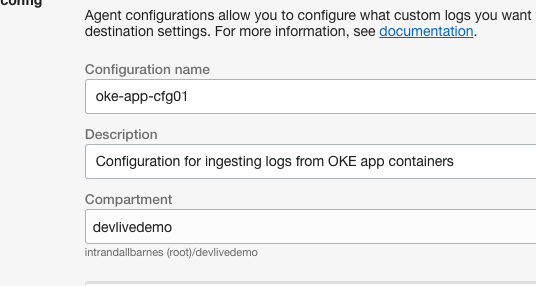

    In **GROUP TYPE** select Dynamic Group, and in the **GROUP** box select the group created in Lab 1: devlivedg. 

    

    **Note** Your screen may give you the option to create a policy to allow resources to use the logging service.  This was already performed in Lab 1, but go ahead and click **Create** to dismiss the prompt.

4.  In the **Configure Log Inputs** section choose **INPUT TYPE** Log Path, **INPUT NAME**  okeapplogs, and for **FILE PATHS** use the following path:

    ```
    /var/log/pods/default_*/*/*.log  
    ```

    This is the default filepath for application containers in the current versions of OKE. If you wish to include all container logs (including system and service containers) then remove "default_" from the path and use:

    ```
    /var/log/pods/*/*/*.log  
    ```

    Your Agent configuration should look like the following:

    

6.  Click **Create Custom Log** to complete the task.  You are ready to move on to the next step.

## **STEP 3:** Review code options and deploy application to OKE

Kubernetes recommends directing app log message to stdout and stderr.
OCI fluentd-based agents automatically deployed on worker nodes can read these logs and stream them to the OCI Logging Service.  In Steps 1 and 2 you set up the Logging Service with a collection location (custom log) for log data, and you instructed the worker node agents where to look for specific application pod logs (the agent config).  

Next we will review simple application code examples that you, as a developer, can use to export log data from your container applications.  This application uses Python, but the concepts are the same regardless of your preferred platform.

**1. Review the deployment files** 

Navigate to the **devlive/oke-logging** subdirectory downloaded in the Setup Lab and view the contents.

```
$ cd ~/devlive-hol/oke-logging/
$ ls

   devlive-logger.py  devlive-logger.yaml  Dockerfile  src
```
Let's examine the Python source:

```
$ cat devlive-logger.py 
```
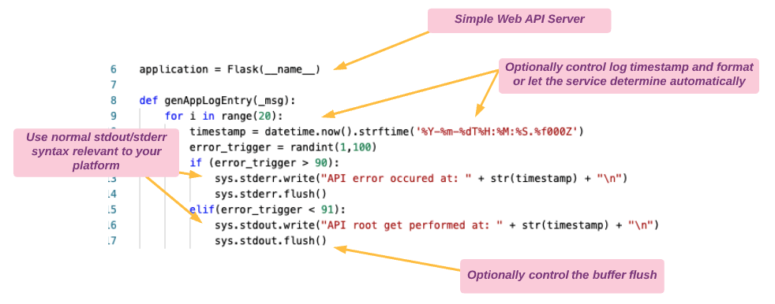

Now let's review the deployment file:

```
$ cat devlive-logger.yaml
```
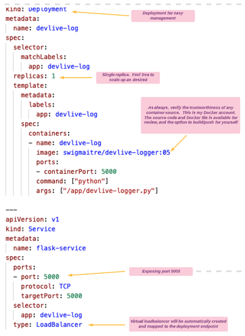

**2. Deploy the Application** 

Run the following commands to deploy and verify the app.  

```
$ kubectl apply -f devlive-logger.yaml 
```

```
$ kubectl get deployments


NAME          READY   UP-TO-DATE   AVAILABLE   AGE
devlive-log   1/1     1            1           44s
```

Execute the following command to verify the service endpoint is online.  You may need to wait a few more seconds for the Load Balancer to come online and update the public IP field.
```
$ kubectl get service flask-service

```


**3. Generate log entries**

Log entries are generated only as a result of receiving GET requests to the Flask server.  Using the Load Balancer public IP address obtained in the previous step, make a few calls to the flask web server with the following command (Note: your IP will be unique)

```
$ curl [your-load-balancer-IP]:5000

Salut!  Hello!  Hola!  Ciao!
```

Alternatively, you could also reach the flask server via a browser, as shown here (don't forget to specify port 5000):


Verify pod/container logs are being populated on the worker node by executing the following command: 

```
$ kubectl logs deployments/devlive-log
```

Don't worry if you see some *"error occured at:  "* messages mixed in with the regular log entries.  These are created by the application to simulate process activities, and we'll watch for these as they are imported into the Logging Service console in Step 4 next.

**Remember to periodically execute the curl command to generate new log entries!**

## **STEP 4:** Examine data format ingested into the OCI Logging Service

**1. Locate and review Log**

Navigate to **logging service** --> **logs** and select your custom log **customlog01** to open the Explore Log page.

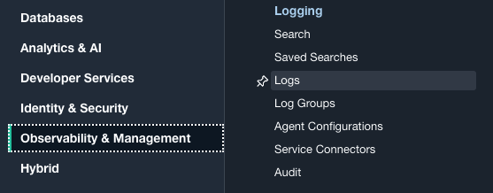


By this time you should be able to view log messages.  **Note:** there could be an initial ingestion delay of up to a few minutes. 

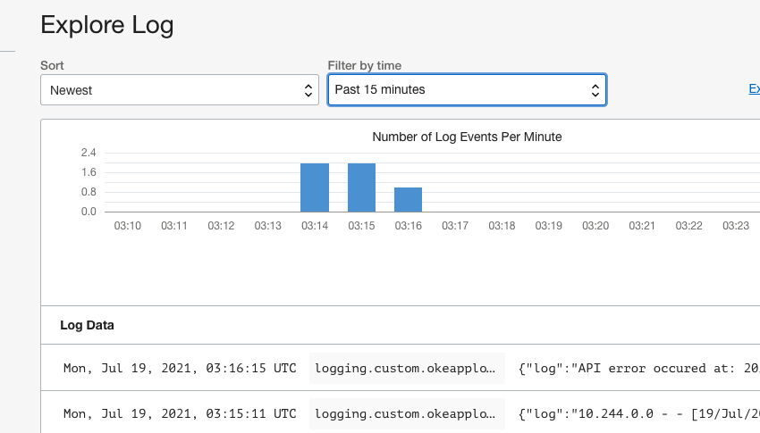


Examine the log entries and identify the additional metadata available.

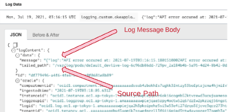


**2. Intro to Log Search**

Select the **Explore with Log Seach** link to pull up the search page.


Enter search keywords or phrases in the **Custom Filters** box and review the results.  This Log Search capabilities are extensive, including the ability to create and save complex queries and define automatic export jobs for result sets.  Although we don't have time in this lab to cover all the capabilities, please spend a few minutes exploring the possibilities.


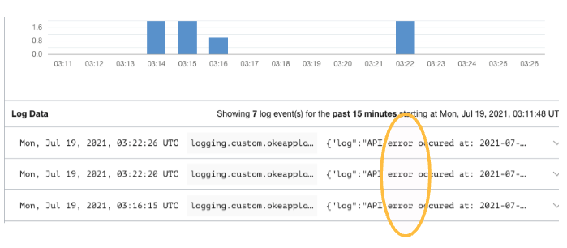


**Remember to periodically execute the curl command to generate new log entries!**


**Congratulations!**  You have completed this lab and are ready to move on to the next section.


## Learn More

* [OCI Logging Service](https://docs.oracle.com/en-us/iaas/Content/Logging/Concepts/loggingoverview.htm)


## Acknowledgements
* **Author** - Randall Barnes, Solution Architect, OCI Observability Team
* **Last Updated Date** - July, 2021
