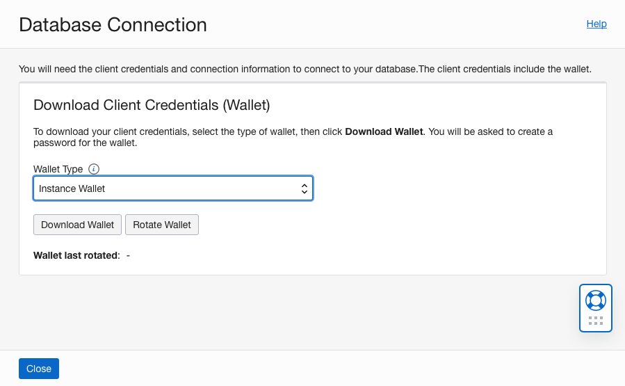
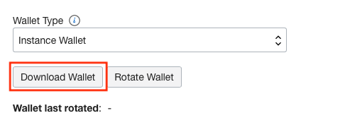
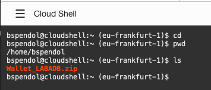
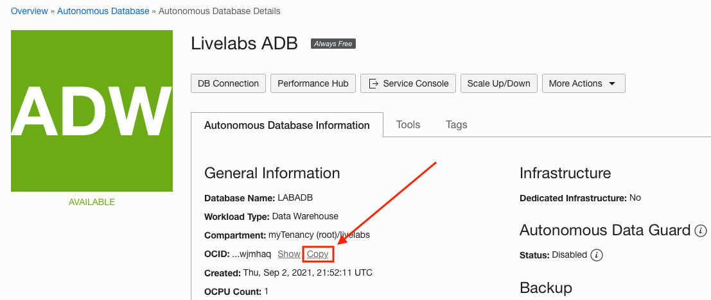

# Oracle Database CI/CD for Developers - Lab 1: Use SQLcl for Database Change Management/Tracking

## Introduction

In this lab you will use the SQLcl to create object in an Autonomous Database. Once the objects are created, SQLcl will be used to export the object definitions so that we can commit them to our OCI Code Repository.

Estimated Lab Time: 30-45 minutes

### Objectives

- Create a baseline for your database schema
- Commit the objects to your OCI Repository

### Prerequisites

- You have completed the [Setups](../setups/setups.md).

## Task 1: Log into your Autonomous Database

To access our Autonomous Database, we first must download the wallet that contains the connection information. We can do this in two ways.

### Download the wallet via a web browser

1. Use the OCI web console drop down menu to go to **Oracle Database** and then **Autonomous Database**.

    

2. On the Autonomous Database page, change your compartment to the livelabs compartment using the **Compartment** dropdown on the left side of the page.

    

3. In the list of Autonomous Databases, find the **Livelabs ADB** database we created and click on the **Display Name**.

    

4. On the **Autonomous Database Details Page**, click the **DB Connection button** on the upper part of the page.

    


5. The **Database Connection slider** will appear. 

    

   Use this slider to set the **Wallet Type Select List** to **Instance Wallet**

    

   and then click the **Download Wallet button**.

    

6. Using the **Download Wallet modal**, enter and confirm a password for the wallet and click **download**.

    

    Note where you saved this file and close the **Download Wallet modal** and the **Database Connection slider**.

7. Open an **OCI Cloud Shell session** if one is not already running.

    

8. In the cloud shell ensure you are in your home directory. You can do this by issuing a **cd** from the command prompt and then verifying you are in your home directory by issuing a *pwd* from the command prompt.

   

   the directory should be **/home/YOUR_USER_NAME**

9. Find where you saved the **Autonomous Database Wallet** on your local environment and **drag and drop it** into the **cloud shell window**.

   

   and you will see the **upload progress** in the upper right of the cloud shell session window

   

   When done, you can hide the progress window.

10. In your home directory, you can issue an **ls** at the cloud shell prompt to see the file.

   

### Download the wallet via OCI CLI

We can issue an OCI CLI command to download the Autonomous Database wallet. 

1. Use the OCI web console drop down menu to go to **Oracle Database** and then **Autonomous Database**.

    

2. On the Autonomous Database page, change your compartment to the livelabs compartment using the **Compartment** dropdown on the left side of the page.

    

3. In the list of Autonomous Databases, find the **Livelabs ADB** database we created and click on the **Display Name**.

    

4. Open an **OCI Cloud Shell session** if one is not already running.

    

5. At the cloud shell prompt, we will issue ab OCI CLI command using the autonomous-database generate-wallet api. 

The format of the api is:

```
oci db autonomous-database generate-wallet --autonomous-database-id ADB_OCID --file FILENAME.ZIP --password MY_PASSWORD
```

where we supply the Autonomous Database OCID, a filename and a password.

6. At the **Cloud Shell prompt**, copy and paste the following to start building our command

````
<copy>
oci db autonomous-database generate-wallet --autonomous-database-id 
</copy>
````
   


7. Using the **Autonomous Database Details Page**, click the **Copy** link next to the **OCID label** in the **Autonomous Database Information** section.

   

   and paste it into the cloud shell ensuring there is a space between --autonomous-database-id and the OCID you are pasting.

   

8. We can now add the rest of the command. **Copy and paste the following** into the cloud shell after the OCID you just pasted. Make sure there is a space between the OCID and the command we are about to paste in.

   ````
   <copy>
   --file Wallet_LABADB.zip --password S3cr3tPassw0rd!!
   </copy>
   ````

   when the command **looks like the following**

   

   press **enter** and you will see the **wallet download**

   

9. In your home directory, you can issue an **ls** at the cloud shell prompt to see the file.

   


6. We can now construct the OCI CLI command.

Once the ADB wallet is downloaded, at a command line, change the directory to the database directory in our repository project. We should be at db-cicd-project -> database. Start SQLcl but do not log into a database yet:

> sql /nolog

 

Next, we have to tell SQLcl where to look for the ADB wallet. First, remember where you downloaded it and we can use the following command to set its location:

SQL> set cloudconfig /DIRECTORY_WHERE_WALLET_IS/WALLET.zip

 

The naming of the wallet is in the format of Wallet_DB_NAME.zip. So, if I named my database ADB, the wallet name would be Wallet_ADB.zip. And if I put the wallet in my downloads folder and the full command would be:

SQL> set cloudconfig /Users/bspendol/Downloads/Wallet_ADB.zip

 

Next, we need to connect to the database. The syntax is:

SQL> conn USERNAME@DB_NAME_high/medium/low/tp/tpurgent

 

The high/medium/low/tp/tpurgent provide different levels of performance for various clients or applications to connect into the database. From the documentation:

    tpurgent: The highest priority application connection service for time critical transaction processing operations. This connection service supports manual parallelism.
    tp: A typical application connection service for transaction processing operations. This connection service does not run with parallelism.
    high: A high priority application connection service for reporting and batch operations. All operations run in parallel and are subject to queuing.
    medium: A typical application connection service for reporting and batch operations. All operations run in parallel and are subject to queuing. Using this service the degree of parallelism is limited to four (4).
    low: A lowest priority application connection service for reporting or batch processing operations. This connection service does not run with parallelism.

For what we want to do, the high-performance service name will be fine. We also want to connect as the admin user so we can setup a schema and permissions on that schema. With our database being named ADB, we would have the following connect command:

SQL> conn admin@ADB_high

 

And then provide the password you used when creating the ADB at the password prompt:

Password? (**********?)

 

And we are in. Time to create a schema, give that schema some permissions and then setup a sample for using Liquibase with. Run the following commands:

SQL> create user demo identified by "PAssw0rd11##11" quota unlimited on data;

SQL> grant connect, resource to demo;

 

Now connect as this user:

SQL> conn demo@ADB_high

 

And then provide the password at the password prompt:

Password? (**********?)

 

Its time to create some sample datababase object for our repository. Run the following scripts included in the sample repository to create some objects:

SQL > @../demo_scripts/create_table.sql

SQL > @../demo_scripts/insert_data.sql

SQL > @../demo_scripts/create_logic.sql

 

This has created us a table, some data in the table, a trigger with some logic and two procedures. Let’s say this is the base of our application we are going to create. Its now time to use Liquibase to create our baseline and commit it to the repository.

At the SQL prompt, issue the following command:

SQL> lb genschema -split

 

Once this is finished, we can exit out of SQLcl and start to commit our changes to the repository.

SQL> exit

 

If you take a quick look around the database directory, you will now see folders for indexes, tables, procedures and triggers; all the objects we just created. We also have a controller.xml file. This file is a change log that includes all files in each directory and in the proper order to allow the schema to be deployed correctly to other databases, our CI process.

Time to commit our code to the repository. Change your directory to the top level of the project (the db-cicd-project directory) and run the following command:

> git add .

 

This command adds our new files to the local staging area. Now we commit the files

> git commit -m "v1.0"

 

A git commit in takes a snapshot of your local repository or you can think of it as saving the current state. Finally, lets push these files up to the GitHub file repository

> git push

 

The push command uploads our commit or state to the main repository. Once the push is done, you can see our files in our repository on GitHub. Congratulations, you have just created your code baseline or version 1.0!

Ready, Set, Branch

We have our main code line for our application in the repository. We can now have our developers clone the repository and start their assigned tickets/task in this development cycle or sprint. The issue with this is that they would all be committing to main and probably stepping all over each other. This requires each developer to create a branch of the repository that they can work in and commit their code to.

Let’s pretend we are developer who has been given the URL to clone the repository and start coding. They start by using git to clone to their local machine:

> git clone git@github.com:YOUR_GITHUB_USERNAME/db-cicd-project.git

 

Now they need to create a personal branch of this code:

> git checkout -b BRANCH_NAME

 

A good practice is to have the developers name the branch to relate to a ticket or sprint they are working on with their names in the branch. Here are some examples:

> git checkout -b TICKET#_USERNAME

> git checkout -b JIRA_TICKET#_USERNAME

> git checkout -b SPRINT#_USERNAME

 

For our example here, let’s use the following (use your name, not mine). Run this command in the top level folder of the project (db-cicd-project)

> git checkout -b sprint1_brian.spendolini

 

And you will see the response:

> Switched to a new branch 'sprint1_brian.spendolini'

 

We can now start developing and committing code to the repository without mixing our changes with the main code line. You can always issue a git status to see what branch you are in:

> git status
On branch sprint1_brian.spendolini
nothing to commit, working tree clean


Only the Changes

Back to our sprint. If you remember from our example scenario, the first ticket says that we need to add a new column to the trees table so that citizens can upload a picture of the tree they are entering. OK, simple enough task.

Once we are in our local git repository for the project db-cicd-project, we move the the database directory. And as before, we use SQLcl to log into our autonomous database:

> sql /nolog

 

Set the wallet location again (your directory path will be different):

SQL> set cloudconfig /Users/bspendol/Downloads/Wallet_ADB.zip

 

And connect to the database:

SQL> conn demo@ADB_high

 

And then provide the password at the password prompt (password is PAssw0rd11##11):

Password? (**********?)

 

Time to add the column. We can issue the following SQL to add the personal_interest column to the employee table:

SQL> alter table trees add (tree_picture blob);
Table EMPLOYEES altered.

 

Ticket done, time to generate the schema again using Liquibase.

SQL> lb genschema -split

 

We can exit SQLcl and go back to the top level of our local git repository. In the db-cicd-project, we issue a git add

> git add .

 

And then a commit

> git commit -m "ticket1"

 

Then we push the new code up to our repository. This push will be slightly different because we are pushing to a branch now. If you issue a git push, you will see something similar to below:

> git push
fatal: The current branch sprint1_brian.spendolini has no upstream branch.
To push the current branch and set the remote as upstream, use

    git push --set-upstream origin sprint1_brian.spendolini

 

So we need to issues the push with our branch this one time:

> git push --set-upstream origin sprint1_brian.spendolini

 

If you go into the GitHub web UI, you can see in this repository that a new branch has been created and that only the table file has been updated as expected.

The other files which contain the procedure and trigger code have not been changed. Again, Liquibase is tracking the changes for us, and we can see it in action here.

Apply Yourself

Seeing is believing so let’s do exactly that; let’s apply our master code line into a schema in our database then apply the new branch and see what Liquibase does.

We need to switch back to our master branch in our local code repository on our local machines. Before we do that, we can see what happened when we do this switch. Go into the database directory while still on this branch we just committed to. Take a look at the trees_table.xml file. We should see the new column in the XML as:

         <COL_LIST_ITEM>
            <NAME>TREE_PICTURE</NAME>
            <DATATYPE>BLOB</DATATYPE>
         </COL_LIST_ITEM>
      </COL_LIST>

 

Now issue the following git command:

> git checkout master

 

And look at the employees_table.xml again. You can see that the last column in this file is SUBMITION_DATE and no longer TREE_PICTURE.

         <COL_LIST_ITEM>
            <NAME>SUBMITION_DATE</NAME>
            <DATATYPE>TIMESTAMP</DATATYPE>
            <SCALE>6</SCALE>
         </COL_LIST_ITEM>
      </COL_LIST>

 

Why is that? It’s because you switched branches to the master branch where we have our baseline code. We have yet to merge this code into that main branch so the new column change only exists in our development branch. Let’s use this to our advantage. While on the master branch, start up SQLcl and login as the admin user:

> sql /nolog

SQL> set cloudconfig /Users/bspendol/Downloads/Wallet_ADB.zip

SQL> conn admin@ADB_high

 

And we will create a new schema

SQL> create user test identified by "PAssw0rd11##11" quota unlimited on data;

SQL> grant connect, resource to test;

SQL> conn test@ADB_high
Password? (**********?) **************
Connected.

 

We need to be in the database directory of our local project. We can use some of SQLcl built in functionality to get there if not already there. We can navigate directories with the cd command. If you are in the tables directory under the database directory, you can simply issue a:

SQL> host cd ..

 

And move up a directory into the database directory in our project home. We can also use the host command with SQLcl to see where we are:

SQL> host pwd
/Users/bspendol/git/db-cicd-project/database

 

Ensure you are in the /db-cicd-project/database directory where mine would be as above:
/Users/bspendol/git/db-cicd-project/database

You can also issue a host ls command to see the files in that directory:

SQL> host ls
controller.xml        index            table
database_files_here    procedure        trigger

 

we are looking to use the controller.xml file.

Quick checkpoint: We are logged into our database as the test user we just made, we are on the master code branch in the local repository and we are in the database directory in our project home. Once here, we are going to use Liquibase to create the objects from our master branch. Issue the following command:

SQL> lb update -changelog controller.xml

 

Once you issue this command, you will see all our objects being created in the database.

SQL> lb update -changelog controller.xml
ScriptRunner Executing: table/trees_table.xml::96726c6d630653c9a9169df8b67089f2cdee1135::(DEMO)-Generated -- DONE
ScriptRunner Executing:
procedure/admin_email_set_procedure.xml::9d1175a5b6ca6d0c969a2eb183062e0a873ee226::(DEMO)-Generated -- DONE
ScriptRunner Executing: index/tree_id_pk_index.xml::b4dd6c2359e7f1e881b55ba728056510d537967a::(DEMO)-Generated -- DONE
ScriptRunner Executing: trigger/set_date_bi_trigger.xml::3b0d8da4c19a11b80f035a748c9b40752f010110::(DEMO)-Generated -- DONE

######## ERROR SUMMARY ##################
Errors encountered:0

######## END ERROR SUMMARY ##################

 

Now, we can move to our development branch and apply that to this schema. Exit out of SQLcl:

SQL> exit

 

Change branches (remember your branch will be named different, unless you are a clone of me with the same name..if so email me please):

> git checkout sprint1_brian.spendolini
Switched to branch 'sprint1_brian.spendolini'
Your branch is up to date with 'origin/sprint1_brian.spendolini'.

 

And log back into the database as this test user:

> sql /nolog

SQL> set cloudconfig /Users/bspendol/Downloads/Wallet_ADB.zip

SQL> conn test@ADB_high

 

And now, using our development branch, we will apply the changes to this schema:

SQL> lb update -changelog controller.xml
ScriptRunner Executing: table/trees_table.xml::f81a149311b20a5a1dfe95a35108b8728df33b7f::(DEMO)-Generated -- DONE

######## ERROR SUMMARY ##################
Errors encountered:0

######## END ERROR SUMMARY ##################

 

There are 2 tables that Liquibase uses to track changes, DATABASECHANGELOG and DATABASECHANGELOG_ACTIONS. There is also a view that combines these tables for a more readable format, DATABASECHANGELOG_DETAILS. If we take a look at the DATABASECHANGELOG_DETAILS view, we can see that only an alter table was done and that the table was not dropped and recreated in the SQL column:

SQL
--------------------------------------------
ALTER TABLE "TREES" ADD ("TREE_PICTURE" BLOB)

 

This would be not only the behavior you would see in say a production instance, but more importantly the behavior you would expect a change management tool to be executing.

Merge Ahead

You now have the tools to start change management with SQLcl, Liquibase and a git repository for your development group or organization. As with all new processes, start slow. Maybe start with just getting everyone used to committing code to a central repository using git. But once we start adding these building blocks, we can continue down the CICD road to the next stages.

This process also allows you to start combining your database sprint code with stateless application code in the same repository setting the entire development team up for a CICD process. No longer are database developers and DBAs left out in the cold being called legacy when they can now uptake the same change management and repository practices that other development teams have enjoyed.

In part 2, we will be discussing the automated pipelines we should be using for testing this code; in essence, once a commit or merge request happens, we test the code on a new database.


## Acknowledgements

- **Authors** - Jeff Smith, Distinguished Product Manager and Brian Spendolini, Trainee Product Manager
- **Last Updated By/Date** - Brian Spendolini, August 2021