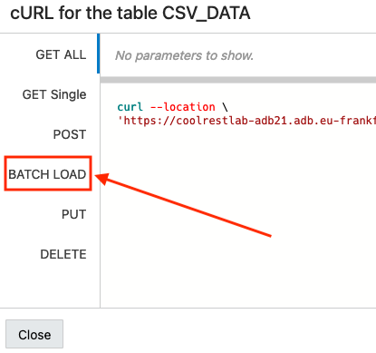

# Modern App Dev with Oracle REST Data Services - Loading Data and Creating Business Objects

## Introduction

In this lab you will use the SQL Developer Web browser-based tool, connect to your Database, create and REST enable a table.

Estimated Lab Time: 20 minutes

### Objectives

- Load a CSV of over 2 million rows into the CSV_DATA table
- Create PL/SQL business objects in the database

### Prerequisites

- The following lab requires an <a href="https://www.oracle.com/cloud/free/" target="\_blank">Oracle Cloud account</a>. You may use your own cloud account, a cloud account that you obtained through a trial, or a training account whose details were given to you by an Oracle instructor.
- This lab assumes you have successfully provisioned Oracle Autonomous database an connected to ADB with SQL Developer web.
- Completed the User Setups Lab
- Completed the Create and auto-REST enable a table lab

## **STEP 1**: Load data into the Database

1. Start by again using the cURL slide out on our REST enabled table.

    

2. We now have the cURL for the table CSV_DATA slideout. 

    

    Left click the **BATCH LOAD** side tab.

    

3. Next, click the copy icon  for the **BATCH LOAD** endpoint.

    

    It should be similar to the following:

```
curl --location --request POST \
--data-binary @<FILE_NAME> \
'https://coolrestlab-adb21.adb.eu-frankfurt-1.oraclecloudapps.com/ords/gary/csv_data/' 
```

4.  We are going to alter this a bit for our data load. First, we need to be in either the OCI Cloud Shell or a local computer with cURL installed. Every OCI account has Cloud Shell so we would encourage using that. To use the Cloud Shell, after logging into your OCI account, 

open cURL slideout

copy BATH LOAD command

append to the following format:


curl --write-out '%{time_total}' -X POST --data-binary "@2M.csv" -H "Content-Type:text/csv" --user gary:PASSWORD "https://coolrestlab-adb21.adb.eu-frankfurt-1.oraclecloudapps.com/ords/gary/csv_data/batchload?batchRows=5000&errorsMax=20"\

download csv file via PAR

run command in cloud console

bspendol@cloudshell:~ (eu-frankfurt-1)$ curl --write-out '%{time_total}' -X POST --data-binary "@2M.csv" -H "Content-Type:text/csv" --user gary:PASSWORD "https://coolrestlab-adb21.adb.eu-frankfurt-1.oraclecloudapps.com/ords/gary/csv_data/batchload?batchRows=5000&errorsMax=20"
#INFO Number of rows processed: 2,097,148
#INFO Number of rows in error: 0
#INFO Last row processed in final committed batch: 2,097,148
0 - SUCCESS: Load processed without errors

SQL WOrksheet

select count(*) from csv_data

add business logic procedure


create or replace procedure csv_biz_logic as

begin

    null;

end csv_biz_logic;

test business logic

exec csv_biz_logic;

## Conclusion

In this lab, you loaded over two million rows into a table with curl and REST as well as added a business logic procedure to the database.

## Acknowledgements

- **Author** - Jeff Smith, Distinguished Product Manager and Brian Spendolini, Trainee Product Manager
- **Last Updated By/Date** - February 2021
- **Workshop Expiry Date** - February 2022

