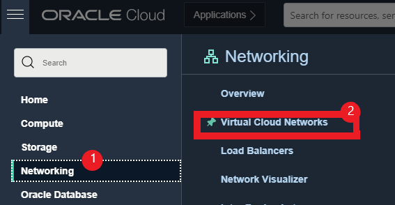
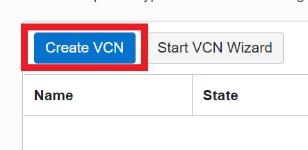
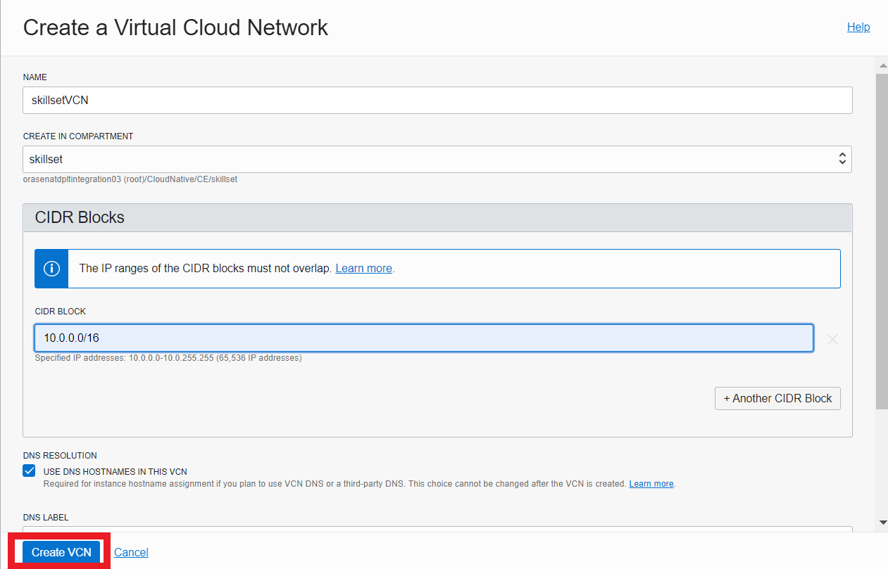
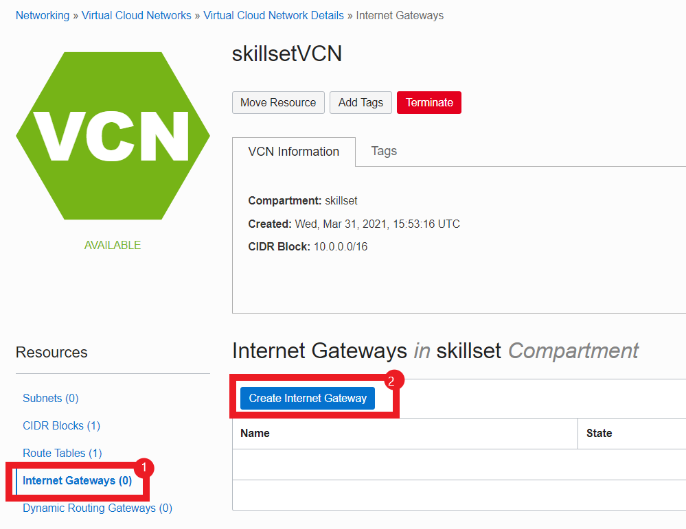
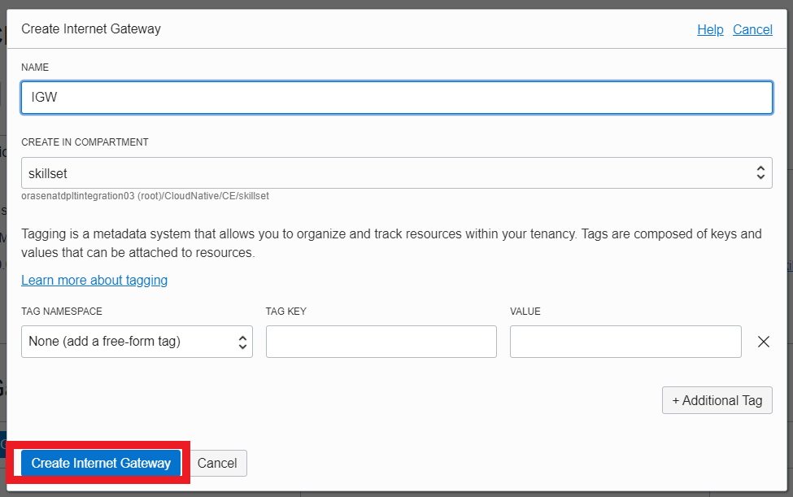
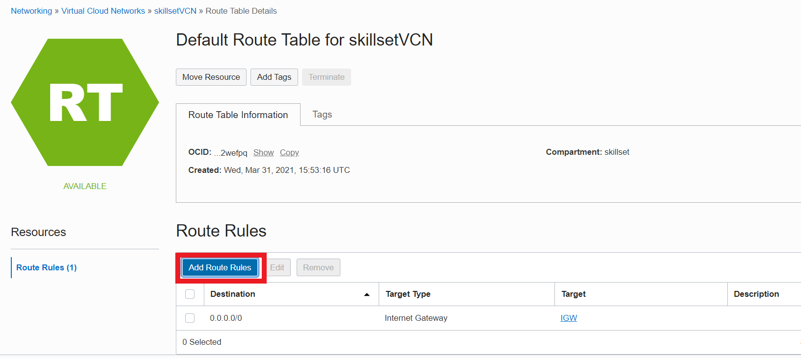
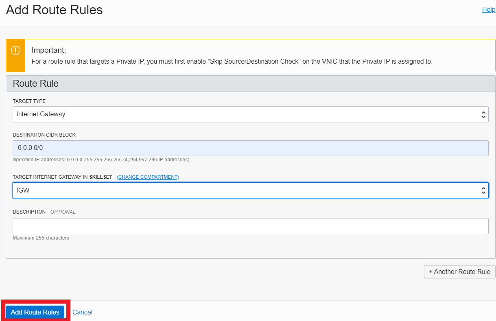
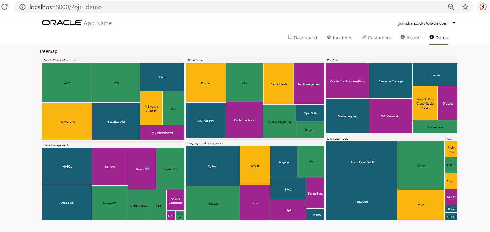

#  Build an OracleJET Web Application

## Introduction

In this lab you are going to go through a series of steps for provisioning a **Linux Instance** and deploying an **OracleJET** application. The application that is going to be developed in this lab uses **OracleJET** elements (both **JavaScript** and **HTML**) to create a basic application that shows an Oracle JET tree map structure based on a JSON file stored inside the project.

A **tree map** is **an interactive data visualization** in which hierarchical data is represented across two dimensions by the size and color of nested rectangular nodes.

Treemap Characteristics:

* Treemaps display 2 dimensions of hierarchical data using the size and color of the nodes.
* Emphasizes the leaf nodes in the hierarchy.
* To emphasize data of the entire hierarchy, consider using a sunburst instead.
* Treemaps are extremely effective in small form factors.

Estimated Lab Time: 50 minutes

### Objectives

* Provision a Virtual Cloud Network and needed resources.
* Provision a Linux Instance in OCI and install the needed packages.
* Build a basic OracleJET application that will make show a treemap structure based on a locally stored JSON file.
* Run and test the application.

### What Do You Need?
* An IDE, such as **Visual Studio Code**.
* An OCI Account.
* A tenancy where you have the resources available to provision a VCN and a Linux Instance.
* An existing compartment in which the resources created will reside.

### Prerequisites
* If you choose to develop the code on your local machine you need to have installed **NodeJS**, **OracleJET** and **Visual Studio Code** (or other code editor of your choice), as mentioned in **Lab 3 - Install and prepare prerequisites**.

## **Step 1:** Creating a Virtual Cloud Network

1. Please refer to this [link] (https://oracle-base.com/articles/vm/oracle-cloud-infrastructure-oci-create-a-compartment) if you want to create a new compartment. In this lab will be used an existing compartment called _skillset_.

2. In the top-left hamburger menu go to **Networking** -> **Virtual Cloud Networks**.



3. Select the option **Create VCN**.



4. Fill in the form with the following details as shown in the image: the name of the VCN, the compartment in which it will be created, as well as the CIDR block.



5. After the VCN is created, in the next steps all the required resources for a publicly accessible subnet will be created. If the VCN doesn’t already contain a **Default Route Table** and **Default Security List** it is necessary that you create them. To create a new **Internet Gateway**, navigate to the VCN then from the menu on the left side of the screen choose **Internet Gateways** -> **Create Internet Gateway** and fill in the form as shown in the image.





6. From the detail page of the VCN navigate to **Route Tables** -> **Your Default Route Table**.



7. Click on the **Add Route Rules** button and add a new rule for the Internet Gateway created previously.



8. From the detail page of the VCN navigate to **Security Lists** -> **Your Default Security List**. Select **Ingress Rules** and click on **Add Ingress Rules**. Add all the needed rules so that the lists of rules will be the same as the ones in the images. Here, port 8000 was added since this is the default port of an OracleJET application. This can be changed, if desired, considering the fact that it also needs to be changed in the OJET code as well.


  **Note**: For production instances never open up all traffic via 0.0.0.0/0 on a given port, in this lab this happens only to make the configuration easier.

9. The next step would be to create a public subnet in the VCN. Navigate to **your VCN** -> **Subnets** -> **Create Subnet** and fill in the form with the name of the subnet, the compartment and the CIDR block. For the subnet type select **Regional**, as recommended. Also, chose the Default Route Table and Default Security List created and updated previously.


## **Step 2:** Creating a Linux Instance in OCI

After the Virtual Cloud Network and its components are provisioned, the next step would be to create a Linux Instance to run the OracleJET code.

1. In the top-left hamburger menu navigate to **Compute** -> **Instances** and choose **Create Instance**. Chose a name for the instance, in this case it would be _ojet-server_, then select the desired compartment and availability domain.


2. Select the image and shape as shown in the picture.


3. Chose the VCN in which the instance will reside, as well as the subnet created previously. To simplify everything, chose to assign a Public IP to the instance, in order to make it accessible from the Internet.


4. Upload your public SSH key from your computer (.pub) so that you will be able to connect to the instance. If you need to generate an SSH key pair, follow instructions from **Lab 1: Generate SSH key**.


5. Click the **Create** button.

## **Step 3:** Connecting to the Instance and installing the needed packages

1. From the OCI Console, copy the public IP address of your new created instance and open a terminal, CMD or Windows PowerShell screen.

2. The next step for connecting to the instance is to run the following command.
```
<copy>ssh opc@<instance_public_ip></copy>
```
3.  After the connection is successful you need to run some commands in order to make the configuration complete
* Before beginning to install anything on the instance, the following command needs to be run.
```
<copy>sudo yum update</copy>
```
* Open the port needed for the application. In this case, 8000, the default port for an OracleJET application.
```
<copy>sudo firewall-cmd --permanent --zone=public --add-port=8000/tcp
sudo firewall-cmd --reload</copy>
```
* Install **curl** package.
```
<copy>sudo yum install curl</copy>
```
* Install **NodeJS** package.
```
<copy>sudo curl -sL https://rpm.nodesource.com/setup_14.x | sudo bash -
sudo yum install -y nodejs</copy>
```
* Install **OracleJET Cli** package.
```
<copy>sudo npm install -g @oracle/ojet-cli</copy>
```
4. [Optional] In order to check that the installation was successful, you can generate a simple OracleJET application and run it, using the following command.
```
<copy>ojet create <your_app_name> --template=navbar</copy>
```
5. [Optional] After the application is created, you can see a new folder named <your_app_name>. Navigate to that folder and run the application as follows:
```
<copy>cd <your_app_name>
ojet build
ojet serve</copy>
```
6. [Optional] Leave the terminal at the previous step open, with the ``ojet serve`` command running, open a browser on your local machine and navigate to **http://public\_ip\_address:8000** You should be able to see an empty OracleJET application.

7. [Optional] If there are going to be more people that would need to connect to the instance, their SSH keys need to be added on the instance as well. In order to do this, connect to the instance using SSH and run the following commands.
```
<copy>
ssh opc@<instance_public_ip>
cd ~/.ssh
nano authorized_keys
</copy>
```
Paste the key that needs to be added at the end of the file on the instance and save the file (**Ctrl+O** then **Ctrl+X**).

## **Step 4:** Create a simple OracleJET application with a Treemap

After the process of configuring the OCI instance, in order to be able to create and run OracleJET application, you will see an example of a basic project that will contain a treemap structure based on a JSON file stored in the project.

You can either create and run the following application on your local machine, then copy the code and run it on the Linux Instance, or you can connect with SSH to the instance and write the code directly on the instance in any editor of your choice.

  **Note**: If you choose to develop the code on your local machine you need to have installed **NodeJS**, **OracleJET** and **Visual Studio Code** (or other code editor of your choice), as mentioned in **Lab 3: Install and prepare prerequisites**.

According to [OracleJET Cookbook] (https://www.oracle.com/webfolder/technetwork/jet/jetCookbook.html?component=treemap&demo=default), a treemap is an interactive data visualization in which hierarchical data is represented across two dimensions by the size and color of nested rectangular nodes.

Follow this steps:

1. Open a terminal, PowerShell or CMD.
2. Go to a folder from your computer where you will create a new OracleJET project.
```
<copy>cd <folder_name></copy>
```
3. Create a new OracleJET project.
```
<copy>ojet create OJETTreemap_Demo --template=navbar</copy>
```
4. Navigate to the _OJETTreemap\_Demo_ folder.
```
<copy>cd OJETTreemap_Demo</copy>
```
5. Build your new project.
```
<copy>ojet build</copy>
```
6. Run your project to see the result in the interface.
```
<copy>ojet serve</copy>
```
After creating your new project, open **Visual Studio Code** editor and open the folder where your OracleJET project was created.

OracleJET applications are modular. A module of the application consists of business logic defined in a ***JavaScript*** file and a view defined in an ***HTML*** file. By convention, the name of the JavaScript file is the same as the name of the HTML file, for each module in the application. The default location for the JavaScript side of a module is **./src/js/viewModels**, while the matching HTML files are located in **./src/js/views**.

Whenever you run `ojet build` or `ojet serve` , the _src_ folder is copied to the _web_ folder. Below, you can see the _src_ folder and _web_ folder highlighted.

**Never** change the files in the _web_ folder. They will automatically be overwritten whenever you run `ojet build` or `ojet serve`. Only change the files in the _src_ folder.

There are other important files in the project:

* _index.html_ : The main index file of the application, though note that `ojet serve` will load it from _web_ folder, not the _src_ folder.
* _main.js_ : The main entry point into the file, hooked into the _index.html_ file via a script element. It provides the _requirejs.config_ section, as well as the require block.
* _appController.js_ : The location for global variables, which is loaded into the application in the require block in the _main.js_ file.

If you want to create a new module in the application, you will need to create:

* A JavaScript file that provides a define block, in **src/js/viewModels**.
* An HTML file that has the same name as the JavaScript file, in **src/js/views**.
* Specify a new entry for the menu if you want a different page for it in **appController.js** file (_navData_ variable).

In order to see a treemap in your application, use Visual Studio Code and follow these steps:

1. Create a new JavaScript file under **src/js/viewModels** named _demo.js_.
2. Copy this code to the file:

```
<copy>
define(['accUtils', 'knockout', 'ojs/ojbootstrap', 'ojs/ojattributegrouphandler',
    'text!data/sampletest.json',
    'ojs/ojarraytreedataprovider', 'ojs/ojarraydataprovider',
    'ojs/ojtreemap'],
    function (accUtils, ko, Bootstrap, attributeGroupHandler, jsonData, ArrayTreeDataProvider) {
        function DemoViewModel() {

            //TREEMAP CODE
            var colorHandler = new attributeGroupHandler.ColorAttributeGroupHandler();
            var nodes = JSON.parse(jsonData);
            this.treemapData = new ArrayTreeDataProvider(nodes, { keyAttributes: 'label', childrenAttribute: 'nodes' });
            this.getColor = function () {
                return colorHandler.getValue(Math.floor(Math.random() * 4));
            };
        }

        this.connected = () => {
            accUtils.announce('Demo page loaded.', 'assertive');
            document.title = "Demo";
        };

        this.disconnected = () => {
            // Implement if needed
        };

        this.transitionCompleted = () => {
            // Implement if needed
        };

        return DemoViewModel;
    }
);
</copy>
```
3. Create a new HTML file under **src/js/views** named _demo.html_.
4. Copy this code to the file:

```
<copy>
<html lang="en-us" style="height:100%;" dir="ltr">
<body>
    <div> Treemap </div>
    <div id="sampleDemo" class="demo-padding demo-container">
        <div id="componentDemoContent" style="width: 1px; min-width: 100%;">
            <div id="treemap-container">
                <oj-treemap id="treemap" animation-on-display="auto" animation-on-data-change="auto"
                    data="[[treemapData]]">
                    <template slot="nodeTemplate">
                        <oj-treemap-node label="[[$current.data.label]]" value="[[$current.data.noSkilledEng]]"
                            id="[[$current.data.id]]" color="[[getColor()]]">
                        </oj-treemap-node>
                    </template>
                </oj-treemap>

            </div>
        </div>
</body>
</html>
</copy>
```
The treemap will need to extract the data from a JSON file which has a specific structure so that it will display the data correctly.

5. Create a new folder under **/src/js** named _data_.
6. Create a new file named _sampletest.json_ and copy the content of _sample\_test.json_ file attached **here**.

At this moment you have the JSON, JavaScript and HTML file and if you want to see the result, you need to create a new entry in the menu.

7. Open the _appController.js_ file, search for the _navData_ variable and add your new entry.
```
<copy>
     let navData = [
        { path: '', redirect: 'dashboard' },
        { path: 'dashboard', detail: { label: 'Dashboard', iconClass: 'oj-ux-ico-bar-chart' } },
        { path: 'incidents', detail: { label: 'Incidents', iconClass: 'oj-ux-ico-fire' } },
        { path: 'customers', detail: { label: 'Customers', iconClass: 'oj-ux-ico-contact-group' } },
        { path: 'about', detail: { label: 'About', iconClass: 'oj-ux-ico-information-s' } },
        { path: 'demo', detail: { label: 'Demo', iconClass: 'oj-ux-ico-information-s' } }
      ];
</copy>
```

After all this changes are made, run again `ojet build` and `ojet serve` commands and you will see the final result in your browser.



8. If you created the project on your local machine, you need to upload it to the instance. In order to do this, you can use the following commands (run in from you laptop, not on the instance).

  **Note**: Before copying the code from your local machine to the instance, delete the _node\_modules_ folder.

  * On the instance:
  ```
  <copy>
  cd /home/opc
  mkdir SkillsetTracking
  </copy>
  ```
  * On your local machine:
  ```
  <copy>
  cd <project_folder_path>
  rm node_modules
  scp -r * opc@<your_instance_public_ip>:/home/opc/SkillsetTracking/
  </copy>
  ```

9. After you uploaded the code on the instance, you can run it with ``npm install``, ``ojet build`` and ``ojet serve``, but the application will stop running when you close the SSH connection, or you can add it as a **crontab job**.
```
<copy>
sudo crontab -e
</copy>
```
Press ***insert*** to enter the _edit_ mode and paste the following.
```
<copy>
@reboot cd /home/opc/SkillsetTracking/ && ojet serve
</copy>
```
Press ***Esc***, the ***:wq***. After the crontab is saved, reboot the istance.
```
<copy>
sudo reboot
</copy>
```

You should now be able to see the application running in browser at **http://your\_instance\_public\_ip:8000/** .

## Want to Learn More?

* [OracleJET](https://www.oracle.com/webfolder/technetwork/jet/index.html)
* [OracleJET Cookbook](https://www.oracle.com/webfolder/technetwork/jet/jetCookbook.html)
* [OracleJET Learning Path](https://www.oracle.com/webfolder/technetwork/jet/index.html?ojr=learn)

## Acknowledgements

**Authors/Contributors** - Gheorghe Teodora Sabina, Giurgiteanu Maria Alexandra
