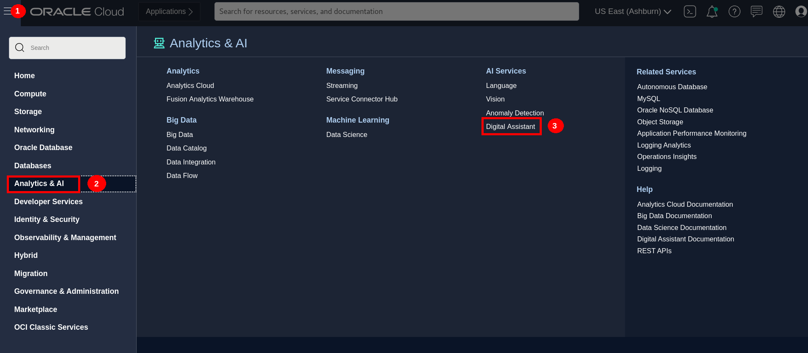
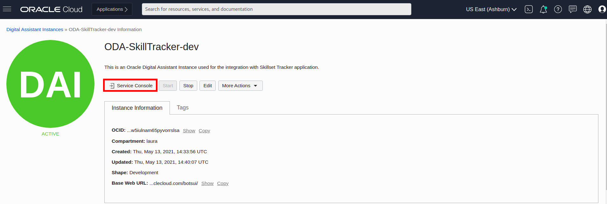
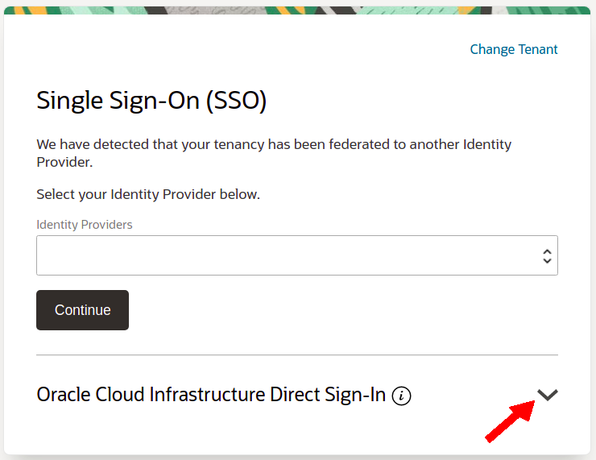
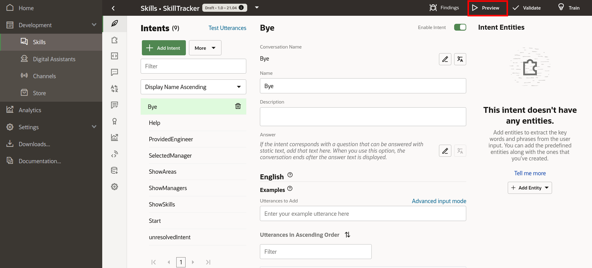
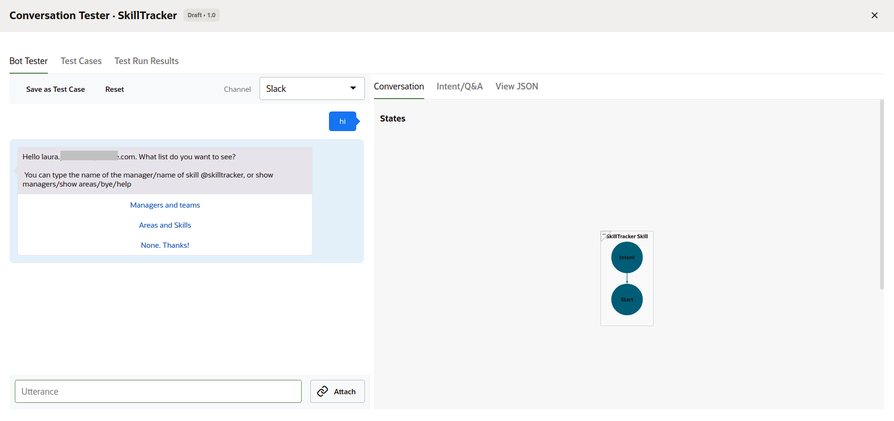

# Integrate your application with Oracle Digital Assistant

## Introduction

Talk about this lab

### Terminology

**Digital assistants** are virtual devices that help users accomplish tasks through natural language conversations, without having to seek out and wade through various apps and web sites. Each digital assistant contains a collection of specialized skills. When a user engages with the digital assistant, the digital assistant evaluates the user input and routes the conversation to and from the appropriate skills.

### Basic Concepts

- **Intents** - Categories of actions or tasks users expect your skill to perform for them.

- **Entities** - Variables that identify key pieces of information from user input that enable the skill to fulfill a task.

  Both intents and entities are common NLP (Natural Language Processing) concepts.
  NLP is the science of extracting the intention of text and relevant information from text.

- **Components** - Provide your skill with various functions so that it can respond to users. These can be generic functions like outputting text, or they can return information from a backend and perform custom logic.

- **Flows** - The definition for the skill-user interaction. The dialog flow describes how your skill responds and behaves according to user input.

- **Channels** - Digital assistants and skills aren’t apps that you download from an app marketplace, like iTunes. Instead, users access them through messaging platforms or through client messaging apps. Channels, which are platform-specific configurations, allow this access. A single digital assistant or skill can have several channels configured for it so that it can run on different services simultaneously. Example of Channels: Slack, Facebook Messenger

Estimated Lab Time: 1 hour

### Objectives

- Create an Oracle Digital Assistant Service Instance
- Access the Service Instance from the Infrastructure Console
- Import developed Skill in your Oracle Digital Assistant Service Instance
- Test the Skill with Conversation Tester
- Creating a Slack channel for Digital Assistant

### Prerequisites

- This lab assumes you have an Oracle Cloud account and compartment, user, groups and policies created into it and you are logged in your account. For an overview of compartments, users, groups, policies etc see this [link](https://docs.oracle.com/en/cloud/paas/digital-assistant/use-chatbot/users-groups-and-policies1.html#GUID-145DC7BA-2A9B-43BD-90A9-6FDBCAEBB7B0).

## **Step 1:** Create an Oracle Digital Assistant Service Instance

1. In the Infrastructure Console, click on Hamburger menu on the top left to open the navigation menu, select **Analytics & AI**, and select **Digital Assistant** (which appears under the AI Services category on the page).

2. From the **Compartments** panel, select a compartment.

3. Click **Create Instance**.

4. On the **Create Instance** page, fill in the following details:

   - **Compartment**.
   - **Name**. Enter a name that reflects usage of the instance.
   - **Description**. (Optional) Enter a description for your instance.
   - **Instance shape**. Select between the following shapes:
     - **Development**. This is a lightweight option that is geared toward development work.
     - **Production**. This option should be selected for production instances of Digital Assistant. In comparison with the Development shape, this option has higher rate limits and greater database capacity, which enables more Insights data to be collected.
   - **Tag Namespace**. (Optional)

   

5. Click **Create**.

After a few minutes, your instance will go from the status of **Creating** to **Active**, meaning that your instance is ready to use.

## **Step 2:** Access the Service Instance from the Infrastructure Console

Once you have provisioned an instance, you can access it from the **Infrastructure Console** by following these steps:

1. Select your Digital Assistance Instance.

2. Click **Service Console**. It will open a new page.

3. **Sign In** to the Console. Click on the arrow located on the right side of **Oracle Cloud Infrastructure Direct Sign-In** text and enter your **Username** and **Password**, then click on **Sign In**. A new window with your Digital Assistant will be opened.

## **Step 3:** Import Skill

1. In the Infrastructure Console, click on Hamburger menu on the top left to open the navigation menu, select **Development**, then select **Skills**.

2. Download the **Skill** by accessing this [link]().

3. In the up right corner of the Console, select **Import Skill**.

4. Select the downloaded file from your computer then click **Open**

## **Step 4:** Test the Skill with Conversation Tester

1. After you import the Skill, you will find it in the Console, under **Development** -> **Skills** cathegory. Now click on **SkillTracker**.

2. In the up right corner of the console, click on **Preview** to test the skill.

3. A window with **Conversation Tester** will pop-up. You can choose the **Channel** for the test and you will use the **Utterance** section to enter the text. For this test I used the **Slack** channel.

4. In the **Utterance** section type _hi_ or _hello_ or how do you want to say hello/wake up the bot, then enter.

5. You can make now 2 types of testing: Press the button testing method or User input + Press the button testing method.

**I. Press the button testing method**

After you wake up the bot, you can click on the buttons:

- **Managers and teams** to see a list of managers -> you can choose a manager -> a list of it's Employees will show up and you can choose one -> a list of Skill Areas will show up and you can choose one of them -> a list of Skills and Skill Values of the selected employee will show up and you can select one -> an output message will show up that will have 3 buttons:

  - **Go back to skills** where you can see a list of all the Skills and their Values from all the Skill Areas of the selected employee and you can select one -> then you can choose from the buttons:
    - **Go back to skills** to go back at the list with all the skills and their values
    - **Start again** to start from beginning
    - **Exit** to finish the test
  - **Start again** to start from beginning
  - **Exit** to finish the test

- **Areas and Skills** to see a list of Skill Areas and you can choose one -> a list of Skills for the selected Area will show up and you can choose one -> a list of Skill Values between 0-5 will show up and you can choose the desired minimum value for the selected Skill -> a list of Engineers and their level for the selected Skill will show up and you can choose one -> an output message will show up that will have 4 buttons:

  - **Change Skill level** to go back to the state when you choose the Skill Level for the selected skill
  - **Change Area** to go back to the state when you choose the Skill Area
  - **Start from the top** to start from beginning
  - **All good.Bye!** to finish the test

- **None. Thanks!** if you changed your mind and want to exit the test.

**II. User input + Press the button testing method**

After you wake up the bot, you can click on the buttons described above OR you can type in the **Utterance** field one of the following:

- the name of the desired Manager
- the name of the desired Skill Area
- the name of the desired Employee
- show managers
- show areas
- bye
- help
- restart

After you enter one of the above, you can then press the buttons depending on what do you want to see next.

## **Step 5:** Creating a Slack channel for Digital Assistant

## Want to Learn More?

## Acknowledgements

**Authors/Contributors** - Minoiu (Paraschiv) Laura Tatiana, Digori Gheorghe
