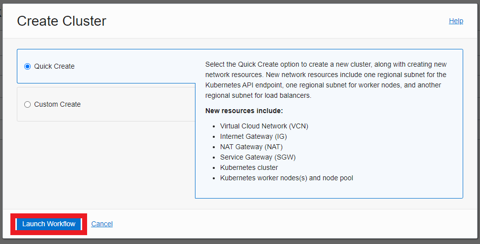
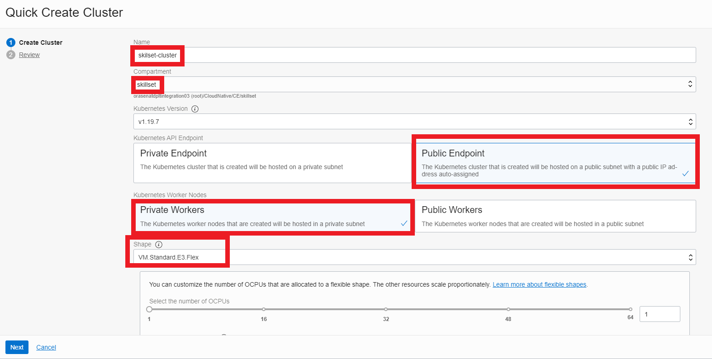

#  Deployment on OKE [Work in progress]

## Introduction

**Kubernetes** is an open-source container orchestration tool for automating the deployment and management of Cloud Native applications. 

The goal of this Lab is to guide you through the steps that need to be followed in order to create a Docker file and deploy the code from **Lab 6: Build NodeJS APIs to make calls to the database** in **Container Engine for Kubernetes (OKE)**.

Estimated Lab Time: 2 hours

### Objectives

* Create a Container Registry and a Kubernetes Cluster (OKE) in OCI.
* Deploy the application built in **Lab 6: Build NodeJS APIs to make calls to the database** in OKE.

### What Do You Need?
* A tenancy where you have the resources available to provision a Container Registry and a Kubernetes Cluster (OKE).
* OCI CLI installed and configured to connect to OCI.
* Docker installed and configured.
* Kubectl installed.

### Prerequisites

* **Lab 4: Autonomous JSON Database & SODA Collections**
* **Lab 6: Build NodeJS APIs to make calls to the database**.


## **Step 1:** Prepare the code for running
As a prerequisite for this step you should have available the code from **Lab 6: Build NodeJS APIs to make calls to the database**. In addition, you should download the Database Wallet as shown in **Lab 4: Autonomous JSON Database & SODA Collections**, extract the content of the archive and move the folder with the Wallet content into the project folder (in our example the Wallet folder is named _Wallet\_SkillsetDB_).

1. In the project folder create a new file _Dockerfile_ and paste the following content into it. This are all the commands needed to run in order to install the application on the container.

```
<copy>
FROM oraclelinux:7-slim
WORKDIR /opt/oracle
RUN yum install -y wget unzip libaio && \
    rm -rf /var/cache/yum
RUN wget https://download.oracle.com/otn_software/linux/instantclient/instantclient-basiclite-linuxx64.zip && \
    unzip instantclient-basiclite-linuxx64.zip && \
    rm -f instantclient-basiclite-linuxx64.zip && \
    cd instantclient* && \
    rm -f *jdbc* *occi* *mysql* *jar uidrvci genezi adrci && \
    echo /opt/oracle/instantclient* > /etc/ld.so.conf.d/oracle-instantclient.conf && \
    ldconfig

RUN  yum -y install oracle-nodejs-release-el7 && \
     yum-config-manager --disable ol7_developer_EPEL && \
     yum -y install nodejs && \
     rm -rf /var/cache/yum

RUN npm install
COPY . .

EXPOSE 8000
CMD [ "node", "app.js" ]
</copy>
```

2. In the project folder create a new folder _k8s-yaml_.

3. Navigate to _k8s-yaml_ and create a new file _oracledb-secret.sh_ and paste the following content into it. Make sure to replace the path with the correct one for the Wallet folder, if needed.

```
<copy>
#!/bin/bash
# Copyright 2021, Oracle Corporation and/or its affiliates. All rights reserved.

cat <<EOF | kubectl apply -f -
apiVersion: v1
kind: Secret
metadata:
  name: oracledb-secret
  namespace: default
type: Opaque
data:
  ojdbc.properties: `cat ../Wallet_SkillsetDB/ojdbc.properties | base64 -w0`
  tnsnames.ora: `cat ../Wallet_SkillsetDB/tnsnames.ora | base64 -w0`
  sqlnet.ora: `cat ../Wallet_SkillsetDB/sqlnet.ora | base64 -w0`
  cwallet.sso: `cat ../Wallet_SkillsetDB/cwallet.sso | base64 -w0`
  ewallet.p12: `cat ../Wallet_SkillsetDB/ewallet.p12 | base64 -w0`
  keystore.jks: `cat ../Wallet_SkillsetDB/keystore.jks | base64 -w0`
  truststore.jks: `cat ../Wallet_SkillsetDB/truststore.jks | base64 -w0`
EOF
</copy>
```

4. In the same folder, create a new file _skillset-deployment.yml_ and paste the following content. Note that you would need to update this file later in order to replace **your\_docker\_image** with your own Docker Image name.

**Note**: The **your\_oracle\_db\_user**, **your\_oracle\_db\_password**, and **your\_oracle\_db\_connection\_string** fields should be encoded for security reasons. In order to do this you can use the following command, or any other option you prefer: ``echo -n "your_text" | base64``

```
<copy>
apiVersion: apps/v1
kind: Deployment
metadata:
  name: skillset-deployment
  labels:
    app: skillset
spec:
  replicas: 2
  selector:
    matchLabels:
      app: skillset
  template:
    metadata:
      labels:
        app: skillset
    spec:
      containers:
      - name: skillset
        image: <your_docker_image>
        volumeMounts:
        - name: oracledb-secret
          mountPath: /opt/oracle/instantclient_21_1/network/admin
          readOnly: true

        ports:
        - containerPort: 8000
      imagePullSecrets:
        - name: ocir
      volumes:
      - name: oracledb-secret
        secret:
           defaultMode: 420
           secretName: oracledb-secret

---

apiVersion: v1
kind: Secret
metadata:
  name: oracle-db-connection
type: Opaque
data:
  NODE_ORACLEDB_USER: <your_oracle_db_user>
  NODE_ORACLEDB_PASSWORD: <your_oracle_db_password>
  NODE_ORACLEDB_CONNECTIONSTRING: <your_oracle_db_connection_string>

---
apiVersion: v1
kind: Service
metadata:
  name: skillset-service
spec:
  type: LoadBalancer
  ports:
  - port: 8000
    protocol: TCP
    targetPort: 8000
  selector:
    app: skillset          
</copy>
```

## **Step 2:** Create a Docker image and run a Docker container
1. Now that you have the _Dockerfile_ prepared, you can create a **Docker image** by running the following command. In this case we named it _skillset/ojetoraclelinux_. You can give it your own name, this is just an example.

**Note**: Before running the command, navigate to the directory containing the Docker file in the terminal.

```
<copy>
docker build -t skillset/ojetoraclelinux .
</copy>
```

2. The next step would be to create a Docker container and mount the connection string and Database Wallet. Use the following command to do this, and add the correct path to your Database Wallet folder.

**Note**: Before running the command, navigate to the project directory in the terminal.

```
<copy>
docker run --env-file=.env  -p 8000:8000 -v <path_to_the_wallet_folder>:/opt/oracle/instantclient_21_1/network/admin  -d skillset/ojetoraclelinux
</copy>
```

3. Test that the command executed successfully by opening a browser and accessing ``localhost:8000/api/skillset``. You should see the following message _...OJET Skillset APIs are running..._.

## **Step 3:** Push the image to OCI Container Registry (OCIR)
1. Open the OCI Console and from the top left hamburger menu navigate to **Developer Services** -> **Container Registry**.
2. Click **Create Repository** and fill in the form with the Compartment name (here _skillset_) and the Repository Name (here _skillset-repo_). For the Access field, choose Private.


3. From your project folder, run the following commands. Don't forget to replace the OCI region key and the tenancy name in the commands.

```
<copy>
docker tag skillset/ojetoraclelinux <oci_region_key>.ocir.io/<oci_tenancy_name>/skillset:latest
docker push <oci_region_key>.ocir.io/<oci_tenancy_name>/skillset:latest
</copy>
```

## **Step 4:** Migrate docker container app to OKE

1. Open the OCI Console and from the top left hamburger menu navigate to **Developer Services** -> **Kubernetes Clusters (OKE)** and click **Create Cluster**.
2. Choose _Quick Create_.



3. Pick a name, a compartment and a Public Endpoint and Private Workers. For the number of nodes, choose 2. Click _Next_ and _Submit_.



4. After the cluster has provisioned, navigate to its detail page and click on _Access Cluster_. Copy the command to access the cluster and run it.


5. To check if you accessed the correct cluster, run the following command and check that the resulted nodes are the same as the ones in the **OCI Console** -> **Kubernetes Clusters (OKE)** -> **Your cluster** -> **Node Pools** -> **Your node pool** -> **Nodes**.

```
<copy>
kubectl get nodes
</copy>
```


6. Navigate to the _k8s-yaml_ folder and create an OCIR secret using the following commands. Edit the commands with your own OCI region, username, password and email.

```
<copy>
kubectl create secret docker-registry ocir --docker-server=<oci_region_key>.ocir.io --docker-username='' --docker-password='' --docker-email=''
./oracledb-secret.sh
</copy>
```

7. Run the deployment yml file.

```
<copy>
kubectl apply -f skillset-deployment.yaml
</copy>
```

8. Check that your service was deployed successfully.
```
<copy>
kubectl get svc
</copy>
```

9. You should have a result similar to the following. You can test your deployment by accessing in the browser the following paths  ``EXTERNAL-IP:8000`` or ``EXTERNAL-IP:8000/api/skillset``.


## Want to Learn More?

* [Overview of Container Engine for Kubernetes](https://docs.oracle.com/en-us/iaas/Content/ContEng/Concepts/contengoverview.htm)
* [Overview of Registry](https://docs.oracle.com/en-us/iaas/Content/Registry/Concepts/registryoverview.htm)

## Acknowledgements

**Authors/Contributors** - Grama Emanuel, Giurgiteanu Maria Alexandra, Gheorghe Teodora Sabina
