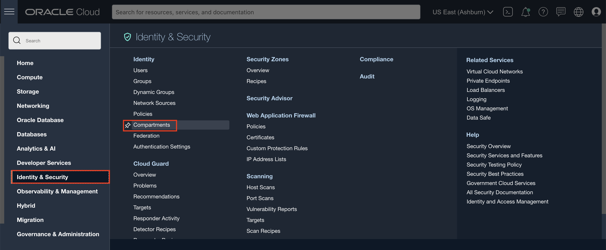
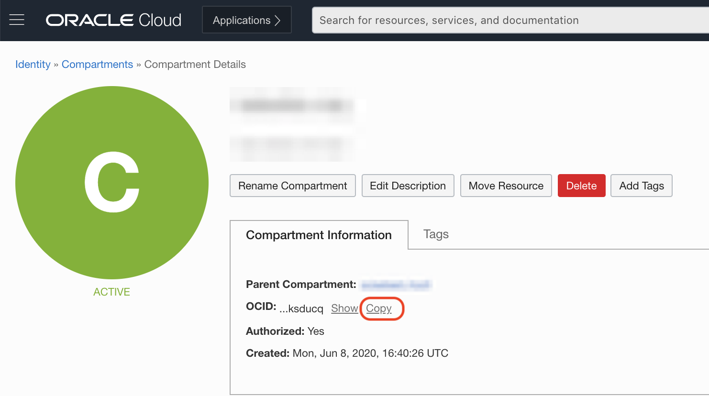

# Deploy Oracle SOA Suite on Oracle Kubernetes Engine (OKE)

## Introduction

In this lab, we will deploy the infrastructure with Terraform and deploy SOA Suite using Helm.

Estimated Lab Time: 45 minutes.

### Objectives

In this lab, you will provision:
* A Kubernetes cluster on Oracle Kubernetes Engine, with a database for the SOA Suite schemas and a file storage mountpath to store the SOA Suite domain files.
* Oracle SOA Suite in Kubernetes.

### Prerequisites

For this lab, you need:

* Git installed.
* OCI Command Line Interface (CLI) installed.
* Terraform installed. 
* Helm 3.x installed

## **STEP 1:** Get the Terraform Code

1. You'll find the code on Github.com at [https://github.com/oracle-quickstart/fixme](https://github.com/oracle-quickstart/fixme)

2. You can click **Code** and download as a zip file or using git command line, in a local folder of your choice, clone the repository with

    ```bash
    <copy>
    git clone https://github.com/oracle-quickstart/fixme
    </copy>
    ```

4. Get into the code folder

    ```bash
    <copy>
    cd <folder>
    </copy>
    ```

## **STEP 2:** Create a `terraform.tfvars` Config File

In order to run the deployment, you need to define a few settings in a file named `terraform.tfvars`

1. Create a file called `terraform.tfvars` from the template using:

    ```bash
    <copy>
    cp terraform.tfvars.template terraform.tfvars
    </copy>
    ```
    
2. Edit the `terraform.tfvars` file with the editor of your choice and provide the following values:

    (See the next step to find out where to find the required information)

    ```
    <copy>
    </copy>
    ```

## **STEP 3**: Gather Required Information

1. Get your `tenancy OCID`:

    - In the Oracle Cloud Console, **click** your **User** icon (top right corner), then **Tenancy**.

        

    - **Copy** the OCID of the tenancy and paste it in your environment file.

        

2. Get your `compartment OCID`:

    - In the Oracle Cloud Console, go to **Identity -> Compartments**.

        

    - Navigate to the compartment where you want to deploy the infrastructure.

    - **Copy** the OCID of the compartment.

        

<!-- 3. Get your `user OCID`:

    - In the Oracle Cloud Console, **click** your **User** icon (top right corner), then **click** your user name.
        
        

    - **Copy** the OCID of your user and paste it in your environment file.

        

4. Get the oci public key `fingerprint`:

    - In your user settings, under API Keys, you will find the `fingerprint` value. 
    
    Make sure this is the one matching the oci public key you created for terraform.

         -->


5. The rest of the variables can be left as defaults, although we strongly recommend you change the password values.

5. Save the `terraform.tfvars` file

## **STEP 4:** Run the Deployment

1. Initialize the project

    ```
    <copy>
    terraform init
    </copy>
    ```

2. Check the plan (optional)

    To determine what will happen, you can run the `plan` operation

    ```
    <copy>
    terraform plan
    </copy>
    ```

3. Apply the plan

   ```bash
    <copy>
    terraform apply
    </copy>
    ```

    You will be prompted to enter `yes` to apply the plan.

    ```
    Do you want to perform these actions?
    Terraform will perform the actions described above.
    Only 'yes' will be accepted to approve.

    Enter a value: yes
    ```

    It will take several minutes to provision the resources.


This provisions the Oracle Kubernetes Engine cluster, with:
    - A node pool of 3 nodes.
    - A database to store Oracle SOA Suite schemas.
    - A file storage file system and mount target to store the Oracle SOA Suite domain files.

It also installs the Kubernetes pre-requisites to installing Oracle SOA Suite. It installs:
    - The Oracle WebLogic Kubernetes Operator.
    - The Traefik ingress controller.
    


You may proceed to the next lab.

## Acknowledgements
 - **Author** - Subash Singh, Emmanuel Leroy, May 2021
 - **Last Updated By/Date** - Emmanuel Leroy, May 2021
