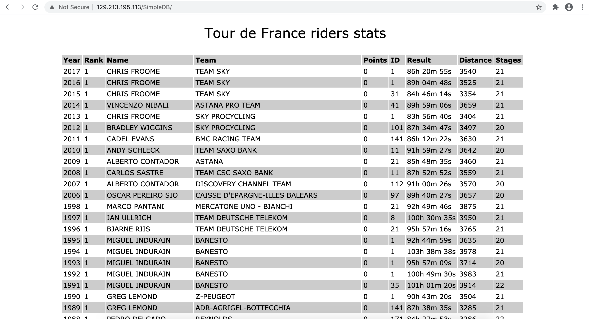

# Migrate the Tomcat Application

## Introduction

In this tutorial, we will migrate the application to the Tomcat cluster on Oracle Cloud Infrastructure (OCI).

Estimated Completion Time: 10 minutes.

### Objectives

In this tutorial, you will:
* Move the application over to the Tomcat cluster on OCI
* Configure the datasource used by the application to point to the Oracle Autonomous Database

### Prerequisites

For this tutorial, you need to have provisioned the Tomcat cluster on OCI.

## **STEP 1**: Move the Application WAR File to the Tomcat Cluster on Oracle Cloud Infrastructure

1. Gather the Tomcat servers IP addresses from the output of the Terraform.

2. Get into the Tomcat Docker container:

    If you were previously inside the database container, exit with:

    ```
    <copy>
    exit
    </copy>
    ```

    Then get in the Tomcat container with:

    ```
    <copy>
    docker exec -it tomcat-to-oci_tomcat_1 /bin/bash
    </copy>
    ```

2. Copy the application WAR file over to each Tomcat server:

    ```bash
    # Set the PUBLIC IP of the Tomcat server
    export BASTION_IP=<Bastion_p[ublic_IP>
    export TOMCAT_IP=<Tomcat Private IP>
    ```

    Then run:

    ```bash
    <copy>
    cd /usr/local/tomcat/webapps/
    scp -o ProxyCommand="ssh -W %h:%p opc@${BASTION_IP}" SimpleDB.war opc@${TOMCAT_IP}:~/
    </copy>
    ```

3. SSH to the Tomcat server:

    ```bash
    <copy>
    ssh -o ProxyCommand="ssh -W %h:%p opc@${BASTION_IP}" opc@${TOMCAT_IP}
    </copy>
    ```

4. Copy the file to the deployment folder:

    ```bash
    <copy>
    sudo cp SimpleDB.war /var/lib/tomcat/webapps/
    </copy>
    ```

5. Check the deployment happened as expected:

    ```bash
    <copy>
    cd /var/lib/tomcat/webapps/
    ls -lh
    </copy>
    ```

    If the war file was deployed, you should find a folder called `SimpleDB` in this folder.

    It may take several seconds to deploy, so if you don't see the folder at first, try the `ls -lh` command again.

## **STEP 2:** Configure the Datasource

1. Open the `server.xml` file in /etc/tomcat/ for editing:

    ```bash
    <copy>
    sudo nano /etc/tomcat/server.xml
    </copy>
    ```

2. Add the following section within the existing `<GlobalNamingResources>` section:

    ```xml
    <copy>
     <Resource name="jdbc/JDBCConnectionDS"
          global="jdbc/JDBCConnectionDS"
          auth="Container"
          type="javax.sql.DataSource"
          username="riders"
          password="Nge29v2rv#1YtSIS#"
          driverClassName="oracle.jdbc.OracleDriver"
          description="RIDERS's database"
          url="jdbc:oracle:thin:@atpdb_high?TNS_ADMIN=/etc/tomcat/wallet"
          maxActive="15"
          maxIdle="3"/>
    </copy>
    ```

    Make sure to replace the `atpdb` name with your information if you didn't use the name `atp_db`.

    You should end up with something like:

    ```xml
    <GlobalNamingResources>
    <!-- Editable user database that can also be used by
         UserDatabaseRealm to authenticate users
    -->
        <Resource name="UserDatabase" auth="Container"
              type="org.apache.catalina.UserDatabase"
              description="User database that can be updated and saved"
              factory="org.apache.catalina.users.MemoryUserDatabaseFactory"
              pathname="conf/tomcat-users.xml" />
        <Resource name="jdbc/JDBCConnectionDS"
            global="jdbc/JDBCConnectionDS"
            auth="Container"
            type="javax.sql.DataSource"
            username="riders"
            password="Nge29v2rv#1YtSIS#"
            driverClassName="oracle.jdbc.OracleDriver"
            description="RIDERS's database"
            url="jdbc:oracle:thin:@atpdb_high?TNS_ADMIN=/etc/tomcat/wallet"
            maxActive="15"
            maxIdle="3"/>
    </GlobalNamingResources>
    ```

3. Type `CTRL+x`, then `y` to save the file.

4. Open the `context.xml` file for editing:

    ```bash
    <copy>
    sudo nano /etc/tomcat/context.xml
    </copy>
    ```

5. Add the following section inside the `<Context />` tag:

    ```xml
    <copy>
      <ResourceLink name="jdbc/JDBCConnectionDS"
        global="jdbc/JDBCConnectionDS"
        type="javax.sql.DataSource"/>
    </copy>
    ```

    You should end up with something like:

    ```xml
    <Context>
    <ResourceLink name="jdbc/JDBCConnectionDS"
        global="jdbc/JDBCConnectionDS"
        type="javax.sql.DataSource"/>
        <!-- Default set of monitored resources -->
        <WatchedResource>WEB-INF/web.xml</WatchedResource>
        <!-- Uncomment this to disable session persistence across Tomcat restarts -->
        <!--
        <Manager pathname="" />
        -->
        <!-- Uncomment this to enable Comet connection tacking (provides events
            on session expiration as well as webapp lifecycle) -->
        <!--
        <Valve className="org.apache.catalina.valves.CometConnectionManagerValve" />
        -->

    </Context>
    ```

6. Type `CTRL+x`, then `y` to save the file.

7. Restart Tomcat:

    ```bash
    <copy>
    sudo systemctl restart tomcat
    </copy>
    ```

8. Check that the application is correctly deployed and served by the individual server by tunneling through the bastion with:

    ```bash
    <copy>
    export PORT=8080
    ssh -M -S socket -fnNT -L ${PORT}:${TOMCAT_IP}:${PORT} opc@${BASTION_IP} cat -
    </copy>
    ```

9. You can check the deployment at `http://localhost:8080/SimpleDB`

    > **Note:** The first time the application runs, the query may take up to 30 seconds.


## **STEP 3:** Repeat for each Tomcat Server

1. Repeat the steps in the "Move the Application WAR File to the Tomcat Cluster on Oracle Cloud Infrastructure" section and "Configure the Datasource" section for each server on the Tomcat cluster if you had more than one.

## **STEP 4:** Check the Application Served Via the Load Balancer

1. Get the load balancer public IP from the Terraform output.

2. In your browser, go to http://*LOAD_BALANCER_IP*/SimpleDB/.

3. Check that you see the application being served.

    


## Acknowledgements
 - **Author** - Subash Singh, Emmanuel Leroy, October 2020
 - **Last Updated By/Date** - Emmanuel Leroy, October 2020
