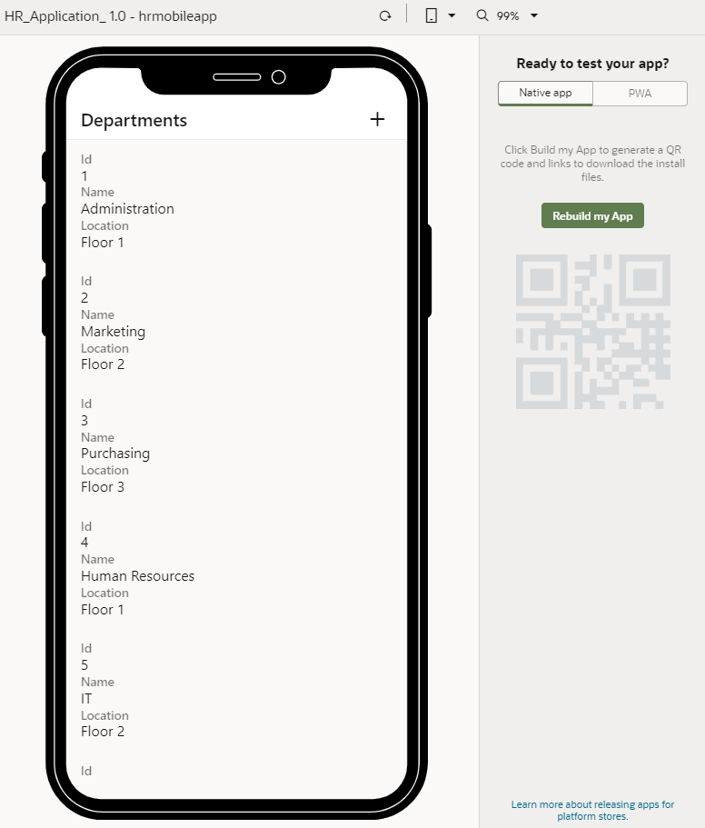
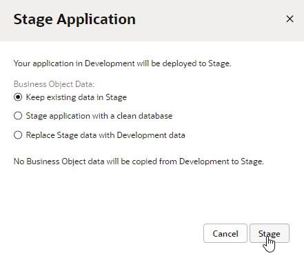
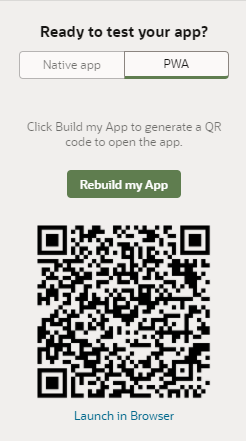

# Build a Mobile Application for Installation on Android and iOS Devices

## Introduction

This lab shows you how to build a mobile application for installation on Android and iOS devices. 

### Estimated Lab Time:  10 minutes

### Background

After you define build configurations that define deployment information for the Android and iOS platforms, you are ready to build the mobile application and stage it for testing. Visual Builder generates a QR code and a link to an installation file for each platform after the build process is complete. Because you've enabled the mobile app as a Progressive Web App (PWA), a QR code is generated for the PWA as well. Users can scan the QR code or download the installation file to install the mobile application.

In this lab, you'll build a mobile application to generate QR codes and installation files for both the Android and iOS platforms. The steps to build a mobile application for installation on any one platform (either Android or iOS) are identical, except that a QR code and an installation file are only generated for the specified platform.

## **STEP 1**: Build a Mobile Application

After you create the build configuration for both Android and iOS, you can generate QR codes and build the installation files (APK for an Android device and IPA for an iOS device) to install the mobile application on those devices.   

1.  Click **Preview**  to run the app on a new tab in the browser.

    

2.  Click **Build my App**.
3.  In the Stage Application dialog box, select **Populate Stage with Development data** and click **Stage**.

    

    When the build is complete, you'll see a **Native App** tab with a QR code and **Download** link to install the mobile app as a native app. You'll also see a **PWA** tab from where you can install the mobile app as a PWA.  

    

4. If you have access to an Android or iOS device, download the installation file for each platform:
    -   Select **iOS** in the drop-down list, then scan the QR code to download the installation file onto an iOS device, or use the **Download** link to download the IPA file to your file system.
    -   Select **Android** in the drop-down list, then scan the QR code to download the installation file onto an Android device, or use the **Download** link to download the APK file to your file system.

5. Click the **PWA** tab and click the **Launch in Browser** link to open the app on your device.

  

6.  When prompted, click **Add** in the Add to Home Screen dialog box, then **Install** in the Install app? dialog box.

   The hrmobileapp opens as an app on your device.
   

7. Try out the app and test its functionality. When you are done, click **X** to close the app.

   You can always click  on your device's home screen to open the app again.

## Acknowledgements
**Author** - Sheryl Manoharan

**Last Updated** - March 2021
