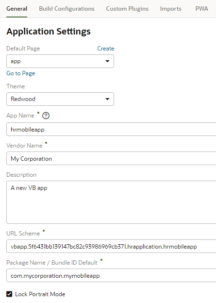
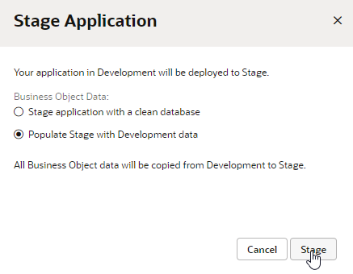
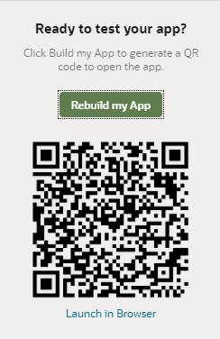
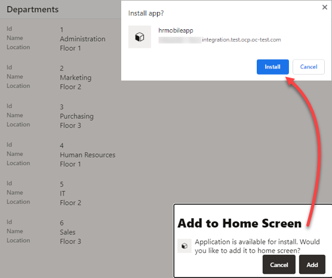

# Configure a Mobile Application to Run as a PWA

## Introduction

This lab shows how to configure a mobile application's settings and enable the app to run as a Progressive Web App (PWA).

### Estimated Lab Time:  5 minutes

### Background

PWAs are designed to be capable, reliable, and installable to provide a user experience that feels like a platform-specific application. When you enable a mobile app as a PWA in Visual Builder, it can be installed directly from the browser on an Android or iOS device. Much like a native mobile app, it opens in a standalone window (instead of a browser tab) and users interact with it pretty much like a native app. You can also make progressive enhancements as new browser capabilities become available. Most importantly for you as a developer, you won't have to publish your app to an app store.

You can also install PWAs on laptops (for example, as a Chrome app). This means that unlike native mobile apps that are limited to Android and iOS devices, PWAs can also run on Windows, Mac, and other operating systems.

In this lab, you'll configure the HR mobile application to run as a PWA. You'll also review the app's settings to make sure the values are what you want your user to see. You'll use these settings to launch your PWA from a browser.

## **STEP 1**: Configure Application Settings

1.  In the Navigator, click the **Mobile Applications **  tab.
2.  Click the **hrmobileapp** node and click the **Settings** tab.
3.  In the **General** tab, review the Application Settings that are displayed to users:

    -   **App Name**: Accept the default value or specify another name to be displayed when the app is installed on a mobile device.
    -   **URL Scheme:** Accept the default value for the app's URL scheme.
    -   **Package name / Bundle ID Default:** Accept the default value for the app's package name. To avoid naming conflicts, Android uses reverse package names, such as `com.company.application`. For more information, refer to the Android Developers website.
    -   **Lock Portrait Mode:** Accept the default value to display the app in Portrait mode on the mobile device. Deselecting the check box renders the mobile application in both Landscape and Portrait mode.

    

## **STEP 2**: Enable PWA Support

1.  Click the **PWA** tab, then click **Enable Progressive Web App (PWA)**.

    

2.  Review the Manifest Settings, which are included with the PWA's web manifest, a JSON file that contains information about your application:

    -   **Application Name:** Accept the default value or specify another name to be displayed when you are prompted to install the application.  

    -   **Short Name:** Accept the default value. When both the application name and short name are specified, the short name is used on the Home screen, launcher, and other places where space is limited.

    -   **Theme Color**: Accept the default background and theme colors.

    The Resources section is where you'd customize your app's splash screen and icons. The Advanced File Caching section lists the flows and pages to be cached on the user’s device when the PWA is first launched. For demonstration purposes, we'll accept the default settings in both sections.

## **STEP 3**: Run the Mobile App as a PWA

1. Click **Preview** .

  When the application opens in another browser tab, notice that it's now possible for you to generate a QR code for the app, even though you haven't defined build configurations. That's because PWAs don't require build configurations like native mobile apps.

  

3. Click **Build my App**.

4. In the Stage Application dialog box, select **Populate Stage with Development data** and click **Stage**.

    

    When the build is complete, you can scan the QR code that's generated to install the mobile app as a PWA on a device. Alternatively, you can launch it directly from your laptop or device browser. For demonstration purposes, this is the easiest option, so that's what we'll do.   

5. Click the **Launch in Browser** link to open the app on your laptop or device browser.

  

6.  When prompted, click **Add** in the Add to Home Screen dialog box, then **Install** in the Install app? dialog box.

  

   The hrmobileapp opens as an app on your device.

   

7. Try out the app and test its functionality. When you are done, click **X** to close the app. Remember to also close the preview tab or window.

   You can always click  on your device's home screen or desktop to open the app again.

If you only want to try your mobile app as a PWA, skip to Lab 9 to see how to publish the live version of your app. But if you want to build your app for installation on Android and iOS, you'll need to create build configurations, as described in Labs 6, 7, and 8.

## Acknowledgements
**Author** - Sheryl Manoharan

**Last Updated** - April 2021
