# Create Pages for Business Objects
## Introduction

This lab shows you how to create web pages to display the business objects you created in the previous lab.

Estimated Lab Time:  15 minutes

### Background

Now that you've created the Location, Department, and Employee business objects, we'll see how to create web pages to display data from these business objects. So far, you've only imported data for the Location object. You'll add data for the Department and Employee business objects in later labs, but set up Department and Employee pages to display that data in this lab.

You'll create one page to display departments and another to display employees, both in table components. You'll also add a **Create** button to each page to let your users create a new department or a new employee (in other words, create a new instance of the business object in the database).

## Task 1: Use the main-start Page to Display Departments

Let's create a table to display your departments on the main-start page. The Table component is useful when you want to show lots of data in columns.

1.  Click the **Web Applications**  tab in the Navigator.
2.  Expand the **hrwebapp** and **main** nodes if necessary, then click **main-start**, the page that was automatically created as the default home page for your web application. (You can also open the page by clicking the main-start tab just below the header.) You're viewing the Page Designer, with the Components palette visible.

    You may want to click the **Web Applications** tab to close the Navigator pane and expand your work area. You can also widen your browser window.

3.  Let's give this main-start page a title. From the Components palette, drag the **Heading** component under Common and drop it onto the page.

    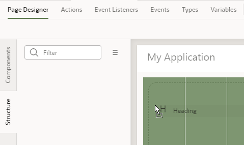

4.  In the Heading's Properties pane, enter `Departments` in the **Text** field.

    

5.  In the Components palette, scroll down to **Collection** and drag a **Table** component onto the page below the heading. You'll use this table to display three columns that map to the department business object's id, name, and location fields.

    

6.  Select the table if necessary, then click **Add Data** in the Properties pane to open the Add Data Quick Start.  

    

    Quick Starts walk you through complex processes and help build the basics of your application quickly; in this task, we'll use the Add Data Quick Start to connect your table to the Department business object's data. The Quick Start wizard will prompt you to select your data source, select the fields from the business object that you want to show in your table, and filter data (which we won't do here).

7.  On the Locate Data page of the Quick Start, select **Department** under Business Objects, then click **Next**.  

    

8.  On the Bind Data page, under **item\[i\]**, select the **id** and **name** check boxes (in that order). These two fields will show as columns in your Departments table.

    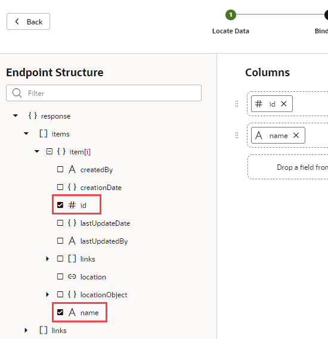

9.  Expand the **locationObject** and **items** nodes (**item\[i\]** is expanded automatically) and select **name** to enable the location name to appear as another column in the table. Because we created a reference from the Department business object to the Location business object in the previous lab, the location's name field is now available to us through the locationObject accessor, which lets us traverse relationships between the two objects. Click **Next**.

    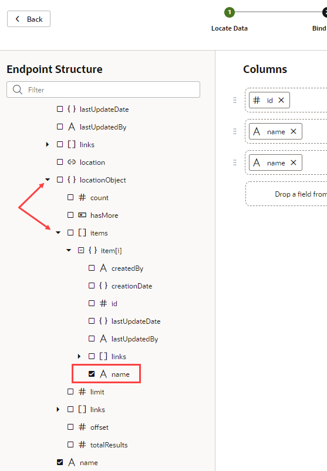

10.  On the Define Query page, click **Finish**.  

    A Departments table with three empty columns is displayed on the main-start page. Notice that the second Name column (which maps to the location name field) shows simply as Name because that's what we set for the Display Field when we created the Location reference.

    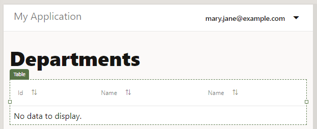

11.  To make the location name column descriptive, click the **Data** tab in the Properties pane. Under **Table Columns**, click the  **Column Detail** arrow next to **Name (locationObject)**. You won't see the icon until you hover the mouse next to the field.

    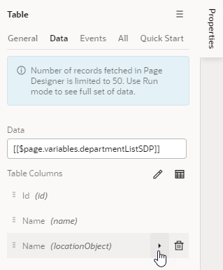

12.  In the **Columns, Header Text** field, change `Name` to `Location`, then click  **Table** to return to the main **Data** tab.  

    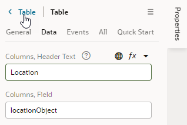

    The main-start page now has a table with three columns: Id, Name, and Location. You won't see any information in your table because we are yet to import data for the Department business object.

## Task 2: Add a Create Page for the Department Business Object

Now that we have a way to show departments, we'll add a Create page that lets users create new departments. With the help of the Add Create Page Quick Start, we'll connect to our data source, the Department business object, and select the fields that we want the user to provide values for.

1.  With the Departments table on the main-start page selected, click the **Quick Start** tab, then click **Add Create Page**.
2.  On the Select Endpoint page, select **Department** under Business Objects (if necessary) and click **Next**.
3.  On the Page Detail page, under Endpoint Structure, select the **location** check box (the **name** check box is already selected, because name is a required field). Name and Location are the only fields the user needs to specify to create a department.

    

4.  Leave the other values set to their defaults. Click **Finish**.

    A **Create Department** button appears in a Toolbar component above the table on the main-start page. (You might need to click next to the button to see the Toolbar component.) Click the **Web Applications** tab to see the main-create-department page created in the pages list under **main**.

    

5.  Let's now quickly test whether we can create departments. Click the **main-create-department** page in the Navigator to open it in the Page Designer.

    The page has a form for you to enter the fields you specified. It also has two buttons: Cancel and Save.

6.  In the Page Designer toolbar, click **Live** to make the form active. (Click **Properties** if you need to make room for the form.)

    To indicate that you are in Live view, the **Live** button now has a green background, and a green line appears around the page.

7.  Enter `Administration` in the **Name** field, and select **Floor 1** from the **Location** drop-down list.

    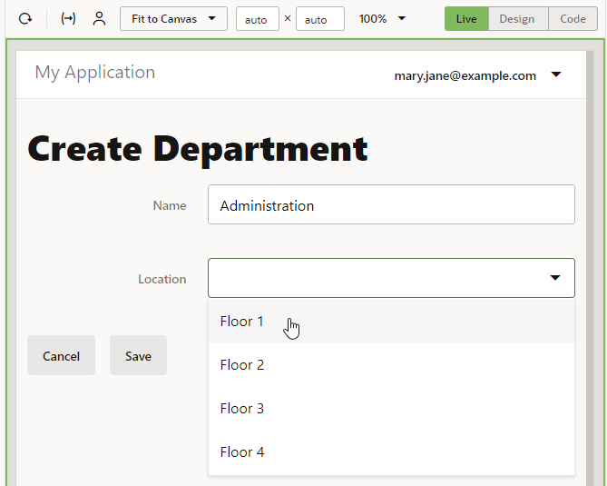

    Click **Save**. A message appears briefly and you are taken to the application's Diagram tab, which visually represents the application's **main** page flow.

    

    By convention, a page name has its flow name as a prefix. This simple application uses only the **main** flow. More complex applications can have more than one flow.

8.  Open the **main-start** page (you can either click the main-start tab just below the header or click the page in the Web Apps pane), then click **Reload page**  to see the table row you created.

    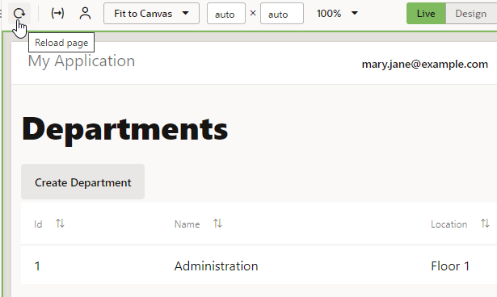

9.  Click **Design** to return to Design view.

## Task 3: Add a Page to Display Employees

We'll now create a page to display employees, similar to the one you created to show departments.

1.  In the Web Apps tree, under **hrwebapp**, click **\+** (Create Root Page) next to the main node and select **Create Page**.

    

2.  In the Create Page dialog box, enter `employees` in the **Page ID** field after `main-` and click **Create**. The main-employees page opens in the Page Designer.

    

3.  Drag the **Heading** component from the Components palette and drop it onto the page.
4.  Click the **Properties** tab (if necessary), then in the heading's Properties pane, enter `Employees` in the **Text** field.
5.  In the Components palette, scroll down to Collection and drag a **Table** component onto the page.
6.  Click **Add Data**.
7.  On the Locate Data page, select **Employee** under Business Objects and click **Next**.
8.  On the Bind Data page, select the **id**, **name**, **hireDate**, and **email** check boxes under **item\[i\]**. The columns appear in the order selected; if you want to change the order, drag a **Handle**  to reorder the columns as desired.

    

9.  Expand the **departmentObject** and **items** nodes (**item\[i\]** is expanded automatically) and select **name**, then click **Next**.

    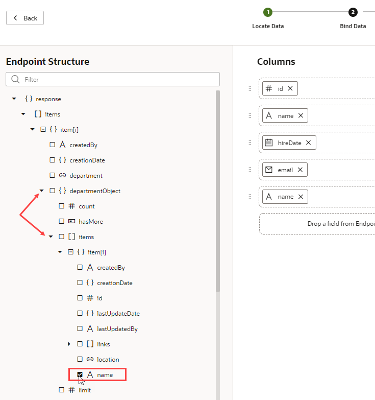

10.  On the Define Query page, click **Finish**.

    An empty Employees table is displayed.

11.  To make the second Name column (which refers to the Department name field) descriptive, click the **Data** tab in the table's Properties pane. Under **Table Columns**, click the  **Column Detail** arrow next to **Name (departmentObject)**.

    

12.  In **Columns, Header Text** field, change `Name` to `Department`, then click  **Table** to return to the main **Data** tab.

    The main-employees page now has a table with five columns: Id, Name, Hire Date, Email, and Department. You won't see any information in the table until we import data for the Employee business object in a later lab.

    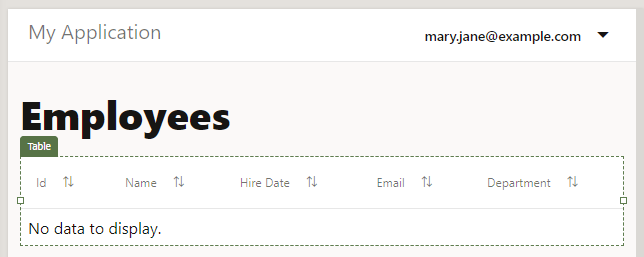

## Task 4: Add a Create Page for the Employee Business Object
Add a Create page that lets your users create new employees.

1.  Click the **Quick Start** tab, then click **Add Create Page**.
2.  On the Select Endpoint page, select **Employee** under Business Objects (if necessary) and click **Next**.
3.  On the Page Detail page, select the **hireDate**, **email**, and **department** check boxes, in that order (**name** is already selected, because it's a required field).
4.  Leave the **Button label** field and other values to their default values. Click **Finish**.

    

    A **Create Employee** button appears above the table, and the main-create-employee page appears in the pages list.

5.  In the pages list, click the **main-create-employee** page to open it in the Page Designer.
6.  Click within the form on the page but outside of a component (that is, in the **Form Layout** component on the page). In the **General** tab of the Form Layout's properties, set the **Max Columns** value to **2**.

    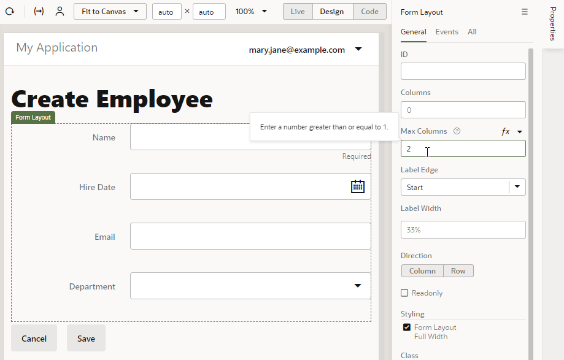

    The fields now appear in two columns. If you don't see the change, click **Properties** to hide the Properties pane and expand your view.

7.  Click **Live** to make the form active. Enter `Leslie Smith` in the **Name** field. Select today's date from the **Hire Date** calendar, and enter `lsmith@example.com` in the **Email** field. Select `Administration` (the only choice) from the **Department** list. (You can use other data if you wish, except for the department, because you have only one department.) Click **Save**.  

    Visual Builder briefly displays a message and then places you in the main page flow of your application.

    

8.  Return to the main-employees page. (You can double-click the page tile in the page flow, in addition to using other navigation mechanisms.) If necessary, click **Reload page**  to display the row you created.

9.  Click **Code** (next to **Design** in the Page Designer toolbar) to view the HTML code for the main-employees page. You can see the code for the heading, the toolbar, and the table within `div` elements. You could edit this code to create a customized user interface. The components and classes all begin with `oj-`, indicating that they are Oracle JavaScript Extension Toolkit (JET) components.  

    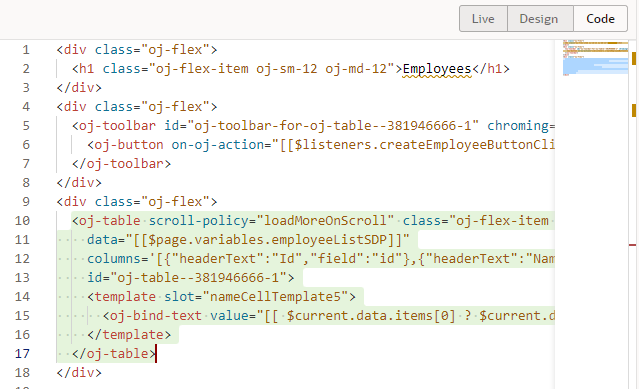

10.  Click **Design** to return to the main-employees page, then click **Structure** to view the page's component structure.

    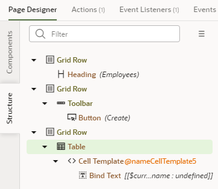

11.  Click **Structure** again to close the structure view.

## Task 5: Change the Name of the main-start Page

It makes sense at this point to change the name of the main-start page to main-departments, to match the name of the main-employees page.

1.  In the Web Apps pane of the Navigator, right-click the **main-start** page and select **Rename**.

    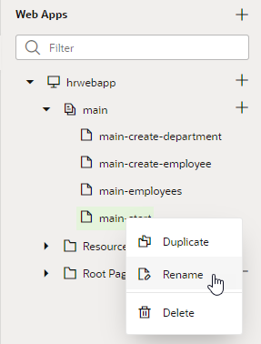

2.  In the Rename dialog box, replace `start` with `departments` in the **ID** field and click **Rename**.

3. Click the **main** node. The page flow Diagram shows the now renamed page.

    

3.  Double-click **main-departments** to go to that page again.
4.  Although you have changed its name, the main-departments page will continue to be the page where your application starts when you run it. To find out why, click **Source View**  in the Navigator and expand the **webApps**, **hrwebapp**, **flows**, and **main** nodes. Then click **main-flow.json**.

    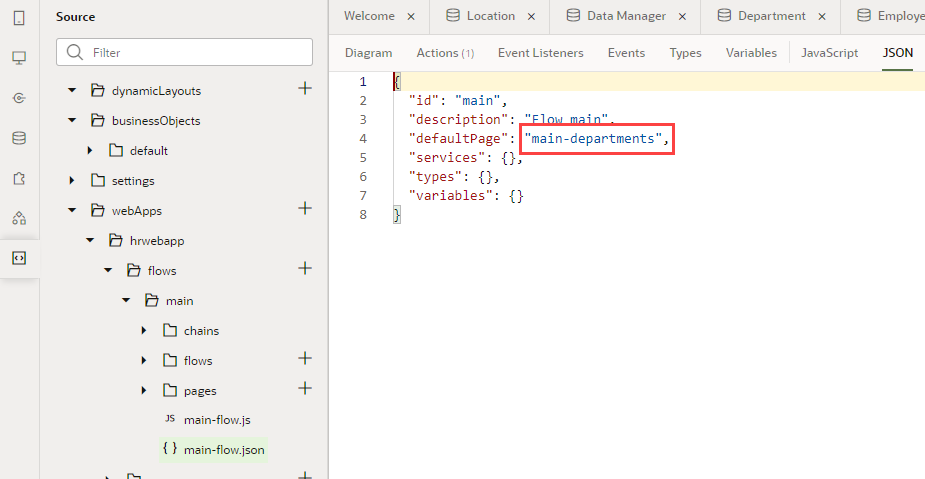

    You can see that the `defaultPage` property has been set to the value `main-departments`, making it the starting page for the web application flow. (If we'd looked before, it would have been set to `main-start`.)

You may now [proceed to the next lab](#next).

## Acknowledgements
* **Author** - Sheryl Manoharan, Visual Builder User Assistance
* **Last Updated By** - November 2021
