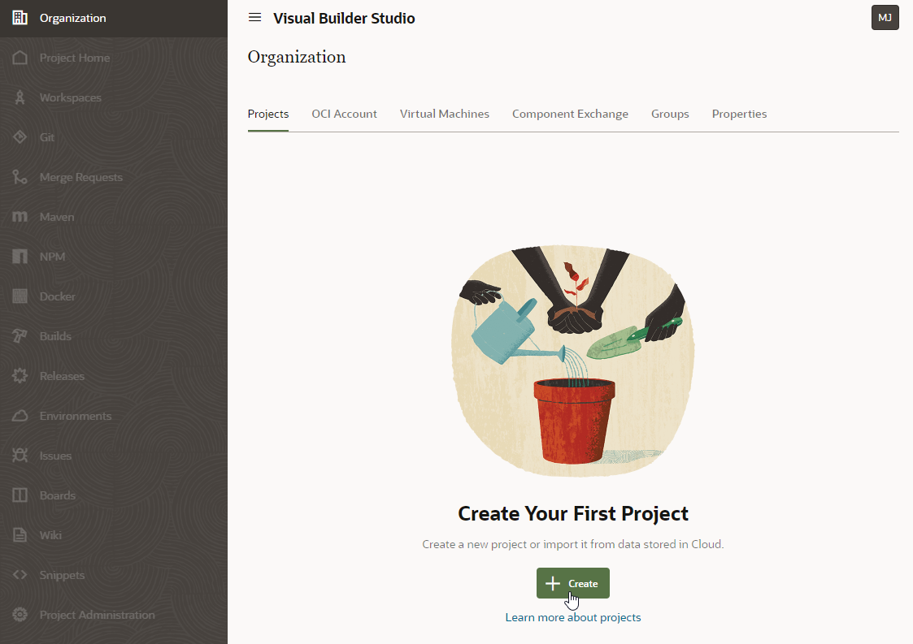
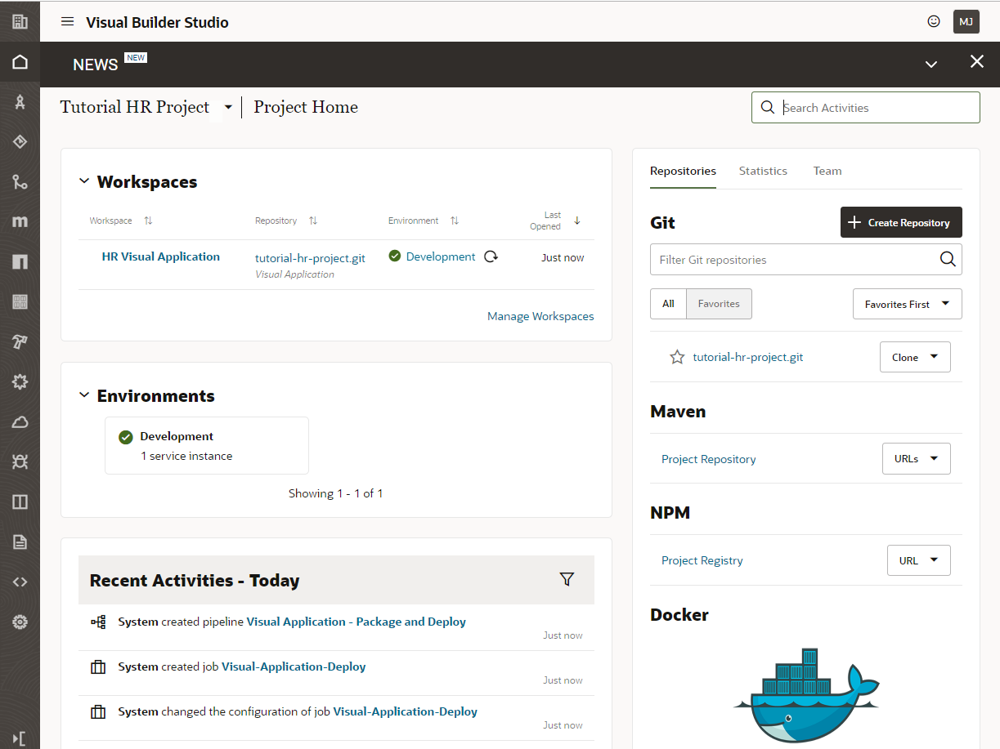
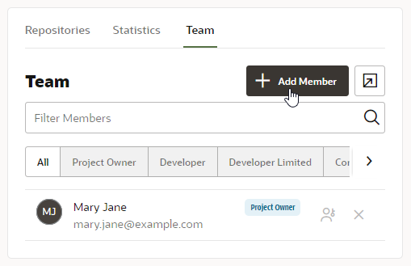

# Create a Project for a New Visual Application

## Introduction

This lab shows you how to create a project for a new visual application, which serves as the foundation to build a web application in Oracle Visual Builder Studio.

Estimated Time: 15 minutes

### Background

You can create engaging web and mobile applications in VB Studio using a _visual application_ template, which provides everything you need to visually develop a web or mobile application.

In this workshop, you'll build a simple Human Resources visual application, using a _project_ as a starting point. Every project in VB Studio is devoted to a discrete software effort, and the project you create in this lab is exclusive to the HR visual application. The project brings together all the tools you need to create your application, such as a Git repository to store your source code, a pipeline to provide continuous integration and delivery, an issue tracking system, and more.

As part of your project, you'll also create a _workspace_, a completely private area for you to work on your visual application. All your work within this space is stored in a clone of the project's Git repository, and is not visible to others until you share or publish your changes. A workspace also connects you to the development environment where you plan to host your application, which must be a separate Visual Builder (VB) instance.

### Prerequisites

This lab assumes you have:
* A Chrome browser
* A VB Studio instance and a separate VB instance

## Task 1: Create a Project for a Visual Application

As someone who creates a project, you'll automatically become the project's owner, responsible for project management. For the purposes of this tutorial, we'll assume that you're also the developer who will create the HR web application.

1.  On VB Studio's Organization page, click the **Projects** tab, then click **\+ Create**.

    

2.  On the Project Details page of the New Project wizard, enter:

    -   **Project Name**: `Tutorial HR Project` (you may want to add your name to the project name if you're in a large organization)
    -   **Description**: `Tutorial project`
    -   **Security**: **Private** (the default)
    -   **Preferred Language**: the language of your choice

    Click **Next**.

3.  On the Template page, select **Visual Application**. Click **Next**.

4.  On the Project Properties page, click **Development VB Instance** to select the VB instance where you plan to deploy and host your application. When you have only one VB instance provisioned, it will be automatically selected as your environment's development instance.

5.  Change the **Workspace Name** from the default `Workspace1` to `HR Visual Application`. Also change the **Working Branch Name** from `branch1` to `hrbranch`.

6.  Leave other fields to their default settings and click **Finish**.

    Wait for the project to be provisioned. Once provisioning completes, you'll see the Project Home page, which serves as a window to your workspace as well as to your environments, repositories, and a recent activities feed. On the left are a series of tabs showing all the project components that are available.

    

## Task 2: Explore the Project Environment

Everything you need to start building a visual application is now created for you in this project. Let's step through some key components to better understand your project environment.

1.  On the Project Home page, you'll see the **tutorial-hr-project.git** repository on the right in the Repositories tab. This Git repository stores your visual application's source files and is also known as the project's _remote_ repository. Click the **tutorial-hr-project.git** link to see your project's remote branches, `main` and `hrbranch`, created with initial content for your visual application. (The `main` branch is the default branch created when a new repository is generated and is the project's source of truth.)

    

2.  In the left navigation, click **Workspaces**to view the **HR Visual Application** workspace. This workspace contains a working copy of `hrbranch` and serves as your _local_ repository. The `hrbranch` initially has the same set of source files as the `main` branch, but as you work with your visual application, it will include the changes you make. Your changes can't be seen by others until you save them from the local branch to a remote branch.

    

3.  Click **Environments**  in the left navigation to view the development environment that points to your VB instance. Here, you can view details of your VB instance and all the applications you deploy to this instance.  

    

4.  Click **Builds**  in the left navigation to view the default build jobs that package and deploy your visual application to the development instance. The `Visual-Application-Package` job generates the visual application's artifact files. The `Visual-Application-Deploy` job deploys the artifact files to the development instance.

    

5.  On the Builds page, click **Pipelines** to view the sequence of build jobs that package and deploy your application to your development environment.

    

## Task 3: Add Credentials to Deploy the Visual Application

Now that your project is provisioned, let's set up the credentials that VB Studio will use to deploy your visual application to the VB  development instance.

1.  Click **Jobs** on the Builds page, then click **Configure**  for the `Visual-Application-Deploy` job.

    

2.  On the Job Configuration page, click **Steps**.

3.  In the **Username** and **Password** fields, enter the credentials of a user who can deploy to the VB development instance. Click **Save**.

    

   **Tip:** While on this page, take a quick look at other advanced settings:
    - Notice the **Include the application version in the URL** check box that's selected by default. This option adds a version to the URL when your application is deployed (for example, https://host/something-else/0.1/index.html). This version number is useful to identify multiple versions during development, but when your app is ready to go live, you'll want to deselect this option to remove the version and replace it instead with **live** (https:/host/something-else/live/index.html).
    - Take note of the **Use clean database** option, also selected by default. This option uses a new database by default to store your application's data. To keep your data after initially importing it (which we'll do in a later lab), you'll need to select the **Keep existing environment data** option.

## Task 4: Add Team Members

For the purposes of this tutorial, let's assume that other members of your team will work with you on this visual application—which means you'll need to add them to this project. As the project owner, you can control what others can do in this project by granting them membership as a Developer Full Access, Developer Limited Access, or Contributor.

1.  Click **Project Home**  in the left navigation.

2.  On the Project Home page, click **Team**, then **\+ Add Member**.

    

3.  In the Add Member dialog box, enter the username of a teammate, select the new user's membership, and click **Add**. For demonstration purposes, this tutorial adds Clara Coder with the Developer Limited Access role, which lets her access most project components but limits management actions.

    

    An email containing project details is sent to Clara Coder. Your recent activities feed is also updated.

    You may now [proceed to the next lab](#next).
## Acknowledgements
* **Created By/Date** - Sheryl Manoharan, VB Studio User Assistance, November 2021
<!--* **Last Updated By** - October 2021 --!>
