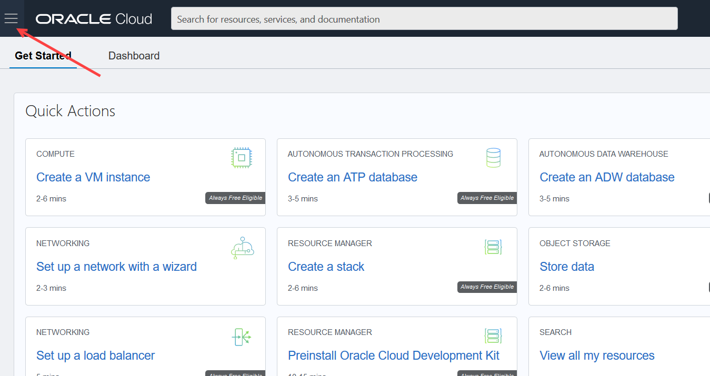
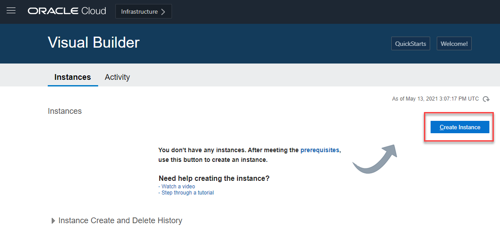

# Provision Instances

## Introduction

This lab walks you through the process of provisioning a Visual Builder Studio instance and a separate Visual Builder instance, assuming you don't already have both available to you. If you do, you can skip this lab and move on to the next one.

Estimated Lab Time: 10 minutes

### Background
If you just created a new Cloud account following the instructions in Getting Started, you must wait at least 30 minutes before you attempt to create an instance of Visual Builder and Visual Builder Studio. (It could take anywhere between 10 and 30 minutes for a new user account to be fully provisioned and for the navigation menu to show.) If you already have a Cloud account, you don't need to wait. Either way, make sure you've signed in to the Oracle Cloud as an Oracle Identity Cloud Service user before proceeding. *Note: If you log in using an Oracle Cloud Infrastructure account, the navigation menu to Visual Builder won't show.*

## **STEP 1**: Create an Instance of Visual Builder
Provision a service instance of Visual Builder to deploy and host apps created in Visual Builder Studio. The Visual Builder instance serves as the runtime environment for the web app that you will create in Visual Builder Studio.

1.  On the Oracle Cloud Get Started page, click the menu in the upper left corner to display the services you can provision:

    

2.  Click **OCI Classic Services**, then select **Visual Builder**:

    

3.  On the Instances tab, click **Create Instance**:

    

4.  On the Create Instance page, fill in the information required.  Give your instance a unique name, one that is unlikely to be chosen by another user.  Be sure to select the Region nearest to your location.  Click **Next**.

    

    When the instance has finished provisioning, you'll receive an email.  

5. From the menu on the Instances page, click **Open Visual Builder Home Page**.

   

## **STEP 2:** Create an Instance of Visual Builder Studio
Provision a service instance of Visual Builder Studio to design and develop your web app. You can create only one Visual Builder Studio instance in an Oracle Cloud account. Before you attempt to create an instance, make sure there's no existing Visual Builder Studio instance in your account.

1. Navigate back to your Cloud Console and click on the hamburger menu on top left, click **OCI Classic Services**, then select **Developer**.

   

2. On the Instances tab, click **Create Instance**:

    

3. On the Create New Instance page, fill in the required information. Give your instance a unique name, then select the Region nearest to your location. Click **Next**.

   

3. On the Confirmation page, click **Create**.

   

4. Once the service instance is created, clicking the Action menu icon and select **Access Service Instance**.

     

## Acknowledgements
**Author** - Sheryl Manoharan, Visual Builder User Assistance

**Last Updated** - August 2021
