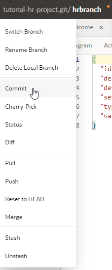
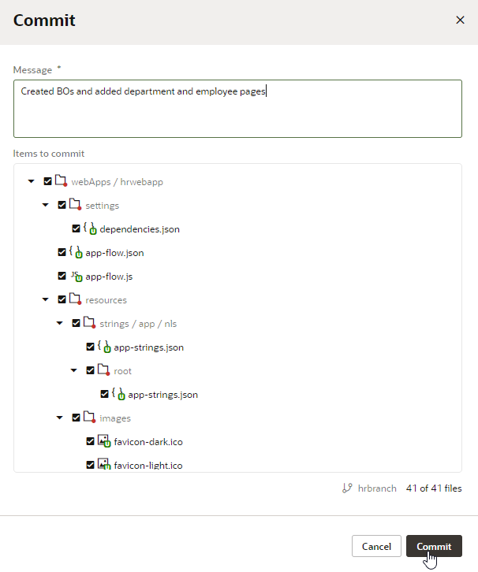
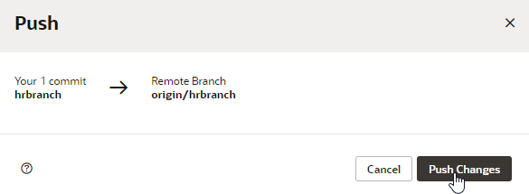
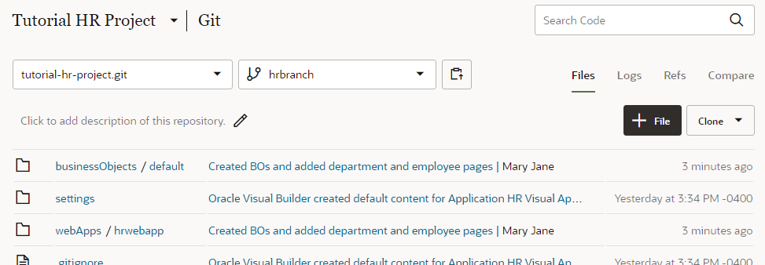

# Save a Web Application's Changes to a Remote Branch

## Introduction

This lab shows you how to save a web application's changes from your local branch to a remote branch using Visual Builder Studio.

Estimated Lab Time: 10 minutes

### Background
While developing the HR web application, you might have noticed a dot in the header next to your Git repository in the header:

This dot indicates you've made changes in your local branch that haven't been saved to the remote branch. It's important to save your changes as often as you can, but first, let's review a few concepts.

When you created a workspace early on in this workshop, you created a new branch called hrbranch, which was a copy of the master branch in the project’s Git repository. All the work you've done so far on the HR web application has been automatically saved to hrbranch, but these changes are not visible to others because hrbranch is a local branch in your workspace. To let others view your changes, you'll need to save your changes from the local branch in your workspace to a branch in a remote repository.

Saving changes to a remote branch is a two-step process: _commit_ and _push_. The first step you'll do is "commit". A commit groups the files in your local branch that you want to save to the remote branch and provides a description of the group. Next, you'll "push" your changes. A push saves all the files in the groups that you've "committed" to the remote branch.

Once you commit and push your changes, all the changes from your local hrbranch become available to others in your project through the remote hrbranch.

## **STEP 1:** Commit Changes in a Local Branch
Let's group the changes you've made so far in your local branch for a commit. Ideally, you'll commit your changes as often as you can, so you have a string of commits with messages that clearly describe your updates.

1. Click the Git repository menu in the header and select **Commit**.

  

2. In the Commit dialog box, enter a message that describes your changes and click **Commit**.

    

    A successful message appears on the page. Click  to close the message.

## **STEP 2:** Push Changes to a Remote Branch

Push your commits from the local branch in your workspace to the remote branch.

1.  Click the Git repository menu and select **Push**.
2.  In the Push dialog box, you'll see 1 commit ready to be pushed from your local branch to the remote branch. Click **Push Changes**.

    

    When the successful message appears, click .

## **STEP 3:** View Changes in the Remote Branch

Now that your changes have been pushed, let's check them in the remote hrbranch.

1.  In the header, click **Go to project page**  to return to the project's home page.
2.  Click **Git**  in the left navigation.
3.  For the tutorial-hr-project.git repository, select **hrbranch**.

    

    You can see your changes added to the remote hrbranch, indicated by your last commit message. Click the **Logs** tab to see all commits to the remote branch.

    

    Now if a teammate (for example, Clara Coder) wanted to work on this web application, she could use the **Clone From Git** option on the Workspaces page to clone hrbranch in her workspace, then use it as a base for her updates.

## Acknowledgements
* **Author** - Sheryl Manoharan, VB Studio User Assistance
* **Last Updated By/Date** - August 2021
