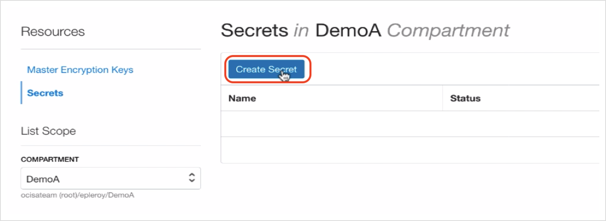
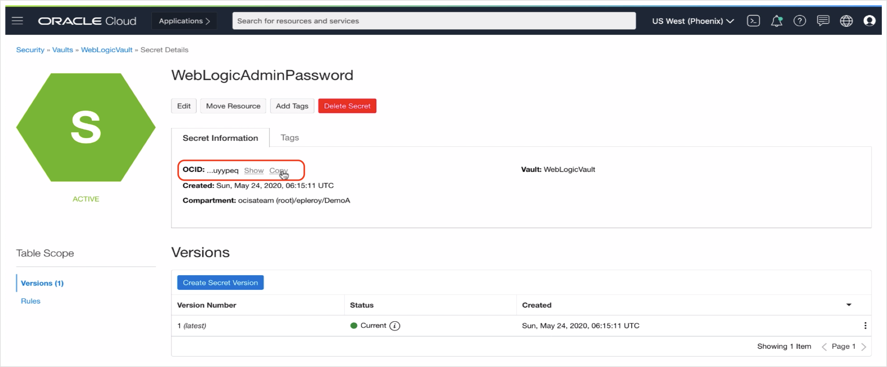

# Prepare the OCI Account

## Introduction

In this lab we will prepare the OCI environment to provision WebLogic Server for Oracle Cloud Infrastructure from the marketplace.

Estimated Lab Time: 5 minutes.

### Objectives

In this lab you will:

- Create a Vault.
- Create a Key.
- Create a Secret to hold the WebLogic Admin password.
- Copy the Secret OCID to use during the provisioning stage

### Prerequisites

For this lab you will need an OCI account with a compartment created.

## **STEP 1:** Create a Vault

1. Go to **Security -> Vault**.

   

2. Make sure you are in the compartment where you want to deploy WebLogic.

3. Click **Create Vault**.

   

4. Name the vault `WebLogic Vault` or a name of your choosing. Make sure the `private` option is **not checked** and click **Create Vault**.

   

## **STEP 2:** Create a Key in the Vault

1. Once the vault is provisioned, select the vault.

   

2. Click **Create Key**.

   

3. Name the key `WebLogicKey` or a name of your choosing and click **Create Key**.

   

## **STEP 3:** Create a Secret for the WebLogic Admin Password

1. Once the key is provisioned, click **Secrets**.

   

2. Click **Create Secret**.

  

3. Name the **Secret** as `WebLogicAdminPassword`, select the `WebLogicKey` created at the previous step as the **Encryption Key**, keep the default `plaintext` option and type `welcome1` or any WebLogic compliant password (at least 8 chars and 1 uppercase or number) in the **Secret Content** text field, and click **Create Secret**.

  

4. Click the `WebLogicAdminPassword` **Secret** you just created and **make a note** of its **OCID**.

   

That is all that's needed to get started.

You may proceed to the next lab.

## Acknowledgements

 - **Author** - Emmanuel Leroy, May 2020
 - **Last Updated By/Date** - Emmanuel Leroy, August 2020
