# Real Application Testing : SQL Performance Analyzer and Database Replay
## Introduction
Oracle Real Application Testing option enables you to perform real-world testing of Oracle Database. By capturing production workloads and assessing the impact of system changes on these workloads before production deployment, Oracle Real Application Testing minimizes the risk of instabilities associated with system changes.

### Objectives
The objective of this lab is to become familiar with the basic usage of SQL Performance Analyzer and Database Replay.


*Estimated Lab Time*: 55 minutes

### Prerequisites
- A Free Tier, Paid or LiveLabs Oracle Cloud account
- You have completed:
    - Lab: Generate SSH Keys
    - Lab: Environment Setup
- SSH Private Key to access the host via SSH
- OMS super-user Credentials:
    - Username: **sysman**
    - password: **welcome1**
- EM13c Host Public IP address
- OMS Console URL:
  ````
  <copy>https://<EM13c Host Public IP address>:7803/em</copy>
  e.g: https://111.888.111.888:7803/em
  ````

*Note*: This lab environment is setup with Enterprise Manager Cloud Control Release 13.4 Release Update 5 and Database 19.3 as Oracle Management Repository. Workshop activities included in this lab will be executed both locally on the instance using Enterprise Manager Command Line Interface (EMCLI) or Database PLSQL APIs, and the Enterprise Manager console (browser). The use of SQL Performance Analyzer and Database Replay requires the Oracle Real Application Testing licensing option. For more information, see Oracle Database Licensing Information User Manual.

### Lab Timing (Estimated)

| **Step No.** | **Feature**                                   | **Approx. Time** | **Details**                                                                                                                                                                                                                    | **Value proposition**                                                                                                                                                                                                                                                                                                                                                                                                                                                                                                                                                      |
|--------|-----------------------------------------------|------------------|--------------------------------------------------------------------------------------------------------------------------------------------------------------------------------------------------------------------------------|-----------------------------------------------------------------------------------------------------------------------------------------------------------------------------------------------------------------------------------------------------------------------------------------------------------------------------------------------------------------------------------------------------------------------------------------------------------------------------------------------------------------------------------------------------------------------------|
| **1**  | SQL Performance Analyzer - API                              | 15 minutes       | The objective of this activity is to demonstrate and use the SQL Performance Analyzer functionality of Real Application Testing capabilities using API PLSQL mode.                                                                        | **Scenario:**    You've been asked to validate SQL performance before upgrade Database from 18.3 to 19.3. How each SQLs in the application's workload (Order Entry) performs in new 19.3 upgrade.                                                                                                                                                                                                                                           |
| **2**  | SQL Performance Analyzer - EM UI       | 10 minutes       | The objective of this activity is to demonstrate and use the SQL Performance Analyzer functionality of Real Application Testing capabilities using Enterprise Manager UI.                                                 | **Scenario:**    You've been asked to validate SQL performance before upgrade Database from 18.3 to 19.3. How each SQLs in the application's workload (Sales History) performs in new 19.3 upgrade.                                                                                                                                                                                                                                                                                                                                                  |
| **3**  | Database Workload Replay - API                         | 10 minutes       | The objective of this activity is to demonstrate and use the Database Replay functionality of Real Application Testing capabilities using API PLSQL mode and import Capture and Replay into Enterprise Manager.                                                                                                           | **Scenario:**    You've been asked to validate Database performance before upgrade Database from 18.3 to 19.3. How the application's workload (Order Entry) performs in new 19.3 upgrade. Database Replay enables realistic testing of system changes by essentially re-creating the production workload environment on a test system.                                                                                                                                                                                                                                                                                                                                 |
| **4**  | Database Replay - Consolidation Replay (EM) | 10 minutes       | The objective of this activity is to demonstrate and use the Consolidation Database Replay using Enterprise Manager UI. | **Scenario:**    You've been asked to validate Database performance before upgrade Database from 18.3 to 19.3. The plan is also consolidation a couple of application workload from 2 different Database Captures (Order Entry and Sales History) from 18.3 into a single Database Replay in 19.3.                                                                                                                                                                                                                                                                                                                                                                                                                                                                                                    |


## **STEP 1:** SQL Performance Analyzer - API
### Login to Host using SSH Key based authentication
1. Running Swingbench's Order Entry workload for 5 minutes. Refer to *Lab 2* for detailed instructions relevant to your SSH client type (e.g. Putty on Windows or Native such as terminal on Mac OS):
    **SSH Session 1**
    - Authentication OS User - “*opc*”
    - Authentication method - *SSH RSA Key*
    - Oracle EM and DB Software OS User – “*oracle*”. First login as “*opc*”, then sudo to “*oracle*”.
    - Change directory to **cd scripts/swingbench/swingbench**
    - Execute the script **bin/charbench -c /home/oracle/scripts/swingbench/swingbench/configs/SOE_Client_Side_2.xml**
    - The Swingbench will be running for 5 minutes. Do not need to wait until Swingbench workload to finish to continue to Step 2.

    ````
    <copy>sudo su - oracle
    cd scripts/swingbench/swingbench
    bin/charbench -c /home/oracle/scripts/swingbench/swingbench/configs/SOE_Client_Side_2.xml</copy>
    ````

    

2.  Capture STS (SQL Tuning Set)
    **SSH Session 2**
    - Authentication OS User - “*opc*”
    - Authentication method - *SSH RSA Key*
    - Oracle EM and DB Software OS User – “*oracle*”. First login as “*opc*”, then sudo to “*oracle*”.
    - Set Environment variables for sales database **. SALESENV**
    - Execute STS API to create STS and capture from cursor cache for 5 minutes in sqlplus
    - Continue to Step 3 after PL/SQL procedure successfully completed.
    ````
    <copy>sudo su - oracle
    . SALESENV
    sqlplus '/ as sysdba'
    SQL> alter session set container = oltp;
    SQL> EXEC dbms_sqltune.create_sqlset('soests1');
    SQL> EXEC dbms_sqltune.capture_cursor_cache_sqlset(sqlset_name => 'soests1', time_limit => 300, repeat_interval => 60,basic_filter => 'parsing_schema_name in (''SOE'')')</copy>
    ````

    

    

3.  Move STS (SQL Tuning Set) to 19.3 Cloned oltp Database
    - Create STS staging table in source 18.3 sales-oltp PDB
    - Export STS staging table
    ````
    <copy>sudo su - oracle
    . SALESENV
    sqlplus '/ as sysdba'
    SQL> alter session set container = oltp;
    SQL> exec  DBMS_SQLTUNE.create_stgtab_sqlset(table_name => 'SQLSET_TAB', schema_name => 'SYSTEM', tablespace_name => 'USERS');
    SQL> exec DBMS_SQLTUNE.pack_stgtab_sqlset(sqlset_name => 'soests1', sqlset_owner => 'SYS', staging_table_name => 'SQLSET_TAB', staging_schema_owner => 'SYSTEM');
    SQL> create or replace directory dpdir as '/home/oracle/scripts/exp';
    SQL> exit
    emrep:oracle@emcc:~> expdp system/welcome1@oltp directory=DPDIR dumpfile=soests1.dmp tables=sqlset_tab</copy>
    ````

    

    

    - Import STS staging table
    - Unpack STS in target 19.3 clone sales-oltp PDB
    ````
    <copy>sudo su - oracle
    . 19c.env
    sqlplus system/welcome1@//emcc/oltp_cl2.subnet.vcn.oraclevcn.com
    SQL> create  or replace directory dpdir as '/home/oracle/scripts/exp';
    SQL> exit
    emrep:oracle@emcc:~> impdp system/welcome1@//emcc/oltp_cl2.subnet.vcn.oraclevcn.com directory=DPDIR dumpfile=soests1.dmp

    emrep:oracle@emcc:~> sqlplus '/ as sysdba'
    SQL> alter session set container = OLTP_CL2;
    SQL> exec DBMS_SQLTUNE.unpack_stgtab_sqlset(sqlset_name => 'soests1', sqlset_owner => 'SYS', staging_table_name => 'SQLSET_TAB',replace => TRUE, staging_schema_owner => 'SYSTEM');</copy>
    ````

    

    


4.  Create and run SPA task
    - Create Database Link from target to source
    ````
    <copy>
    . 19c.env
    sqlplus '/ as sysdba'
    SQL> alter session set container = OLTP_CL2;
    SQL> create public database link oltp connect to system identified by welcome1 using '(DESCRIPTION = (ADDRESS = (PROTOCOL = TCP)(HOST = emcc.marketplace.com)(PORT = 1523)) (CONNECT_DATA = (SERVER = DEDICATED) (SERVICE_NAME = oltp.subnet.vcn.oraclevcn.com)))';
    </copy>
    ````

    

    - Create SPA task
    ````
    <copy>
    SQL> var atname varchar2(30);
    SQL> exec :atname := 'SPA_TEST_API';
    SQL> begin
        :atname := DBMS_SQLPA.CREATE_ANALYSIS_TASK (sqlset_owner => 'SYS',sqlset_name => 'soests1', task_name => :atname);
        end;
        /
    </copy>    
    ````

    

    - Run SPA task test-execute to source 18c via dblink
    ````
    <copy>
    SQL> begin
        DBMS_SQLPA.EXECUTE_ANALYSIS_TASK(
        task_name => 'SPA_TEST_API',
        execution_type => 'TEST EXECUTE',
        execution_name => 'oltp18c',
        execution_params => dbms_advisor.arglist('DATABASE_LINK', 'OLTP.SUBNET.VCN.ORACLEVCN.COM'));
        end;
        /
    </copy>  
    ````

    

    - Run SPA task test-execute in target 19c
    ````
    <copy>
    SQL> begin
        DBMS_SQLPA.EXECUTE_ANALYSIS_TASK(
        task_name => 'SPA_TEST_API',
        execution_type => 'TEST EXECUTE',
        execution_name => 'oltp19c');
        end;
        /
    </copy>  
    ````

    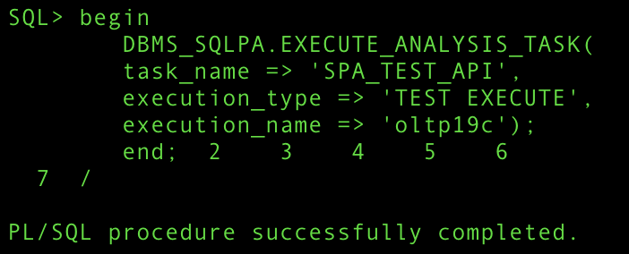


5.  Run SPA Analyze Compare and generate SPA report
    - Run SPA Compare Analysis based on elapse time
    ````
    <copy>
    SQL> begin
      DBMS_SQLPA.EXECUTE_ANALYSIS_TASK(
      task_name => 'SPA_TEST_API',
      execution_type => 'COMPARE',
      execution_name => 'oltp18cvs19c_elapsetime',
      execution_params => dbms_advisor.arglist(
          'comparison_metric',
          'elapsed_time'));
      end;
      /
    </copy>  
    ````

    

    - Generate SPA report
    ````
    <copy>
    SQL> set long 10000000 longchunksize 10000000 linesize 200 head off feedback off echo off
    SQL> spool /tmp/spaapirep.html
    SQL> SELECT dbms_sqlpa.report_analysis_task(task_name => 'SPA_TEST_API', type => 'html', section => 'ALL') FROM dual;
    SQL> spool off
    SQL> exit
    emrep:oracle@emcc:~> chmod 777 /tmp/spaapirep.html
    </copy>
    ````
    - Use a scp client tp copy file to your local machine


## **STEP 2:** SQL Performance Analyzer - EM UI

1. Log into an Enterprise Manager VM (using provided IP). The Enterprise Manager credentials are “sysman/welcome1”.

    

2. **Click** on the Targets, then Databases. You will be directed to the list of Databases in EM.

    

3. Here you will notice different databases listed, such as SALES, HR etc., we will work in pluggable database psales inside the sales container database. **Expand** the Sales database from the list, and **Click** sales.subnet.vcn.oraclevcn.com_PSALES

    

4. Go to SQL Tuning Set page by **Click** on Performance menu -> SQL -> SQL Tuning Set. And use SYS_SALES credential name from the database login screen

    

    

5. Pick SQL Tuning Set 'shsts1' and **Click** Copy To A Database button

    

6. Enter Copy SQL Tuning Set
    - Pick **db19c.subnet.vcn.oraclevcn.com_PSAL_CL1** for Destination Database
    - Pick **STSCOPY** for Directory Object
    - Pick **ORACLE** for both Source and Destination Credentials and **SYS_SALES** for Destination Database Credential
    - **Click** Ok

    

    

    

    - View on job page to check status of the Copy STS job

7. After the COPY STS job successfully finished, **Click** Target - Database
    - **Click** db19c.subnet.vcn.oraclevcn.com - PDB **PSAL_CLone1**
    - **Click** on menu Performance - SQL - SQL Performance Analyzer

    

    

    

8. In SPA (SQL Performance Analyzer) page, **Click** Guided Workflow

    

9. Step 1 Create SPA Task  based on STS

    

    - Enter Name for the Task Name : **SHSPATASK**
    - Enter Description : **Sales History SPA Task**
    - Pick STS : **SHSTS1**

    

    - **Click** Create and back to **Guided Workflow** page

10. Step 2 Create SQL Trial in Initial Environment

    

    - Enter SQL Trial Name : **SHSTS_SQL_TRIAL_18C**
    - Enter Description
    - Creation Method: **Execute SQLs Remotely**

    

    - Default per-SQL Time Limit
    - Database Link: pick **PSALES.SUBNET.VCN.ORACLEVCN.COM**

    

    - **Check** Trial environment established
    - **Click** Submit

11. Back to SQL Performance Analyzer Home page, to check the status of the task run.

    

    - Continue the Workflow **Click** SHSPATASK

    

12. Continue Step 3 in SPA Guided Workflow **SHSPATASK**, Create SQL Trial in Changed Environment

    

    - Enter SQL Trial Name : **SHSTS_SQL_TRIAL_19C**
    - Enter Description
    - Creation Method: **Execute SQLs Locally**
    - Default per-SQL Time Limit
    - **Check** Trial environment established
    - **Click** Submit

    

13. Back to SQL Performance Analyzer Home page, to check the status of the task run.

    

    - Continue the Workflow **Click** SHSPATASK

14. Continue Step 4 in SPA Guided Workflow **SHSPATASK**, Compare Step 2 and Step 3

    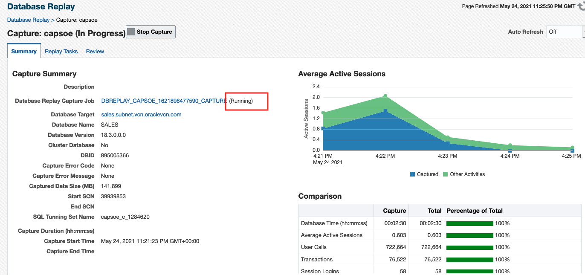

    - Trial 1 Name : **SHSTS_SQL_TRIAL_18C**
    - Trial 2 Name : **SHSTS_SQL_TRIAL_19C**
    - Comparison Metric : **Buffer Get**
    - **Click** Submit

    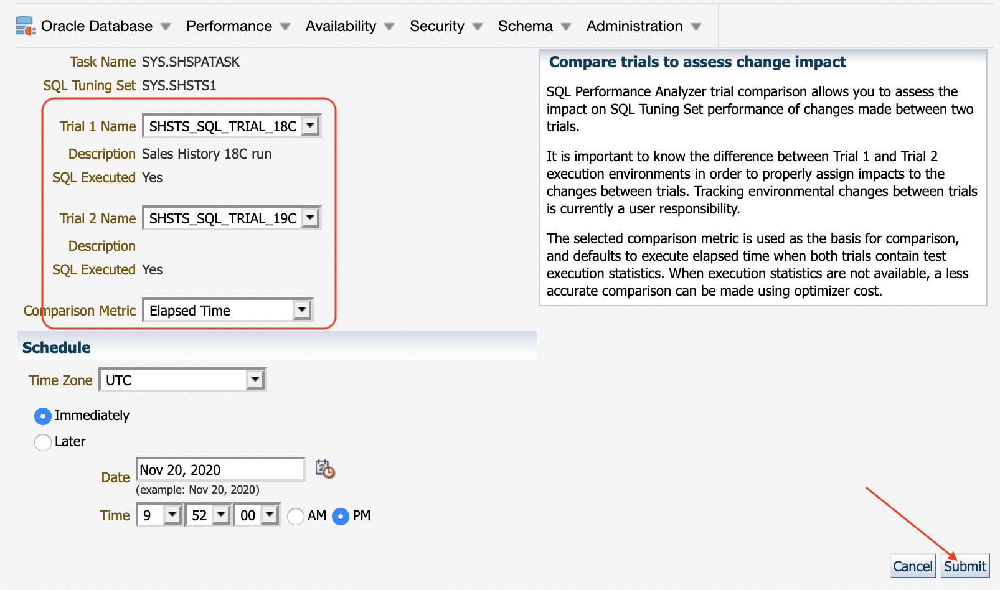

15.  Continue Step 5 in SPA Guided Workflow **SHSPATASK**, View Trial Comparison report

    

    

    - **Click** one of the SQLID to check the detail of the SQL comparison

    


## **STEP 3:** Database Workload Replay - API

### Login to Host using SSH Key based authentication
1. Running Swingbench's Order Entry workload for 10 minutes. Refer to *Lab 2* for detailed instructions relevant to your SSH client type (e.g. Putty on Windows or Native such as terminal on Mac OS):
    **SSH Session 1**
    - Authentication OS User - “*opc*”
    - Authentication method - *SSH RSA Key*
    - Oracle EM and DB Software OS User – “*oracle*”. First login as “*opc*”, then sudo to “*oracle*”.
    - Change directory to **cd scripts/swingbench/swingbench**
    - Execute the script **bin/charbench -c /home/oracle/scripts/swingbench/swingbench/configs/SOE_Client_Side_2.xml**
    - The Swingbench will be running for 5 minutes. Do not need to wait until Swingbench workload to finish to continue to Step 2.

    ````
    <copy>sudo su - oracle
    cd scripts/swingbench/swingbench
    bin/charbench -c /home/oracle/scripts/swingbench/swingbench/configs/SOE_Client_Side_RAT1.xml</copy>
    ````

    

2.  Start Database Capture
    **SSH Session 2**
    - Authentication OS User - “*opc*”
    - Authentication method - *SSH RSA Key*
    - Oracle EM and DB Software OS User – “*oracle*”. First login as “*opc*”, then sudo to “*oracle*”.
    - Set Environment variables for sales database **. SALESENV**
    - Create Unix folder for DB Replay's Capture **/home/oracle/scripts/CAPTURE/lab3SOE**
    - Create DB Directory Object LAB3SOE
    - Execute DBMS_WORKLOAD_CAPTURE.START_CAPTURE()

    ````
    <copy>sudo su - oracle
    . SALESENV
    mkdir /home/oracle/scripts/CAPTURE/lab3SOE
    sqlplus '/ as sysdba'
    SQL> create directory LAB3SOE as '/home/oracle/scripts/CAPTURE/lab3SOE';
    SQL> exec  DBMS_WORKLOAD_CAPTURE.START_CAPTURE (name => 'Lab 3 Sales Order Entry', dir => 'LAB3SOE',duration => 600); </copy>
    ````

    


3.  Import DB Replay's Capture into EM
    - The DB's Replay's Capture and workload scheduled for 10 minutes
    - Log into your Enterprise Manager as **sysman** as indicated in the Prerequisites step if not already done.
    - Navigate from **Enterprise** to **Quality Management** top then **Database Replay**

    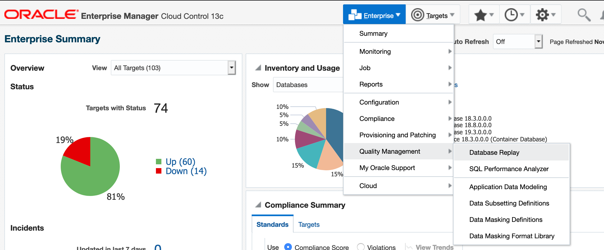

    - In Database Replay page, Captured Workload tab **click** on **Import**

    

    - Pick **Attach to a capture running in DB target**

    

    - Pick **sales.subnet.vcn.oraclevcn.com**

    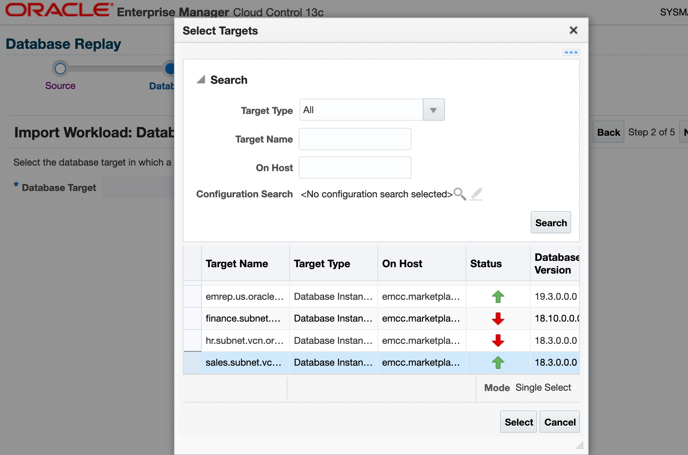

    - Pick Credential **SYS_SALES** for Database Credential, Pick **ORACLE** for Database Host Credential

    

    - In Import Workload page, **Click Discover Workload** button

    

    - Remove **spaces** in New Name **Lab 3 Sales Order Entry** to **Lab3SalesOrderEntry** then **Click** Next

    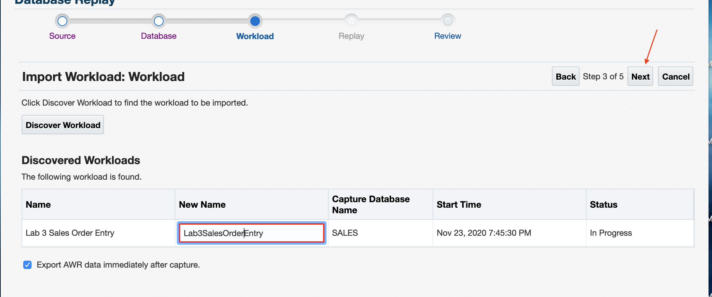

    - **Click Submit** in Import Workload: review

    

    - Back To Capture Workloads, and you can see **Lab3SalesOrder** status is **In Progress**

    

    - **Click Lab3SalesOrder** to enter Capture's detail page

    

4.  Generate DB Replay's Capture from API and EM
    - Query the Capture's Id from dba_workload_captures
      and use the id to generate the report
    ````
    <copy>sudo su - oracle
    . SALESENV
    mkdir /home/oracle/scripts/CAPTURE/lab3SOE
    sqlplus '/ as sysdba'
    SQL> select id, name from dba_workload_captures where name = 'Lab 3 Sales Order Entry';
    SQL> set long 10000000 longchunksize 10000000 linesize 200 head off feedback off echo off
    SQL> spool /tmp/capture_soe.txt
    SQL> select dbms_workload_capture.report(capture_id => 11, format => 'TEXT') from dual;
    SQL> spool off
    </copy>
     ````

    -  Generate and view report in EM; Continue from step 3 above, **Click** Reports tab

    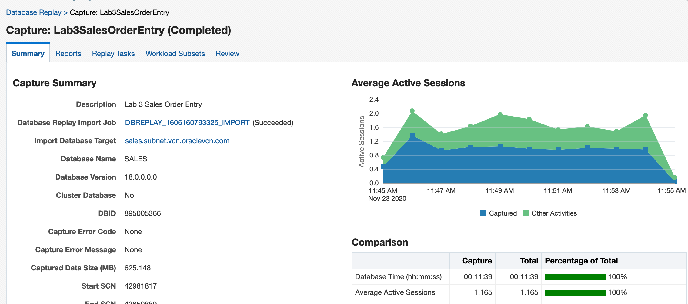

    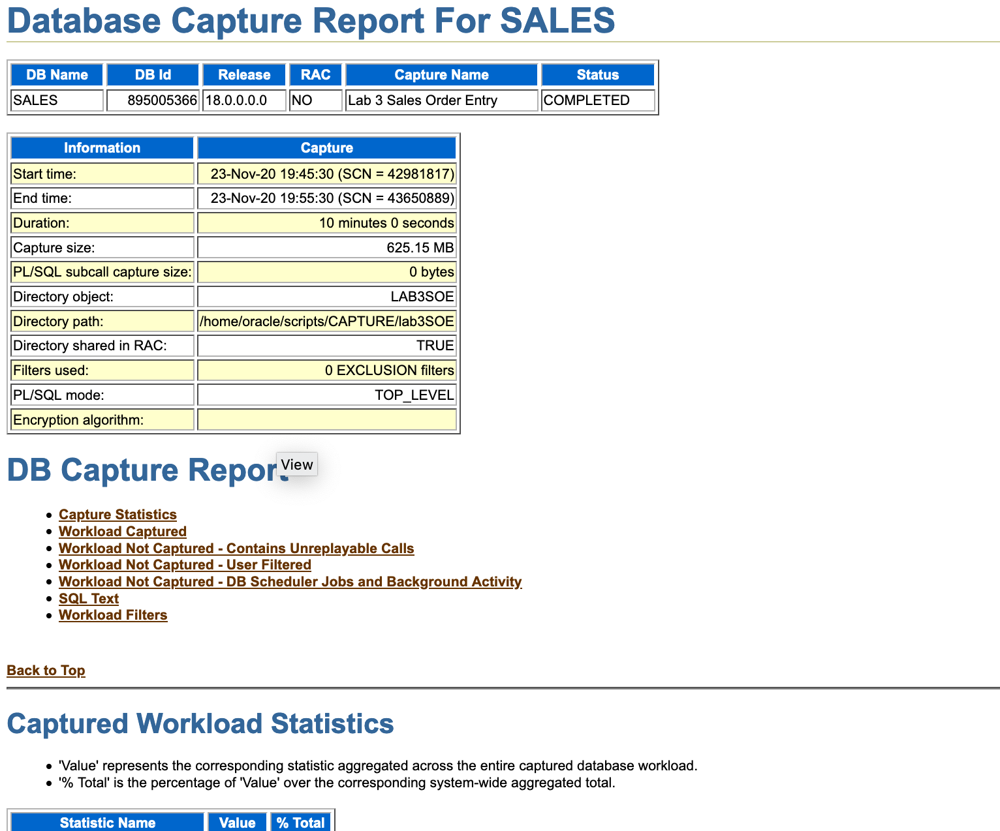

5.  Start Database Replay for Capture **Lab 3 Sales Order Entry** in 19C Database.
    **SSH Session 1**
    - Authentication OS User - “*opc*”
    - Authentication method - *SSH RSA Key*
    - Oracle EM and DB Software OS User – “*oracle*”. First login as “*opc*”, then sudo to “*oracle*”.
    - Set Environment variables for sales database **. 19c.env**
    - Create DB Directory Object LAB3SOE
    - Pre-process the capture in 19C Database
    ````
    <copy>
    . /home/oracle/19c.env
    sqlplus '/ as sysdba'
    SQL> create directory lab3soe as '/home/oracle/scripts/CAPTURE/lab3SOE';
    SQL> exec dbms_workload_replay.process_capture('LAB3SOE')
    </copy>
    ````
    - Start the replay by initializing it
    ````
    <copy>
    SQL> exec dbms_workload_replay.INITIALIZE_REPLAY (replay_name => 'lab3rep', replay_dir => 'LAB3SOE');
    </copy>
    ````
    - Remap the connection for replay
    ````
    <copy>
    begin
    for i in (select conn_id, capture_conn from dba_workload_connection_map m, dba_workload_replays r where replay_id = id and name = 'lab3rep')
    loop
      dbms_workload_replay.remap_connection(connection_id=>i.conn_id, replay_connection=>'(DESCRIPTION = (ADDRESS = (PROTOCOL = TCP)(HOST = emcc.marketplace.com)(PORT = 1521))(CONNECT_DATA = (SERVER = DEDICATED)(SERVICE_NAME = oltp_cl2.subnet.vcn.oraclevcn.com)))');
     end loop;
     commit;
      end;
      /
      </copy>
      ````
     - Prepare the replay  
     ````
     <copy>
     SQL> exec dbms_workload_replay.PREPARE_REPLAY ();
     </copy>
     ````
     - Start wrc clients in new session
     **SSH Session 2**
     - Authentication OS User - “*opc*”
     - Authentication method - *SSH RSA Key*
     - Oracle EM and DB Software OS User – “*oracle*”. First login as “*opc*”, then sudo to “*oracle*”.
     - Set Environment variables for sales database **. 19c.env**
     - run wrc in the replay folder
     ````
     . 19c.env
     cd /home/oracle/scripts/CAPTURE/lab3SOE
     wrc system/welcome1

     Wait for the replay to start (22:41:37)

     ````
     - Start the replay in session 1
     **SSH Session 1**
     ````
     <copy>
     SQL> exec dbms_workload_replay.START_REPLAY
     </copy>
     ````
6.  Import running Replay into EM

    - Log into your Enterprise Manager as **sysman** as indicated in the Prerequisites step if not already done.
    - Navigate from **Enterprise** to **Quality Management** top then **Database Replay**
    - **Click** Replay Tasks tab and **Click** Create button

     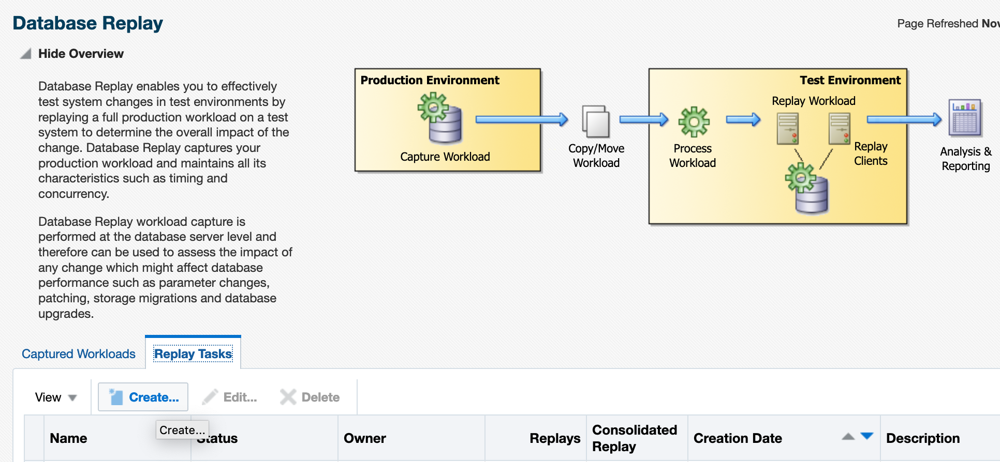

    - **Enter** Name **soetask** in Create Task page
    - **Click** Add button in Workloads section
    - **Pick** Lab3SalesOrderEntry
    - **Uncheck** Create a new replay in Replays section
    - **Click** Submit

     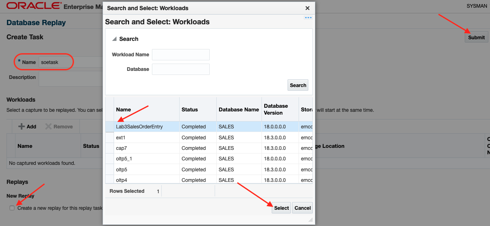

    - Back to **Database  Replay** main page
    - **Click** soetask replay task

     

    - In Replay Task page **click** Import button in Replays section

     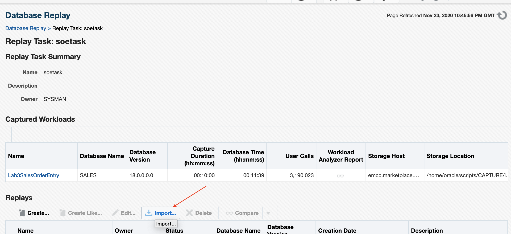

    - **Check** Attach to a replay of this replay task running in a database target

     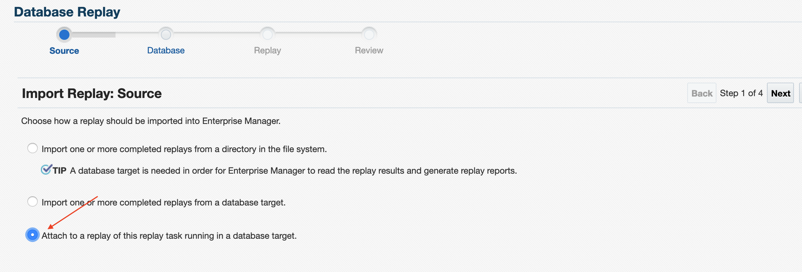

    - **Select** db19c.subnet.vcn.oraclevcn.com

     

    - Use **SYS_DB19C** named credential for DB credential, use **ORACLE** for named credential for DB Host credential

     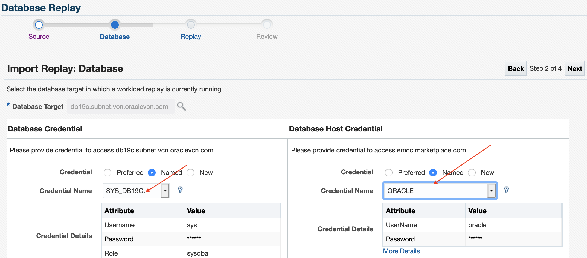

    - **Click** Discover Replay and **Next** button

       

    - **Click Submit**

     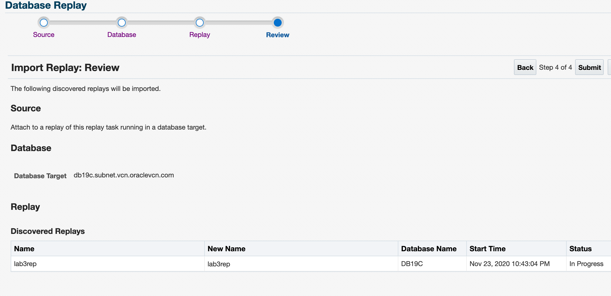

7. Generate Replay report and comparison report

    - Authentication OS User - “*opc*”
    - Authentication method - *SSH RSA Key*
    - Oracle EM and DB Software OS User – “*oracle*”. First login as “*opc*”, then sudo to “*oracle*”.
    - Set Environment variables for sales database **. 19c.env**
    - Generate replay report  
    ````
    <copy>Set long 500000
    Set linesize 200
    Set pagesize 0

    Spool replay_report.txt
    select dbms_workload_replay.report (replay_id => 1, format=> 'TEXT') from dual;
    spool off</copy>
    ````
    - Import capture's awr into relay's DB

    ````
    <copy>
    SELECT DBMS_WORKLOAD_CAPTURE.IMPORT_AWR (capture_id => 11,staging_schema => 'SYSTEM') from dual;</copy>
    ````

    - Generate replay capture comparison report

    ````
    <copy>spool compare_period_report.html

    VAR v_clob CLOB
    BEGIN dbms_workload_replay.compare_period_report(replay_id1 => 1, replay_id2 => null, format => DBMS_WORKLOAD_REPLAY.TYPE_HTML, result => :v_clob);
    END;
    /

    print v_clob;
    spool off
    exit</copy>
    ````

    - Generate and view report in EM
    Log into your Enterprise Manager as **sysman** as indicated in the Prerequisites step if not already done.
    - Navigate from **Enterprise** to **Quality Management** top then **Database Replay**
    - **Expand** soetask and **click** lab3rep

    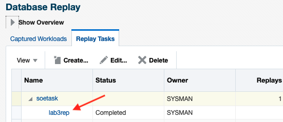

    -  We view 3 reports: Database Replay Report, Replay Compare Period Report, AWR Compare Period Report

    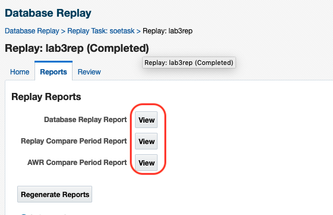


This concludes the Database Replay lab activity.

## **STEP 4:** Database Consolidation Replay

1.  Refresh **SOE** schema in **db19c-oltp_cl2** for another replay and copy capture from Lab3 to a Consolidation Folder and by combining pre-existed a Sales History workload
    **SSH Session 1**
    - Authentication OS User - “*opc*”
    - Authentication method - *SSH RSA Key*
    - Oracle EM and DB Software OS User – “*oracle*”. First login as “*opc*”, then sudo to “*oracle*”.
    - Set Environment variables for sales database **. 19c.env**
    - Run script **sh scripts/refsoe.sh**
    - **cd /home/oracle/scripts/CAPTURE**
    - **cp -r lab3SOE lab4con**

    ````
    <copy>
    . 19c.env
    sh scripts/refsoe.sh
    cd /home/oracle/scripts/CAPTURE
    cp -r lab3SOE lab4con
    </copy>
    ````

    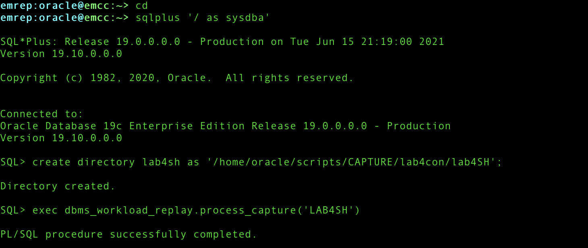

2.  Import pre-existed Sales History Workload and lab's 3 SOE capture into a consolidation capture to EM
    - Log into your Enterprise Manager as **sysman** as indicated in the Prerequisites step if not already done.
    - Navigate from **Enterprise** to **Quality Management** top then **Database Replay**
    - In Database Replay page, Captured Workload tab **click** on **Import**

    

    - Pick **Import a completed captured workload from a directory in the file system** and click **Next**

    

    - Pick **db19c.subnet.vcn.oraclevcn.com_PSAL_CL1** for  Database Target

    

    - Pick **SYS_DB19C** as Named Credential for Database Credential, pick **ORACLE** as Named Credential for Database Host Target
    - Enter **/home/oracle/scripts/CAPTURE/lab4con** as Workload Location
    - Check **Specified workload location is a consolidated replay directory** and **click** Next

      

    - **Click** Discover Workload and update Lab 3 Sales Order Entry to Lab3SalesOE then cick **Submit**

    

3.  Running Consolidation Replay for Sales History Workload and lab's 3 SOE capture
    - Log into your Enterprise Manager as **sysman** as indicated in the Prerequisites step if not already done.
    - Navigate from **Enterprise** to **Quality Management** top then **Database Replay**
    - **Click Create** in Replay Tasks tab  

    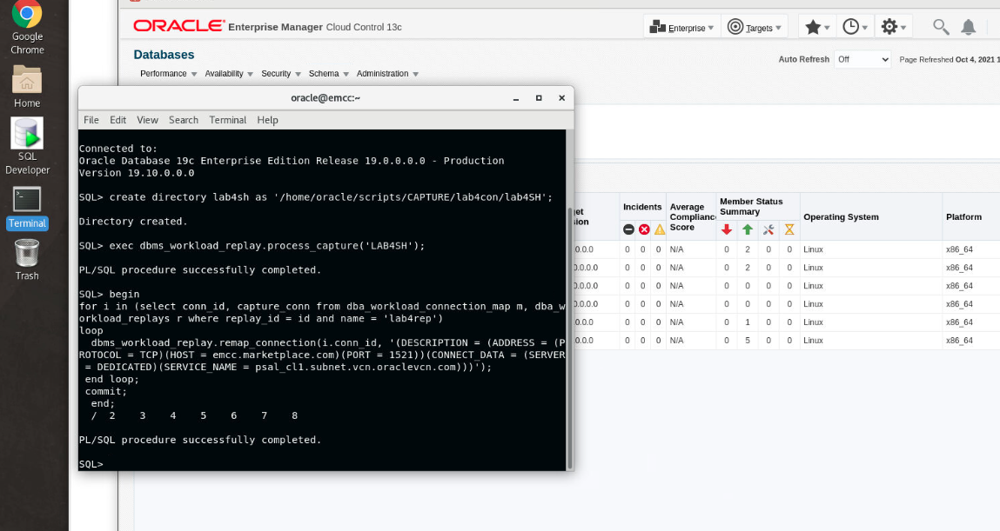

    - **Enter Name and Description**  in Create Task
    - **Click Add** in Workloads
    - **Pick Lab3SalesOE** Workload and
    - **Click Add** in Workloads
    - **Pick SH** Workload  

    

    - **Check** Create a new replay for this replay task
    - **Enter Name**
    - **Pick db19c.subnet.vcn.oraclevcn.com_PSAL_CL1** for  Database Target

    

    - **Click** Preprocess Workload

    

    - Use **SYS_DB19C** named credential for DB credential, use **ORACLE** for named credential for DB Host credential

    

    - **Check** Specify a file path
    - **/home/oracle/scripts/CAPTURE/lab4con** as Consolidated Replay Directory

    

    -


````

alter system set sga_max_size=6291456000 scope=spfile;
alter system set sga_target=6186598400  scope=spfile;
alter system set pga_aggregate_target=2988m  scope=spfile;

````


You have now learned how to work with Real Application Testing. As you can see there are Guided Workflows that will help you during your analysis and verify that you can implement new changes in production with confidence.

Details about newly published statistics can be found if you navigate **Schema** , to **Database Object** , to **Tables** , and Select tables for schema ‘STAT1’


This completes the Lab

Thank You!

## Want to Learn More?

  - [Oracle Enterprise Manager](https://www.oracle.com/enterprise-manager/)
  - [Enterprise Manager Documentation Library](https://docs.oracle.com/en/enterprise-manager/index.html)
  - [Database Lifecycle Management](https://docs.oracle.com/en/enterprise-manager/cloud-control/enterprise-manager-cloud-control/13.4/lifecycle.html)

## Acknowledgements
- **Author** - Björn Bolltoft, Oracle Enterprise Manager Product Management
- **Adapted for Cloud by** -  Rene Fontcha, Master Principal Solutions Architect, NA Technology
- **Last Updated By/Date** - Shefali Bhargava - Enterprise Manager Product Management, October 2020

## Need Help?
Please submit feedback or ask for help using our [LiveLabs Support Forum](https://community.oracle.com/tech/developers/categories/livelabsdiscussions). Please click the Log In button and login using your Oracle Account. Click the **Ask A Question** button to the left to start a *New Discussion* or *Ask a Question*. Please include your workshop name and lab name. You can also include screenshots and attach files. Engage directly with the author of the workshop.
If you do not have an Oracle Account, click [here](https://profile.oracle.com/myprofile/account/create-account.jspx) to create one.
