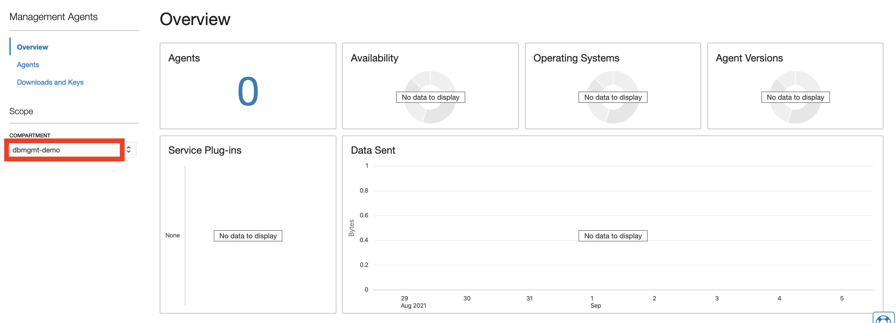
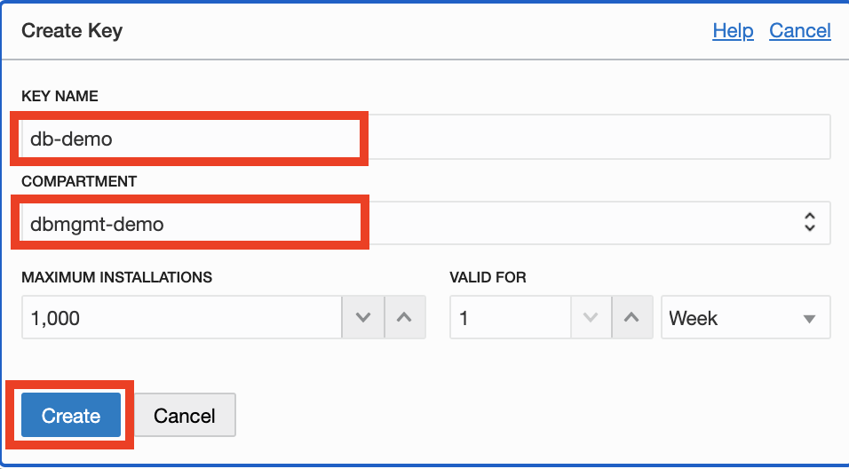
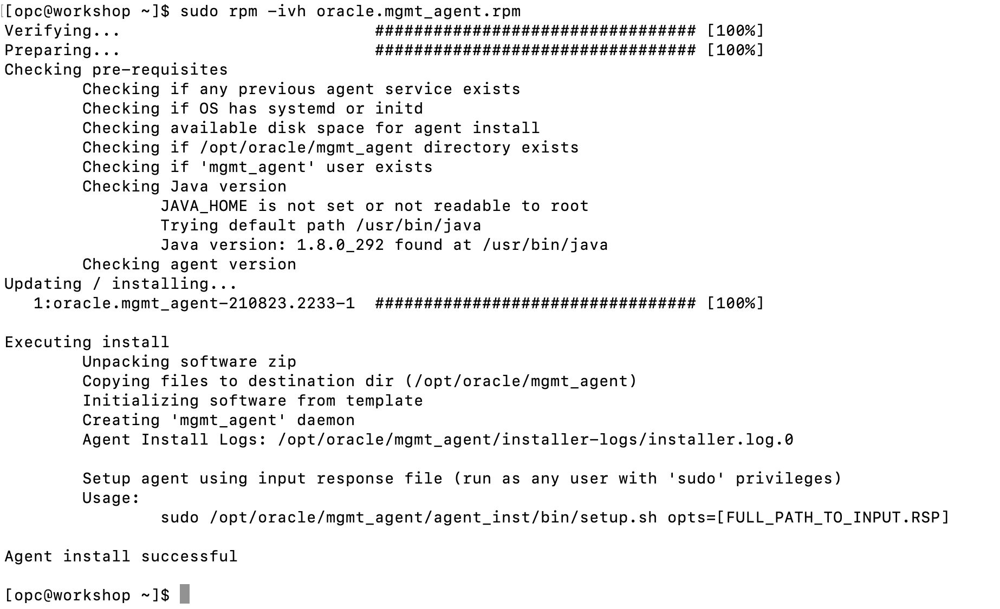
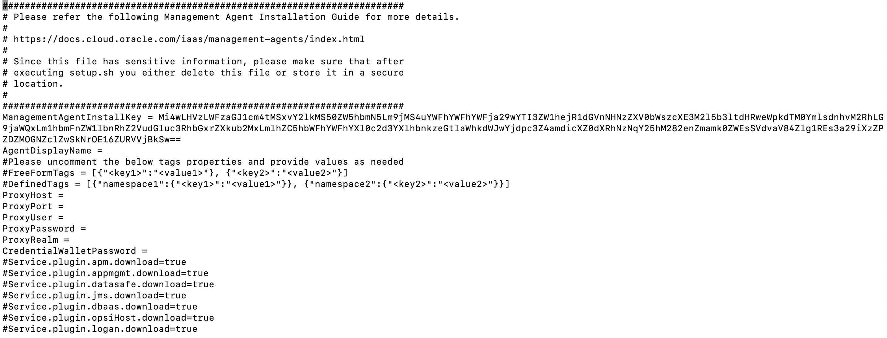
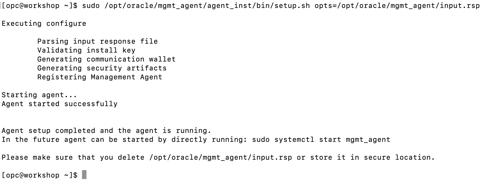

# Download and Install the Management Agent Software

## Introduction

In this lab, you will go through the steps to download and install the management agent to be used in the context of Database Management service.


Estimated Time: 20 minutes

### Objectives

-   Download and install the Management Agent.

### Prerequisites

This lab assumes you have completed the following labs:
* Lab: Generate SSH Key (FreeTier and Paid accounts)
* Lab: Environment Setup or Verify Setup
* Lab: Setup pluggable databases and workload
* Lab: Prerequisite: Create a dynamic group and policies for agent communication

## Task 1: Download the Lab Files

1.  Open up the terminal of your choice and login to the compute instance you created in the previous lab.

2.  Copy the following commands into your terminal.  These commands download the files needed to run the lab.

    *Note*: If you are running in windows using putty, ensure your Session Timeout is set to greater than 0

    ```
    <copy>
    cd /home/opc/
    wget https://objectstorage.us-ashburn-1.oraclecloud.com/n/idtskf8cjzhp/b/installer/o/Linux-x86_64/latest/oracle.mgmt_agent.rpm
    </copy>
    ```

## Task 2: Create an Agent Install Key

1.  You need to create an agent install key before performing the Management Agent installation. An agent install key is issued against your tenancy and validates the authenticity of the installation.

    a) Go to the **Menu** click **Observability & Management** and **Management Agent**.

    b) Select compartment **dbmgmt-demo** from the list of compartments on the left 

     

2.  On the Management Agents home page, click **Download and Keys** from the left menu to view the Agent Install Keys pane. The Agent Install Keys pane is displayed at the bottom of the page. 

    a) On the Agent Install Keys pane, click **Create Key** to create a key
    
    b) Enter the required details in the Create Key window 

    -  In the **Key Name** field, specify a name (db-demo) to identify the key.
    -  In the **Compartment** field, select the compartment **dbmgmt-demo** from the drop-down list. This is the compartment where the agent resource will be created.
    -  In the **Maximum Installs** field, specify a number that indicates the maximum number of installs that can be associated with the key. Default value is 1000.
    -  In the **Valid for** field, specify a number that indicates the period the key is valid for. Default value is 1 Week.
    -  Click **Create**.

         

3.  On the Agent Install Keys section, identify the row with the agent key named as **db-demo**. Click on the three dots and choose the option **Download Key to File** to save the install key to your local desktop.  

     


## Task 3: Install the agent 

1. Open up the terminal of your choice and login to the compute instance you created in the previous lab.
2. Copy the following commands into your terminal.  
    
    ```
    <copy>
    sudo rpm -ivh oracle.mgmt_agent.rpm
    </copy>
    ```
 

3. Create a response file named input.rsp using a text editor under /opt/oracle/mgmt\_agent. Copy the contents of the downloaded install key into input.rsp file. Note that you have switched to the mgmt\_agent user now. The agent installation process creates a new user called mgmt\_agent. All agent files are copied and installed by mgmt_agent user. After creating the response file, check the file permissions and ensure it has read permissions for all users.
  
    ```
    <copy>
    sudo -u mgmt_agent sh
    cd /opt/oracle/mgmt_agent    
    vi input.rsp
    </copy>
    ```

     

     

4. Update **AgentDisplayName** and **CredentialWalletPassword** as below in input.rsp. Password of the agent wallet that the user provides is a custom password for the wallet to store sensitive information. Password minimum length is 8 characters and must contain alphabetic characters combined with numbers or special characters.

    ```
    <copy>
    AgentDisplayName = dbm_demo
    CredentialWalletPassword = Passw0rd#
    </copy>
    ```
     


5. As **opc** user, configure the management agent using the response file. 

    ```
    <copy>
    sudo /opt/oracle/mgmt_agent/agent_inst/bin/setup.sh opts=/opt/oracle/mgmt_agent/input.rsp
    </copy>
    ```
 


## Task 4: Verify the Management Agent Installation

1. Go to the **Menu** click **Observability & Management** and **Management Agent**.
2. Click **Agents** from the left menu.
3. Select compartment **dbmgmt-demo** from the list of compartments on the left.
4. From the Agents list, look for the agent that was recently installed using the Created column which displays the date of the agent installation or the Host column which displays the host name where the agent was installed.

     


You may now proceed to the next lab.

## Acknowledgements

- **Author** - Vivek Verma, Principal Cloud Architect, North America Cloud Engineering
- **Contributors** - Vivek Verma, Sriram Vrinda, Pratima Chennupati
- **Last Updated By/Date** - Vivek Verma, September 2021
