# Setup Database Management for Oracle Cloud Databases

## Introduction

In this lab, you will go through the steps to setup Database Management for Oracle Cloud Databases.

Database Management service now also supports Oracle Databases, which are databases running on comanaged Oracle Cloud Database services, including bare metal, virtual machines, and Exadata Cloud.


Database Management features for Oracle Database service are available as part of two Management Options, which you can select when enabling Database Management.

The Full Management option includes all Database Management features for Oracle Database Enterprise Editions, including the following features. The Full Management option is also available for Oracle Database Standard Edition but doesn’t include Performance Hub features.

* Monitoring and managing capabilities for your fleet of databases
* SKU features, which include advanced Performance Hub features, such as automatic database diagnostic monitor (ADDM) and blocking sessions and other features, such as scheduled fobs, tablespace monitoring, and database parameters
* Features available as part of Basic Management

The Basic Management option includes the following features:

* 14 basic monitoring metrics, such as CpuUtilization, StorageAllocated, and UserCalls. These metrics are displayed in the OCI Monitoring service and on the Database Details page of the database after Database Management is enabled.
* Active session history (ASH) analytics and SQL monitoring features in Performance Hub for multitenant container databases (CDBs). These features are not available for pluggable databases.

Estimated Time: 50 minutes

### Objectives

Setup Database Management to monitor and manage Oracle Databases on the following Co-managed Oracle Database Cloud solutions:

-   Bare Metal and Virtual Machine DB Systems
    
-   Exadata Cloud Service

### Prerequisites

This lab assumes you have completed the following labs:
* Oracle Database running on Oracle Database Cloud Service - Please check documentation to [Create a DB System] ( https://docs.oracle.com/en-us/iaas/Content/Database/Tasks/creatingDBsystem.htm#create).

## Task 1: Oracle Cloud Database-related Prerequisite Tasks

1. Set database monitoring user credentials in the Oracle Cloud Database. You must grant a database user, for example, DBSNMP, the privileges required to monitor and manage the Oracle Cloud Database.

    Connect to DBCS database as **SYSDBA** and execute the following :

    ```
    <copy>
    GRANT CREATE PROCEDURE TO dbsnmp;
    GRANT SELECT ANY DICTIONARY, SELECT_CATALOG_ROLE TO dbsnmp;
    GRANT ALTER SYSTEM TO dbsnmp;
    GRANT ADVISOR TO dbsnmp;
    GRANT EXECUTE ON DBMS_WORKLOAD_REPOSITORY TO dbsnmp;
    alter user dbsnmp account unlock;
    alter user dbsnmp identified by "<password>";
    </copy>
    ```

    The database user password checks in Database Management require the password to be Federal Information Processing Standards (FIPS) compliant:
    
    * Password length must be between 14 to 127 characters.
    * Password must have at least one lowercase, one uppercase, one digit, and one special character.

    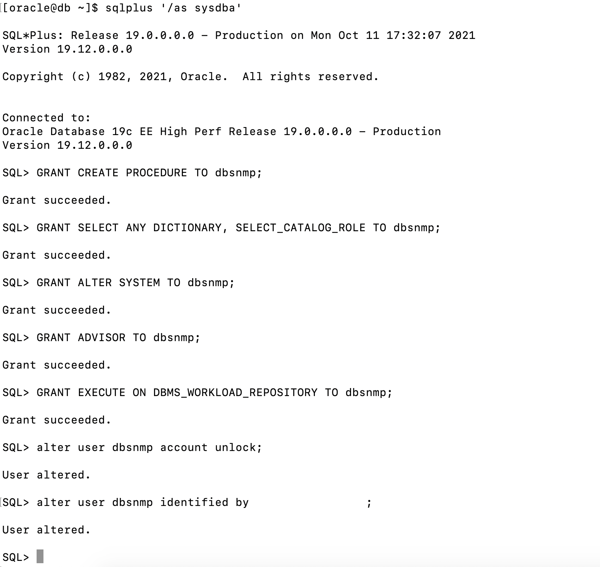 

## Task 2: Assign IAM permissions

1.  From the Oracle Cloud Console **Navigation menu** (aka hamburger menu) located in the upper left, click **Identity & Security**. Under **Identity**, click **Policies**.

    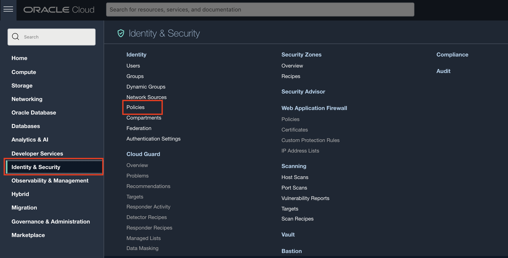 

2. Click **Create Policy**. On the **Create Policy** dialog enter:

     **Name:** Policy-for-dbmgmt
     
     **Description:** Policy for OCI DB Management
     
     **Compartment:** Select root
     
     Enable **Show manual editor**
     
     Enter following in **Policy Builder**:

    ```
    <copy>
    Allow service dpd to read secret-family in compartment dbmgmt-demo
    Allow service dpd to manage objects in compartment dbmgmt-demo
    Allow group dbmgmt-group to manage dbmgmt-family in tenancy
    Allow group dbmgmt-group to read database-family in tenancy
    Allow group dbmgmt-group to manage vnics in tenancy
    Allow group dbmgmt-group to use subnets in tenancy
    Allow group dbmgmt-group to use network-security-groups in tenancy
    Allow group dbmgmt-group to use security-lists in tenancy
    Allow group dbmgmt-group to manage secret-family in compartment dbmgmt-demo
    Allow group dbmgmt-group to read buckets in compartment dbmgmt-demo
    </copy>
    ```

     

    Click **Create**

## Task 3: Create OCI Vault

1.  From the Oracle Cloud Console **Navigation menu** (aka hamburger menu) located in the upper left, click **Identity & Security** and click **Vault**.

    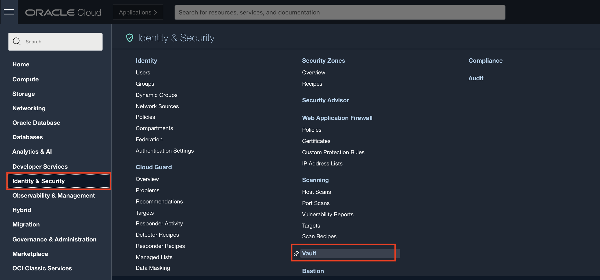 

2.  On the OCI Vaults page click **Create Vault**.

    

3.  Select "Create in Compartment" and enter "Name" : dgmgmt-vault

    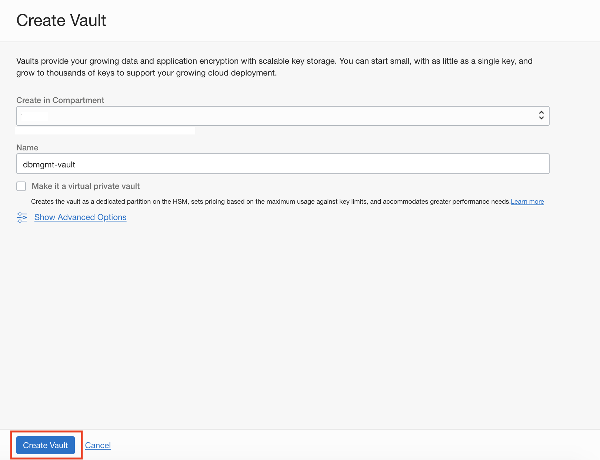

    Click **Create Vault**.

4.  Click on the vault **dgmgmt-vault**.

    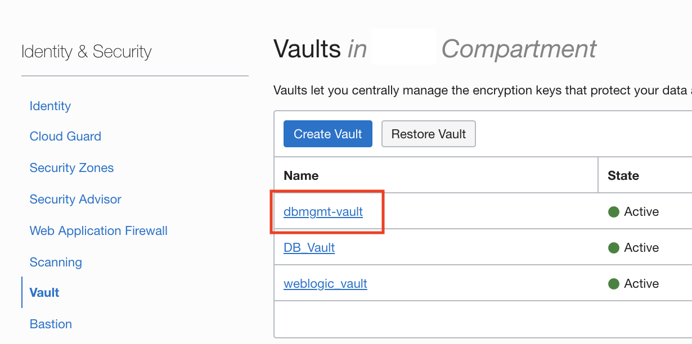

## Task 4: Create Key

1. On the **Vault Details** page click **Create Key**. On the **Create Key** page select all defaults and enter "Name" : dbmgmt-key.

    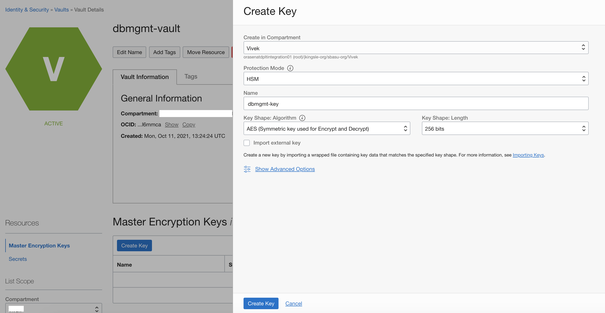

    Click **Create Key**.

2. On the **Vault Details** page confirm the State of key is "Enabled". From the left navigation pane click **Secrets**.

    

## Task 5: Create Secret

1. Click **Create Secret**. On the **Create Secret** page enter following :

    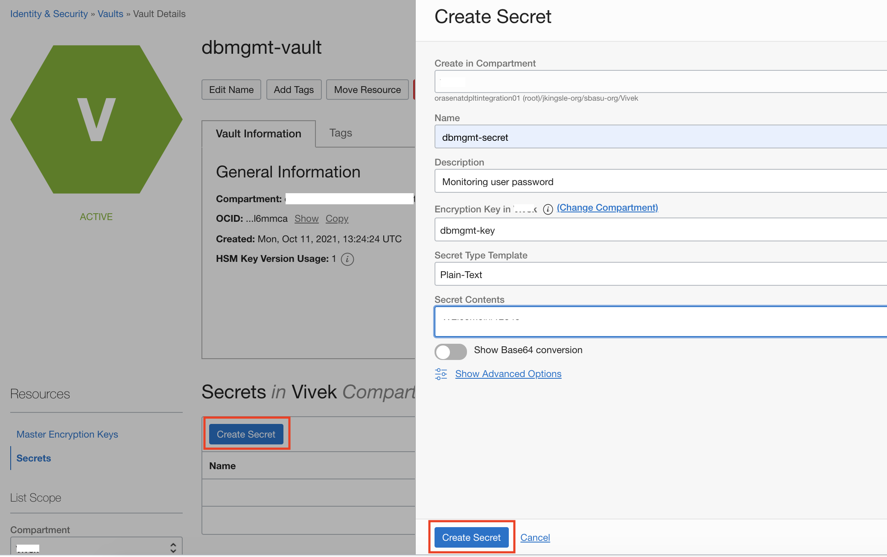

     **Create in Compartment:** Select Compartment Name

     **Name:** dbmgmt-secret
     
     **Description:** Monitoring user password
     
     **Encryption Key:** Select **dbmgmt-key**
     
     **Secret Type Template:** Select default
     
     **Secret Contents:** Enter the DBSNMP user password

    Click **Create Secret**.

2. Confirm the **Status** of **dbmgmt-secret** is **Active**.

    

## Task 6: Create a Database Management private endpoint

You must create a private endpoint to connect Database Management to an Oracle Cloud Database.

The private endpoint is a representation of Database Management in the VCN in which the Oracle Cloud Database can be accessed, and acts as a VNIC with private IP addresses in a subnet of your choice. The private endpoint need not be on the same subnet as the Oracle Cloud Database, although, it must be on a subnet that can communicate with the Oracle Cloud Database.

Refer [Create a Database Management Private Endpoint]( https://docs.oracle.com/en-us/iaas/database-management/doc/perform-database-management-prerequisite-tasks.html#GUID-AC816009-3FE9-42A1-A133-83281E0790FD) for best practices.


1.  From the Oracle Cloud Console **Navigation menu** (aka hamburger menu) located in the upper left, click **Observability & Management**. Under **Database Management**, click **Administration**.

    

2.  On the left pane on the **Administration** page, click **Private Endpoint** and select the compartment in which you want to create the private endpoint.

    

3.  On the **Private Endpoints** page, click **Create Private Endpoint**.

4. In the **Create Private Endpoint** dialog:

    

     **Name:** dbmgmtpe

     **Description:** Database Management Private Endpoint

     **Choose Compartment:** Select the compartment in which you want the private endpoint to reside.

     **Use this private endpoint for RAC databases:** Select this check box if you want to create a Database Management private endpoint for RAC Oracle Cloud Databases in the Virtual Machine DB system and Exadata Cloud service. The Database Management private endpoint for RAC Oracle Cloud Databases is a limited resource and you can create only one such private endpoint in your tenancy. Leave this unchecked.

     **Virtual Cloud Network :** Select the VCN in which the Oracle Cloud Database can be accessed. Select labVCN.

     **Subnet :** Select a subnet within the selected VCN. Select lab-public-subnet1.

     **Network Security Group:** Optionally, select an NSG added to the Bare Metal or Virtual Machine DB system or the Exadata VM cluster. You can also click + Another Security Group to select another NSG. Leave as default.

     Click **Create Private Endpoint**.

5.  To view details of the private endpoint, click its name.

    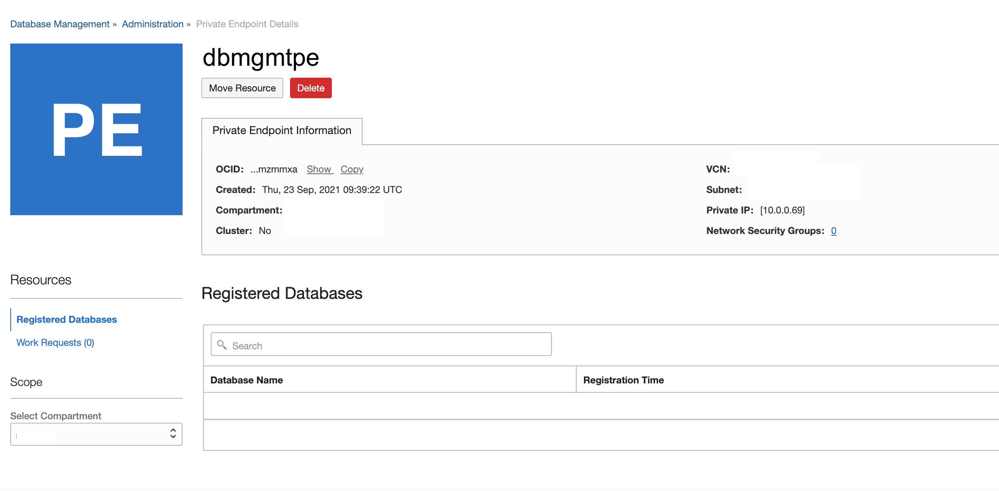

## Task 7: Add security rules to enable communication

Add the following stateful security rules to the Security List:

Ingress rule for the Virtual Machine DB system's VCN: The Virtual Machine DB system's VCN (on port 1521) can receive incoming traffic from the Database Management private IP address (10.0.0.69/32) from any port.

Egress rule for the Database Management private endpoint: The Database Management private IP address (from any port) can send requests to the Virtual Machine DB system's VCN (10.0.0.0/16) on port 1521.

1.  From the Oracle Cloud Console **Navigation menu** (aka hamburger menu) located in the upper left, click **Oracle Database** and then **Bare Metal, VM and Exadata**.

    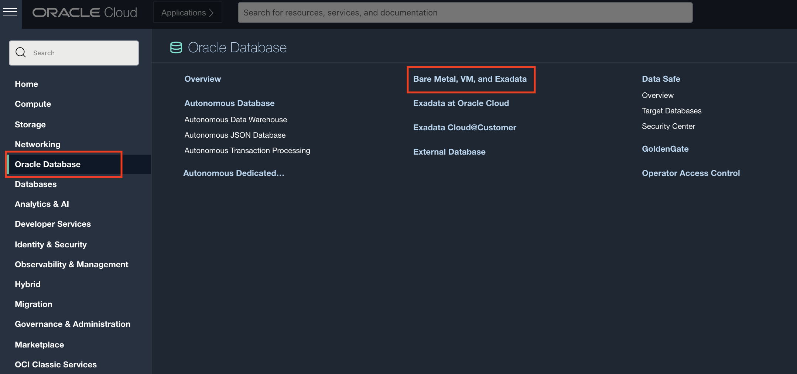

2.  Click on DB System **DBCS**.

    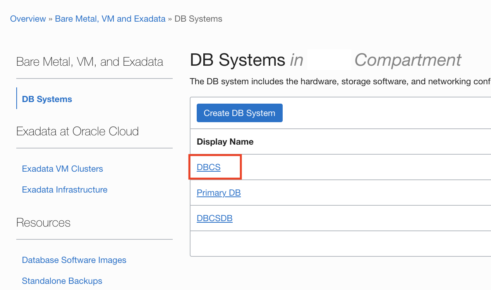

3.  On the **DB System Details** page click **labVCN**.

    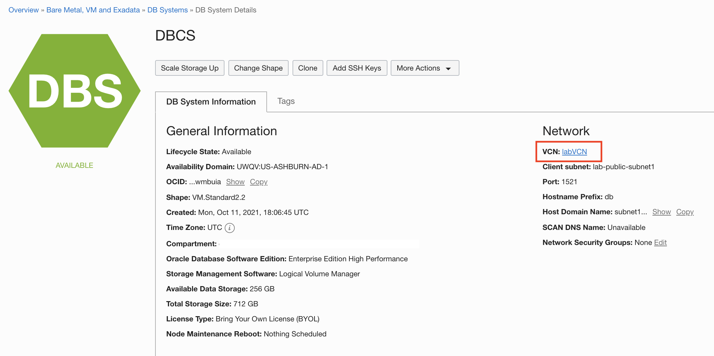

4.  **Virtual Cloud Network Details** page has a list of subnets present under this VCN. Click **lab-public-subnet1** subnet.

    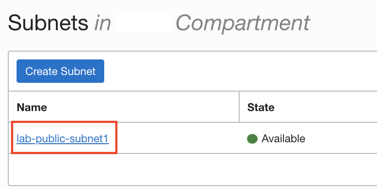

5.  On the **Subnet Details** page, click **Default Security List for labVCN** to go to **Security List Details** page which will have a list of Security List Ingress and Egress Rules.

    

6.  Click **Add Ingress Rules** to add a Ingress rule for the Virtual Machine DB system's VCN. The Virtual Machine DB system's VCN (on port 1521) can receive incoming traffic from the Database Management private IP address (10.0.0.69/32) from any port.

     **Source Type:** Select **CIDR**

     **Source CIDR:** 10.0.0.69/32

     **IP Protocol:** Select **TCP**

     **Source Port Range:** Leave blank

     **Destination Port Range:** 1521

     **Description:** Connection from DB Management Private Endpoint

     Click on **Add Ingress Rules**.

    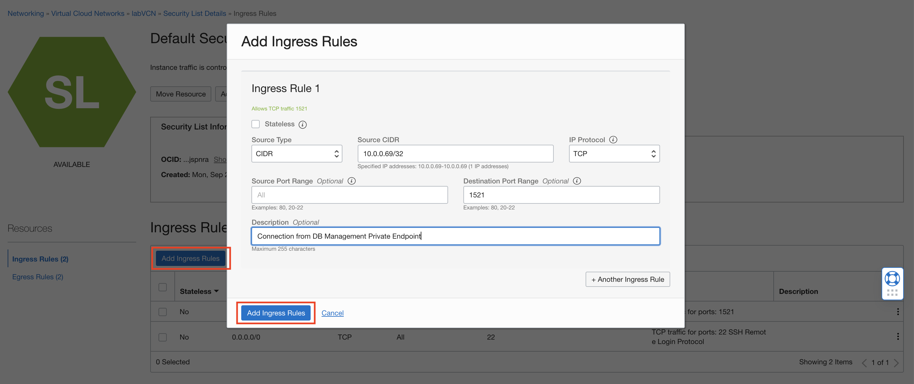

7.  From the Oracle Cloud Console **Navigation menu** (aka hamburger menu) located in the upper left, click **Observability & Management**. Under **Database Management**, click **Administration**.

    

8.  On the left pane on the **Administration** page, click **Private Endpoint** and click **dbmgmtpe** under Private Endpoints.

9.  On the **Private Endpoint Details** page, click **lab-public-subnet1**.

    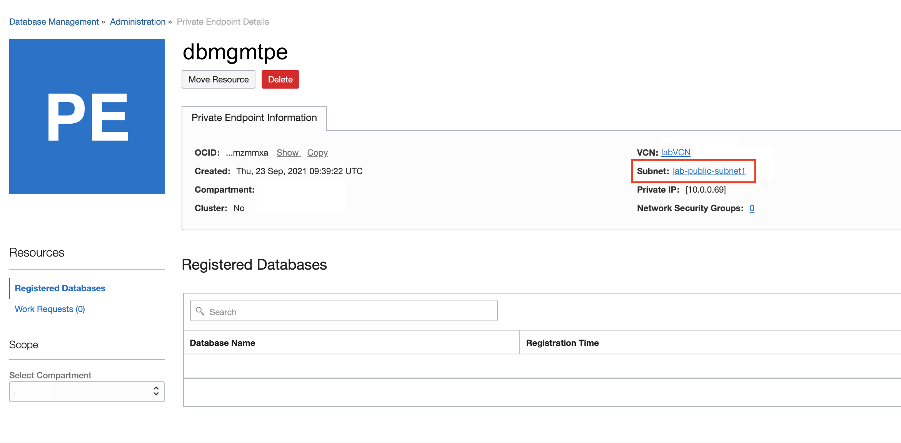

10.  On the **Subnet Details** page, click **Default Security List for labVCN** to go to **Security List Details** page which will have a list of Security List Ingress and Egress Rules.

    

11.  Click **Egress Rules** on the left navigation pane and then click **Add Egress Rules**. Enter following details:

     **Source Type:** Select **CIDR**

     **Source CIDR:** 10.0.0.0/16

     **IP Protocol:** Select **TCP**

     **Source Port Range:** Leave blank

     **Destination Port Range:** 1521

     **Description:** Egress from DB Management PE to DBCS

     Click on **Add Egress Rules**.

    


## Task 8: Enable Database Management for Oracle Cloud Databases

1.  From the Oracle Cloud Console **Navigation menu** (aka hamburger menu) located in the upper left, click **Observability & Management**. Under **Database Management**, click **Administration**.

    

2.  On the **Managed Databases** page, click **Enable Database Management**.

    

3.  On the **Enable Database Management** dialog:

    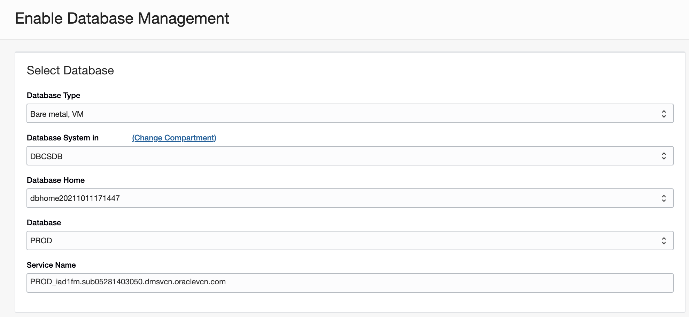

     **Database Type:** Select **Bare metal, VM**

     **Database System:** DBCSDB

     **Database Home:** Select default.
     
     **Database:** Select default.

     **Service Name:** Select default.

    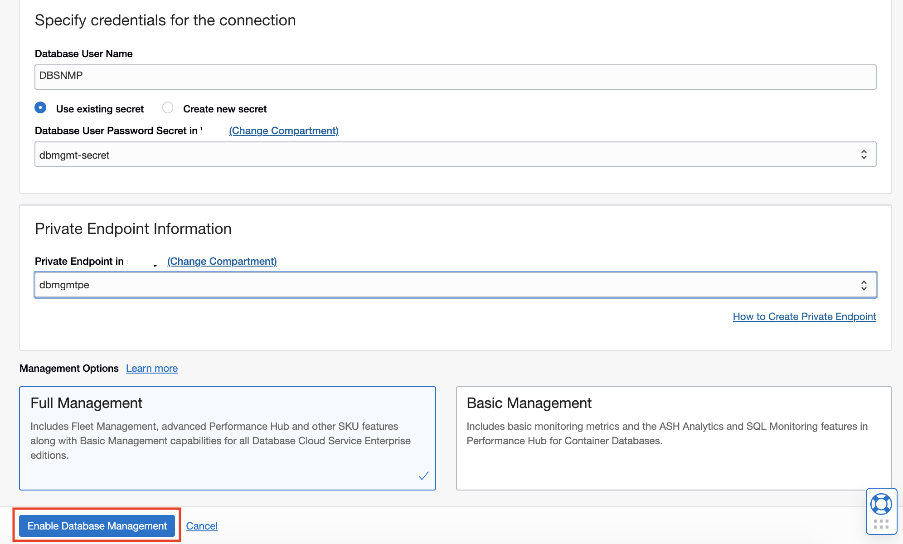

     **Database User Name:** DBSNMP

     **Use existing secret or Create new secret:** Select **Use existing secret**.

     **Database User Password Secret:** Select **dbmgmt-secret**.

     **Private Endpoint:** Select **dbmgmtpe**

     **Management Options:** Select **Full Management**. For information on Management Options, see [About Management Options]( https://docs.oracle.com/en-us/iaas/database-management/doc/enable-database-management.html#GUID-82E59C37-A1EA-4355-8216-769D22F8EFDD).

     Click **Enable Database Management**.

4.  A confirmation message with a link to the Oracle Cloud Database's Work Requests page is displayed. Click the link to monitor the progress of the work request.

    

5.  You can verify if Database Management is successfully enabled on the following pages:

* Database Management Administration page: Select the appropriate option in the Deployment Type drop-down list. After Database Management is enabled, the Oracle Cloud Database is listed as a Managed Database. Click Database Name **PROD** to view **Managed Database Details**.

    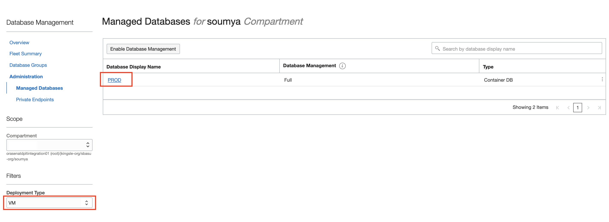

    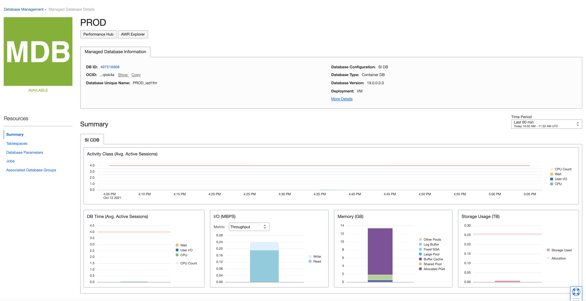

* Database Details page of the Oracle Cloud Database: **Database Management** is set to **Full**. Select **Metrics** on the left pane under Resources and check if the database metrics are displayed.

    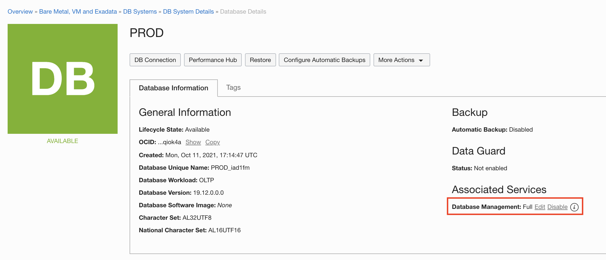

    

    For ASH Analytics & SQL Monitoring click on **Performance Hub** on the Database Details page. **Performance Hub** page on Database Details will be a basic one.

    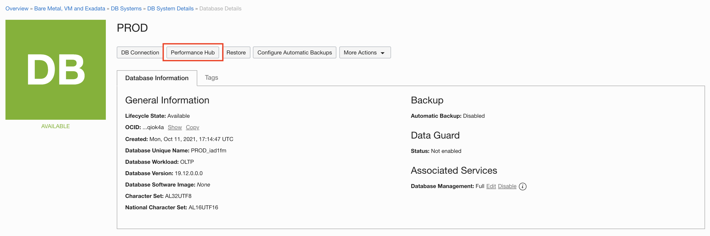    

## Acknowledgements

- **Author** - Vivek Verma, Principal Cloud Architect, North America Cloud Engineering
- **Contributors** - Vivek Verma, Sriram Vrinda, Pratima Chennupati
- **Last Updated By/Date** - Vivek Verma, September 2021
