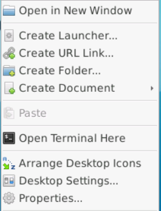
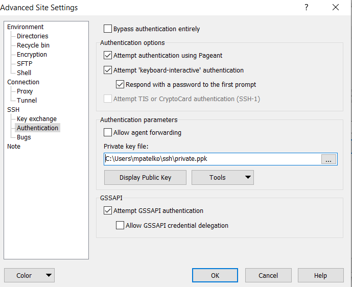
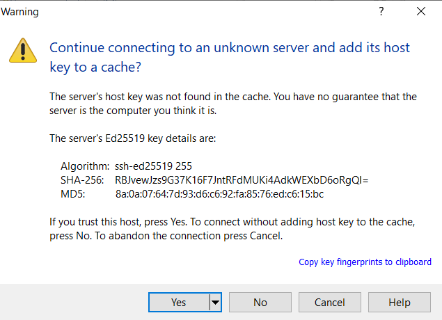

# Run Faceswap (terminal and GUI)

## Introduction

Now that we made sure that our GPU machine supports Tensorflow (see Lab 4), we can go ahead and run Faceswap. In the lab, you will learn to copy your training data to the compute instance, extract the faces from the training data, train the GAN with the extracted faces and to convert your video with the swapped face.

### Objectives

- Copy your training data (photos or videos with the faces you want to swap) to the compute instance
- [Extract](https://forum.faceswap.dev/viewtopic.php?f=25&t=27) the faces from the photos or videos
- [Train](https://forum.faceswap.dev/viewtopic.php?f=27&t=146) the GAN with the extracted faces
- [Convert](https://forum.faceswap.dev/viewtopic.php?f=24&t=1083) and swap face A in your source video with face B

### What Do You Need?

- Complete Lab 1 to Lab 3
- Complete Lab 4 to make sure that your GPU machine supports Tensorflow, otherwise the Faceswap GAN will not utilize the GPU
- Complete Lab 5

## **Step 1:** Connect to the VNC Desktop

1.  Create a SSH tunnel to the VNC server using the following command (where private-key is your private OpenSSH key and public_ip the private IP address from your Ubuntu compute instance):

```
<copy>ssh -i private-key ubuntu@public_ip -C -L 5901:127.0.0.1:5901</copy>
```

2. Connect to **127.0.0.1:5901** using your VNC client.
   

3. When prompted for password, enter the password created during the VNC server configuration.
   

Your remote Ubuntu desktop will open up.


## **Step 2:** Open Faceswap on the VNC Desktop

1.  Open a terminal by right-clicking on the desktop and selecting **Open Terminal here**.
    

    The terminal will open up on your VNC desktop.

    

If it is not possible to open a terminal, run the following commands in the terminal on your local machine.

```
<copy>sudo apt remove gnome-terminal</copy>
```

```
<copy>sudo apt install gnome-terminal</copy>
```

2. Navigate to your faceswap folder.

```
<copy>cd cd ../faceswap/</copy>
```

Launch the Faceswap GUI by executing the following command:

```
<copy>bash faceswap_gui_launcher.sh</copy>
```

The Faceswap GUI opens up.


## **Step 3:** Copy your training data to the compute instance

To train the Faceswap GAN, you need to provide pictures or a video of person A and person B from who you want to swap faces. In this example, we will copy two videos from person A and person B from our local machine to the remote Ubuntu instance using WinSCP.

1. Download and install [WinSCP](https://winscp.net/eng/download.php) on your local machine.

2. Open WinSCP on your local machine and open the folder with the videos on the left side.F
   

3. Click on **New Site**. A new window will pop up.
   

4. Fill in the the _IP address_ of your instance in **hostname** field and _Ubuntu_ in the **user name** field as shown below.
   
5. Click on the **Advanced...** button.
6. Click on **Authentication** under **SSH** on the left part of the window.
7. Click on the three dots and select your SSH private key file in your folder as shpwn below.
   
8. Click **OK**
9. Click **Login**
10. A warning screen pops up. Click **YES**.
    
11. You can see your local files folder on the left and your remote files folder on the right part of the WinSCP tool.
    
12. Create the folder **src** in your remote folder by right clicking in the right field, selecting **New -> Directory** and typing the name of your folder **src**.
13. Select your two videos on the right side (local machine) and drag them to the **src** folder on the left side (remote machine).

## **Step 4:** Extract the faces from the photos and videos

The first step, is to extract the faces from video A and video B.
In the Faceswap GUI,

## **Step 5:** Train the GAN

## **Step 6:** Convert your video with the swapped face

## **Acknowledgements**

- **Created By/Date** - Maria Patelkou, HPC Solution Architect, Oracle Proposal to Production programme, March 2021
- **Last Updated By/Date** - Maria Patelkou, HPC Solution Architect, Oracle Proposal to Production programme, March 2021

## Need Help?

Please submit feedback or ask for help using our [LiveLabs Support Forum](https://community.oracle.com/tech/developers/categories/livelabsdiscussions). Please click the **Log In** button and login using your Oracle Account. Click the **Ask A Question** button to the left to start a _New Discussion_ or _Ask a Question_. Please include your workshop name and lab name. You can also include screenshots and attach files. Engage directly with the author of the workshop.

If you do not have an Oracle Account, click [here](https://profile.oracle.com/myprofile/account/create-account.jspx) to create one.
