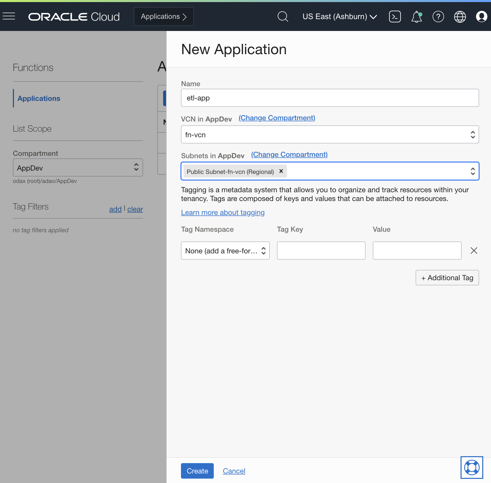
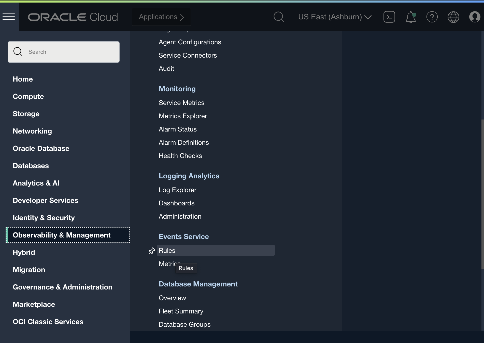
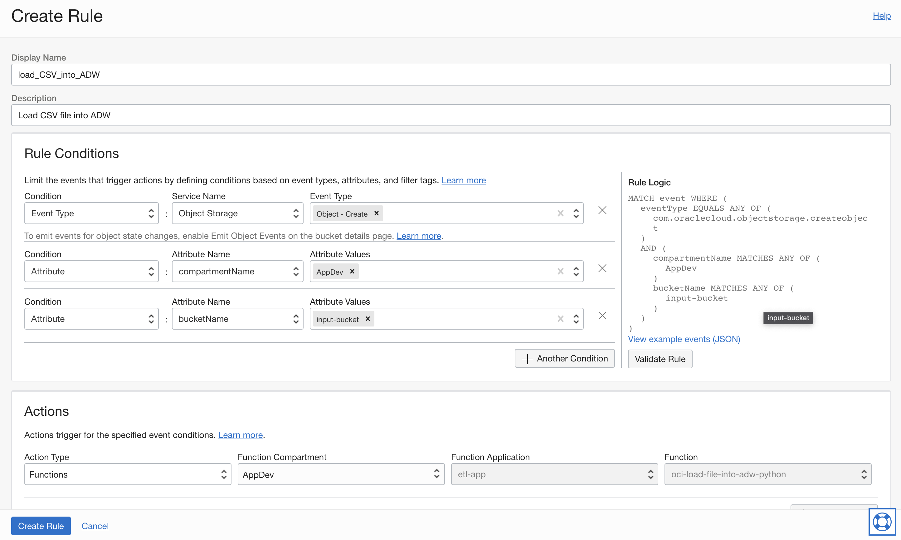

# Functions

## Introduction

In this lab you will create the Oracle Function and trigger the function whenever a file is uploaded to the Object Storage. The function will take the file and write it to the database.

Estimated time: 20 minutes

### Objectives

- Create an application.
- Deploy a Function.
- Create an Event rule.
- Test the created Function

### Prerequisites

- Your Oracle Cloud Trial Account
- Completed the **Prerequisites for Functions**
- Completed the **OCI Services**

## **STEP 1:** Create an application

In this step, you will create an application and set up Fn CLI in the OCI Cloud Shell.

1. Under Solutions and Platform, select **Developer Services** and click **Functions**.
1. Select your development compartment from the **Compartment** list.
1. Click **Create Application**.
1. For name, enter `etl-app`.
1. Select the VCN you created earlier (e.g. `fn-vcn`).
1. Select the public subnet.
1. Click **Create**.
1. Click on the created application to open the application details.
1. Click the **Getting Started** link and follow the **Begin your Cloud Shell session** and **Setup fn CLI on Cloud Shell** sections in the **Cloud Shell Setup**.



This involves launching Cloud Shell, updating the Fn context, generating an auth token for the registry, and logging into the Oracle Cloud Infrastructure Registry.

## **STEP 2:** Deploy the function

In this step, you will clone the functions source code repository and use the `fn deploy` command to build the Docker image, push the image to OCIR, and deploy the function to Oracle Functions in your application.

1. From the Console UI, open the Cloud Shell.
1. Clone the Functions source code repository:

    ```shell
    <copy>
    git clone https://github.com/oracle/oracle-functions-samples.git
    </copy>
    ```

1. Go to the `samples/oci-load-file-into-adw-python` folder:

    ```shell
    <copy>
    cd oracle-functions-samples/samples/oci-load-file-into-adw-python
    </copy>
    ```

1. Deploy the function to the `etl-app`:

    ```shell
    <copy>
    fn -v deploy --app etl-app
    </copy>
    ```

After you deploy the function, you need to set function configuration values so the function knows how to connect to the Autonomous Database.

1. Using the Fn CLI, set the following configuration values. Make sure you replace the `[ORDS_BASE_URL]` and `[DB_PASSWORD]` with your values:

    ```shell
    <copy>
    fn config function etl-app oci-load-file-into-adw-python ords-base-url [ORDS_BASE_URL]
    fn config function etl-app oci-load-file-into-adw-python db-schema admin
    fn config function etl-app oci-load-file-into-adw-python db-user admin
    fn config function etl-app oci-load-file-into-adw-python dbpwd-cipher [DB-PASSWORD]
    fn config function etl-app oci-load-file-into-adw-python input-bucket input-bucket
    fn config function etl-app oci-load-file-into-adw-python processed-bucket processed-bucket
    </copy>
    ```

## **STEP 3:** Create an Event rule

In this step, you will configure a Cloud Event to trigger the function when you drop the files into the `input-bucket`.

1. From Console UI, open navigation and select **Observability & Management** and click **Events Service** > **Rules**.
    
1. Select your development compartment from the **Compartment** list. e.g.: **AppDev**
1. Click **Create Rule**.
1. For display name, enter `load_CSV_into_ADW`.
1. For description, enter `Load CSV file into ADW`.
1. Create three rules. You can click **Another Condition** to add more conditions:

    | Condition | Service/Attribute Name | Event Type/Attribute Values |
    | --- | --- | --- |
    | Event Type | Object Storage | Object - Create | 
    | Attribute | compartmentName | <YOUR_DEVELOPMENT_COMPARTMENT> |
    | Attribute | bucketName | input-bucket |

1. Under Actions, select **Functions**:
    - For function compartment, select your development compartment.
    - For function application, select `etl-app`.
    - For function, select `oci-load-file-into-adw-python`.

1. Click **Create Rule**.



## **STEP 4:** Test the function

To test the function, you can upload a `.csv` file to the `input-bucket`. You can do that from the Console UI or the Cloud Shell using the OCI CLI.

1. Open the Cloud Shell.
1. Go to the functions folder:

    ```shell
    <copy>
    cd ~/oracle-functions-samples/samples/oci-load-file-into-adw-python
    </copy>
    ```

1. Use the OCI CLI to upload `file1.csv` to the `input-bucket`:

    ```bash
    $ oci os object put  --bucket-name input-bucket --file file1.csv
    Uploading object  [####################################]  100%
    {
      "etag": "607fd72d-a041-484c-9ee0-93b9f5488084",
      "last-modified": "Tue, 20 Oct 2020 18:03:50 GMT",
      "opc-content-md5": "O8mZv0X2gLagQGT5CutWsQ=="
    }
    ```

To see the data in the database, follow these steps:

1. From the OCI console, navigate to **Autonomous Data Warehouse**.
1. Select your development compartment from the **Compartment** list.
1. Click on the database name (`funcdb`).
1. Click the **Service Console**.
1. Click **Development** link from the side bar.
1. Click **Database Actions**.
1. Use **ADMIN** and the admin password to authenticate.
1. Click **SQL** to get to the worksheet.
1. In the worksheet, enter the following query:

    ```shell
    <copy>
    select UTL_RAW.CAST_TO_VARCHAR2( DBMS_LOB.SUBSTR( JSON_DOCUMENT, 4000, 1 )) AS json from regionsnumbers
    </copy>
    ```

1. Click the green play button to execute the query.

1. The data from the CSV file is in the **Query Result** tab.

This concludes this lab.

## Acknowledgements

- **Author** - Greg Verstraeten
- **Contributors** -  Peter Jausovec, Prasenjit Sarkar, Adao Junior
- **Last Updated By/Date** - Adao Junior, October 2020
