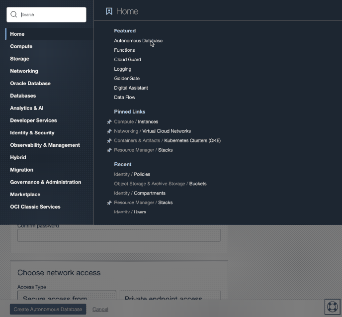

# Functions

## Introduction

In this lab you will create an Object Storage Bucket and Autonomous Database that will be used by the Function.

Estimated time: 10 minutes

### Objectives

- Create Object Storage Bucket.
- Create the IAM policy for the Function to access the Bucket
- Create an Autonomous Data Warehouse Database.

### Prerequisites

- Your Oracle Cloud Trial Account
- Completed the **Prerequisites for Functions**

## **STEP 1:** Create Object Storage Bucket

You need a `input-bucket` bucket in Object Storage. You will use the `input-bucket` to drop-in the CSV files. The function will process the file and import them into Autonomous Data Warehouse.

Let's create the `input-bucket` first:

1. Click the **Navigation Menu** in the upper left, navigate to **Storage** and select **Buckets** under **Object Storage and Archive Storage**.

 

1. Select your development compartment (AppDev) from the **Compartment** list.
1. Click the **Create Bucket**.
1. Name the bucket **input-bucket**.
1. Select the **Standard** storage tier.
1. Check the **Emit Object Events** check box.
1. Click **Create Bucket**.


## **STEP 2:** Create IAM policies

Create a new policy that allows the dynamic group (`functions-dynamic-group`) to manage objects in the bucket.

1. Click the **Navigation Menu** in the upper left, navigate to **Identity & Security** and select **Policies**.

 

1. Click **Create Policy**.
1. For name, enter `functions-buckets-policy`.
1. For description, enter `Policy that allows functions dynamic group to manage objects in the bucket`.
1. Under Compartment, select `AppDev` (Or any other compartment that you created on the previous lab)
1. Go to the Policy Builder section and turn on the `Show manual editor`.
1. Enter on the textbox the policy bellow:

    `Allow dynamic-group functions-dynamic-group to manage objects in compartment [compartment-name] where target.bucket.name='input-bucket'`

    Note: the `compartment-name` is your development compartment (the one where you created the VCN and Function Application).

    Example using AppDev Compartment:

    ```shell
    <copy>
    Allow dynamic-group functions-dynamic-group to manage objects in compartment AppDev where target.bucket.name='input-bucket'
    </copy>
    ```

1. Click **Create**.


## **STEP 3:** Create an Autonomous Data Warehouse

The function accesses the Autonomous Database using SODA (Simple Oracle Document Access) for simplicity. You can use the other type of access by modifying the function.

1. Open the navigation menu, select **Autonomous Data Warehouse**.
1. Click the **Navigation Menu** in the upper left, navigate to **Oracle Database** and select **Autonomous Data Warehouse**.

 

1. Click **Create Autonomous Database**.
1. From the list, select your development compartment.
1. For display name and database name, enter `funcdb`.
1. For the workload type, select **Data Warehouse**.
1. For deployment type, select **Shared Infrastructure**.
1. Enter the admin password. Make a note on the password, as you will need on the next lab.
1. Choose license type to **License Included**.
1. Click **Create Autonomous Database**.

    

    Wait for OCI to provision the Autonomous Database, and then click the **Service Console** button.

1. Click **Development** from the sidebar.
1. Under RESTful Services and SODA, click **Copy URL**.
1. From your OCI Cloud Shell (If using another terminal, you need to make sure you have all tools to test or alternatives), create the collection called `regionsnumbers` by running the command below. Make sure you replace the `<ORDS_BASE_URL>` with the value you copied in the previous step, and `<DB-PASSWORD>` with the admin password you set when you created the Autonomous Database.

    ```shell
    <copy>
    export ORDS_BASE_URL=<ORDS_BASE_URL>
    curl -X PUT -u 'ADMIN:<DB-PASSWORD>' -H "Content-Type: application/json" $ORDS_BASE_URL/admin/soda/latest/regionsnumbers
    </copy>
    ```

1. To double check collection was created, you can list all collections. The output should look similar as below:

    ```bash
    $ curl -u 'ADMIN:<DB-password>' -H "Content-Type: application/json" $ORDS_BASE_URL/admin/soda/latest/

    {"items":[{"name":"regionsnumbers","properties":{"schemaName":"ADMIN","tableName":"REGIONSNUMBERS","keyColumn":{"name":"ID","sqlType":"VARCHAR2","maxLength":255,"assignmentMethod":"UUID"},"contentColumn":{"name":"JSON_DOCUMENT","sqlType":"BLOB","jsonFormat":"OSON"},"versionColumn":{"name":"VERSION","type":"String","method":"UUID"},"lastModifiedColumn":{"name":"LAST_MODIFIED"},"creationTimeColumn":{"name":"CREATED_ON"},"readOnly":false},"links":[{"rel":"canonical","href":"https://.../ords/admin/soda/latest/regionsnumbers"}]}],"hasMore":false}
    ```

Do not close the OCI Cloud Shell, as you will be using ont he next lab.

You may now [proceed to the next lab](#next).

## Acknowledgements

- **Author** - Greg Verstraeten
- **Contributors** -  Peter Jausovec, Prasenjit Sarkar, Adao Junior
- **Last Updated By/Date** - Adao Junior, July 2021
