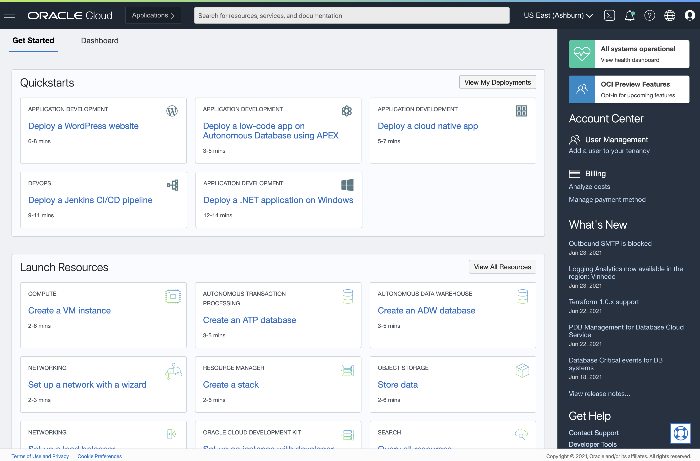
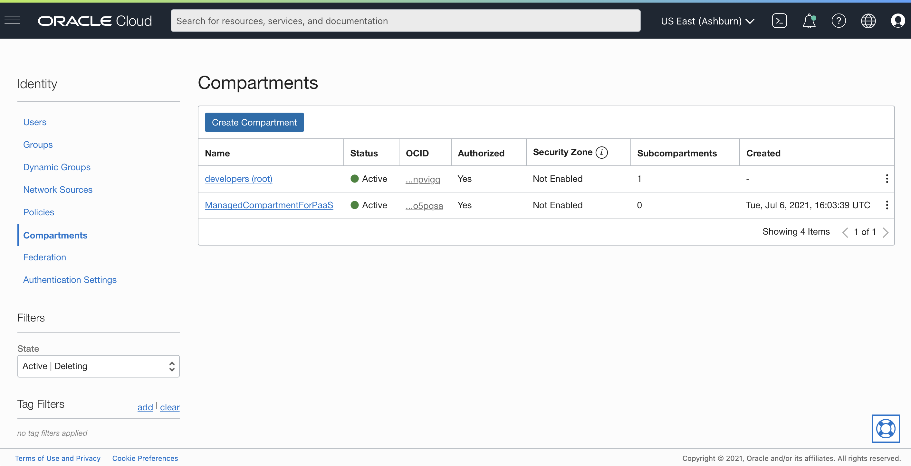
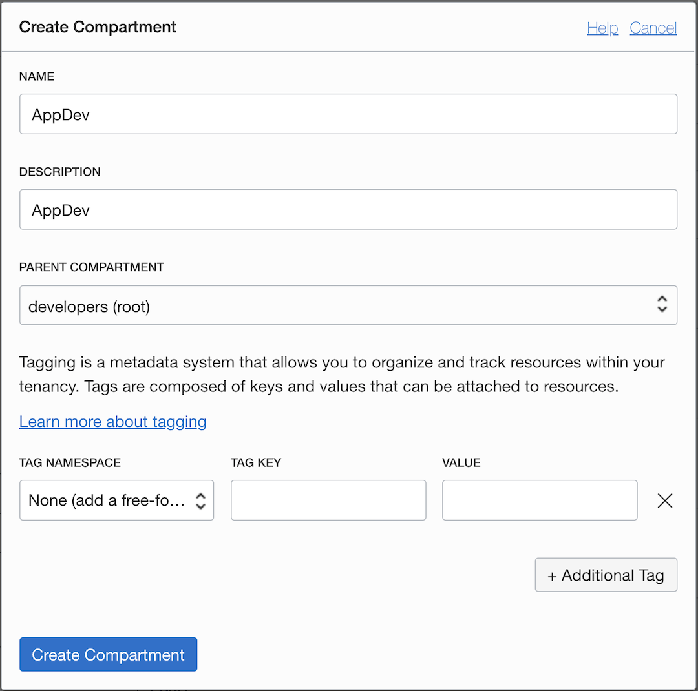
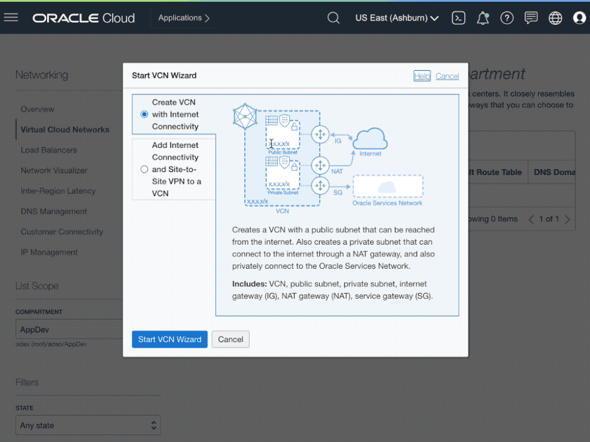
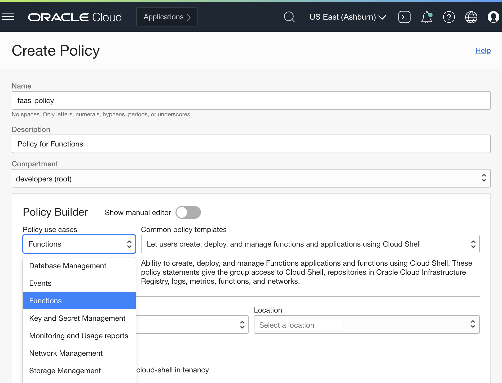
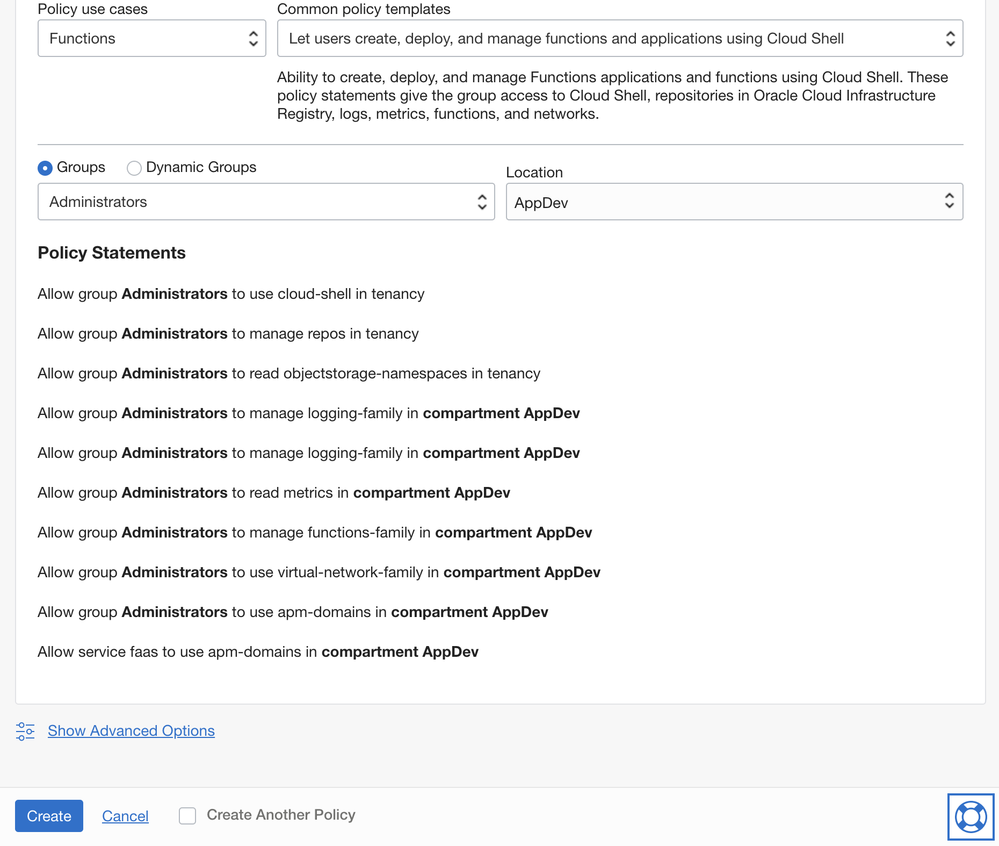
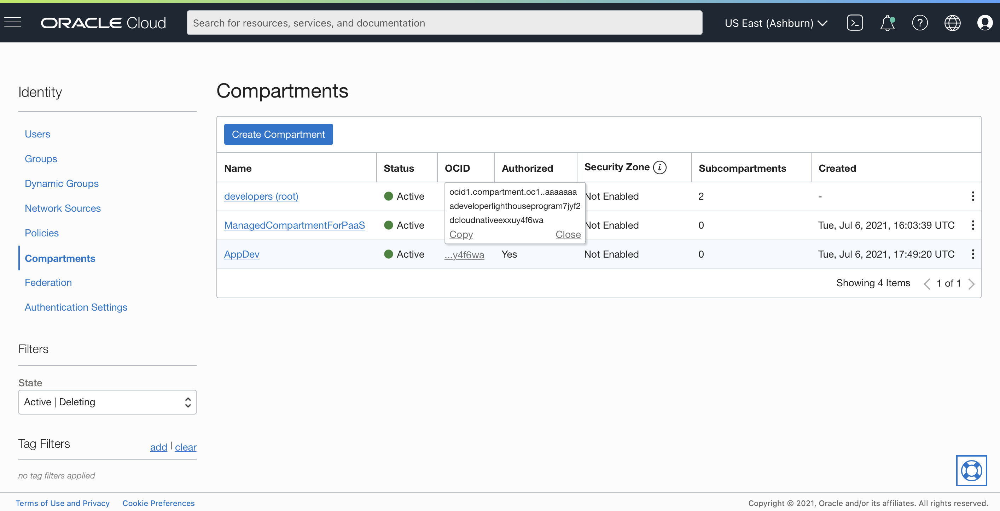

# Prerequisites for Functions

## Introduction

The following steps represents the prerequisites for the Functions Lab.

Estimated time: 10 minutes

### Objectives

- Log into OCI Tenancy.
- Create a compartment if not done yet.
- Create a VCN if not done yet.
- Create the policies to use Oracle Functions and to allow Functions to use OCI resources.
- Create a Dynamic Group.

### Prerequisites

- Your Oracle Cloud Trial Account

## **STEP 1:** Log into OCI Tenancy

   Log in to your OCI dashboard and retrieve information required to create resources.

1. Once you log in you will see a page similar to the one below.

  

## **STEP 2:** Create compartment

If you want to use an existing compartment, skip to the next step. Otherwise, follow the steps.

1. Click the **Navigation Menu** in the upper left, navigate to **Identity & Security** and select **Compartments**.

  

1. From this screen, you will see a list of compartments, click **Create Compartment**.

  

1. Enter the following:
      - Name: Enter **"AppDev".**
      - Description: Enter a description (required), for example: "AppDev compartment for the getting started tutorial". Avoid entering confidential information.
      - Parent Compartment: Select the compartment you want this compartment to reside in. Defaults to the root compartment (or tenancy).
      - Click **Create Compartment**.
      - Your compartment is displayed in the list.

  

Now you are ready to move on to Step 3.

## **STEP 3:** Create VCN and subnets

If a suitable VCN in which to create network resources doesn't exist already, log in to the Console as a tenancy administrator and then:

1. Click the **Navigation Menu** in the upper left, navigate to **Networking** and select **Virtual Cloud Networks**.

  

1. Choose a compartment from the previous step.
1. Click **Start VCN Wizard**, then **VCN with Internet Connectivity**, then **Start VCN Wizard**.
1. Enter a name for the new VCN (for example: `fn-vcn`), click **Next**, and then click **Create** to create the VCN along with the related network resources.

  

## **STEP 4:** Create policy for Oracle Functions Service

Log in to the Console as a **tenancy administrator** and under Governance and Administration, and do the following:

1. Click the **Navigation Menu** in the upper left, navigate to **Identity & Security** and select **Policies** under the **Identity** section.

  

1. Select the tenancy's **root compartment**
1. Click **Create Policy**.
1. For name, enter `faas-policy`.
1. For description, enter `Policy for Functions`.
1. Under Compartment, select `root`
1. Go to the Policy Builder section and Under Policy Use Cases type, select Functions
  
1. Under Common policy templates use the default `Let users create, deploy and manage functions and applications using Cloud Shell`
1. Select a group where the user that will be creating the function is part of it. e.g.: `Administrators`
1. Select the previously created compartment as location. e.g.: `AppDev`
1. Review the policy statements
  
1. Click **Create**.

Make sure the user is part of the group referenced in the policy statements above. To create groups and add users to groups, refer to [Create a group](https://docs.cloud.oracle.com/en-us/iaas/Content/Identity/Tasks/managinggroups.htm#To).

## **STEP 5:** Create a Dynamic Group

To use other OCI Services, your function must be part of a **dynamic group**. For information on creating dynamic groups, refer to the [documentation](https://docs.cloud.oracle.com/iaas/Content/Identity/Tasks/managingdynamicgroups.htm#To).

Before you create a dynamic group, you need to get your development compartment OCID. You will use the compartment OCID in the dynamic group matching rule.

1. Click the **Navigation Menu** in the upper left, navigate to **Identity & Security** and select **Compartments**.

  

1. Find your development compartment (AppDev) from the list, hover over the cell in the OCID column and click **Copy**, to copy the compartment OCID to your clipboard.

  

1. Store the compartment OCID as you will use it soon.

  Now you're ready to create a dynamic group.

1. To create a dynamic group, open the navigation menu, select **Identity**, and then **Dynamic Groups**.
1. Click **Create Dynamic Group**.
1. For name, enter `functions-dynamic-group`.
1. For description, enter `Group with all functions in a compartment`.
1. To select the functions that belong to the dynamic group, [write matching rules](https://docs.cloud.oracle.com/en-us/iaas/Content/Identity/Tasks/managingdynamicgroups.htm#Writing). Write the following matching rule that will include all functions within a compartment that you create your application in. This will be valid for new or previous functions created on this compartment:

    ```shell
    <copy>
    All {resource.type = 'fnfunc', resource.compartment.id = 'ocid1.compartment.oc1..example'}
    </copy>
    ```

  *Note:* Make sure you replace the above value (`ocid1.compartment.oc1..example`) with the compartment OCID you stored earlier.

1. Click **Create**.

You may now [proceed to the next lab](#next).

## Acknowledgements

- **Author** - Adao Junior
- **Contributors** -  Peter Jausovec, Prasenjit Sarkar, Adao Junior
- **Sample Author** - Greg Verstraeten
- **Last Updated By/Date** - Adao Junior, July 2021
