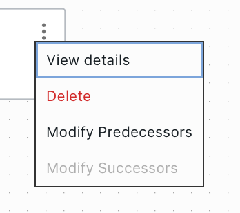
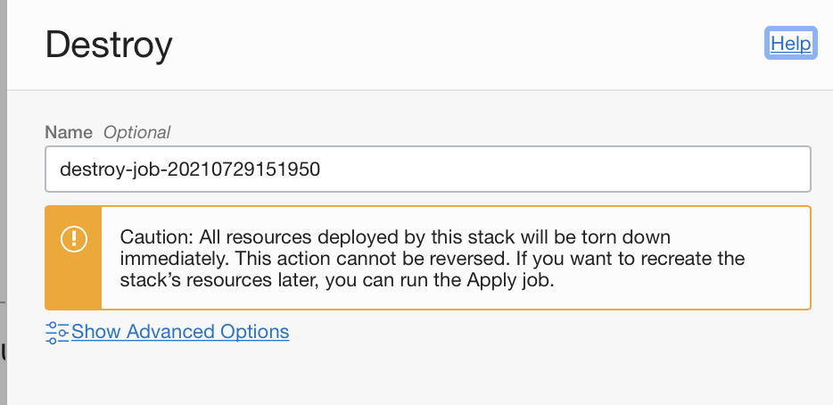
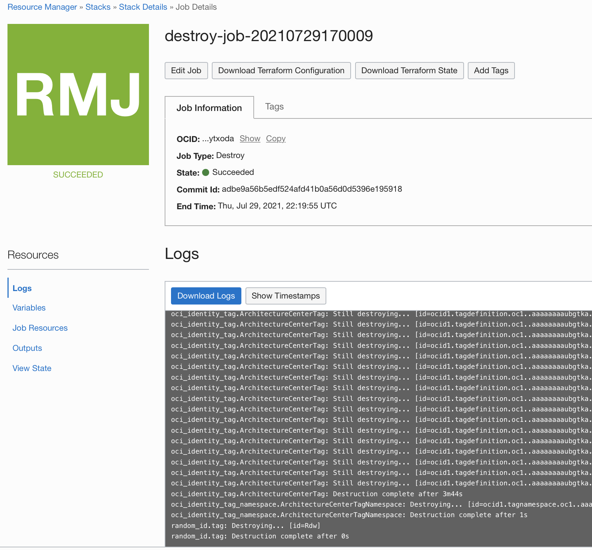
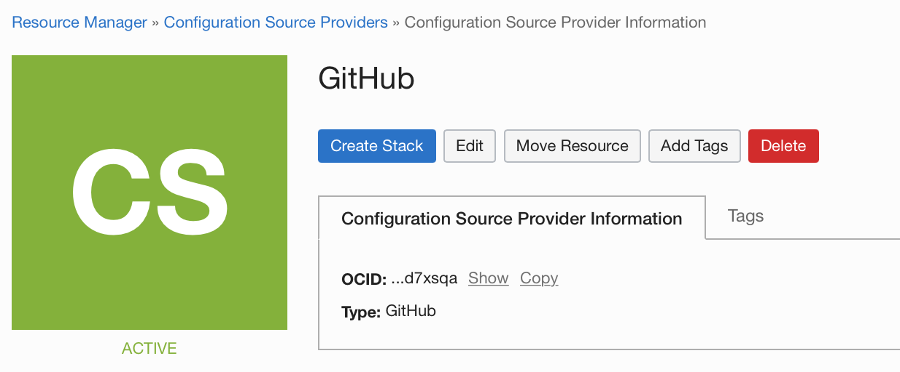

# Release resources created through the workshop

## Introduction

Congratulations, you complete the workshop. You may want to release the resources created through the workshop using Terraform.

---

Estimated Lab time: 5 minutes

### Objectives

In this lab, you will:

* Release Infrastructure Resources

### Prerequisites

* An Oracle Free Tier(Trial), Paid or LiveLabs Cloud Account
* GitHub account

## **STEP 1**: Delete DevOps Pipeline

1. In the Console, open the navigation menu, click Developer Services, and then under DevOps, click Projects.

1. Select the project we deployed during this workshop (it should starts with `hello`) and click the View all Deployment Pipelines link.

1. Click on the `deploy-fulfillment-to-dev` Deployment Pipeline name to open up the Pipeline page.

1. Delete all stages from the pipeline. Click the Menu icon (3 dots) in the top-right corner of the stage that you want to delete.
        

1. Select Delete and confirm to permanently delete the stage from the pipeline.

1. Confirm the deletion of the stage.

1. After deleting all Stages. You can click the Menu icon for the pipeline (3 dots besides `Run pipeline` button), then select `Delete`.
        

1. Confirm the deletion of the pipeline.

## **STEP 2**: Delete DevOps Artifacts

1. Go back to the project page.

1. In the `Latest artifacts` section in the bottom of the page, click on the name of each Artifact.

1. In the Artifact details page, click `Remove`.

1. Confirm the deletion of the Artifact.

1. Repeat the operation for all Artifacts created during the workshop.

## **STEP 3**: Release ORM Stack Resources

All resources provisioned during this workshop that were managed exclusively via Resource Manager can be destroyed running a `Destroy` job associated with your Stack `infrastructure-onboard`.

1. Open the navigation menu and click Developer Services. Under Resource Manager, click Stacks.

1. Choose the `cicd` compartment if you haven't selected before. The page updates to display only the resources in that compartment. 

1. Click the name of the stack `infrastructure-onboard`.

1. The Stack Details page is displayed.

1. Click Destroy.
    

1. In the Destroy panel, you can enter a name for the job and click Destroy again to confirm your action.
    

You can monitor the status and review the results of a destroy job by viewing the state or the logs.
    

To view the Terraform state file (shows the state of your resources after running the job), click the name of the job to display the Job Details page, then click View State under Resources.

To view the logs for the job, click the name of the job to display the Job Details page, then click Logs under Resources.

1. At the end, the Destroy job succeeds and your resources were released.
    

1. You can go back to the Stack Details page, and delete the Stack by clicking on `More Actions -> Delete Stack` and click again to confirm your action. 
      

## **STEP 4**: Delete ORM Configuration Source Provider

The next step is to delete the GitHub Configuration Source Provider in the Oracle Resource Manager.

1. In the left hand side menu, under Resource Manager, click `Configuration Source Providers`.
    
1. Click the name of the configuration source provider that you want to delete - `GitHub`.
      

1. Click Delete Configuration Source Provider and then confirm the action.
      

You may now [proceed to the next lab](#next).