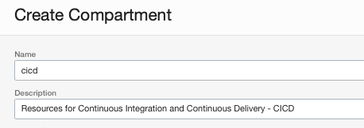
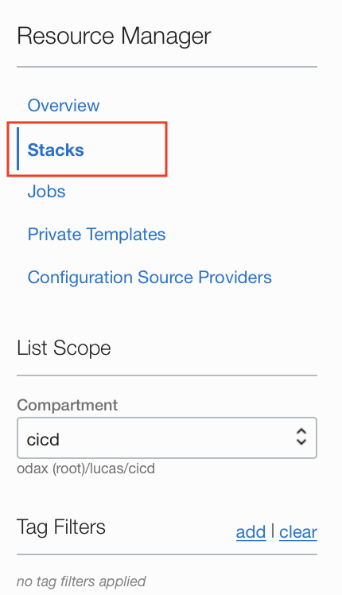

# Deploy the Infrastructure

## Introduction

In this lab exercise, we will introduce you to modern practices for deploying Cloud Native Applications through an automated CI/CD pipeline, and the first one is `GitOps`.

GitOps is a paradigm for application development and operations. It provides a developer-centric experience for operating infrastructure. It consists of declarative description of an immutable infrastructure and its desired state, stored in a Git repository. 

To deploy/provision application and infrastructure, you need to update your git repository and then create a pull/merge request so that someone can review your code and accept the changes. Those changes should be deployed to your servers/infrastructure through an automation process.

As part of this lab, you will turn into a SRE/Platform Administrator and will provision all the Infrastructure resources used by your applicaitons through Infrastructure As Code (IaC) using [Terraform](https://www.terraform.io) on [Oracle Cloud Infrastructure Resource Manager service (ORM)](https://docs.oracle.com/en-us/iaas/Content/ResourceManager/Concepts/resourcemanager.htm).  

If you are not familar with Terraform, this is an open-source tool that allow you to write infrastructure as code using declarative configuration files. OCI Resource Manager allows you to share and manage Terraform configurations and state files across multiple teams and platforms. You can connect Resource Manager to your Git repository by setting up a Configuration Source Provider.


Estimated Lab time: 20 minutes

### Objectives

In this lab, you will:

* Create an IAM compartment to isolate and organize your CI/CD cloud resources
* Create ORM project pointing to a git repository.
* Provision Infrastructure: Network, IAM, Kubernetes Cluster on OKE, DevOps project

### Prerequisites

* An Oracle Free Tier(Trial), Paid or LiveLabs Cloud Account
* GitHub account

## **STEP 1**: Create a Compartment

1. Got to Navigation Menu -> Identity & Security -> Identity -> Compartments

1. To create a compartment in the tenancy (root compartment) click Create Compartment.
Otherwise, click through the hierarchy of compartments until you reach the detail page of the compartment in which you want to create the compartment. On the Compartment Details page, click Create Compartment.


1. Enter the compartment name and description:



## **STEP 2**: Import Git "deploy" repository 

Oracle has published a [Reference Architecture](https://docs.oracle.com/en/solutions/build-pipeline-using-devops/index.html) which contains a [quickstart](https://github.com/oracle-quickstart/oci-arch-devops) repository that we will use to automate the provisioning of OCI DevOps service and all target services/environments. Let's *import* that repository to your GitHub account.

1. Open up a new browser tab and go to [GitHub](https://github.com).

1. On the top navigation bar, click on the plus sign and then  Import Repository.


1. Enter the URL of the OCI Architecture DevOps repo: `https://github.com/oracle-quickstart/oci-arch-devops`


1. Enter a name for the new *deploy* repository. To better identify it, let's name it: `oci-devops-platform-deploy`. 

1. Set privacy settings to `Private` and then click on Begin import button in the bottom of the page to create a new repo.


1. Open up the new project on your browser.


## **STEP 3**: Setup ORM Configuration Source Provider 

A Configuration Source Provider is a connection information to a source code control system where your Terraform configuration files are stored.

### Generate GitHub Personal Access Token

In order to connect your GitHub account with ORM you need first to generate a Personal Access Token. 

1. Follow GitHub documentation on how to create your PAT: https://docs.github.com/en/github/authenticating-to-github/keeping-your-account-and-data-secure/creating-a-personal-access-token


1. Select the top level `repo` scope to enable access to your private repositories.


1. Click on generate token, then copy the token value and store it safely as we are going to use it soon and it won't be displayed again.


### Create ORM Configuration Source Provider

Now we will setup the connection between OCI Resource Manager service in your tenancy with the GitHub deploy repository. 

1. Open up Resource Manager service: Go to Navigation Menu -> Developer Services -> Resource Manager

1. On the left hand side menu, click on `Configuration Source Providers`. Make sure the `cicd` compartment is selected under the `List Scope` section.


1. Click on `Create Configuration Source Provider` button and fill out the form:

    |Field|Value|
    |--|--|
    |Name|GitHub|
    |Description|GitHub Integration|
    |Compartment|cicd|
    |Type|GitHub|
    |[Server URL](https://docs.oracle.com/en-us/iaas/Content/ResourceManager/Tasks/managingconfigurationsourceproviders.htm#CreateConfigurationSourceProvider__exampleurls)|https://github.com or https://github.com/"your account" (or check documentation for supported GitHub account types)|
    |Personal Access Token|Enter the GitHub PAT value you copied earlier|
    
    

1. Click on Create button to finish this process. Once the configuration source provider was created you can click on the Provider hyperlink to go to the details page where you can click to validate the connection with the Server URL.

## **STEP 4**: Create ORM Stack

Next step we are going to create a OCI Resource Manager Stack. The Stack is a collection of Oracle Cloud Infrastructure resources corresponding to a given Terraform configuration. Each stack resides in the compartment you specify, in a single region; however, resources on a given stack can be deployed across multiple regions. An OCID (unique identifier) is assigned to each stack.

1. Open up Resource Manager service: Go to Navigation Menu -> Developer Services -> Resource Manager

1. On the left hand side menu, click on `Stacks`, then Create Stack button to open up the Create Stack Wizard page. Make sure the `cicd` compartment is selected under the `List Scope` section.


1. In the Stack information page, select `Source Control System` for the Origin of the Terraform configuration, then select the followingn under Stack Configurations:

    |Property|Value|
    |--|--|
    |Configuration Source Provider|GitHub|
    |Repository|oci-devops-platform-deploy|
    |Branch|master|
    |Working Directory|devops_oke|

1. In the Stack Information section, enter:

    |Property|Value|
    |--|--|
    |Name|infrastructure-onboard|
    |Description|Provision OKE Kubernetes Cluster and sample DevOps project|
    |Create in Compartment|cicd|
    |Terraform Version|select the latest available or compatible leave the default option|

1. Click on Next in the bottom of the page to go to the `Configure variables` page.


1. In the `Configure Variables` page, change the following variables:

    DevOps Project:
    |Variable|Value|
    |-|-|
    |Compartment|cicd|
    |Project Name|HelloDevOps|
    |Show Advanced Options?|unchecked|

    Policy Settings: No changes required, use Stack default value.

    OKE Cluster Configuration: No changes required, use Stack default values to create a new OKE cluster.

    OKE Worker Nodes: Change the number of worker nodes from 3 to 1. Use default value for the remaining variables.
    
1. Click on Next in the bottom of the page to proceed to the Review page.

1. After Reviewing the variable values that were modified, click on Create button to create the `infrastructure-onboard` Stack.

## **STEP 5**: Provisioning the Infrastructure

We are going to use [GitHub Actions](https://github.com/features/actions) to automate the provisioning of the Infrastructure using the OCI Command Line Interface (CLI) and the ORM Stack that will hold the state of the infrastructure.

1. Let's create the workflow file. Open up the GitHub repo on your browser and go to the `.github/workflows` folder. Then click on Add File -> Create New File.

2. Create a file named `oci-platform-build.yaml` with the following content:

```yaml
 name: oci-build-platform-dev-environment
on:
  push:
    branches:
      - dev_environment
jobs:
  build-resource-manager:
    name: Build Infrastructure
    runs-on: ubuntu-latest
    env: 
        STACK_NAME: "oci-build-platform-dev-environment-"
        PROVIDER_NAME: "GitHub Source Provider"
        BRANCH_NAME: "dev_environment"
        REPO_URL: "https://github.com/lucassrg/oci-devops-platform-deploy"
        WORKING_DIRECTORY: "devops_oke"
        TF_VERSION: "0.14.x"
        REGION: "us-ashburn-1"
    steps:
      
      - name: 'Checkout'
        uses: actions/checkout@v2

      - name: 'Write OCI CLI Config & PEM Key Files'
        run: |
          mkdir ~/.oci
          echo "[DEFAULT]" >> ~/.oci/config
          echo "user=${{secrets.OCI_USER_OCID}}" >> ~/.oci/config
          echo "fingerprint=${{secrets.OCI_FINGERPRINT}}" >> ~/.oci/config
          echo "pass_phrase=${{secrets.OCI_PASSPHRASE}}" >> ~/.oci/config
          echo "region=${{secrets.OCI_REGION}}" >> ~/.oci/config
          echo "tenancy=${{secrets.OCI_TENANCY_OCID}}" >> ~/.oci/config
          echo "key_file=~/.oci/key.pem" >> ~/.oci/config
          echo "${{secrets.OCI_KEY_FILE}}" >> ~/.oci/key.pem
          
      - name: 'Install OCI CLI'
        run: |
          curl -L -O https://raw.githubusercontent.com/oracle/oci-cli/master/scripts/install/install.sh
          chmod +x install.sh
          ./install.sh --accept-all-defaults
          echo "/home/runner/bin" >> $GITHUB_PATH
          exec -l $SHELL
          
      - name: 'Fix OCI Config File Permissions'
        run: |
          oci setup repair-file-permissions --file /home/runner/.oci/config
          oci setup repair-file-permissions --file /home/runner/.oci/key.pem
          
      - name: 'Check Provider'
        run: |
          echo "SOURCE_PROVIDER_ID=$(oci resource-manager configuration-source-provider list \
            --compartment-id ${{secrets.OCI_COMPARTMENT_OCID}} | jq '.data.items[] | select(."display-name"==env.PROVIDER_NAME).id' -r)" >> $GITHUB_ENV
            
      - name: 'Check Stack'
        run: |
          echo "STACK_ID=$(oci resource-manager stack list --all --compartment-id ${{secrets.OCI_COMPARTMENT_OCID}} | jq '.data[] | select(."display-name"==env.STACK_NAME).id' -r)" >> $GITHUB_ENV
      
      - name: 'Create Provider'
        if: ${{env.SOURCE_PROVIDER_ID == ''}}
        run: |
          echo "SOURCE_PROVIDER_ID=$(oci resource-manager configuration-source-provider create-github-access-token-provider \
            --access-token ${{secrets.GITHUB_ACCESS_TOKEN}} \
            --api-endpoint https://github.com/ \
            --display-name $PROVIDER_NAME \
            --compartment-id ${{secrets.OCI_COMPARTMENT_OCID}} | jq '.data.id' -r)" >> $GITHUB_ENV
            
      - name: 'Create Stack'
        if: ${{env.STACK_ID == ''}}
        run: |
          echo "STACK_ID=$(oci resource-manager stack create-from-git-provider \
            --compartment-id ${{secrets.OCI_COMPARTMENT_OCID}} \
            --config-source-configuration-source-provider-id $SOURCE_PROVIDER_ID \
            --config-source-branch-name $BRANCH_NAME \
            --config-source-repository-url $REPO_URL \
            --config-source-working-directory $WORKING_DIRECTORY \
            --display-name "$STACK_NAME" \
            --terraform-version $TF_VERSION \
            --variables '{"compartment_ocid": "${{secrets.OCI_COMPARTMENT_OCID}}", "region": "${{env.REGION}}", "bucket_name": "${{env.BUCKET_NAME}}"}' \
            --wait-for-state SUCCEEDED | jq '.data.id' -r)" >> $GITHUB_ENV
        
      - name: 'Create Plan Job'
        if: ${{env.STACK_ID != ''}}
        run: |
          echo "PLAN_JOB_ID=$(oci resource-manager job create-plan-job \
            --stack-id $STACK_ID --wait-for-state SUCCEEDED | jq '.data.id' -r)" >> $GITHUB_ENV
   
      - name: 'Apply Plan Job'
        if: ${{env.PLAN_JOB_ID != ''}}
        run: | 
          echo "APPLY_JOB_ID=$(oci resource-manager job create-apply-job \
            --execution-plan-strategy FROM_PLAN_JOB_ID \
            --execution-plan-job-id $PLAN_JOB_ID \
            --stack-id $STACK_ID \
            --wait-for-state SUCCEEDED | jq '.data.id' -r)" >> $GITHUB_ENV
```