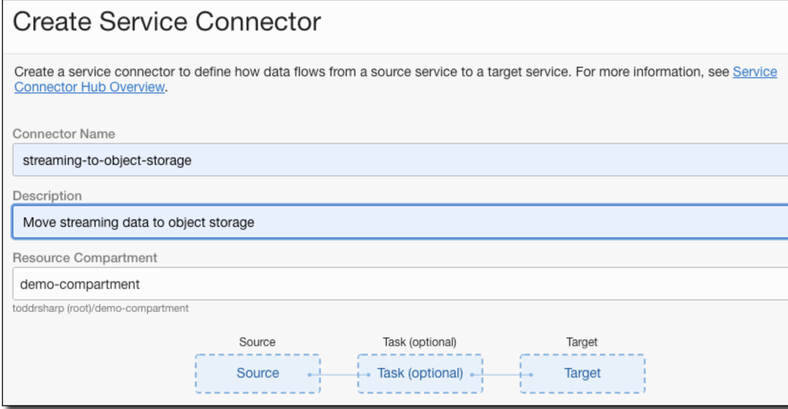
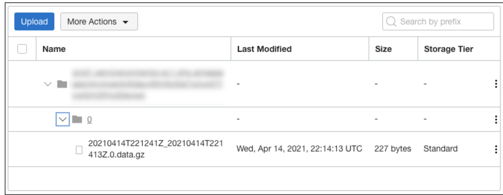

# Archiving Stream Data to Object Storage

In this tutorial, we’re going to use [Service Connector Hub](https://docs.oracle.com/en-us/iaas/Content/service-connector-hub/overview.htm) to read an OCI stream of data and archive that data to Object Storage.

## Pre-Requisites

* Need to be an OCI Tenancy Administrator

## Task 1: Create an OCI Stream

1. Open the navigation menu and click ***Analytics & AI***. Under ***Messaging***, click ***Streaming***. A list of existing streams is displayed.

2. Click ***Create Stream*** at the top of the list.

3. ***Stream Name:*** Required. Specify a friendly name for the stream. It does not have to be unique within the compartment, but it must be unique to the stream pool. The stream name cannot be changed. Avoid entering confidential information.

4. Compartment: Choose the compartment in which the stream will be created. FOr this lab, we will keep it in the root tenancy.

5. ***Stream Pool:*** Choose the stream pool that will contain your stream.

   a. If your chosen compartment has an existing stream pool, you can select it from the drop-down list or click Create new stream pool and configure the stream pool manually.

   b. **If no stream pool exists** in the chosen compartment, select Auto-create a default stream pool or click Create a new stream pool and configure the stream pool manually.

6. In the Define Stream Settings panel:

    a. ***Retention (in Hours):*** Enter the number of hours (from 24 to 168) to retain messages. The default value is 24.

    b. ***Number of Partitions:*** Enter the number of partitions for the stream. The maximum number is based on the limits for your tenancy.

7. Click ***Show Advanced Options*** to optionally define Tags: If you have permissions to create a resource, then you also have permissions to apply free-form tags to that resource. To apply a defined tag, you must have permissions to use the tag namespace. For more information about tagging, see Resource Tags. If you are not sure whether to apply tags, skip this option (you can apply tags later) or ask your administrator.

8. Click ***Create***.


## Task 2: Create Object Storage Bucket

1. Open the navigation menu and click ***Storage***. Under ***Object Storage***, click ***Buckets***.

2. Select a ***compartment*** from the ***Compartment list***  on the left side of the page. For this lab you will remain in the tenancy root compartment.

You will keep all of the defaults for the bucket creation.

3. Click ***Create Bucket***.

4. Enter a ***Bucket Name*** . For this lab we will name the bucket **streaming-archive-demo-0**.

   You will keep all of the defaults for the bucket creation.

5. Click ***Create*** . 


 

## Task 3: Create Service Connector

For simple archiving operations, we don’t need to write a single line of code. Instead, we just create a service connector and point it at the source (stream) and destination (bucket). Navigate to the Service Connector Hub via the burger menu (or by searching for it).

1. Open the navigation menu and click ***Analytics & AI***. Under ***Messaging***, click ***Service Connector Hub***.

2. You can choose a compartment you have permission to work in (on the left side of the page). The page updates to display only the resources in that compartment. For this lab, we will work in the tenancy root compartment.

3. Click ***Create Service Connector***. 

4. Name the connector ***streaming-to-object-storage*** . 

5. Provide the description ***Moving streaming data to object storage***.

6. For the compartment, choose the root tenancy.




7. Now to configure your service connector, Choose  ’Streaming’ as the ***source***, and ‘Object Storage’ as the ***target***. Chose the compartment where the stream pool resides, choose the stream pool, and the stream. You can choose to read from either the ‘Latest’ offset or ’Trim Horizon’ (the oldest non-committed offset).


 - You will not be using the optional ***Configure Task*** for this lab. 

 8. Click ***Create*** to create the default policy to allow the Service Connector Service to read from Streaming.


 9. Click ***Create*** and the service connector is ready to archive your streams.


## Task 4: Publish Messages using OCI Cloud Shell

 To test this out, we can write some messages to our stream using the Oracle Cloud Infrastructure CLI in Cloud Shell. 


1. To start the Oracle Cloud shell, go to your Cloud console and click the cloud shell icon at the top right of the page.


    

    


2.  To test this out, we can write some messages to our stream using the OCI CLI in OCI Cloud Shell. When writing messages to a stream, we must pass the message as a JSON object with two keys: key and value. Both the key and the value must be Base64 encoded. Here are two  two separate messages to publish, one with key1 and another with key2. Both will contain a simple JSON message payload. Below the values are encoded.

```bash
$ echo -n "key1" | base64
a2V5MQ==
$ echo -n "key2" | base64
a2V5Mg==
$ echo -n '{"id":"0", "test": "message from CLI"}' | base64
eyJpZCI6IjAiLCAidGVzdCI6ICJtZXNzYWdlIGZyb20gQ0xJIn0=
```

3. You then plug these encoded values into your OCI CLI commands and published both messages. The ***Stream id*** and *** stream endpoint*** can be retrieved from your stream information.

```bash
// key1
oci streaming stream message put \
  --stream-id ocid1.stream.oc1.phx… \
  --endpoint https://cell-1.streaming.us-phoenix-1.oci.oraclecloud.com \
  --messages "[{\"key\": \"a2V5MQ==\", \"value\": \"eyJpZCI6IjAiLCAidGVzdCI6ICJtZXNzYWdlIGZyb20gQ0xJIn0=\"}]"

// key2
oci streaming stream message put \
  --stream-id ocid1.stream.oc1.phx… \
  --endpoint https://cell-1.streaming.us-phoenix-1.oci.oraclecloud.com \
  --messages "[{\"key\": \"a2V5Mg==\", \"value\": \"eyJpZCI6IjAiLCAidGVzdCI6ICJtZXNzYWdlIGZyb20gQ0xJIn0=\"}]"
  ```

  4. You will now confirm the archive operation.   You will need to wait the 60000 milliseconds (60 seconds) for the archive operation. After the 60 second wait period, we can check that the stream data was written to our Object Storage bucket.

  

As shown above, the stream data was written to a compressed file in my bucket and labeled with the timestamp at which it was written. Both of the messages that were published via the CLI were archived into the bucket. Without writing a single line of code or deploying any infrastructure, we have a reliable archive of our stream data in OCI.

