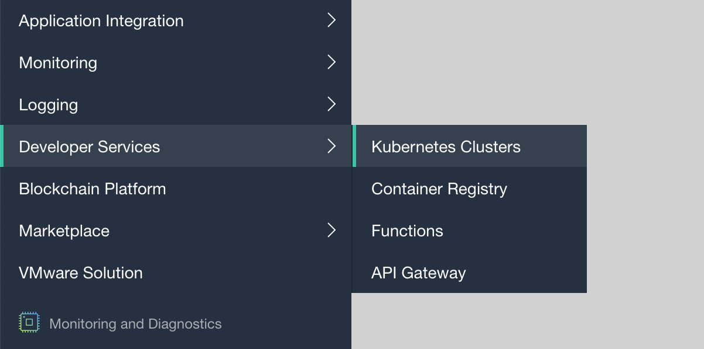
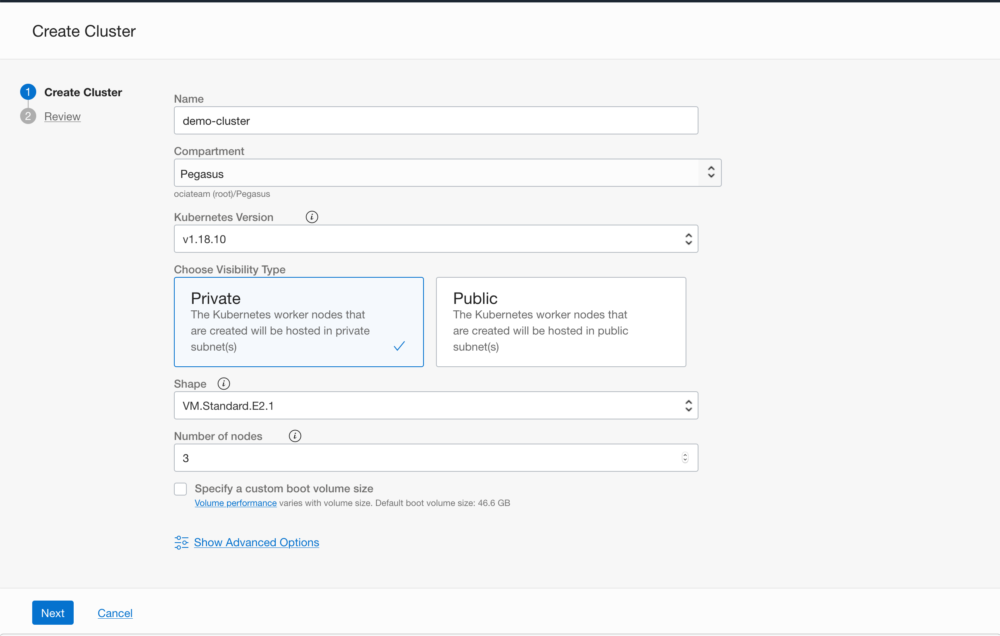
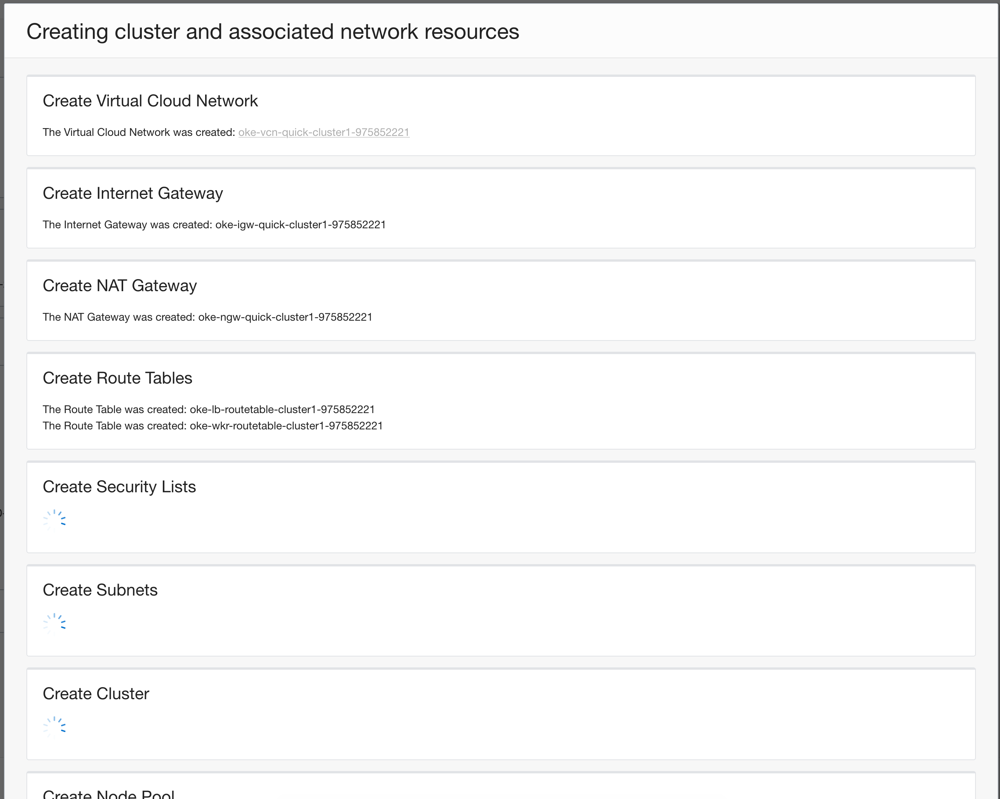

# Deploying Jenkins on an OCI Arm A1 based Kubernetes cluster

Quick delivery of software has become a competitive advantage for companies. Automated development processes facilitate speed and consistency, which led to the rise of continuous integration (CI) and continuous delivery and deployment (CD) pipelines. Jenkins, a popular product among Oracle Cloud Infrastructure customers, can automate all phases of CI and CD.

This tutorial explains how to deploy Jenkins on Oracle Cloud Infrastructure (OCI) to centralize build automation and scale Jenkins build agents by using OCI Container Engine for Kubernetes. Kubernetes ensures that resources are used efficiently and that servers aren’t overloaded or idle. The ability of Kubernetes to orchestrate container deployment ensures that Jenkins always has the right amount of resources available. GitHub is used to manage source code in this tutorial.

## Deploying your workloads on OCI Arm A1 compute platform

The OCI Arm A1 compute platform based on Ampere Altra CPUs represent a generational shift for enterprises and application developers that are building workloads that can scale from edge devices to cloud data centers. The unique design of this  platform delivers consistent and predictable performance as there are no resource contention within a compute core and offers more isolation and security. This new class of compute shapes on Oracle Cloud Infrastructure  provide an unmatched platform that combines power of the Altra CPUs with the security, scalability and eco-system of services on OCI.


## Create a Kubernetes Cluster

Container Engine for Kubernetes is easy to start using, and combined with OCI Cloud Shell, you can have complete control without having to set up a local environment. To get started, you create a new Kubernetes cluster on OCI.

1. From the navigation menu in the Oracle Cloud Console, go to **Developer Services** and click **Kubernetes Clusters**.
   


2. Click **Create Cluster**. You can use the **Quick Create** option to use default values or the **Custom Create** option to specify advanced settings. Here we use the **Quick Create** because the defaults that it chooses are a great start.


3. On the Create Cluster page, choose some basic configuration options, like the version of Kubernetes that you want to run and the number and shape of the nodes for your cluster. For this tutorial, choose the Oracle A1 shape for the nodes. 

> Choose the OCI Arm A1 compute shape for the nodes. !!! Update screenshots!!!



You can also specify a name and compartment for the cluster. The visibility type indicates whether the nodes in the cluster are reachable from the internet, for example, over SSH. It's more common to keep them on a private network and use bastion or jump hosts on the public network to provide access paths. Here we choose the default of keeping the nodes private.

4. Click **Create Cluster** and the workflow starts creating all the required required resources and the cluster itself. 



After the supporting resources are created, the cluster details page is displayed. Within a few minutes, the cluster is created and activated.


5. After the cluster status is Active, click the Access Cluster button to see the ways to access the cluster.

6. Choose the Cloud Shell option. Cloud Shell is a full-featured, online terminal environment integrated with the Console. Cloud Shell has all the tools you need for interacting with your Kubernetes cluster and is the quickest way to get started without configuring a local development environment.


You can launch Cloud Shell directly from the page. Note that access to Cloud Shell is also available on the top of the Console at all times, for quick access.

The page also include a command to run inside Cloud Shell. This command uses the OCI CLI to create the *kubeconfig* file. Kubernetes clients like `kubectl` can work with a configuration file that facilitates access to the cluster. Such a file is generally called a *kubeconfig* file. Typically, this configuration file resides in *~/.kube*. A single configuration file can contain access configuration for multiple clusters.

> OCI CLI is already installed and configured for you in the Cloud Shell environment. 

7. Launch Cloud Shell, and then copy the command and paste it in to Cloud Shell to run it. The standard command line client for Kubernetes is kubectl and it is preinstalled in the Cloud Shell environment. 
   
   Now, let's check if we can interact with the cluster and see the cluster nodes. 

8. Copy the following command to Cloud Shell and run it.
    ```
    kubectl get nodes
    ```
   You should see output similar to the following example, depending on the number of nodes in the cluster. 

    ```
    NAME          STATUS   ROLES   AGE   VERSION
    10.0.10.181   Ready    node    48m   v1.18.10
    10.0.10.253   Ready    node    49m   v1.18.10
    10.0.10.5     Ready    node    49m   v1.18.10
    ```

Now that you have a fully functioning Kubernetes cluster and have set up the tools to interact with it, let’s deploy the Jenkins CI/CD server on it.

## Deploy Jenkins to Kubernetes

A typical Jenkins deployment consists of a controller node and, optionally, one or more agents. To simplify the deployment, this tutorial uses Helm to deploy Jenkins. Helm is a package manager for Kubernetes, and its package format is called a *chart*. Helm charts can collectively be stored in *chart repositories*.

Helm is pre-installed and configured for use in the Cloud Shell environment. 

1. Add the repository for the Jenkins Helm chart and install it.
    ```
    helm repo add jenkinsci https://charts.jenkins.io
    helm repo update
    ```
    Helm searches this repository for the charts that you ask Helm to install.

2. Install the Jenkins chart.

    ```
    helm install jenkins --set controller.serviceType=LoadBalancer jenkinsci/jenkins
    ```
    This command is telling Helm to perform the following actions:

    -	`install` installs a chart (applications are packaged as charts that Helm can install on a Kubernetes cluster).
    -	`jenkins` is the name this installation or release. You can upgrade or roll back this release later.
    - `--set controller.serviceType=LoadBalancer` tells Helm to configure the chart to use a load balancer as the method to access the application.
    - `jenkinsci/jenkins` is the chart name.

    As you run the command, Helm starts the deployment and displays some notes. The notes show how to access the Jenkins server that you just deployed.


3. To get the URL to Jenkins, run the following command in Cloud Shell:
    ```
    export SERVICE_IP=$(kubectl get svc --namespace default jenkins --template "{{ range (index .status.loadBalancer.ingress 0) }}{{ . }}{{ end }}")
      echo http://$SERVICE_IP:8080/login
    ```

This command gets the IP address for the load balancer that the Kubernetes cluster provisioned as part of deploying the Helm chart to access Jenkins. You can open links directly from Cloud Shell, and following the link displayed opens Jenkins in a new tab.

The default admin user that the Helm chart creates is `admin`. The password is generated at deployment and stored as a secret in the Kubernetes cluster. To get this password, run the following command:

```
kubectl exec --namespace default -it svc/jenkins -c jenkins -- /bin/cat /run/secrets/chart-admin-password && echo
```

With the password, you can log in to Jenkins.
 

## Next Steps

Now that Jenkins has been deployed and you can log in as the admin user, you can follow these optional steps to take full advantage of your self-hosted CI/CD system.

- [Add optional Security](https://wiki.jenkins.io/display/JENKINS/Standard+Security+Setup) -  Jenkins has been deployed with security enabled, using Jenkins' own user database, which requires no additional resources. You can add users or change to an external authentication.
- Install more plugins
  - The [Kubernetes](https://plugins.jenkins.io/kubernetes/) plugin for Jenkins is installed and configured for you. See the documentation for how to write `Jenkinsfile`s that can take full advantage of your cloud native CI/CD system.
  - [The Oracle Cloud Infrastructure Compute](https://plugins.jenkins.io/oracle-cloud-infrastructure-compute/) plugin is handy when you want to create compute instances as needed for the duration of specific builds. This is particularly useful when you need specialized hardware shapes for running your builds or tests.
  - [Blue Ocean](https://plugins.jenkins.io/blueocean/)  rethinks the Jenkins user experience. Designed from the ground up for Jenkins Pipeline and compatible with Freestyle jobs, Blue Ocean reduces clutter and increases clarity for every member of your team.

