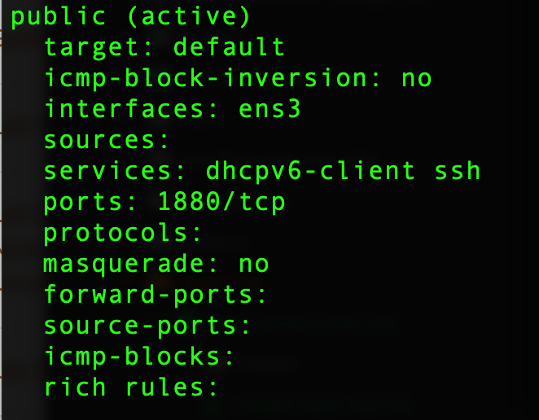

# Configuring the Network Security and Firewall

## Introduction

In this lab, we will configure the Virtual Cloud Network to allow incoming traffic on port 1180 (the default port of Node-RED).
Furthermore, we will also configure the firewall on Oracle Autonomous Linux (OAL) to allow incoming traffic on the same port.

Estimated Lab Time: 20 minutes

### Objectives
* Configure Network Security List to allow incoming traffic on port 1880
* Configure the firewall service on (OAL) to allow incoming traffic on port 1880

### Prerequisites
* A VCN
* A compute instance running OAL
* Connected via SSH to your compute instance

## **Step 1**: Configure Network Security List

1. Using the menu, click on **Virtual Cloud Network** and then the VCN you created for this practice.

   

2. Now click on **Security Lists** on the left navigation bar for the VCN.
   

3. Click on the **Default Security List**.

4. Here you need to open port **1880**. Click on **+ Another Ingress Rule** and add the following values as shown below:

   - **Source Type:** CIDR
   - **Source CIDR**: 0.0.0.0/0
   - **IP Protocol:** TCP
   - **Source Port Range:** All
   - **Destination Port Range:** 1880
   - Click on **Add Ingress Rules** at the bottom.

   

## **Step 2**: Update the OAL Firewall service

Change to your SSH session. We will now configure the firewall service on OAL to allow incoming traffic on port 1180.

Type the following command: `sudo firewall-cmd --permanent --add-port=1880/tcp`

You can control the currently configured firewall rules for which incoming traffic is allowed by typing `sudo firewall-cmd --list-all --zone=public`

**Congratiulations!** You have finished this lab. Now lets start up Node-RED in the next lab.
