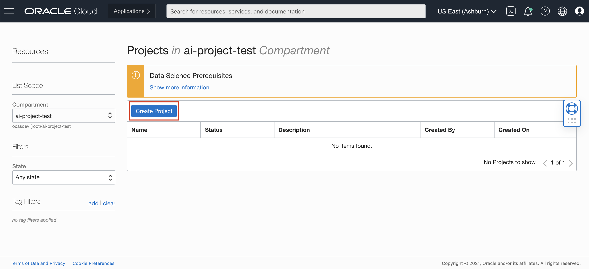
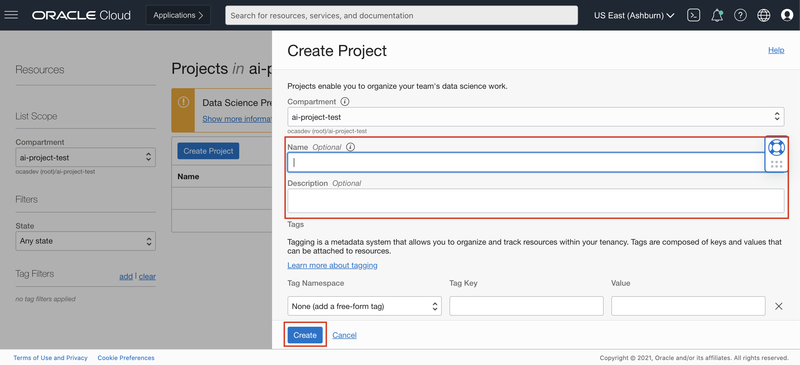
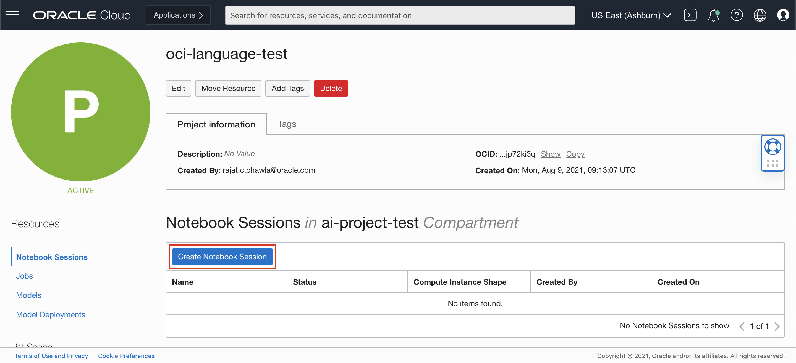
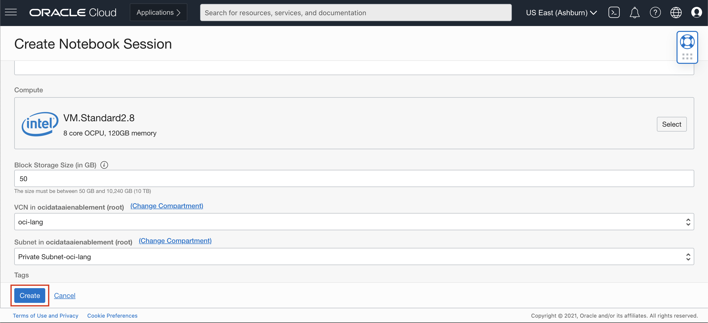
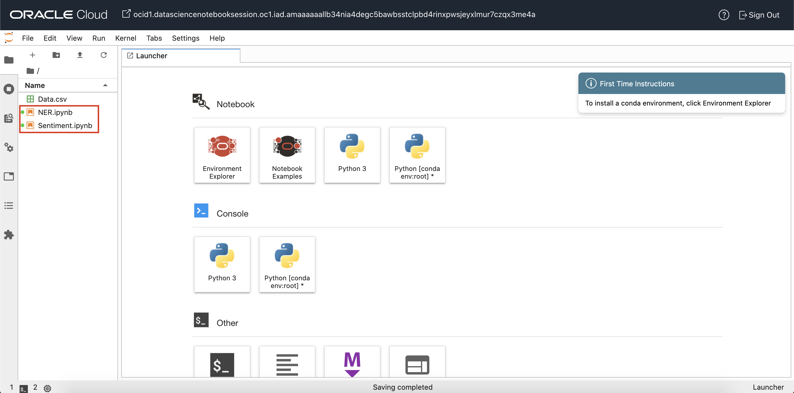

# Lab 5: Access OCI Language Service in DataScience NotebookSession.

## Introduction

## **TASK 1:** Navigate to the NoteBook

Follow the below steps to open Notebook in DataScience:
### 1. Navigate to Data Science Service
Log into OCI Cloud Console. Using the Burger Menu on the top left corner, navigate to Analytics and AI menu and click it, and then select Data Science item under Machine Learning.

### 2. Select Compartment
Select the Compartment in which want to create your project.

<!-- Click Create Project to create a new project. -->
<!-- Select the Root Compartment -->

### 2. Create Project
Click Create Project to create a new project.
<!-- Select the Project named 'oci-language-livelabs' -->

### 3. Create Notebook
Enter name and click Create Button.
<!-- Select the Notebook named 'Livelabs Notebook' -->

### 4. Create NoteBook Session
Click Create NoteBook Session to create a new Notebook session.

### 5. Enter Details
Select a name.
We recommend you choose VM.Standard2.8 (not VM.Standard.E2.8) as the shape. This is a high performance shape, which will be useful for tasks such as AutoML.
Set blockstorage to 50 GByte.
Select the subset with INternet connectivity.
If you don't have a subnet then
Create a VCN and subnets using Virtual Cloud Networks > Start VCN Wizard > VCN with Internet Connectivity option.
The Networking Quickstart option automatically creates the necessary private subnet with a NAT gateway.
Select defaults for VCN and subnet. These should point to the resources that were created earlier by the resource manager.

### 4. Open the OCI Data Science notebook
Open the notebook that was provisioned.

## **TASK 2:** Invoke the Language Service

### 1. Download and Upload the Files
Download this [Sentiment Analysis](./files/sentiment.ipynb) and [Named Entitiy Recognition](./files/ner.ipynb) files and upload it in the Notebook. 
Download this [Dataset](./files/Data.csv) and upload it in the Notebook.

### 2. Setup API Signing Key and Config File
Make sure you create a .oci directory in the Data Science notebook session and upload the config file and the Private Key to your .oci directory.
To More about about how to create API Key and config file, Refer Lab-3(Setup API Signing Key and Config File).

### 3. Execute the Notebooks

Open the Notebook that you've just uploaded

Now go through each of the cells and run them one by one.

These notebooks demonstrates how you can be more productive by using the various Language services.

Congratulations on completing this lab!

[Proceed to the next section](#next).

## Acknowledgements
* **Authors**
    * Rajat Chawla  - Oracle AI OCI Langauge Services
    * Ankit Tyagi -  Oracle AI OCI Langauge Services
* **Last Updated By/Date**
    * Rajat Chawla  - Oracle AI OCI Langauge Services, August 2021