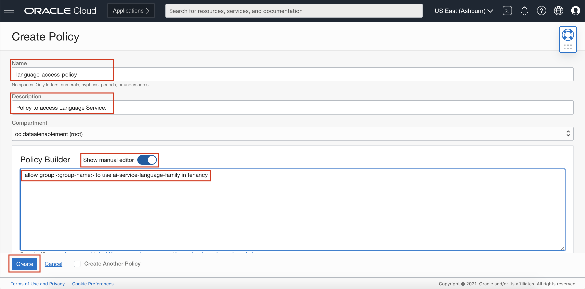
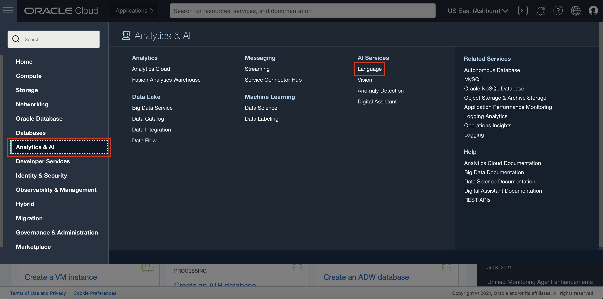
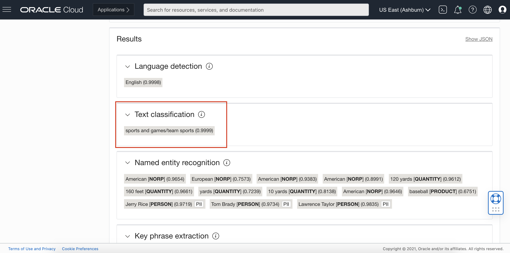

# Lab 1: Analyzing Text with the Console

## Introduction
In this session, we will help users to get familiar with our OCI Language and teach them to use our services via the cloud console.
You can use one or more of these text analysis tools to analyze your text with the Language service:
- Aspect-Based Sentiment Analysis
- Named Entity Recognition
- Key Phrase Extraction
- Language Detection
- Text Classification

***Estimated Lab Time***: 20 minutes

### Objectives

In this lab, you will:
- Understand a high level overview of the OCI Language.
- Understand all the capabilities of OCI Language.
- Understand how to analyze text using OCI Language via cloud console.
### Prerequisites
- A Free tier or paid tenancy account in OCI (Oracle Cloud Infrastructure)
- Tenancy is whitelisted to be able to use OCI Language

## **Policy Setup**

Before you start using OCI Language, your tenancy administrator should set up the following policies by following below steps:
### 1. Navigate to Policies
Log into OCI Cloud Console. Using the Burger Menu on the top left corner, navigate to Identity & Security and click it, and then select Policies item under Identity.

### 2. Create Policy
Click Create Policy


### 3. Create a new policy with the following statements:

If you want to allow all the users in your tenancy to use language service.
Create a new policy with the below statement:
```
<copy>allow any-user to use ai-service-language-family in tenancy</copy>
```

If you want to limit access to a user group.
Create a new policy with the below statement:
```
<copy>allow group <group-name> to use ai-service-language-family in tenancy</copy>
```


## **TASK 1:** Use the Console to analyze text

### 1: Navigate to OCI Language

Log into OCI Cloud Console. Using the Burger Menu on the top left corner, navigate to Analytics and AI menu and click it, and then select Language item under AI services.



### 2: Enter Text

Paste, or enter your text into the dialog box to analyze.


### 3: Select the text analysis tools

Select one or more of the text analysis tools to analyze your text with the Language service:


### 4: Click Analyze

You can analyze text by clicking Analyze button.


<!-- ### 5: Click Reset

You can reset the page by clicking Reset button.
 -->

## **TASK 2:** Viewing the Results

After you analyze your text, the Language service displays the results by category for the selected tools as follows:

### 1: Sentiment Analysis

Renders the results in horizontal bar graphs as a percentage.


### 2: Named Entity Recognition

Identifies the named entities that were found and their categories are indicated in square brackets.


### 3: Key Phrase Extraction

Lists the key phrases in a double-quotes delimited list.


### 4: Language Detection

Lists, by confidence percentage, the languages detected.


### 5: Text Classification

Lists the word, identified document category, and the confidence score.


## **TASK 3:** Viewing the Results in JSON

You can click Show Json to view the output of each of the capabilities in JSON format.


Click Return to Standard Results to leave the JSON view. 


Congratulations on completing this lab!

[Proceed to the next section](#next).

