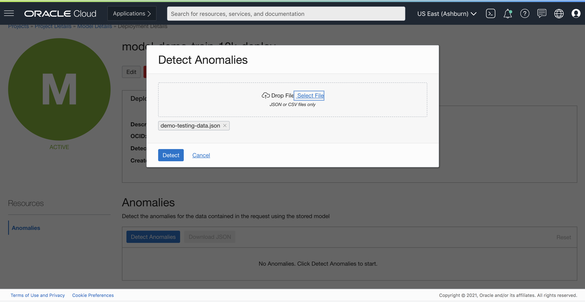
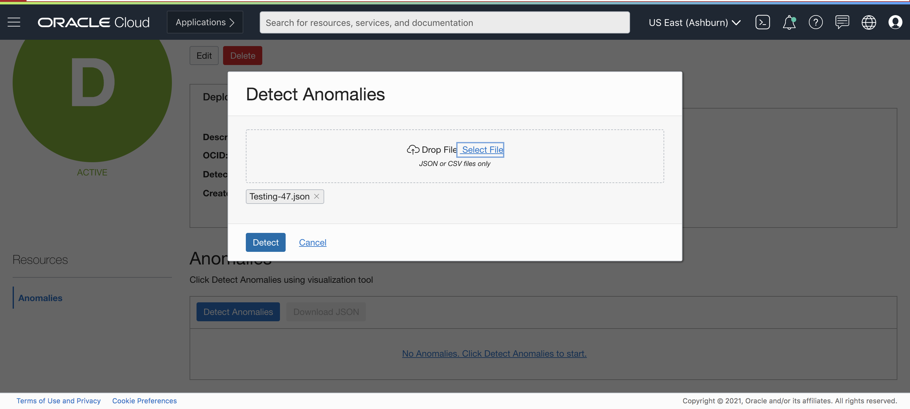
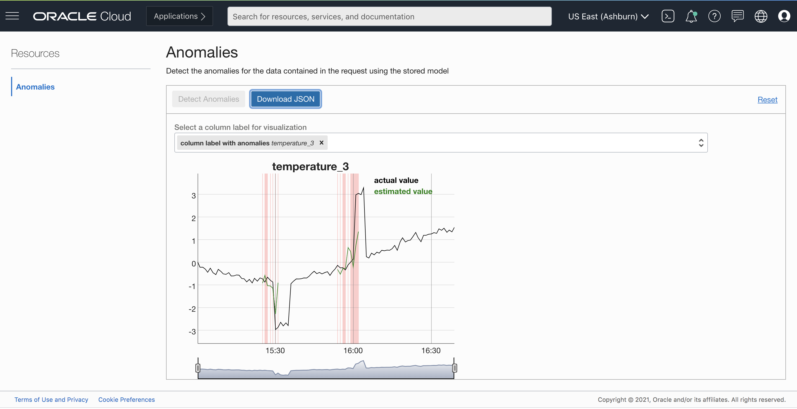

#Lab 3: Train Anomaly Detection Model And Detect

## Introduction

In this session, we will show you how to train an anomaly detection model, deploy the model, and make predictions with new data.

***Estimated Lab Time***: 30 minutes

### Objectives

In this lab, you will:
- Learn to train an anomaly detection model with created data asset
- Learn to verify the trained model performance
- Learn to deploy the model to be ready
- Upload testing data to check detection result

### Prerequisites
- A Free tier or paid tenancy account in OCI
- Understand basic model terminology FAP - False Alarm Probability
- Tenancy is whitelisted to be able to use Anomaly Detection service


## **STEP 1:** Create a Model
* Select the proper data asset
* Set training parameters
* Train a model
Once the project livelabs_demo is selected, it will navigate the User to Created Anomaly Detection Project. Select Create and Train Model


Select Next


Now that we have a data asset to train a model, let train an anomaly detection model. Since we have a Data Asset now, navigate back to the Create and Train a model screen


This time, the data asset previously created should show up on the default panel. Select Next


This takes us to train a model menu. Among options like naming the model and providing description which are option since they relate to housekeeping we also have an option to specify FAP(false alarm probability) and Train Fraction Ratio. The default values for these are 0.01 and 0.7 implying 70% respectively.

The default value 0.01 is very less so in order to save on the training time, we will dial up the FAP to 0.05. The training fraction ratio can be left as it is.


Select Submit. If the steps till now are done right, we should see the following screen.


## **STEP 2:** Deploy a Model
* Once we have verified that our model is successfully created now it is time to deploy our model. To initiate the process, click on the model you desire to deploy. It will direct you to the model deployment form


* Click on Add Deployment.


* Press Submit button. Once the deployment is successful, the model is ready to be used for detecting anomalies.


## **STEP 3:** Detect Anomaly with new Data

* Upload to UI
To start the  process of anomaly detection select detect anomalies.


Select a file from local filesystem or drag and drop the desired file.


Now press detect.

* See result in graph
Once the test file is submitted, you have the option to select the column to see anomalies for.


Use the drop wizard to select column. The columns for which the model has detected anomalies will be labelled as such.


 Lets select sensor 8 to see where the model has detected an anomaly.
 

The part of the signal where the model has determined to be an anomaly is highlighted. There is also an option to download the anomaly detection result.

* Download anomaly file
 

This will download a file named anomalies.json Lets peek at the contents
 ```json
 {
    "anomalies": {
      "pressure_1": [
        {
          "timestamp": "2020-07-02T13:12:00.000Z",
          "estimatedValue": 85.66492698482568,
          "actualValue": 81.7651725
        },
        {
          "timestamp": "2020-07-02T13:12:01.000Z",
          "estimatedValue": 87.28059796474808,
          "actualValue": 76.87014
        },
        {
          "timestamp": "2020-07-02T13:13:00.000Z",
          "estimatedValue": 88.59603352625678,
          "actualValue": 71.97510750000001
        },
        {
          "timestamp": "2020-07-02T13:14:00.000Z",
          "estimatedValue": 89.468983523406,
          "actualValue": 67.080075
        },
        {
          "timestamp": "2020-07-02T13:14:01.000Z",
          "estimatedValue": 90.20400941495645,
          "actualValue": 62.1850425
        },
        {
          "timestamp": "2020-07-02T13:15:00.000Z",
          "estimatedValue": 90.657841920921,
          "actualValue": 57.29001
        }
      ],
      "temperature_4": [
        {
          "timestamp": "2020-07-02T13:20:01.000Z",
          "estimatedValue": 16.224764289227032,
          "actualValue": 20
        },
        {
          "timestamp": "2020-07-02T13:21:00.000Z",
          "estimatedValue": 16.207771473365277,
          "actualValue": 20.1
        },
        {
          "timestamp": "2020-07-02T13:22:00.000Z",
          "estimatedValue": 16.253040231702492,
          "actualValue": 20.15
        },
        {
          "timestamp": "2020-07-02T13:22:01.000Z",
          "estimatedValue": 16.25493106991135,
          "actualValue": 20.1
        }
      ]
    }
  }

 ```

We see that the results for all the anomalies are within their own key. And each value is a further a tuple that contains the timestamp, actual value and what the model expects the value to be.

Congratulations on completing this lab!

You now have completed the full cycle of using the training data to create a model and deploy, and also making predictions with testing data.

The next 2 sessions are optional for advanced users, which cover the topic on using REST API to integrate our services and how to prepare the training and testing data from raw data in different scenarios.

[Proceed to the next section](#next).

## Acknowledgements

* **Authors**
    * Jason Ding - Principal Data Scientist - Oracle AI Services
    * Haad Khan - Senior Data Scientist - Oracle AI Services
* **Last Updated By/Date**
    * Haad Khan - Senior Data Scientist, May 2021
